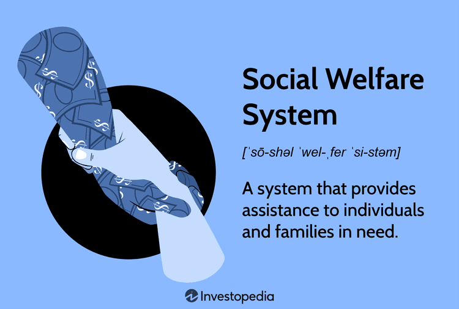

Social protection insurance mechanisms play a crucial role in today's economy by providing financial security and support to individuals in times of need. These mechanisms include various programs such as healthcare, unemployment benefits, and pensions, which are designed to mitigate the adverse effects of economic fluctuations and personal hardships. By offering a safety net, social protection enhances economic stability and supports social cohesion, contributing to a more resilient society.

The interplay between social protection and financial markets is increasingly significant. Financial markets influence the funding and sustainability of social protection programs, while social insurance impacts economic behavior and market dynamics. This interconnectedness underscores the need for innovative solutions to optimize resource allocation and ensure the effectiveness of social protection systems.

A notable development in this context is the rise of algorithmic trading within the insurance sector. Algorithmic trading refers to the use of computer algorithms to execute trades based on predetermined criteria, enabling rapid and efficient decision-making. In the insurance industry, algorithmic trading enhances risk management and pricing strategies, allowing insurers to better navigate complex financial environments. This technological advancement offers the potential to improve the operation and delivery of social protection mechanisms by facilitating more accurate assessments of risk and financial needs.

The purpose of this article is to analyze the role of both social insurance and algorithmic trading in enhancing social protection mechanisms. By examining the synergies between these fields, we aim to identify opportunities for optimizing social insurance frameworks and leveraging cutting-edge technologies to address contemporary challenges. As digital transformation reshapes economic landscapes, understanding and harnessing these synergies becomes increasingly important for policymakers, industry stakeholders, and society at large.

## Table of Contents

## Understanding Social Protection Insurance Mechanisms

Social protection insurance mechanisms play a fundamental role in modern society by providing financial support and security to individuals facing socioeconomic risks and vulnerabilities. These mechanisms are designed to protect individuals from economic insecurities caused by events such as unemployment, illness, disability, and old age, thereby ensuring a minimum standard of living and promoting social stability.

Social protection insurance can be categorized into various types, each tailored to address specific needs. Among the most common forms are healthcare insurance, unemployment benefits, and pension schemes. Healthcare insurance aims to ensure access to necessary medical care without financial hardship, while unemployment benefits provide temporary income support to individuals who have lost their jobs. Pension schemes, on the other hand, are designed to provide income to individuals upon retirement, thus safeguarding them against poverty in old age. Other social insurance programs may include disability insurance, maternity benefits, and parental leave.

The importance of social insurance mechanisms extends to their ability to mitigate the impacts of economic fluctuations. During economic downturns or periods of financial instability, these mechanisms serve as automatic stabilizers. By maintaining consumer spending through benefits such as unemployment insurance, social protection systems help stabilize aggregate demand, reduce the severity of recessions, and support economic recovery. This is instrumental in preventing the exacerbation of poverty and inequality during economic crises.

Globally, there are numerous examples of successful social protection programs. For instance, the Scandinavian countries, such as Sweden and Denmark, are renowned for their comprehensive social welfare systems that provide extensive coverage across a variety of risks. Similarly, the Social Security system in the United States offers a safety net for retirees, the disabled, and survivors of deceased workers. In developing countries, conditional cash transfer programs, like Brazil's Bolsa Família and Mexico's Progresa/Oportunidades, have effectively reduced poverty and improved health and education outcomes by providing financial support to low-income families conditional on school attendance or healthcare visits.

Despite their critical importance, social protection systems face challenges, especially in the digital era. The rise of technological advancements and the gig economy presents new types of employment and income that traditional social insurance frameworks may struggle to accommodate. Additionally, issues related to data privacy, cybersecurity threats, and the need for digital literacy further complicate the delivery and effectiveness of these programs. Policymakers and stakeholders must adapt and innovate to ensure that social protection mechanisms remain robust and inclusive in an increasingly digital and interconnected world.

## The Role of Algorithmic Trading in Insurance

Algorithmic trading, commonly known as algo trading, refers to the use of computer algorithms to manage trading decisions, execute orders, and perform market analysis at speeds and volumes that are impractical for human traders. Its application is widespread in financial markets, providing significant advantages such as improved precision, speed, and reliability.

In the context of the insurance industry, [algorithmic trading](/wiki/algorithmic-trading) is redefining traditional practices. Insurers, traditionally reliant on static methods for risk assessment and premium calculation, are now embracing technology-driven approaches to enhance these processes. Algorithmic trading enables insurers to efficiently analyze vast datasets, identify risk variables, and optimize pricing models, thereby minimizing exposure to undesirable risks while maximizing profitability.

One of the primary benefits of algo trading for insurers is enhanced operational efficiency. The automation of trading processes reduces the need for manual intervention, thereby decreasing the likelihood of human error and slashing transaction costs. Furthermore, algorithmic systems can backtest strategies using historical data to predict future market trends, allowing insurers to fine-tune their risk management frameworks in real-time.

Risk management is another crucial area where algorithmic trading adds value. By leveraging sophisticated algorithms, insurers can construct diversified portfolios that hedge against potential losses in various market conditions. These algorithms can dynamically adjust to fluctuations in market data and economic indicators, optimizing the balancing of risk and reward. This capability is particularly beneficial for insurers, whose solvency could be jeopardized by unforeseen market downturns.

Pricing accuracy is enhanced by algorithmic trading as well. Algorithms can assess intricate patterns in policyholder data and market conditions, allowing insurers to devise premiums that more accurately reflect the underlying risk. This precision not only helps maintain competitiveness in the market but also ensures policyholders are charged fairly.

Case studies illustrate the positive impact of algorithmic trading in insurance. For instance, a prominent life insurance company integrated [machine learning](/wiki/machine-learning) algorithms to refine its underwriting process, leading to a 20% reduction in processing time and 15% improvement in risk selection accuracy. Similarly, a global property and casualty insurer utilized algo trading strategies to manage catastrophe reinsurance contracts, achieving significant cost efficiencies and improved risk diversification.

However, algorithmic trading carries potential risks and ethical considerations. The reliance on algorithms could lead to heightened market [volatility](/wiki/volatility-trading-strategies), particularly if multiple firms deploy similar trading strategies simultaneously. It also raises concerns regarding data privacy and the inadvertent embedding of biases into algorithmic models, which could result in discriminatory outcomes. Additionally, algorithmic trading systems could be targets for cyber-attacks, potentially compromising the integrity of insurance operations.

In conclusion, while algorithmic trading presents certain challenges, its adoption within the insurance sector is driving greater efficiency, improved risk management, and more accurate pricing strategies. Insurers leveraging these technological advancements are better positioned to navigate the complexities of contemporary financial markets. Yet, it remains essential to establish regulatory frameworks and ethical guidelines to mitigate the associated risks and foster a secure, equitable trading environment.

## Integration of Social Insurance and Algorithmic Trading

In the context of social insurance schemes, algorithmic trading offers a profound opportunity to enhance the efficiency and effectiveness of financial operations. By utilizing complex algorithms, social insurance providers can optimize asset management, ensuring better returns and sustainability of funds. These algorithms can process vast amounts of data at speeds far beyond human capabilities, allowing for more precise forecasting and decision-making. This optimization is crucial for maintaining the solvency and reliability of social insurance systems, particularly in times of economic uncertainty.

Data-driven strategies offer significant enhancements to the delivery of social protection programs. By leveraging machine learning and big data analytics, social insurance agencies can improve their risk assessment processes, identify fraud more accurately, and tailor services to better meet the needs of beneficiaries. For example, predictive analytics can identify trends and needs within the insured population, allowing for more personalized and efficient service provision.

Emerging technologies serve as bridges between traditional insurance mechanisms and modern algorithmic trading. Innovations such as blockchain offer enhanced transparency and security in transactions, while [artificial intelligence](/wiki/ai-artificial-intelligence) can revolutionize the underwriting process by providing real-time, data-informed insights. These technologies help in automating and streamlining operations, reducing administrative costs, and improving accuracy in claims processing.

Pilot projects exemplify the integration between social insurance and algorithmic trading, providing insights into future possibilities. For instance, some insurance companies have started to use algorithmic trading systems to manage their investment portfolios, achieving higher returns while minimizing risks. These early experiments indicate a promising future where social protection mechanisms are supported by robust, technology-driven infrastructure.

However, the integration of these systems is not without challenges. Technologically, there is a need for robust infrastructure capable of handling vast data volumes and ensuring data security. Regulatory challenges include the requirement to establish frameworks that safeguard participants without stifling innovation. Societal barriers involve addressing concerns about data privacy and the ethical use of AI in decision-making processes. Collaborative efforts among policymakers, technologists, and stakeholders are essential to overcome these hurdles and leverage the full potential of algorithmic trading in enhancing social insurance schemes.

## Policy Implications and Future Prospects

Policymakers play a pivotal role in creating an environment where social insurance and trading technologies can effectively integrate to enhance social protection systems. The complexity of such integration demands strategic planning and robust frameworks to ensure that these transformative technologies are leveraged for the public good.

Regulatory frameworks are crucial in maintaining balance and protection in this evolving landscape. As algorithmic trading becomes more ingrained in the insurance sector, regulations must adapt to address new risks and operational paradigms. Key issues include data protection, algorithm transparency, and fairness in automated decision-making. Establishing guidelines that ensure algorithms are used ethically and effectively in administering social insurance is paramount. Moreover, regulators must enforce compliance to prevent market manipulation and systemic risks associated with technological advancements.

Emerging trends and future directions indicate a shift towards more personalized and data-driven approaches to social insurance, driven by the analytical capabilities of algorithmic trading. Technologies such as machine learning and artificial intelligence enable more precise risk assessment and individualized coverage, potentially leading to more equitable access to social insurance benefits. These trends suggest a future where technology not only supports traditional models but also paves the way for innovative insurance products tailored to diverse population needs.

The future of social protection in a digitally advanced world is likely to be characterized by increased accessibility, efficiency, and inclusivity. Predictively, as technologies evolve, social protection schemes could become more resilient against economic shocks, providing enhanced security to vulnerable populations. For instance, real-time data analytics might allow for dynamic adjustments to insurance benefits in response to sudden economic downturns, thereby providing a more responsive safety net.

In conclusion, the evolving landscape of social protection insurance mechanisms, driven by the integration of algorithmic trading, presents both opportunities and challenges. The potential to significantly improve the efficiency and reach of social insurance programs is immense. However, realizing this potential requires thoughtful policy interventions and a commitment to ethical governance. Policymakers must strive to balance innovation with regulation, ensuring that advancements contribute positively to societal welfare while safeguarding against potential risks. The future of social protection lies in harnessing technology to build systems that are not only technically sophisticated but also socially equitable.

## References & Further Reading

[1]: Holzmann, R., Robalino, D., & Takayama, N. (Eds.). (2009). ["Closing the Coverage Gap: The Role of Social Pensions and Other Retirement Income Transfers"](https://openknowledge.worldbank.org/bitstream/handle/10986/2651/493180PUB0REPL10Box338947B01PUBLIC1.pdf?sequence=1). World Bank Publications.

[2]: Barr, N., & Diamond, P. (2008). ["Reforming Pensions: Principles and Policy Choices"](https://academic.oup.com/book/6997) Massachusetts Institute of Technology Press.

[3]: Bachelier, L. (1900). "Theory of speculation." In: Cootner, P. (1964). The Random Character of Stock Market Prices. Massachusetts Institute of Technology Press.

[4]: Allen, F., & Gale, D. (2000). ["Comparing Financial Systems"](https://www.jstor.org/stable/41794912). Massachusetts Institute of Technology Press.

[5]: Varian, H. R. (2014). ["Intermediate Microeconomics: A Modern Approach"](https://archive.org/details/intermediatemicr0000vari_z9edo2) (9th ed.). W. W. Norton & Company.

[6]: Lopez de Prado, M. (2018). ["Advances in Financial Machine Learning"](https://www.amazon.com/Advances-Financial-Machine-Learning-Marcos/dp/1119482089). Wiley.

[7]: Chan, E. P. (2009). ["Quantitative Trading: How to Build Your Own Algorithmic Trading Business"](https://github.com/ftvision/quant_trading_echan_book). John Wiley & Sons.

[8]: Aronson, D. R. (2006). ["Evidence-Based Technical Analysis: Applying the Scientific Method and Statistical Inference to Trading Signals"](https://www.amazon.com/Evidence-Based-Technical-Analysis-Scientific-Statistical/dp/0470008741). John Wiley & Sons.

[9]: Hsieh, D. A. (1997). "Evolving Market Risk Management Solutions." In: Batten, J., & Fetherston, T. (Eds.), Lessons in Financial Modelling: Quantitative Analysis of Financial Innovations. JAI Press.