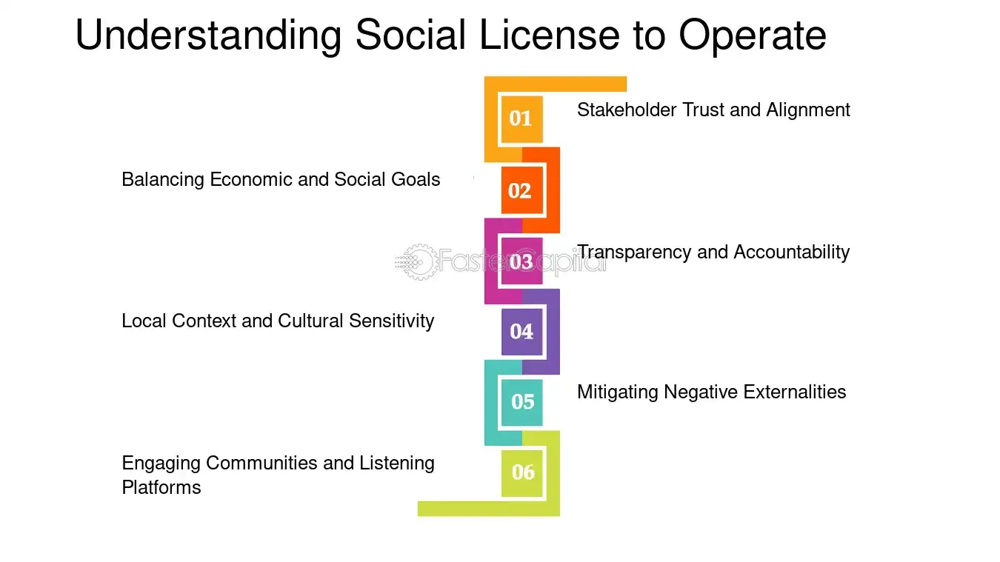

## Table of Contents

## What is the concept of Social License to Operate (SLO)?

Social License to Operate (SLO) is a term that describes the level of acceptance or approval by the local community and other stakeholders towards a company's activities. It's not an official license but more like an informal agreement. If a company wants to operate smoothly, it needs to have a good relationship with the people around it. This means listening to their concerns, being transparent, and making sure the company's actions benefit the community.

Getting and keeping a Social License to Operate can be tricky. Companies need to communicate well and show that they care about the community's well-being. If they don't, they might face protests, bad publicity, or even have to stop their operations. For example, a mining company might need to show that it's not harming the environment and is creating jobs for local people. By doing this, the company can build trust and continue its work without too many problems.

## How does Social License to Operate differ from legal permits and licenses?

Social License to Operate (SLO) is different from legal permits and licenses because SLO is not something you can get from the government. Legal permits and licenses are official documents that a company needs to operate legally. They are given by government agencies after the company meets certain rules and regulations. On the other hand, SLO is about how the community feels about the company. It's like an informal approval from the people who live near the company's operations.

While legal permits and licenses are mandatory and enforceable by law, SLO is more about building trust and maintaining a good relationship with the community. A company can have all the legal permits it needs, but if the local people don't support its activities, it might still face problems. For example, the community might protest or spread negative information about the company. So, even though SLO isn't required by law, it's very important for a company to operate smoothly and avoid conflicts.

## Why is Social License to Operate important for businesses?

Social License to Operate (SLO) is important for businesses because it helps them work without big problems from the community. If a business has a good SLO, it means the local people trust and support what the business is doing. This makes it easier for the business to keep running smoothly. Without a good SLO, a business might face protests, bad publicity, or even have to stop working because the community is unhappy.

Having a strong SLO can also help a business in the long run. When a business listens to the community and takes care of their concerns, it builds a good reputation. This can attract more customers, employees, and even investors who want to support a company that is seen as responsible and caring. So, working on SLO is not just about avoiding trouble; it's also about growing and being successful in the future.

## What are the key components of achieving a Social License to Operate?

Achieving a Social License to Operate (SLO) involves several important parts. One key part is being open and honest with the community. This means telling them about your plans and listening to what they have to say. It's important to share information about how your business might affect the environment, jobs, and local life. By being transparent, you show that you care about the community's concerns and are willing to work with them.

Another important part is making sure your business brings benefits to the community. This could mean creating jobs, supporting local businesses, or helping with community projects. When people see that your business is doing good things for them, they are more likely to support you. It's also important to keep promises and follow through on commitments. If you say you will do something for the community, make sure you do it. This builds trust and shows that you are reliable.

Lastly, being respectful and understanding different views is crucial. Every community is different, and what works in one place might not work in another. It's important to respect local customs and traditions and be willing to adjust your plans if needed. By showing respect and being flexible, you can build a strong relationship with the community. This helps in maintaining a good Social License to Operate and ensures that your business can continue to work smoothly.

## How can a company measure its Social License to Operate?

A company can measure its Social License to Operate by listening to what the community says and watching how they act. One way to do this is by talking to people directly, like holding meetings or doing surveys. If people are happy and supportive, they might say good things about the company and be willing to work with them. On the other hand, if they are unhappy, they might protest or speak out against the company. By paying attention to these signs, a company can get a good idea of whether they have a strong Social License to Operate.

Another way to measure SLO is by looking at how the community interacts with the company online and in the media. If the company gets a lot of positive comments and shares on social media, it's a good sign that the community supports them. Also, if news stories and articles about the company are mostly positive, it shows that the company is doing well in the eyes of the public. By keeping an eye on these things, a company can understand how strong their Social License to Operate really is and make changes if needed to keep the community happy.

## What role do industry standards play in achieving a Social License to Operate?

Industry standards are important rules that companies follow to make sure they are doing things the right way. These standards can help a company get a Social License to Operate because they show the community that the company cares about doing things safely and responsibly. For example, if a company follows high environmental standards, the community might trust them more because they know the company is trying to protect the environment. By meeting these standards, a company can show that it is serious about being a good neighbor and taking care of the community's concerns.

However, just following industry standards might not be enough to get a strong Social License to Operate. The community might have their own ideas about what is important, and these might be different from the industry standards. So, a company needs to listen to the community and maybe do more than what the standards say. For example, if the community is worried about jobs, the company might need to create more job opportunities even if the industry standards don't say anything about it. By going beyond the standards and really understanding what the community wants, a company can build a better relationship and earn a stronger Social License to Operate.

## Can you provide examples of industries where Social License to Operate is particularly crucial?

The mining industry is one where Social License to Operate is really important. Mining can have a big impact on the environment and the local community. If a mining company wants to work without problems, it needs to show the community that it is taking care of the environment and creating jobs. If the community feels that the mining company is not listening to their concerns or is harming their land, they might protest or try to stop the mining. So, mining companies need to build trust and show that they care about the community to keep their Social License to Operate strong.

Another industry where Social License to Operate matters a lot is energy, especially with projects like oil and gas extraction or building wind farms. These projects can change the local area a lot, and people might worry about things like pollution or noise. Energy companies need to talk to the community, explain what they are doing, and make sure they are doing things in a way that the community agrees with. If they don't, they might face opposition and have trouble getting their projects done. By working with the community and showing they care about their concerns, energy companies can keep their Social License to Operate and move forward with their plans.

## How do stakeholders influence the Social License to Operate?

Stakeholders, like local people, workers, and environmental groups, have a big say in whether a company gets a Social License to Operate. If these groups think a company is doing good things, like protecting the environment or creating jobs, they will support the company. This support is important because it helps the company work without problems. On the other hand, if stakeholders are unhappy, they might protest or spread bad news about the company. This can make it hard for the company to keep going and can even force them to stop what they are doing.

Companies need to listen to what stakeholders want and try to meet their needs. By talking to these groups and understanding their concerns, a company can show that it cares about the community. This can help build trust and make the company more likely to get and keep a strong Social License to Operate. If a company ignores what stakeholders say, it can lose their support and face a lot of trouble. So, working well with stakeholders is key to having a good Social License to Operate.

## What are the consequences of losing a Social License to Operate?

Losing a Social License to Operate can cause big problems for a company. If the community stops supporting the company, people might start protesting or spreading bad news about it. This can make it hard for the company to keep working. The company might have to stop its projects or even close down if the community is really against what it's doing. Losing the trust of the community can also hurt the company's reputation, which can make it hard to find new customers or get money from investors.

In the long run, not having a Social License to Operate can stop a company from growing and being successful. If the company can't fix its relationship with the community, it might have to move to a new place or change what it does. This can cost a lot of money and time. So, it's really important for companies to listen to the community and work hard to keep their trust. If they don't, they could lose their chance to operate and grow in the future.

## How can companies regain a lost Social License to Operate?

If a company loses its Social License to Operate, it needs to work hard to win back the community's trust. The first step is to talk to the people and find out why they are unhappy. The company should listen carefully and show that it cares about what the community thinks. It might need to say sorry for any mistakes and explain what it will do differently in the future. Being open and honest about its plans and actions is really important. The company should also keep the community updated on any changes it makes to show that it is serious about fixing the problems.

Once the company knows what the community wants, it should start doing things to make things better. This could mean cleaning up the environment, creating more jobs, or helping with community projects. The company needs to follow through on its promises and show that it is making a real effort to improve. Over time, if the community sees that the company is trying hard to do better and is keeping its word, they might start to trust the company again. Regaining a Social License to Operate takes time and a lot of work, but it's possible if the company is committed to making things right with the community.

## What are the best practices for maintaining a strong Social License to Operate?

To keep a strong Social License to Operate, a company needs to always talk with the community and listen to what they say. It's important to be open and honest about what the company is doing and how it might affect the people around it. If the community has worries or ideas, the company should pay attention and be ready to change its plans if needed. By being clear and showing that it cares about the community's thoughts, the company can build trust and keep a good relationship with the people.

Another important thing is to make sure the company is doing good things for the community. This can mean creating jobs, helping with local projects, or taking care of the environment. When the community sees that the company is bringing benefits, they are more likely to support it. The company should also keep its promises and follow through on what it says it will do. By doing these things, a company can keep its Social License to Operate strong and work without big problems from the community.

## How do global variations affect the application of Social License to Operate and industry standards?

Global variations mean that what works in one place might not work in another when it comes to Social License to Operate and industry standards. Different countries and cultures have their own rules and ways of doing things. For example, what people care about in a small village in Africa might be different from what people care about in a big city in Europe. So, a company needs to understand these differences and adjust how it talks to the community and follows rules. If a company uses the same plan everywhere, it might not get the support it needs from local people.

Industry standards can also be different around the world. Some countries might have very strict rules about things like the environment or safety, while others might have more relaxed rules. A company that wants to keep a strong Social License to Operate needs to know these differences and follow the local standards. But sometimes, just following the rules isn't enough. The company might need to do more to show the community that it cares about their concerns and is trying to do the right thing. By understanding and respecting global variations, a company can build trust and keep its Social License to Operate strong no matter where it is working.

## References & Further Reading

[1]: Grote, J., Cuomo, G., & Piermarini, M. (2018). ["Algorithmic Trading and the Need for More Regulation."](https://www.semanticscholar.org/paper/When-Is-More-Uncertainty-Better-A-Model-of-and-Griffin-Grote/29d3fde3ec110d9fbad2875690e919548ae5b59a) CNBC.

[2]: ["Advances in Financial Machine Learning"](https://www.amazon.com/Advances-Financial-Machine-Learning-Marcos/dp/1119482089) by Marcos Lopez de Prado.

[3]: {"Financial Stability and Central Bank Governance: The Issues and Legitimacy Dilemmas in the Context of Covid-19 Crisis—Focusing on Japanese and European Central Banks."} Discussion Paper. Bank of Japan. 

[4]: ["Quantitative Trading: How to Build Your Own Algorithmic Trading Business"](https://www.amazon.com/Quantitative-Trading-Build-Algorithmic-Business/dp/1119800064) by Ernest P. Chan.

[5]: MathWorks, ["Algorithmic Trading with MATLAB."](https://www.mathworks.com/discovery/algorithmic-trading.html)

[6]: U.S. Securities and Exchange Commission (SEC), ["Regulation of Exchanges and Alternative Trading Systems."](https://www.federalregister.gov/documents/1998/12/22/98-33299/regulation-of-exchanges-and-alternative-trading-systems)