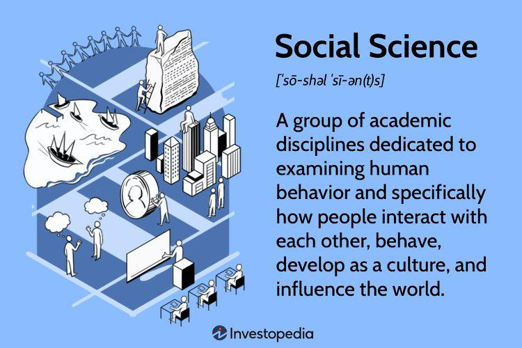

## Table of Contents

## What is the Social Science Research Network (SSRN)?

The Social Science Research Network (SSRN) is a website where researchers can share their papers and studies with others. It is like a big online library where people can find and read research from different areas like law, economics, and social sciences. Researchers upload their work to SSRN so that other people can see it and learn from it.

SSRN is useful because it helps spread new ideas and research quickly. Instead of waiting for a paper to be published in a journal, which can take a long time, researchers can put their work on SSRN right away. This means that other researchers and the public can start using the new information sooner. It also helps researchers get feedback on their work and improve it before it is officially published.

## Who founded the SSRN and when was it established?

SSRN was founded by Michael C. Jensen and Wayne Marr in 1994. Michael C. Jensen is a famous professor who wanted to make it easier for researchers to share their work with others. Wayne Marr helped him start SSRN because they both thought it was important for new research to be available quickly.

At first, SSRN was just for sharing research in finance and economics. But over time, it grew to include many other areas like law, health, and social sciences. Today, SSRN is a big online place where researchers from all over the world can share their papers and learn from each other.

## What types of research papers can be found on SSRN?

SSRN has many different types of research papers. You can find papers about law, like studies on new laws or court cases. There are also papers about economics, which might talk about how money and businesses work. If you are interested in health, you can find research about new medicines or ways to stay healthy. SSRN also has papers on social sciences, which can include topics like how people behave or what they think about different issues.

Besides these, SSRN includes research from other areas too. For example, there are papers on business, like how companies are run or how they can improve. You can also find research on technology, which might discuss new inventions or how technology changes our lives. SSRN is a big place with papers from many different fields, so there is something for everyone who wants to learn and explore new ideas.

## How can someone submit a paper to SSRN?

To submit a paper to SSRN, you first need to create an account on their website. You can do this by going to the SSRN homepage and clicking on the "Register" button. Once you have an account, you can log in and go to the "Submit Paper" section. Here, you will need to fill out some information about your paper, like the title, authors, and a short summary. You will also need to upload your paper as a file, usually in a PDF format.

After you submit your paper, it will go through a review process. SSRN does not review the content of your paper for quality or accuracy, but they do check to make sure it follows their guidelines. If everything is okay, your paper will be added to the SSRN database, and people can start reading and downloading it. You might also get feedback from other researchers, which can help you improve your work. Remember, submitting a paper to SSRN is a good way to share your research with others quickly.

## What are the benefits of using SSRN for researchers?

Using SSRN can help researchers in many ways. When you put your paper on SSRN, it can be seen by people all over the world right away. This means other researchers can read your work and give you feedback quickly. This feedback can help you make your paper better before you send it to a journal. Also, SSRN is a good place to show your work to others, which can help you get noticed in your field. This can be important for getting a job or more funding for your research.

Another benefit of SSRN is that it helps you keep track of how many people are reading your paper. SSRN gives you reports on how many times your paper has been downloaded. This can show that your work is important and interesting to others. Also, SSRN makes it easy to find other papers that are similar to yours. This can help you learn more about your topic and find new ideas for your research. Overall, using SSRN can make your research better known and help you grow as a researcher.

## How does SSRN ensure the quality of the papers it hosts?

SSRN does not check the quality of the papers it hosts in the same way that a journal might. Instead, SSRN focuses on making sure that the papers follow their rules. When someone submits a paper, SSRN checks to make sure it is in the right format and that all the required information is there. They also make sure the paper is not just an advertisement or something that doesn't belong on their site. This helps keep the site useful and organized for everyone.

Even though SSRN does not review the content of the papers for quality, the papers still go through a process where other researchers can read and comment on them. This feedback from the community can help improve the quality of the papers over time. By sharing papers early, researchers can get helpful suggestions and make their work better before it is published in a journal. This way, SSRN helps make research better through community involvement.

## Can the public access papers on SSRN, and if so, how?

Yes, the public can access papers on SSRN. All you need to do is go to the SSRN website and use the search tool to find papers that interest you. You can search by topic, author, or title. Once you find a paper you want to read, you can usually download it for free. This makes it easy for anyone to learn about new research.

SSRN has papers on many different subjects, so there is something for everyone. Whether you are a student, a teacher, or just someone who likes to learn new things, you can find useful information on SSRN. Just remember that while anyone can read the papers, you need to create an account if you want to download them or submit your own research.

## What is the role of SSRN in academic and professional communities?

SSRN plays a big role in helping researchers share their work with others. It is like a big online library where people can find and read new research papers. Researchers from all over the world can put their papers on SSRN, so others can see them quickly. This helps spread new ideas and knowledge faster than waiting for a paper to be published in a journal. SSRN is useful for both academic and professional communities because it lets people learn about the latest research and gives researchers a chance to get feedback on their work.

In the academic world, SSRN helps professors and students stay up-to-date with new studies in their fields. It is a great place for them to find papers that can help with their own research or teaching. For professionals, like lawyers or business people, SSRN can provide important information that can help them do their jobs better. By making research available to everyone, SSRN helps create a community where people can learn from each other and improve their work.

## How does SSRN integrate with other academic databases and platforms?

SSRN works well with other academic databases and platforms by letting researchers share their papers in many places at once. When someone puts a paper on SSRN, they can also choose to send it to other databases like Google Scholar or PubMed. This means more people can find and read the paper. SSRN also has special tools that help researchers keep track of their work across different platforms. For example, they can see how many times their paper has been downloaded or cited on other sites.

This integration helps make research more visible and easier to find. By connecting with other databases, SSRN helps create a big network where researchers can share and find new ideas quickly. This is good for both the people who write the papers and those who want to read them. It makes the world of research more connected and helps everyone learn and grow together.

## What are the statistics on usage and impact of SSRN?

SSRN is used a lot by researchers and people who want to learn new things. Every month, millions of people visit the SSRN website to read and download papers. In fact, SSRN has over 1 million papers from different fields like law, economics, and health. This shows that many people find SSRN helpful for finding new research.

The impact of SSRN is big because it helps spread new ideas quickly. When a paper is put on SSRN, it can be read and shared by people all over the world right away. This means researchers can get feedback and improve their work faster. Also, SSRN keeps track of how many times a paper is downloaded, which shows that the research is important and useful to others.

## How has SSRN evolved since its inception?

Since it started in 1994, SSRN has grown a lot. At first, it was just for sharing research in finance and economics. But over time, it added more areas like law, health, and social sciences. Now, SSRN has over 1 million papers from all these different fields. It has become a big online library where people from all over the world can find and read new research. This growth has made SSRN a very important place for sharing and learning about new ideas.

SSRN has also changed how it works with other platforms. Now, when someone puts a paper on SSRN, they can also send it to other databases like Google Scholar or PubMed. This makes the research easier to find and read by more people. SSRN also gives researchers tools to see how many times their paper has been downloaded or cited on other sites. These changes have helped make research more connected and visible, which is good for both the people who write the papers and those who want to learn from them.

## What future developments are expected for SSRN?

In the future, SSRN is expected to keep growing and adding more papers from different fields. They might add new areas of research that are becoming more important, like technology or environmental studies. SSRN could also work on making their website easier to use, so more people can find and read the papers they need. They might add new tools to help researchers share their work even better and get more feedback from others.

Another thing SSRN might do is make their connections with other databases even stronger. This could mean that when someone puts a paper on SSRN, it will show up in more places right away. SSRN might also start using new technology to help researchers see how their work is being used and who is reading it. All these changes could make SSRN an even better place for sharing and learning about new research.

## References & Further Reading

[1]: Bergstra, J., Bardenet, R., Bengio, Y., & Kégl, B. (2011). ["Algorithms for Hyper-Parameter Optimization."](https://papers.nips.cc/paper/4443-algorithms-for-hyper-parameter-optimization) Advances in Neural Information Processing Systems 24.

[2]: ["Advances in Financial Machine Learning"](https://www.amazon.com/Advances-Financial-Machine-Learning-Marcos/dp/1119482089) by Marcos Lopez de Prado

[3]: ["Evidence-Based Technical Analysis: Applying the Scientific Method and Statistical Inference to Trading Signals"](https://www.amazon.com/Evidence-Based-Technical-Analysis-Scientific-Statistical/dp/0470008741) by David Aronson

[4]: ["Machine Learning for Algorithmic Trading"](https://github.com/stefan-jansen/machine-learning-for-trading) by Stefan Jansen

[5]: ["Quantitative Trading: How to Build Your Own Algorithmic Trading Business"](https://books.google.com/books/about/Quantitative_Trading.html?id=j70yEAAAQBAJ) by Ernest P. Chan