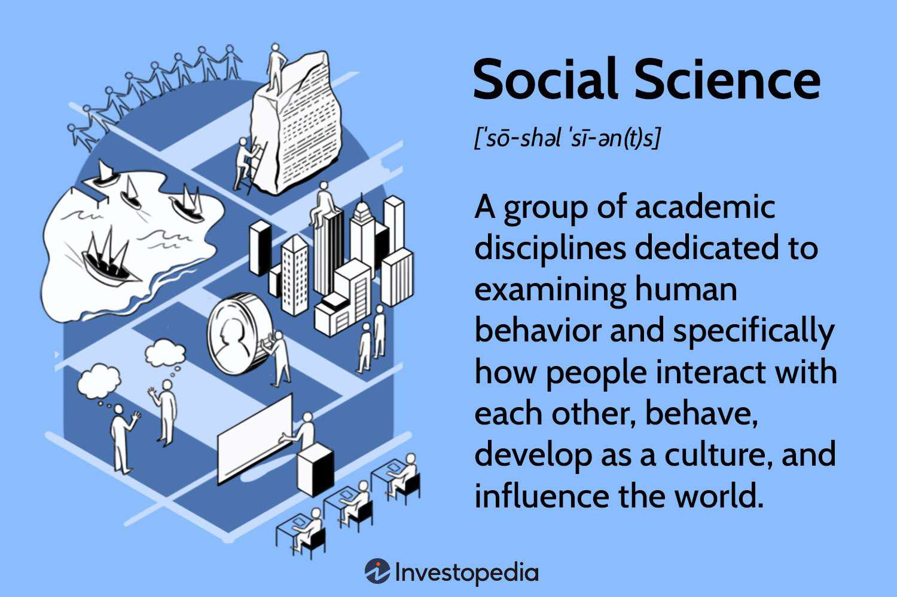

## Table of Contents

## What are social sciences?

Social sciences are a group of academic fields that study how people behave and interact with each other in society. They look at things like how people live together, how they make decisions, and how they form groups and institutions. Some examples of social sciences are sociology, psychology, economics, political science, and anthropology. These fields help us understand the world around us and how societies work.

In social sciences, researchers use different methods to collect and analyze information. They might do surveys, interviews, or observe people in their everyday lives. By doing this, they can find patterns and understand why people do the things they do. Social sciences are important because they help us solve problems in society, like poverty, crime, and inequality. They also help us make better policies and improve the way we live together.

## What are the five major branches of social sciences?

The five major branches of social sciences are sociology, psychology, economics, political science, and anthropology. Sociology looks at how people live together in groups and societies. It studies things like family, education, and how people get along with each other. Psychology focuses on understanding the human mind and behavior. It helps us learn about why people think and act the way they do, including emotions and mental health.

Economics is all about how people use resources and make money. It looks at things like jobs, money, and how people buy and sell things. Political science studies how governments work and how people make decisions about who leads them. It covers topics like voting, laws, and different types of government. Anthropology is the study of humans and their cultures, both past and present. It looks at how people live, their traditions, and how they have changed over time.

These five branches help us understand different parts of human life and society. By studying them, we can learn more about ourselves and the world around us.

## How does sociology differ from psychology?

Sociology and psychology both study how people behave, but they look at different things. Sociology focuses on groups of people and how they live together in society. It looks at things like families, schools, and communities. Sociologists want to understand how these groups work and how they affect the people in them. They study big patterns and trends, like why some groups of people are richer or poorer than others, or how different cultures do things differently.

Psychology, on the other hand, focuses on the individual person. It tries to understand what goes on inside someone's mind and why they behave the way they do. Psychologists look at things like emotions, thoughts, and mental health. They might study how a person's childhood affects them as an adult, or how people can change their behavior to be happier and healthier. While sociology looks at the bigger picture of society, psychology zooms in on the individual and their personal experiences.

## What is the focus of anthropology in social sciences?

Anthropology in social sciences focuses on studying humans and their cultures, both in the past and the present. It looks at how people live, their traditions, and how they have changed over time. Anthropologists want to understand what makes different groups of people unique and how they interact with each other and their environment.

Anthropology is different from other social sciences because it often involves spending a lot of time living with the people being studied. This helps anthropologists get a deep understanding of their way of life. They might study things like language, religion, family structures, and how people get food. By doing this, anthropologists help us learn about the diversity of human life and how societies have developed over time.

## How does economics contribute to understanding social behavior?

Economics helps us understand social behavior by looking at how people use resources and make money. It studies things like jobs, money, and how people buy and sell things. By doing this, economists can see how people make choices based on what they want and what they can afford. For example, if someone has a lot of money, they might buy more things, but if they don't have much money, they might have to be careful with what they spend. This shows how money and resources affect how people act in society.

Economics also helps us understand bigger patterns in society, like why some people are rich and others are poor. It looks at how the economy works and how it affects different groups of people. For example, economists might study how jobs are created or lost, and how this changes people's lives. By understanding these patterns, we can see how economic factors shape social behavior and help us make better decisions about things like jobs, money, and how to help people who need it.

## What role does political science play in social sciences?

Political science helps us understand how governments work and how people make decisions about who leads them. It looks at things like voting, laws, and different types of government. By studying political science, we learn about how power is shared in society and how people can work together to make decisions. This helps us see how politics affects everyday life and how it can be used to solve problems in society.

Political science also helps us understand why people have different opinions and how they come together to form political groups. It looks at how people argue about ideas and how these arguments can lead to changes in laws and policies. By understanding these things, political science helps us make better decisions about who should lead us and how we can make our society better. It's important because it helps us see how we can all work together to make the world a better place.

## Can you explain the methodologies used in social sciences?

In social sciences, researchers use different ways to collect and study information about people and society. One common way is through surveys, where they ask people questions about their thoughts, feelings, and behaviors. This helps them gather a lot of information from many people at once. Another way is through interviews, where researchers talk to people one-on-one to get deeper insights into their lives and experiences. They might also use observations, where they watch people in their everyday lives to see how they act and interact with others. These methods help researchers find patterns and understand why people do the things they do.

Another important method in social sciences is experiments, where researchers set up situations to see how people react. This can help them understand cause and effect, like how a certain change might affect people's behavior. They also use case studies, where they look closely at one person or group to learn a lot about them. Sometimes, researchers use existing data, like government records or past studies, to answer new questions. By using these different methods, social scientists can get a full picture of how people and societies work, and they can use this information to help solve problems and make better decisions.

## How do the five major branches of social sciences interconnect?

The five major branches of social sciences—sociology, psychology, economics, political science, and anthropology—are connected because they all study people and how they live together. Sociology looks at how people in groups behave and how society works. It often uses information from psychology, which studies how individuals think and feel. For example, sociologists might use what psychologists learn about emotions to understand why people in a group act a certain way. Economics, which studies how people use money and resources, also connects with sociology because money can affect how people live and interact in society. If people don't have much money, it can change how they behave in their families or communities.

Political science, which looks at how governments and leaders work, is linked to all the other branches too. It uses psychology to understand why people vote the way they do and sociology to see how different groups in society support different leaders. Economics is important for political science because money and resources are big parts of how governments work. Anthropology, which studies different cultures and how they change over time, connects with all these branches by showing how different societies around the world handle money, government, and group behavior. By working together, these branches help us understand the big picture of how people live and how we can make society better.

## What are some key theories in sociology and how do they apply to social phenomena?

One key theory in sociology is the functionalist theory. This theory says that society is like a body, with different parts that all work together to keep things running smoothly. Each part, like family, school, or government, has a job to do. For example, schools teach kids, and families take care of them. If one part isn't working right, it can cause problems for the whole society. Functionalists look at how these parts help keep society stable and how they can change over time. They might study things like why some families are different from others or how schools can help kids do better in life.

Another important theory is the conflict theory. This theory says that society is made up of groups that are always fighting for power and resources. Some groups, like rich people or certain races, have more power than others. This can lead to inequality and unfairness. Conflict theorists look at how these fights affect society and how they can cause big changes. For example, they might study why some people are poor and others are rich, or how different groups fight for their rights. Both functionalist and conflict theories help us understand why society works the way it does and how we can make it better for everyone.

## How has the field of psychology evolved to include social aspects?

Psychology used to focus mostly on the mind of one person at a time. It looked at things like how people think, feel, and behave. But over time, psychologists realized that people's thoughts and actions are affected by the people around them and the society they live in. This led to the development of social psychology, which is a part of psychology that looks at how people's thoughts, feelings, and behaviors are influenced by others. Social psychologists study things like how people act in groups, how they form friendships, and how they are affected by social norms and expectations.

Today, social aspects are a big part of psychology. Psychologists study how social situations can affect mental health, like how being lonely can make someone feel sad or how being part of a supportive group can help someone feel better. They also look at how social factors, like culture and family, shape who we are and how we see the world. By understanding these social influences, psychologists can help people deal with problems and live happier lives. This shows how psychology has grown to include social aspects, making it a more complete way to understand human behavior.

## What are the current trends and challenges in anthropological research?

In anthropological research, one big trend is using new technology to study people and their cultures. Anthropologists now use things like digital tools and social media to learn about how people live and interact. They can study big groups of people from all over the world without having to travel as much. This helps them see how cultures are changing and how people are connected in new ways. Another trend is focusing more on how people deal with big problems like climate change and health issues. Anthropologists are looking at how different cultures handle these challenges and what we can learn from them.

But there are also challenges in anthropological research. One big challenge is making sure that the research is fair and respects the people being studied. Anthropologists have to be careful not to harm or take advantage of the communities they work with. They need to make sure that the people they study have a say in the research and that it helps them in some way. Another challenge is dealing with all the information that's out there. With so much data from digital sources, it can be hard to know what's important and what's not. Anthropologists have to find ways to sort through this information and use it to learn more about people and their cultures.

## How do advanced statistical methods enhance economic and political science research?

Advanced statistical methods help economists and political scientists understand big and complex data better. In economics, these methods let researchers look at lots of information about things like jobs, money, and how people spend. They can use these methods to find patterns and make predictions about the economy. For example, they might use statistics to see how a new law could affect jobs or how people's spending changes over time. This helps them give better advice to governments and businesses about how to make the economy stronger.

In political science, advanced statistics help researchers study how people vote and how governments work. They can use these methods to look at big surveys and see what people think about different issues. This helps them understand why people support certain leaders or policies. For example, they might use statistics to see how different groups of people vote and what makes them change their minds. By using these advanced methods, political scientists can give better advice on how to make governments work better and how to help people have a bigger say in how they are led.

## References & Further Reading

[1]: Kahneman, D. (2011). ["Thinking, Fast and Slow."](https://link.springer.com/article/10.1007/s00362-013-0533-y) Farrar, Straus and Giroux.

[2]: Thaler, R. H., & Sunstein, C. R. (2008). ["Nudge: Improving Decisions About Health, Wealth, and Happiness."](https://psycnet.apa.org/record/2008-03730-000) Yale University Press.

[3]: Shiller, R. J. (2003). ["Irrational Exuberance."](https://www.jstor.org/stable/j.ctt1287kz5) Princeton University Press.

[4]: Lo, A. W. (2012). ["Adaptive Markets: Financial Evolution at the Speed of Thought."](https://www.jstor.org/stable/j.ctvc77k3n) Princeton University Press.

[5]: Fama, E. F. (1970). ["Efficient Capital Markets: A Review of Theory and Empirical Work."](https://onlinelibrary.wiley.com/doi/abs/10.1111/j.1540-6261.1970.tb00518.x) The Journal of Finance, 25(2), 383-417.

[6]: Barberis, N., & Thaler, R. (2003). ["A Survey of Behavioral Finance."](https://www.nber.org/papers/w9222) in Handbook of the Economics of Finance, 1, 1053-1128.