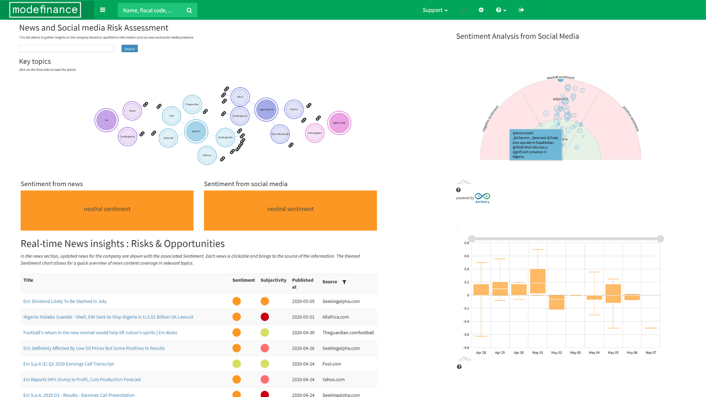

In algorithmic trading, maintaining a competitive edge is essential. Traditional data sources often provide insights based on well-known financial metrics, which may be insufficient for traders striving to identify market trends and opportunities ahead of their competitors. Social sentiment, as an alternative data source, has emerged as a powerful tool to access unique market insights.

Social sentiment data captures the collective mood, opinions, and perceptions from diverse online platforms such as social media, forums, and blogs. This data represents the emotional and psychological influences of market participants, offering real-time insights that go beyond the scope of traditional financial data. Advances in natural language processing and machine learning have made sentiment analysis increasingly accessible and effective, allowing traders to interpret vast amounts of textual information and quantify public sentiment with precision.



Algorithmic traders are now increasingly focusing on social sentiment to inform their decision-making processes. By integrating sentiment data into trading algorithms, traders can predict market trends and adjust their strategies accordingly, often anticipating movements before official data and news releases reflect those changes. This strategic use of social sentiment can significantly bolster a trader's ability to execute informed trades and manage risks effectively.

This article explores the transformative impact of social sentiment data on algorithmic trading. It examines how traders can harness sentiment analysis to enhance their trading algorithms and discusses the key tools and providers facilitating its application in real-world trading environments. With the proliferation of digital communication channels, the role of social sentiment in understanding market dynamics is becoming increasingly crucial, marking a new frontier in the quest for trading excellence.

## Table of Contents

## What is Social Sentiment in Trading?

Social sentiment in trading is a concept that captures the collective mood or opinion of market participants based on data sourced from social media platforms, forums, blogs, and other online environments. This data reflects public discussions and perceptions, which can significantly drive market behavior and influence stock prices. Unlike traditional financial analysis that relies on numerical data and historical price movements, social sentiment offers a more dynamic insight into the market's emotional and psychological reactions to events.

The process of social sentiment analysis involves sophisticated techniques in natural language processing (NLP) and [machine learning](/wiki/machine-learning). These methodologies are employed to quantify and interpret emotions, opinions, and attitudes found in text data shared across digital platforms. NLP techniques identify sentiment by parsing language contexts, while machine learning aids in refining and enhancing the predictive accuracy of these analyses by learning from vast datasets.

Platforms like Twitter and StockTwits have become integral in financial discussions due to their capacity to rapidly disseminate information to a wide audience. Consequently, these platforms serve as fertile ground for collecting sentiment data. For instance, the [volume](/wiki/volume-trading-strategy) and tone of tweets about a particular stock can provide traders with immediate insights into market perception, even before official news outlets can report on it.

Analyzing social sentiment in trading thus provides a real-time narrative of market consensus. This data can be particularly useful in predicting short-term price movements and gauging the impact of news events or corporate announcements. When traders harness this information effectively, they can enhance their market strategies and react swiftly to changes, thereby leveraging social sentiment for potentially improved trading outcomes.

## Role of Social Sentiment as Alternative Data

Traditional financial analysis relies heavily on established data sources, such as financial statements, economic indicators, and historical pricing data. While these sources provide a foundational understanding, their pervasive availability to all market participants diminishes their potential as a source of competitive advantage. Social sentiment, however, emerges as a potent [alternative data](/wiki/best-alternative-data) source, offering fresh insights by capturing the emotional and psychological dynamics of market participants.

Social sentiment data encompasses the collective emotions and opinions of investors derived from digital platforms such as social media, forums, and blogs. This type of data provides a real-time reflection of public mood, which can significantly drive market behavior and influence asset prices. When traders incorporate social sentiment into their strategies, they gain the ability to anticipate market movements that are motivated by collective sentiment. Such foresight is particularly valuable as it often precedes changes captured by official data releases and news events.

For instance, a surge in positive sentiment surrounding a particular stock on social media platforms might indicate an upcoming bullish trend, while increasing negative sentiment may signal an impending downturn. By systematically analyzing this data, traders are able to identify potential opportunities or risks at an early stage. Moreover, social sentiment data contributes to forecasting market [volatility](/wiki/volatility-trading-strategies). Variations in sentiment often correlate with fluctuations in market sentiments and perceived instability, enabling traders to adjust their risk management strategies accordingly.

Beyond signaling opportunities and risks, integrating social sentiment into trading algorithms improves predictive accuracy. Models that [factor](/wiki/factor-investing) in sentiment data can exploit a broader range of market signals, enhancing their ability to predict price movements and generate alpha. Advanced analytical techniques, such as natural language processing and machine learning, are employed to process and quantify sentiment data, transforming qualitative emotions into quantifiable metrics usable for trading algorithms.

In summary, social sentiment as alternative data transcends the limitations of traditional data sources by infusing emotional and psychological insights into trading strategies. This data not only offers a distinct perspective on market dynamics but also empowers traders to enhance their predictive models, manage risks more effectively, and secure a competitive edge in the fast-paced world of [algorithmic trading](/wiki/algorithmic-trading).

## Applications of Social Sentiment in Algorithmic Trading

Algorithmic trading strategies that incorporate social sentiment data have gained attention for their ability to predict shifts in trader sentiment, significantly optimizing the timing for market entry and [exit](/wiki/exit-strategy) points. Sentiment-driven trading strategies differentiate themselves by reacting swiftly to market-moving events. They leverage real-time analysis derived from social sentiment data, allowing traders to capitalize on the immediate impact of public perception on financial instruments.

Integrating social sentiment with quantitative strategies can enhance the robustness of predictive models. By combining diverse data streams, traders can achieve improved accuracy in market forecasts and optimize risk management processes. For example, quantitative models can be adjusted dynamically based on the prevailing sentiment, providing a more comprehensive view of potential risks and rewards.

Event-driven trading systems particularly benefit from analyzing social sentiment to evaluate the impact of corporate announcements or geopolitical events. These systems rely on semantic processing tools that can parse through sentiment data to gauge the collective mood and expectations of market participants. When a significant event occurs, such as a merger announcement or a diplomatic conflict, sentiment analysis helps traders assess the likely market response more swiftly than traditional news analysis.

A practical Python implementation might involve scraping Twitter for keyword-specific tweets using libraries like Tweepy, followed by sentiment analysis using frameworks like TextBlob or VADER (Valence Aware Dictionary and sEntiment Reasoner). Here's a simple example:

```python
import tweepy
from textblob import TextBlob

# Twitter API credentials
consumer_key = 'your_consumer_key'
consumer_secret = 'your_consumer_secret'
access_token = 'your_access_token'
access_token_secret = 'your_access_token_secret'

# Authenticate with Twitter
auth = tweepy.OAuth1UserHandler(consumer_key, consumer_secret, access_token, access_token_secret)
api = tweepy.API(auth)

# Search for tweets containing a specific keyword
tweets = api.search(q='AAPL', count=100)

# Analyze sentiment for each tweet
for tweet in tweets:
    analysis = TextBlob(tweet.text)
    print(f'Tweet: {tweet.text}')
    print(f'Sentiment: {analysis.sentiment.polarity}')

```

This example demonstrates the extraction of tweets based on a keyword (e.g., a stock ticker symbol like 'AAPL'), followed by sentiment analysis to gauge whether the general sentiment is positive, negative, or neutral. Such techniques enable traders to quickly adjust their strategies based on real-time mood swings in the market, showcasing the dynamic application of social sentiment within algorithmic trading.

## Key Social Sentiment Data Providers

Several data providers specialize in social sentiment analysis, delivering diverse datasets and analytical tools tailored for traders. These companies leverage advanced technologies such as natural language processing (NLP) and machine learning to efficiently process and interpret substantial volumes of sentiment data.

Estimize offers crowd-sourced earnings estimates, effectively aggregating predictions from a multitude of analysts and individual investors. This aggregation allows traders to gauge market sentiment concerning forthcoming financial performances, enriching their decision-making processes.

Dataminr focuses on real-time information discovery. It transforms the data from public sources, such as social media, into actionable alerts that can directly impact trading strategies. Traders can utilize these alerts to anticipate market reactions to major events and sentiments.

Tipranks aggregates stock recommendations from both financial analysts and financial bloggers, providing a measured sentiment index. This index serves as a benchmark, helping traders understand the prevailing attitudes and forecasts within the investment community.

RavenPack is another significant player, offering sentiment analysis originating from a wide array of public news and social data sources. It employs sophisticated algorithms to gauge real-time sentiment, enabling traders to quickly respond to market-moving news and sentiment shifts.

InfoTrie specializes in processing large datasets, offering clients a comprehensive sentiment analysis that draws from both news data and social media platforms. This provider’s services are structured to seamlessly integrate into traders' existing analytic frameworks, providing enriched insights into market sentiment influencing stock performance.

Together, these providers equip traders with the capability to harness the emotional and psychological components of market behavior, enhancing both predictive models and strategic decision-making in algorithmic trading.

## Challenges in Utilizing Social Sentiment Data

Social sentiment data, despite its promising benefits in algorithmic trading, presents several challenges that traders and analysts need to address. One of the primary challenges is data noise. Social media platforms and online forums generate vast amounts of data, much of which is irrelevant or redundant. Filtering out this noise to extract meaningful insights requires sophisticated algorithms capable of identifying valuable patterns amidst the clutter.

Another significant challenge is authentication. Verifying the authenticity of the sources generating this sentiment data is crucial, as there is a risk of misinformation propagating through these platforms. Traders must employ methods to ensure data integrity, which may involve cross-referencing multiple sources and utilizing techniques like blockchain for secure data validation.

Linguistic diversity also poses a hurdle in leveraging social sentiment data effectively. Text data from social media and online discussions come in various languages, each with its nuances, slang, and cultural references. Developing models that accurately interpret sentiments across such a diverse linguistic spectrum requires advanced natural language processing (NLP) techniques. These models must also account for context and subtleties like sarcasm, idiomatic expressions, and evolving language use.

The integration of social sentiment data with other data streams further complicates its use. Combining this data with traditional financial metrics or other alternative data sets demands robust data fusion strategies. These integration efforts must ensure compatibility with existing trading systems and algorithms, which can be technically challenging due to differences in data structure, frequency, and timeliness.

Moreover, ethical considerations arise when utilizing social data for trading purposes. Privacy concerns must be addressed, particularly in ensuring that data collection and analysis comply with relevant legal frameworks and ethical guidelines. Traders must consider the impact of their actions when using sentiment data, striving to avoid exploiting sensitive information or contributing to unfair market practices.

In summary, while social sentiment data offers a novel dimension to trading strategies, effectively harnessing its potential requires overcoming challenges related to data noise, authentication, linguistic diversity, technical integration, and ethical considerations. Addressing these issues is crucial for traders seeking to leverage social sentiment as a reliable tool in their trading arsenal.

## Future Prospects of Social Sentiment in Trading

As alternative data sources gain traction, the utilization of social sentiment in trading strategies is poised to become integral, offering a substantial competitive advantage for those who adopt it early. Social sentiment data provides a real-time glimpse into market psychology, capturing the collective emotions and opinions of investors. This addition to traditional data sets has the potential to enhance trading models and improve decision-making processes.

The advancements in [artificial intelligence](/wiki/ai-artificial-intelligence) (AI) and machine learning facilitate the precision of sentiment analysis. These technologies allow for the efficient processing and interpretation of vast amounts of unstructured data generated across social media platforms, forums, and news outlets. As algorithms become more sophisticated, they will be capable of identifying patterns and trends in sentiment data with greater accuracy. This enhanced analytical capability paves the way for high-frequency trading and automated decision-making, where trading systems can react promptly to shifts in market sentiment.

Natural language processing (NLP) technology also plays a crucial role in the future prospects of social sentiment in trading. Ongoing improvements in NLP will enable traders to better interpret the nuanced and often ambiguous language found on social platforms. Sentiment analysis systems will increasingly decipher complex linguistic features like irony and sarcasm, which can significantly affect sentiment interpretation. Such advancements will lead to more reliable and sophisticated tools for traders, allowing for seamless integration of sentiment data into trading strategies.

The evolution of social sentiment analysis is expected to redefine market interactions for traders. This transformation underscores the importance of staying informed about technological advancements in finance, as integrating cutting-edge sentiment analysis tools may offer a distinct advantage. Embracing these changes could lead to innovative approaches to market analysis and trading, optimizing returns and managing risks more effectively. The future of trading, therefore, looks increasingly intertwined with technological progress in sentiment analysis, forecasting a paradigm shift in how market insights are acquired and utilized.

## Conclusion

Social sentiment as an alternative data source offers a compelling edge in the algorithmic trading landscape. It provides the ability to capture real-time market perceptions and psychological undercurrents that drive market movements, making it an invaluable resource for traders. By integrating social sentiment into algorithmic models, traders can significantly enhance their trading outcomes. This integration promotes early detection of market trends, improving the timing of entry and exit points and optimizing risk management strategies.

The evolution of sentiment analysis tools, powered by advancements in AI and machine learning, further augments the precision and applicability of social sentiment data. These enhancements enable more nuanced understanding and predictive accuracy, fostering innovative approaches to trading strategies.

As our understanding and technologies continue to advance, the integration of social sentiment into trading strategies will undoubtedly evolve. This ongoing refinement heralds a promising era for traders, emphasizing the importance of staying informed about technological trends in finance to maintain a competitive advantage.

## References & Further Reading

[1]: Bollen, J., Mao, H., & Zeng, X. (2011). ["Twitter mood predicts the stock market."](https://www.sciencedirect.com/science/article/pii/S187775031100007X) Journal of Computational Science, 2(1), 1-8.

[2]: Liew, J. K. S., & Budavári, T. (2016). ["The 'Google Search' Effect in the US Financial Markets."](https://www.nber.org/papers/w23461) National Bureau of Economic Research.

[3]: ["Advances in Financial Machine Learning"](https://www.amazon.com/Advances-Financial-Machine-Learning-Marcos/dp/1119482089) by Marcos Lopez de Prado

[4]: Ranco, G., Aleksovski, D., Caldarelli, G., Grčar, M., & Mozetič, I. (2015). ["The Effects of Twitter Sentiment on Stock Price Returns."](https://journals.plos.org/plosone/article?id=10.1371/journal.pone.0138441) PLoS ONE, 10(9).

[5]: ["Machine Learning for Algorithmic Trading"](https://github.com/PacktPublishing/Machine-Learning-for-Algorithmic-Trading-Second-Edition) by Stefan Jansen

[6]: Tetlock, P. C. (2007). ["Giving Content to Investor Sentiment: The Role of Media in the Stock Market."](https://onlinelibrary.wiley.com/doi/abs/10.1111/j.1540-6261.2007.01232.x) The Quarterly Journal of Economics, 122(3), 1139-1168.

[7]: Zhang, X., Fuehres, H., & Gloor, P. A. (2011). ["Predicting Stock Market Indicators Through Twitter 'I hope it is not as bad as I fear'."](https://www.sciencedirect.com/science/article/pii/S1877042811023895) Procedia - Social and Behavioral Sciences, 26, 55-62.