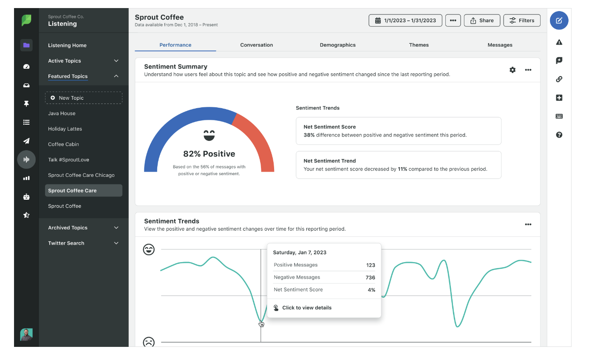

## Table of Contents

## What is a Social Sentiment Indicator?

A Social Sentiment Indicator is a tool that helps people understand how others feel about a certain topic on social media. It looks at posts, comments, and other online content to see if people are happy, sad, angry, or have other feelings about something. For example, if a new movie comes out, a Social Sentiment Indicator can tell if most people like it or not by checking what they say on social media.

These indicators use special computer programs to read and understand the words people use. They can tell if words are positive, negative, or neutral. This helps businesses, researchers, and anyone interested in public opinion to make better decisions. For instance, a company might use a Social Sentiment Indicator to see if their new product is popular or if they need to make changes based on what people are saying online.

## Why is it important to track social sentiment?

Tracking social sentiment is important because it helps us understand what people think and feel about different things. When companies, politicians, or even regular people know what others are saying on social media, they can make better choices. For example, if a company sees that people are unhappy with a product, they can fix it or make it better. This can help them keep their customers happy and make more sales.

It also helps in understanding public opinion on big issues like politics or social causes. By looking at social sentiment, leaders can see if people support their ideas or if they need to change their approach. This can lead to better policies and more effective communication with the public. Overall, tracking social sentiment gives us valuable information that can guide decisions and actions in many areas of life.

## How does a Social Sentiment Indicator work?

A Social Sentiment Indicator works by looking at what people say on social media. It uses special computer programs to read posts, comments, and other online content. These programs can understand if the words people use are happy, sad, angry, or neutral. For example, if someone writes "I love this new phone," the program knows that's a positive comment. If someone else writes "This phone is terrible," the program sees that as a negative comment.

Once the program reads all these comments, it adds them up to see the overall feeling about a topic. If there are more positive comments than negative ones, the Social Sentiment Indicator shows that people generally feel good about it. If there are more negative comments, it shows that people are not happy. This helps businesses and others understand what people think without having to read every single comment themselves.

## What are the common sources of data for Social Sentiment Indicators?

Social Sentiment Indicators get their information from places where people talk online. The most common place is social media like Twitter, Facebook, and Instagram. People share their thoughts and feelings on these sites a lot, so it's a good way to see what they think about different things. Another big source is online forums and review sites like Reddit or Yelp. These places are full of comments and reviews that can tell us if people like or dislike something.

Blogs and news websites also help. People often leave comments on articles and posts, and these comments can show what they feel about the news or topics discussed. Sometimes, Social Sentiment Indicators also look at data from customer feedback forms or surveys that companies collect. All these sources together give a good picture of what people are thinking and feeling about a topic.

## Can you explain the basic metrics used in Social Sentiment analysis?

Social Sentiment analysis uses a few basic metrics to understand how people feel about something. The most common metric is the Sentiment Score, which measures if comments are positive, negative, or neutral. It does this by looking at the words people use and giving them a score. For example, words like "love" or "great" get a high score because they are positive, while words like "hate" or "terrible" get a low score because they are negative. The overall Sentiment Score is the average of all these scores, showing if the general feeling is good, bad, or in the middle.

Another important metric is the Volume of Sentiment, which counts how many people are talking about a topic. If a lot of people are discussing something, it means it's important to them. This can help show if a topic is getting more attention over time. The last metric is the Sentiment Trend, which looks at how feelings change over time. It can tell if people are starting to like something more or less as time goes on. These three metrics together give a full picture of what people think and feel about a topic.

## How is sentiment data collected and processed?

Sentiment data is collected from places where people share their thoughts online, like social media, blogs, and review sites. When someone posts a comment or a review, special computer programs called web crawlers or spiders go to these websites and gather all the text. These programs can read posts from Twitter, comments on a news article, or reviews on a product page. They collect a lot of this data to get a big picture of what people are saying about a topic.

Once the data is collected, it needs to be processed to understand the feelings behind the words. This is done using natural language processing (NLP), which is a way for computers to understand human language. The computer looks at each word and phrase to see if it's positive, negative, or neutral. It then gives each comment a score based on these feelings. After scoring all the comments, the computer adds up the scores to find the overall sentiment. This helps show if people generally feel good, bad, or neutral about something.

## What are the challenges in accurately measuring social sentiment?

Measuring social sentiment accurately can be hard because people use language in many different ways. They might use sarcasm, slang, or cultural references that a computer might not understand. For example, if someone says, "This movie is so good, I fell asleep," they might mean the opposite. Also, people from different places might use words differently, so what's positive in one place might not be in another. These differences can make it tricky for a computer to figure out the real feelings behind what people say.

Another challenge is that social media only shows a part of what people think. Not everyone uses social media, and those who do might not share their true feelings online. Some people might be louder or post more than others, so their opinions can seem more important than they really are. Plus, fake accounts or bots can post comments that don't reflect real people's feelings. All these things can make it hard to get a clear picture of what everyone really thinks about a topic.

## How can businesses use Social Sentiment Indicators to improve their strategies?

Businesses can use Social Sentiment Indicators to learn what people think about their products or services. By looking at social media comments, businesses can see if customers like what they offer or if there are problems that need fixing. For example, if a lot of people are complaining about a product's price, the business might decide to lower it or offer a discount. This can help keep customers happy and make them more likely to buy again. Also, if people are excited about a new product, the business might decide to make more of it or promote it more to get even more sales.

Social Sentiment Indicators can also help businesses understand what's popular or what people want. If a business sees that people are talking a lot about a certain type of product, they might decide to start making something similar. This can help them stay ahead of trends and meet customer needs better. By keeping an eye on social sentiment, businesses can make smarter choices about what to sell, how to price things, and how to talk to their customers, which can lead to more success in the long run.

## What are some advanced techniques used in sentiment analysis?

Advanced techniques in sentiment analysis include using [machine learning](/wiki/machine-learning) and [deep learning](/wiki/deep-learning). Machine learning helps computers learn from examples. For instance, if you show a computer a lot of comments that people have labeled as happy or sad, it can start to guess the feelings in new comments. Deep learning goes even further. It uses something called neural networks, which are like layers of computer brains that can understand very complex patterns in language. This helps the computer get better at knowing if people are using sarcasm or if they mean something different from what they say.

Another advanced technique is aspect-based sentiment analysis. This looks at different parts of a product or service to see what people think about each part. For example, if people are talking about a phone, aspect-based analysis can tell you if they like the camera but not the battery life. This gives businesses more detailed information to work with. Also, there's something called multi-lingual sentiment analysis, which can understand feelings in many different languages. This is useful for businesses that want to know what people all over the world think about their products.

## How do Social Sentiment Indicators integrate with other data analytics tools?

Social Sentiment Indicators can work together with other data analytics tools to give businesses a fuller picture of what's going on. For example, a company might use a Social Sentiment Indicator to see what people are saying about their product on social media. Then, they can use other tools like sales data or website traffic to see if what people are saying matches up with how much they're buying or how many people are visiting the site. By putting all this information together, businesses can make better decisions about what to do next.

Another way Social Sentiment Indicators can be used with other tools is through dashboards and reporting systems. These systems can show sentiment data right next to other important numbers, like how much money the company is making or how many new customers they're getting. This makes it easy for people in the company to see everything at once and understand how feelings on social media might be affecting other parts of the business. It helps them see the big picture and plan their next steps more carefully.

## What are the limitations of current Social Sentiment Indicator technologies?

Current Social Sentiment Indicator technologies have some limitations. One big problem is that they can struggle to understand the way people really talk. People often use sarcasm, slang, or special words that a computer might not get right. For example, if someone says "This is just great" in a sarcastic way, the computer might think they are happy when they're really not. Also, people from different places use words differently, so what's positive in one place might be negative in another. This makes it hard for the computer to figure out the true feelings behind what people say.

Another limitation is that social media only shows a part of what people think. Not everyone uses social media, and those who do might not share their real feelings online. Some people might post more than others, so their opinions can seem more important than they really are. Plus, fake accounts or bots can post comments that don't reflect real people's feelings. All these things can make it hard to get a clear picture of what everyone really thinks about a topic.

## How might future developments in AI and machine learning impact Social Sentiment Indicators?

Future developments in AI and machine learning could make Social Sentiment Indicators much better at understanding what people really mean. As these technologies get smarter, they will be able to pick up on things like sarcasm, slang, and cultural differences more easily. This means the computer will be better at knowing if someone is joking or if they really mean what they say. Also, with more advanced machine learning, Social Sentiment Indicators will be able to learn from more examples and get better at understanding different languages. This will help businesses and researchers understand what people all over the world think about different topics.

These improvements will also help Social Sentiment Indicators deal with the problem of fake accounts and bots. As AI gets better, it will be able to tell the difference between real people's comments and ones made by computers. This will make the data more accurate and trustworthy. Overall, future developments in AI and machine learning will make Social Sentiment Indicators more reliable and useful, giving businesses and others a clearer picture of what people are thinking and feeling.

## References & Further Reading

[1]: Agarwal, A., & Kumar, A. (2021). ["Machine Learning in Finance: Techniques and Applications."](https://www.sciencedirect.com/science/article/pii/S0957417423001410) Springer.

[2]: Bollen, J., Mao, H., & Zeng, X. (2011). ["Twitter mood predicts the stock market."](https://www.sciencedirect.com/science/article/pii/S187775031100007X) Journal of Computational Science, Volume 2, Issue 1.

[3]: Devlin, J., Chang, M. W., Lee, K., & Toutanova, K. (2019). ["BERT: Pre-training of Deep Bidirectional Transformers for Language Understanding."](https://aclanthology.org/N19-1423/) arXiv preprint arXiv:1810.04805.

[4]: Feldman, R. (2013). ["Techniques and applications for sentiment analysis."](https://dl.acm.org/doi/10.1145/2436256.2436274) Communications of the ACM, 56(4), 82-89.

[5]: Soumik, B., & Das, S. (2018). ["Sentiment Analysis in Financial Markets Using Machine Learning and Deep Learning."](https://arxiv.org/abs/1801.07883) IEEE Conference Paper.

[6]: Yang, Y., & Eisenstein, J. (2017). ["Overcoming Language Variation in Sentiment Analysis with Social Attention."](https://aclanthology.org/Q17-1021.pdf) Proceedings of the 2017 Conference on Empirical Methods in Natural Language Processing.

[7]: Zhang, L., Wang, S., & Liu, B. (2018). ["Deep learning for sentiment analysis: A survey."](https://arxiv.org/abs/1801.07883) Wiley Interdisciplinary Reviews: Data Mining and Knowledge Discovery, 8(4).