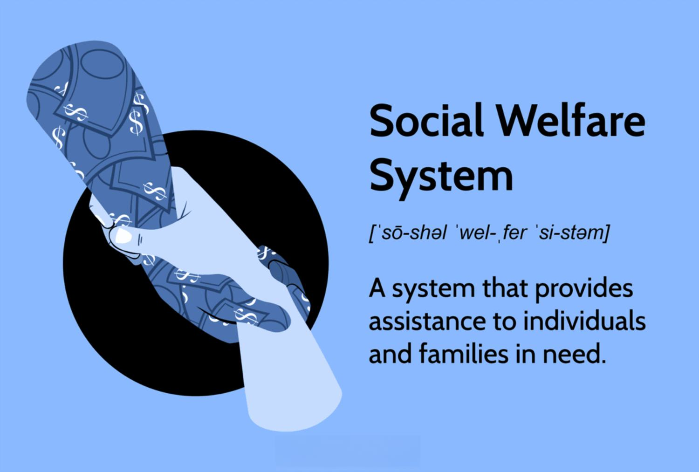

In today's rapidly evolving global landscape, the interplay between social welfare systems and algorithmic trading has garnered increasing attention. The rise of algorithmic trading, characterized by the use of advanced computational models to automate financial transactions, has transformed how markets operate. This transformation offers opportunities for increased efficiency and profitability but also poses challenges related to market volatility and regulation. Concurrently, social welfare systems, designed to provide financial and material support to disadvantaged individuals, play a crucial role in maintaining social equity.

The juxtaposition of these two domains raises important questions about their interaction and potential to influence each other. For example, algorithmic trading strategies often operate on principles of efficiency and profit maximization, which may not always align with the goals of social welfare systems aimed at equity and support. This divergence creates a complex dynamic where technology-driven financial advances can impact resource distribution and access to essential social services.



Examining these dynamics not only highlights the potential challenges posed by algorithmic trading—such as ethical considerations and market manipulation—but also underscores opportunities for leveraging technological advancements to improve the effectiveness of social welfare systems. By analyzing and understanding this intersection, stakeholders can better address issues of social equity and devise strategies to harness financial innovations for public benefit.

This article explores the complex relationships between social welfare, welfare systems, social services, and the proliferation of algorithmic trading. In doing so, it seeks to provide a comprehensive overview of key concepts, current trends, and potential future directions, ultimately aiming to foster a more balanced and equitable approach to integrating technological advancements with social welfare objectives.

## Table of Contents

## Understanding Social Welfare Systems

Social welfare systems are systematically structured to offer financial and material assistance to individuals and families in need. These systems encompass a variety of programs that aim to alleviate basic needs and uphold human dignity. Key components include healthcare services, food assistance programs, and unemployment benefits. Each program targets specific socio-economic vulnerabilities, striving to ensure that all citizens have access to a minimum standard of living.

Healthcare services under social welfare are typically designed to provide access to medical care for individuals who might otherwise be unable to afford it. These services can include government-subsidized health insurance, free clinics, and public health initiatives, which collectively aim to reduce healthcare disparities and improve public health outcomes. For instance, in countries like the United Kingdom, the National Health Service (NHS) provides a comprehensive range of healthcare services funded by taxation, ensuring that healthcare is accessible to all regardless of income.

Food assistance programs, another crucial aspect of social welfare, aim to combat hunger and malnutrition among low-income households. Programs such as the Supplemental Nutrition Assistance Program (SNAP) in the United States supply financial assistance for food purchasing, thereby enhancing food security and nutritional quality for vulnerable populations. These programs often include eligibility criteria based on income thresholds and family size, ensuring that aid is directed towards those most in need.

Unemployment compensation programs provide temporary financial support to individuals who have lost their jobs through no fault of their own. These programs help cushion the economic impact of unemployment, allowing individuals to sustain themselves and their families while searching for new employment opportunities. Benefits are typically calculated as a percentage of the individual’s previous earnings, and eligibility is often contingent upon factors such as work history and the circumstances of job termination.

Eligibility for social welfare programs is generally determined by evaluating factors such as income level, family size, and specific socio-economic conditions. Means testing is a common method used to assess eligibility, ensuring that resources are allocated efficiently to those who require them the most. This process involves an examination of an individual's or family’s financial situation to ascertain their need for assistance. Additionally, factors such as disability status, age, and veteran status can influence eligibility, tailoring support to meet diverse needs within the community.

Overall, social welfare systems are integral to fostering social equity, providing a safety net that addresses economic disparities and promotes the well-being of all citizens. As societal needs evolve, these systems continue to adapt, striving to maintain their relevance and effectiveness in supporting disadvantaged groups.

## The Role of Social Services

Social services play an essential role in actualizing the goals of social welfare systems by directly addressing the needs of vulnerable populations. These services are integral to reducing socio-economic disparities and comprise a diverse array of programs like case management, counseling, and targeted support initiatives. Each service is designed to enhance the quality of life for disadvantaged groups, facilitating their integration into society and promoting their well-being.

Case management in social services involves a systematic approach to assessing the specific needs of individuals or families, developing a comprehensive plan of action, and coordinating appropriate resources and services. By tailoring interventions to the unique circumstances of beneficiaries, case management helps optimize outcomes and ensure that aid is both efficient and effective.

Counseling is another critical component of social services, offering psychological support and guidance to individuals facing various forms of distress. Counseling services aim to empower individuals by enhancing their coping strategies, improving mental health, and fostering resilience. Through professional guidance, beneficiaries are better prepared to handle personal challenges and pursue stability.

Support programs in social services extend beyond immediate assistance; they are designed to foster long-term improvements in living conditions. These programs may include job training, educational opportunities, and housing assistance, all of which are essential for breaking the cycle of poverty and dependency. By addressing both the symptoms and root causes of socio-economic disadvantage, support programs play a crucial role in promoting sustained improvements in beneficiaries' lives.

Social services not only provide direct aid but also serve as advocates for policy change. Advocacy efforts are aimed at influencing policymakers to create and implement legislation that reflects the needs of disadvantaged communities. Social service agencies often collect data, conduct research, and mobilize public opinion to highlight systemic issues and propose actionable solutions. This advocacy ensures that social welfare policies remain relevant and responsive to the evolving needs of society.

In summary, social services are vital to bridging the gap between policy initiatives and practical implementation. By offering multifaceted support and engaging in policy advocacy, these services ensure that social welfare systems effectively reach and uplift those in need. This comprehensive approach not only addresses immediate challenges but also fosters long-term social equity and inclusion.

## Algorithmic Trading: An Overview

Algorithmic trading refers to the use of computer algorithms to automate trading strategies in financial markets. This method enables traders to execute orders at speeds and frequencies that surpass human capabilities, utilizing predetermined instructions encompassing variables such as timing, price, and quantity. The primary advantage of [algorithmic trading](/wiki/algorithmic-trading) is its ability to process large volumes of data and execute trades with precision, minimizing the impact of human error and emotions on trading decisions. This precision can lead to significant financial returns, making algorithmic trading a popular choice among financial institutions and individual traders alike.

The rise of algorithmic trading also presents several challenges. One notable issue is market [volatility](/wiki/volatility-trading-strategies). Algorithms, when improperly calibrated, can respond to market movements in ways that exacerbate fluctuations, potentially destabilizing financial markets. An infamous example is the "Flash Crash" of May 6, 2010, when the Dow Jones Industrial Average plummeted within minutes, largely due to algorithmic trades. Furthermore, the high-frequency nature of these trades means that decisions are made in fractions of a second, leading to concerns about fairness and market manipulation.

Ethical considerations also play a significant role in discussions about algorithmic trading. The opacity of algorithms raises questions about accountability, especially when complex models make decisions with minimal human oversight. Financial institutions must ensure transparency and fairness, particularly in the face of potential biases that could arise from the data used to train these algorithms. For instance, if an algorithm is trained on historical data that reflects socioeconomic disparities, it might inadvertently perpetuate such biases in its trading strategies.

Understanding the impact of algorithmic trading is crucial for creating a fairer and more equitable financial system. Ensuring that these trading methods do not solely benefit a select few but rather contribute positively to overall market efficiency is a significant consideration for regulators and market participants. Policymakers are increasingly focusing on designing regulatory frameworks that address these challenges while fostering innovation. 

The implementation of robust risk management protocols and continuous monitoring of algorithmic trades are essential steps in mitigating potential adverse effects. Additionally, advancements in technology and data analytics offer opportunities to refine these systems, increasing their efficiency and reducing unintended consequences.

In conclusion, while algorithmic trading offers substantial benefits in terms of speed and efficiency, it necessitates a careful examination of its broader implications on market stability and ethical standards. As the financial industry continues to integrate algorithmic solutions, balancing innovation with responsibility remains a critical task for all stakeholders involved.

## The Intersection of Social Welfare and Algo Trading

The intersection of social welfare systems and algorithmic trading reveals contrasting approaches to societal challenges. Social welfare systems aim to ensure equity by providing support to individuals and families in need. These systems focus on redistributive measures that uphold a minimum standard of living. In contrast, algorithmic trading prioritizes market efficiency and the maximization of profit through automated decision-making processes.

The interaction between these domains can significantly influence policy implications and resource distribution. For instance, the rapid growth of algorithmic trading impacts financial markets, affecting [liquidity](/wiki/liquidity-risk-premium) and potentially increasing volatility. These market dynamics can influence economic policies, such as interest rates or fiscal measures, which in turn affect the implementation and funding of welfare programs.

Moreover, as financial markets become more integrated with technology, opportunities arise to leverage algorithmic advancements to enhance social welfare outcomes. Algorithmic models can optimize resource allocation within welfare systems by predicting needs and automating resource distribution. For example, [machine learning](/wiki/machine-learning) algorithms can analyze data to identify trends in unemployment or healthcare needs, allowing for timely adjustments in resource allocation.

Consider the potential to use predictive analytics in managing welfare budgets. An algorithm could analyze economic indicators and forecast unemployment rates, enabling policymakers to dynamically adjust unemployment benefits. The Python code snippet below illustrates a basic approach to predicting unemployment using linear regression:

```python
import numpy as np
from sklearn.linear_model import LinearRegression

# Sample data: X as economic indicators, y as unemployment rates
X = np.array([[1.2], [2.3], [3.1], [4.5]])
y = np.array([4.2, 4.0, 3.8, 3.7])

# Initialize and fit the model
model = LinearRegression()
model.fit(X, y)

# Predict unemployment for a new economic indicator
new_indicator = np.array([[2.5]])
predicted_unemployment = model.predict(new_indicator)
print(f"Predicted Unemployment Rate: {predicted_unemployment[0]:.2f}")
```

While the integration of algorithmic systems into social welfare programs offers promising avenues for efficiency, it also presents challenges. Ethical considerations about data privacy, transparency in decision-making processes, and potential biases in algorithmic outputs must be addressed to ensure fair distribution of resources.

Overall, bridging social welfare and algorithmic trading requires thoughtful policies that harness technological advances for societal benefit, maintaining a balance between market efficiency and social equity.

## Challenges and Opportunities

One of the pressing challenges associated with algorithmic trading is ensuring that its advantages are distributed across wider societal segments. Algorithmic trading, characterized by its speed and precision, has become dominant in modern financial markets, but its benefits are often concentrated among a limited group of sophisticated investors and institutions. As a result, there exists a growing disparity between those with access to advanced trading technologies and those without, exacerbating economic inequality.

Addressing potential ethical concerns and biases in automated trading systems is crucial. Algorithms are typically trained on historical data, which may include biases that risk being perpetuated if not carefully managed. For instance, if past data were influenced by biased market perceptions, the algorithms might reinforce those biases, leading to unfair trading practices. Ensuring transparency and accountability in algorithm development processes can help mitigate these risks.

Conversely, algorithmic techniques offer unique opportunities for enhancing resource allocation within social welfare systems. By leveraging data analysis and predictive modeling, social welfare programs can be optimized to better identify and target those in need. For example, machine learning algorithms can analyze vast datasets to identify patterns and trends that human analysis might overlook. This can lead to more effective allocation of resources, potentially reducing waste and increasing the impact of welfare programs.

Innovations in financial technology, particularly in machine learning and AI, can significantly boost the efficiency and effectiveness of social service delivery. For instance, blockchain technology could be used to streamline the distribution of social welfare benefits, ensuring that funds reach the intended recipients quickly and with minimal overhead. Additionally, real-time data processing capabilities can enable dynamic adjustments to welfare distribution, responding immediately to changes in individual circumstances or broader economic conditions.

To harness these opportunities and navigate the accompanying challenges, collaborative efforts are essential among policymakers, technologists, and social service providers. Establishing robust regulatory mechanisms that address the ethical and practical implications of algorithmic trading technology can help ensure its benefits are more equitably distributed across society, thereby enhancing both economic and social welfare systems.

## Future Directions

Looking ahead, the potential for enhancing the synergy between social welfare initiatives and financial technologies is substantial. As technological advancements emerge, stakeholders—including policymakers, financial institutions, and social organizations—must collaborate to ensure these innovations are harnessed for social benefit. Such collaboration is essential for integrating advanced technologies in a manner that complements and enhances social welfare systems.

Regulatory frameworks play a crucial role in this integration. As algorithmic trading and financial technologies evolve, regulations must adapt to address new challenges and opportunities. Effective regulation can help mitigate risks such as unequal access, market manipulation, and ethical concerns, while maximizing the potential benefits these technologies offer. Developing regulations that are flexible yet robust will be key to maintaining a balanced and equitable financial system.

Future research should prioritize the development of integrated models that align the objectives of social equity and economic efficiency. This requires a multidisciplinary approach, combining insights from social sciences, economics, finance, and technology. Such models could leverage machine learning algorithms to optimize resource allocation within welfare systems, ensuring that aid reaches those most in need efficiently and effectively.

Python, as a versatile programming language, can be instrumental in developing these integrated models. For example, a Python-based simulation could evaluate the impact of different policy scenarios on social welfare outcomes. By utilizing data analytics and machine learning libraries such as Pandas and Scikit-learn, researchers can analyze large datasets to identify patterns and insights that inform policy decisions.

```python
import pandas as pd
from sklearn.model_selection import train_test_split
from sklearn.ensemble import RandomForestRegressor

# Example: model to predict the allocation of resources in welfare systems
data = pd.read_csv('welfare_data.csv')  # Hypothetical dataset
features = data.drop('resource_allocation', axis=1)
target = data['resource_allocation']

X_train, X_test, y_train, y_test = train_test_split(features, target, test_size=0.2, random_state=42)
model = RandomForestRegressor(n_estimators=100, random_state=42)
model.fit(X_train, y_train)

# Predict and analyze outcomes
predictions = model.predict(X_test)
```

Ultimately, by fostering collaboration among stakeholders, adapting regulatory frameworks, and advancing research into integrated models, there is a promising avenue for financial technologies to substantially contribute to social welfare. The goal is to proactively shape an ecosystem where technological advancements enhance both economic and social dimensions, promoting a more equitable and efficient society.

## Conclusion

The convergence of social welfare systems and algorithmic trading presents a unique blend of challenges and opportunities that are pivotal to the modern socio-economic environment. By understanding and leveraging this intersection, we can work towards achieving a society that is both equitable and efficient. The juxtaposition of algorithmic trading, which emphasizes speed and precision, with social welfare systems, which aim to provide support and equity, offers a landscape rich in potential for innovation and improvement.

Effective collaboration among policymakers, industry leaders, and social advocates is crucial. Policymakers must develop and implement regulations that are responsive to the rapid advancements in trading technologies while ensuring that these innovations do not exacerbate social inequities. For instance, regulatory frameworks must address ethical considerations and biases inherent in algorithmic systems, preventing these technologies from unintentionally disadvantaging vulnerable populations.

Industry leaders have a responsibility to drive technological advancements that are socially conscious and contribute positively to the broader welfare context. By adopting an approach that integrates corporate social responsibility with technological development, companies can ensure that their contributions are aligned with societal needs. An example could be the creation of financial products optimized through algorithmic techniques that specifically target underserved communities, thereby enhancing financial inclusion.

Social advocates, similarly, play a vital role in ensuring that the voices of disadvantaged groups are heard and considered in technological developments and policy formulations. They can facilitate dialogue and collaboration between technology developers and policymakers, ensuring that the goals of these groups remain aligned with social equity.

Ultimately, the goal is to ensure that technological progress serves the greater good, enhancing both economic and social well-being. Future innovations must be pursued with a lens of social responsibility, keeping in mind the balance between profitability and the wider societal impact. Innovations such as machine learning models that predict areas needing welfare interventions or blockchain solutions to ensure transparency in welfare distribution illustrate how technology can be harnessed for social good.

Achieving this goal requires a sustained effort to develop integrated strategies that not only maximize economic efficiency but also advance social welfare. Through such strategic collaboration and innovation, there is potential to not only address existing challenges but also to unlock new avenues of opportunity that ensure a more equitable distribution of technological benefits across society.

## References & Further Reading

[1]: Bergstra, J., Bardenet, R., Bengio, Y., & Kégl, B. (2011). ["Algorithms for Hyper-Parameter Optimization."](https://papers.nips.cc/paper/4443-algorithms-for-hyper-parameter-optimization) Advances in Neural Information Processing Systems 24.

[2]: ["Advances in Financial Machine Learning"](https://www.amazon.com/Advances-Financial-Machine-Learning-Marcos/dp/1119482089) by Marcos Lopez de Prado

[3]: ["Evidence-Based Technical Analysis: Applying the Scientific Method and Statistical Inference to Trading Signals"](https://www.amazon.com/Evidence-Based-Technical-Analysis-Scientific-Statistical/dp/0470008741) by David Aronson

[4]: ["Machine Learning for Algorithmic Trading"](https://github.com/stefan-jansen/machine-learning-for-trading) by Stefan Jansen

[5]: ["Quantitative Trading: How to Build Your Own Algorithmic Trading Business"](https://books.google.com/books/about/Quantitative_Trading.html?id=j70yEAAAQBAJ) by Ernest P. Chan

[6]: Hirshleifer, D., & Teoh, S. H. (2003). ["Herd Behavior and Cascading in Capital Markets: A Review and Synthesis."](https://onlinelibrary.wiley.com/doi/abs/10.1111/1468-036X.00207) European Financial Management, 9(1), 25-44.

[7]: Fama, E. F. (1970). ["Efficient Capital Markets: A Review of Theory and Empirical Work."](https://onlinelibrary.wiley.com/doi/abs/10.1111/j.1540-6261.1970.tb00518.x) The Journal of Finance, 25(2), 383-417.

[8]: Malkiel, B. G. (2003). ["The Efficient Market Hypothesis and Its Critics."](https://pubs.aeaweb.org/doi/10.1257/089533003321164958) Journal of Economic Perspectives, 17(1), 59-82.

[9]: Schilling, M. A. (2000). ["Decades ahead of her time: advancing stakeholder theory through the ideas of Mary Parker Follett."](https://www.emerald.com/insight/content/doi/10.1108/13552520010348371/full/html) Journal of Management History, 6(9), 82-99.