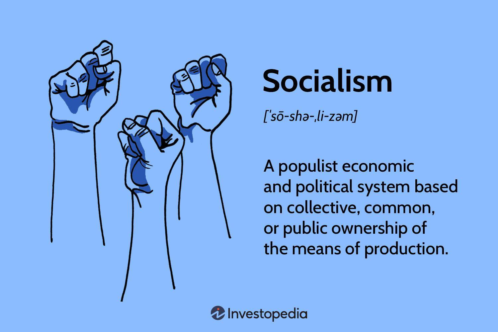

## Table of Contents

## What is a socialist economy?

A socialist economy is a system where the government or the community owns and controls the main parts of the economy, like factories, farms, and services. Instead of private businesses making decisions, the government plans how resources are used and how goods and services are made and shared. The main goal is to make sure everyone's basic needs are met, and to reduce big differences in wealth between people.

In a socialist economy, the idea is that everyone works together for the common good. This means that profits from businesses are used to help the whole community, not just the owners. People often get paid based on what they need or what they contribute, rather than how much money their job can make. While this system aims to create more equality and fairness, it can also face challenges like less motivation for people to work hard or innovate, and difficulties in making quick decisions due to the large role of the government.

## How does a socialist economy differ from a capitalist economy?

In a socialist economy, the government or the community owns and controls the main parts of the economy, like factories and services. The goal is to make sure everyone has what they need and to reduce big differences in wealth. Profits from businesses are used to help everyone, not just the owners. People usually get paid based on what they need or what they contribute to society, not on how much money their job can make. This system tries to create more fairness and equality, but it can be hard to get people to work hard or come up with new ideas because everyone gets similar rewards.

In a capitalist economy, private individuals or businesses own and control most of the economy. The main goal is to make profit, and businesses compete with each other to do this. People are paid based on the value of their work, so some jobs pay a lot more than others. This can lead to big differences in wealth between people. Capitalism encourages people to work hard and innovate because they can earn more money and become successful. However, it can also lead to some people having much more than they need while others struggle to get by.

The main difference between a socialist and a capitalist economy is who owns and controls the economy and how wealth is shared. In socialism, the focus is on meeting everyone's needs and sharing wealth more equally. In capitalism, the focus is on making profit and letting people keep what they earn, which can lead to bigger differences in wealth.

## What are the key principles of socialism?

Socialism is based on the idea that everyone should share the wealth and resources of society equally. In a socialist system, the government or the community owns the big parts of the economy, like factories, farms, and services. The main goal is to make sure everyone has what they need, like food, housing, and healthcare. Instead of letting rich people own everything, socialism tries to stop big differences in wealth by sharing profits with everyone. This way, everyone can have a good life, not just a few people.

Another important principle of socialism is cooperation. Instead of people competing against each other, socialism encourages everyone to work together for the good of the whole community. This means that people are often paid based on what they need or how much they contribute to society, not just how much money their job can make. While this system tries to be fair and equal, it can be hard to keep people motivated to work hard or come up with new ideas because everyone gets similar rewards. But the main focus is always on helping everyone in the community, not just a few people at the top.

## Can you explain the concept of public ownership in a socialist economy?

In a socialist economy, public ownership means that the government or the whole community owns the big parts of the economy, like factories, farms, and services. Instead of a few rich people owning these things, everyone shares them. This is different from a capitalist economy where private individuals or businesses own these things and make decisions to make a profit. In socialism, the idea is that by having public ownership, the wealth and resources can be used to help everyone, not just the owners.

The goal of public ownership in a socialist economy is to make sure everyone's basic needs are met. This means that the profits from factories and businesses are used to provide things like healthcare, education, and housing for everyone. By sharing the wealth, socialism tries to reduce big differences between rich and poor people. While this system aims to be fair and equal, it can also face challenges like less motivation for people to work hard or come up with new ideas, since everyone gets similar rewards no matter what they do.

## What role does the government play in a socialist economy?

In a socialist economy, the government plays a big role. It owns and controls the main parts of the economy, like factories, farms, and services. Instead of private businesses making decisions, the government plans how resources are used and how goods and services are made and shared. The main goal is to make sure everyone's basic needs are met, like having enough food, a place to live, and good healthcare. The government uses the profits from businesses to help the whole community, not just the owners.

The government in a socialist economy also tries to make sure there are not big differences in wealth between people. It does this by making sure everyone gets what they need, and by paying people based on what they contribute to society or what they need, not just how much money their job can make. While the government's big role can help create more fairness and equality, it can also make it hard for the economy to grow quickly or for new ideas to come up, because everyone gets similar rewards no matter what they do.

## How are resources allocated in a socialist system?

In a socialist system, the government decides how resources are used. Instead of private businesses making choices, the government plans everything. It looks at what people need, like food, homes, and healthcare, and then decides how to use resources to meet those needs. The goal is to make sure everyone has enough of what they need, not just a few people getting rich.

The government uses the profits from businesses to help everyone in the community. This means that money made from factories and farms goes back into things like schools, hospitals, and housing. By doing this, the government tries to make sure there are not big differences between rich and poor people. Everyone shares the wealth, so everyone can have a good life.

## What are some historical examples of countries that have implemented socialist economies?

One historical example of a country with a socialist economy is the Soviet Union. From 1922 to 1991, the Soviet government owned and controlled factories, farms, and services. They planned everything to make sure people had what they needed, like food and homes. The goal was to share wealth and make everyone equal, but it was hard to keep people motivated and to grow the economy quickly.

Another example is Cuba, which has had a socialist economy since the 1960s. The Cuban government owns most businesses and decides how to use resources to meet people's needs. They focus on providing healthcare, education, and housing for everyone. While this has helped make things more equal, Cuba has faced challenges like shortages of goods and slow economic growth.

A third example is China, which started moving towards socialism in 1949 after the Chinese Communist Party took power. The government took control of businesses and farms, aiming to share wealth and meet everyone's needs. Over time, China has mixed some capitalist ideas with its socialist system, which has helped it grow economically but also created some inequality.

## What are the advantages of a socialist economy?

One big advantage of a socialist economy is that it tries to make sure everyone has what they need. The government owns and controls the big parts of the economy, like factories and farms, and uses the profits to help everyone. This means that everyone can have enough food, a place to live, and good healthcare. It also tries to stop big differences between rich and poor people by sharing wealth more equally. This can make society more fair and equal, so everyone can have a good life.

Another advantage is that a socialist economy encourages people to work together for the good of everyone, not just to make a profit. Instead of competing, people cooperate to make sure everyone's needs are met. This can create a strong sense of community and help people feel like they are part of something bigger. When everyone works together, it can also help make sure important services like education and healthcare are available to everyone, not just those who can pay for them.

## What challenges and criticisms does a socialist economy face?

One big challenge for a socialist economy is that it can be hard to keep people motivated to work hard or come up with new ideas. Since the government owns everything and tries to make sure everyone is equal, people might not feel like they will get rewarded for doing a good job. This can make the economy grow slower and make it harder to improve things. Another problem is that the government has to plan everything, which can be slow and not very flexible. If the government makes bad decisions, it can be hard to fix them quickly, which can lead to shortages of things people need.

Critics of socialist economies also say that they can lead to less freedom for people. Since the government controls so much, people might not have as many choices about what they want to do or buy. This can make life feel more controlled and less personal. Some people also worry that the government might become too powerful and not listen to what people want. While socialism tries to make things more equal and fair, these challenges and criticisms show that it can be hard to make everyone happy and keep the economy strong.

## How do socialist economies address issues of income inequality and social welfare?

Socialist economies try to fix income inequality by making sure the government owns big parts of the economy, like factories and farms. Instead of a few rich people owning everything, the profits from these businesses are used to help everyone. This means that everyone can have enough money to live on, and the big differences between rich and poor people can be smaller. By sharing wealth more equally, socialist economies aim to make life fairer for everyone.

Socialist economies also focus a lot on social welfare. The government uses the money it gets from businesses to provide things like healthcare, education, and housing for everyone. This means that people don't have to worry about not being able to afford these important things. The idea is that by taking care of everyone's basic needs, people can live better lives and feel more secure. While this system tries to help everyone, it can be hard to keep the economy growing and to make sure everyone stays motivated to work hard.

## What is the impact of a socialist economy on innovation and economic growth?

In a socialist economy, it can be hard to get people to come up with new ideas or work hard. Since the government owns everything and tries to make sure everyone is equal, people might not feel like they will get rewarded for doing a good job. This can slow down innovation because people might not see the point in trying new things if everyone gets the same reward no matter what they do. When there are fewer new ideas, the economy might not grow as fast as it could in other systems where people can earn more money for being innovative.

Economic growth in a socialist economy can also be slower because the government has to plan everything. Planning how to use resources and what to make can take a long time and be less flexible than letting private businesses make decisions. If the government makes bad choices, it can be hard to fix them quickly, which can lead to problems like shortages of things people need. While a socialist economy tries to make sure everyone has what they need and to share wealth more equally, these challenges can make it harder for the economy to grow and improve quickly.

## How have modern socialist economies evolved, and what are some current examples?

Modern socialist economies have changed a lot over time. They have mixed some ideas from capitalism with their socialist systems to try and make things work better. For example, they might let private businesses exist alongside government-owned ones, or they might let people earn more money if they work harder or come up with new ideas. This mixing of ideas is called a mixed economy. It tries to keep the good things about socialism, like making sure everyone has what they need, while also trying to grow the economy faster and encourage people to innovate.

One current example of a modern socialist economy is China. Since the 1970s, China has been mixing socialist ideas with some capitalist ones. The government still owns a lot of big businesses, but it also lets private companies exist and grow. This has helped China's economy grow very fast, but it has also made some people richer than others. Another example is Vietnam, which has also been mixing socialist and capitalist ideas since the 1980s. Like China, Vietnam's government owns many businesses, but it also lets private companies operate. This has helped Vietnam's economy grow and improve people's lives, but it still faces challenges in making sure everyone benefits equally.

## References & Further Reading

[1]: Piketty, T. (2014). ["Capital in the Twenty-First Century"](https://www.jstor.org/stable/j.ctt6wpqbc). Harvard University Press.

[2]: ["Algorithmic Trading and DMA: An Introduction to Direct Access Trading Strategies"](https://archive.org/details/algorithmictradi0000john) by Barry Johnson.

[3]: ["The Socialist System: The Political Economy of Communism"](https://www.jstor.org/stable/j.ctv1ddczdr) by János Kornai.

[4]: Kelley, R. (2020). ["Machine Learning Methods for Algorithmic Trading in the Time Insurance Market"](https://github.com/stefan-jansen/machine-learning-for-trading). Economic Theory Bulletin.

[5]: ["The Rise of China and the Demise of the Capitalist World Economy"](http://digamo.free.fr/minqili08.pdf) by Minqi Li, Monthly Review Press.

[6]: ["China's Transition to a Socialist Market Economy"](https://en.wikipedia.org/wiki/Socialist_market_economy) by Kwan, C. H., & Kwok, G. (Eds.). 

[7]: ["The Road Ahead for the Fed’s Balance Sheet."](https://www.federalreserve.gov/monetarypolicy/bst_recenttrends.htm) The Brookings Institution.

[8]: ["The Philosophical Origins of Central Banking Control"](https://link.springer.com/referenceworkentry/10.1007/978-981-13-0596-2_31) in Research in Political Economy.

[9]: ["Artificial Intelligence in Financial Markets: Cutting Edge Applications for Risk Management, Portfolio Optimization and Economics"](https://link.springer.com/book/10.1057/978-1-137-48880-0) by Christian L. Dunis et al. 

[10]: ["Foundations of Futurology and Technological Forecasting"](https://link.springer.com/chapter/10.1007/978-1-4471-7531-5_5) in Knowledge Representation for Health-Care: Data, Processes, and Guidelines.