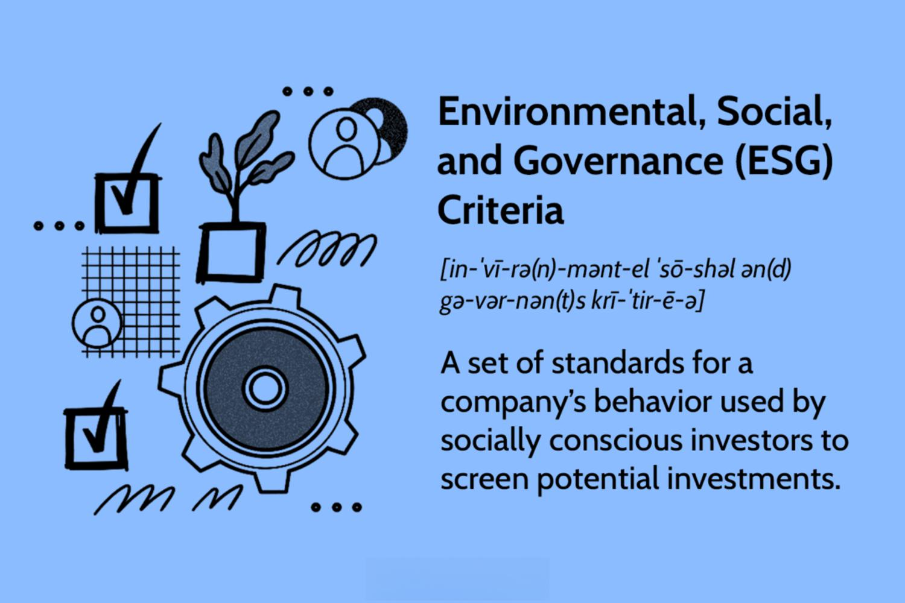

## Table of Contents

## What is socially responsible investing (SRI)?

Socially responsible investing, often called SRI, is a way of choosing investments that consider not just financial returns but also the impact on society and the environment. People who practice SRI look for companies that do good things, like protecting the environment, treating workers fairly, and supporting their communities. They might avoid companies that make products like tobacco or weapons, or those that harm the environment.

SRI has become more popular as more people want their money to help make the world a better place. There are now many funds and investment options that focus on social and environmental issues. These funds often use special criteria to pick companies, such as how they handle climate change or human rights. By investing this way, people hope to support positive changes while still earning money on their investments.

## How does SRI contribute to environmental sustainability?

Socially responsible investing (SRI) helps the environment by encouraging companies to be more sustainable. When investors choose companies that care about the environment, it sends a message that people want businesses to reduce pollution, use less energy, and protect natural resources. This can lead companies to change their ways to attract more investment. For example, a company might start using renewable energy or reduce waste to meet the standards set by SRI funds.

SRI also supports companies that are working on solutions to environmental problems. This can include investing in businesses that develop clean technologies, like solar panels or electric cars. By putting money into these companies, SRI helps them grow and bring their products to more people. This can speed up the shift to a more sustainable world, where we rely less on things that harm the environment.

## What are the basic principles of SRI?

Socially responsible investing, or SRI, is based on the idea that you can make money and do good at the same time. The main principle of SRI is to choose investments that match your values. This means looking for companies that do good things for the world, like protecting the environment, treating workers well, and helping communities. People who practice SRI often avoid companies that make harmful products, like tobacco or weapons, or those that pollute the environment.

Another key principle of SRI is to use your money to make a positive impact. When you invest in companies that care about social and environmental issues, you are supporting them to do more good. This can encourage other companies to follow suit and improve their practices to attract more investors. SRI also involves being an active investor, which means you might vote on company policies or talk to company leaders about making changes that benefit society and the environment.

## Can you list some common environmental criteria used in SRI?

When people do socially responsible investing, they often look at how companies treat the environment. Some common things they check are if the company uses clean energy like wind or solar power instead of dirty energy like coal. They also see if the company is trying to use less energy overall and if they recycle or reuse things instead of just throwing them away. Another big thing is if the company is trying to lower its greenhouse gas emissions to help with climate change.

Also, SRI investors look at how companies manage water. They want to know if the company is using water in a smart way and not wasting it, especially in places where water is scarce. Another important thing is if the company is doing anything to protect nature, like not building in areas that are homes to animals and plants. By checking these things, SRI helps make sure companies are doing their part to keep the environment healthy.

## How can someone start investing in a socially responsible way?

To start investing in a socially responsible way, you first need to think about what issues are important to you. Do you care more about the environment, like fighting climate change, or are you more focused on social issues, like fair treatment of workers? Once you know your values, you can look for companies or funds that match them. There are many investment funds now that focus on social and environmental goals. These funds have names like "sustainable," "green," or "ethical," and they choose companies based on how well they meet certain standards.

After you've picked the right fund or company, you can start investing. You might need to open an investment account if you don't have one already. Many banks and investment companies offer accounts that let you buy stocks, bonds, or funds that focus on social responsibility. It's a good idea to do some research or talk to a financial advisor to make sure you're making smart choices. Remember, socially responsible investing is about using your money to support companies that are trying to make the world a better place, so it's important to keep learning and stay involved.

## What are the different types of SRI funds focused on environmental sustainability?

There are different types of SRI funds that focus on environmental sustainability. One type is called a green fund. These funds invest in companies that are good for the environment. They might pick companies that use clean energy like wind or solar power, or companies that work on reducing pollution and waste. Green funds want to help the planet by supporting businesses that care about the environment.

Another type is a climate change fund. These funds focus on companies that are trying to fight climate change. They might invest in businesses that make electric cars or develop new ways to use less energy. Climate change funds want to help slow down global warming by supporting companies that are working on solutions to this big problem.

There are also sustainable development funds. These funds look for companies that help with things like clean water, protecting nature, and using resources in a smart way. Sustainable development funds want to support companies that are working on making the world a better place for everyone, not just for the environment but also for people and communities.

## How do SRI funds perform compared to traditional investment funds?

SRI funds can do just as well as traditional investment funds. A lot of research has shown that investing in companies that care about the environment and society can still give you good returns on your money. Some studies even say that SRI funds might do a little better than regular funds over time. This is because companies that are good to the planet and people might be better run and more likely to do well in the long run.

But, SRI funds can be a bit different from traditional funds. Sometimes, they might not do as well in the short term because they avoid certain industries, like oil and tobacco, that can make a lot of money. Also, SRI funds might have higher fees because they need to do more research to make sure the companies they invest in meet their standards. So, while SRI funds can be a good choice for people who want to invest in a way that matches their values, it's important to look at all the details and maybe talk to a financial advisor to make the best choice for you.

## What are the challenges and risks associated with SRI?

One challenge with SRI is that it can be hard to find the right information about companies. You need to know a lot about how companies treat the environment and people. This can take a lot of time and research. Also, different SRI funds might have different ideas about what makes a company "good." So, you might need to look at many funds to find one that matches your values.

Another risk is that SRI funds might not do as well as regular funds in the short term. This is because they avoid certain industries that can make a lot of money, like oil and tobacco. SRI funds might also have higher fees because they need to do more research to make sure the companies they invest in meet their standards. So, while SRI can be a good way to invest in line with your values, it's important to think about these risks and maybe talk to a financial advisor.

Lastly, there's the risk that companies might say they care about the environment and people, but not really do much. This is called "greenwashing." It can be hard to tell if a company is really doing good things or just saying they are. This makes it even more important to do your homework and choose SRI funds that are honest and clear about what they do.

## How can investors measure the impact of their SRI investments on environmental sustainability?

Investors can measure the impact of their SRI investments on environmental sustainability by looking at specific metrics and reports. Many SRI funds provide regular reports that show how well the companies they invest in are doing when it comes to things like reducing carbon emissions, using renewable energy, and managing waste. These reports might also include data on how the companies are helping to protect nature and use resources in a smart way. By looking at these reports, investors can see if their money is really helping the environment.

Another way to measure impact is by using third-party ratings and certifications. There are groups that rate companies based on how good they are for the environment. These ratings can help investors see if the companies they invest in are meeting high standards for sustainability. Some SRI funds also work with these groups to make sure they are investing in the best companies. By keeping an eye on these ratings and certifications, investors can feel more confident that their SRI investments are making a positive difference for the environment.

## What role do regulations and policies play in SRI for environmental sustainability?

Regulations and policies are really important for SRI when it comes to environmental sustainability. Governments can make rules that make companies do things that are good for the environment, like using less energy or reducing pollution. When companies have to follow these rules, it makes them more attractive to SRI investors who want to put their money in businesses that care about the planet. Also, some governments give special benefits, like tax breaks, to companies that do well on environmental issues. This can make SRI funds more interested in these companies because they might do better financially.

Policies can also help by making it easier for people to find out how companies are doing on environmental issues. For example, some countries require companies to report on things like their carbon emissions or how they are protecting nature. This information is really helpful for SRI investors because it lets them see if a company is really doing what it says it will do for the environment. By having these rules and policies in place, governments can help SRI investors make choices that support environmental sustainability and encourage more companies to be good to the planet.

## How can advanced investors use SRI strategies to optimize their portfolio for environmental impact?

Advanced investors can use SRI strategies to make their portfolios better for the environment by focusing on specific areas that matter to them. They might choose to invest more in companies that are leaders in renewable energy, like solar or wind power, or in businesses that are working hard to reduce their carbon footprint. By doing this, they can support the growth of clean technologies and help fight climate change. They can also look for companies that are doing well in other areas of environmental sustainability, like managing water resources wisely or protecting biodiversity. By [picking](/wiki/asset-class-picking) these kinds of companies, advanced investors can make sure their money is helping to create a greener world.

Another way advanced investors can optimize their portfolio for environmental impact is by using tools like [ESG](/wiki/esg-investing) (Environmental, Social, and Governance) ratings and impact reports. These tools give detailed information about how companies are performing on environmental issues, which helps investors make smart choices. Advanced investors might also engage directly with the companies they invest in, by voting on environmental policies or talking to company leaders about making changes. By being active and using these tools, advanced investors can have a bigger impact on the environment while still trying to earn good returns on their investments.

## What are the future trends and innovations in SRI for environmental sustainability?

In the future, SRI for environmental sustainability will keep growing as more people want to invest in ways that help the planet. One big trend will be more focus on climate change solutions. This means more money going into companies that work on clean energy, like solar and wind power, and on other ways to reduce greenhouse gases. Also, new technology will help SRI investors pick the best companies for the environment. Things like better data and [artificial intelligence](/wiki/ai-artificial-intelligence) can make it easier to see which companies are really doing good things for the planet.

Another trend will be more rules from governments to help SRI. These rules might make companies report more about their environmental impact, so investors can make better choices. There will also be new ways for investors to work together to make a bigger impact. For example, more people might join together in groups to invest in big projects that help the environment, like planting trees or cleaning up oceans. By working together, investors can make a bigger difference and help push companies to be more sustainable.

## References & Further Reading

[1]: Morgan Stanley Institute for Sustainable Investing, ["Sustainable Reality: Analyzing Risk and Returns of Sustainable Funds."](https://www.morganstanley.com/content/dam/msdotcom/ideas/sustainable-investing-offers-financial-performance-lowered-risk/Sustainable_Reality_Analyzing_Risk_and_Returns_of_Sustainable_Funds.pdf)

[2]: Friede, G., Busch, T., & Bassen, A. (2015). ["ESG and financial performance: aggregated evidence from more than 2000 empirical studies."](https://www.tandfonline.com/doi/full/10.1080/20430795.2015.1118917) Journal of Sustainable Finance & Investment.

[3]: United Nations Environment Programme (UNEP), ["Emissions Gap Report 2020."](https://www.unep.org/emissions-gap-report-2020)

[4]: Global Sustainable Investment Alliance (GSIA), ["2018 Global Sustainable Investment Review."](https://www.gsi-alliance.org/trends-report-2018/)

[5]: Schwab, K. (2019). ["The Fourth Industrial Revolution: A Davos Reader."](https://books.google.com/books/about/The_Fourth_Industrial_Revolution.html?id=ST_FDAAAQBAJ) 

[6]: Statman, M. (2000). ["Socially Responsible Mutual Funds."](https://www.researchgate.net/publication/240311517_Socially_Responsible_Mutual_Funds) Financial Analysts Journal, Vol. 56, No. 3.

[7]: Renneboog, L., Ter Horst, J., & Zhang, C. (2008). ["The price of ethics and stakeholder governance: The performance of socially responsible mutual funds."](https://www.sciencedirect.com/science/article/pii/S0929119908000278) Journal of Corporate Finance.