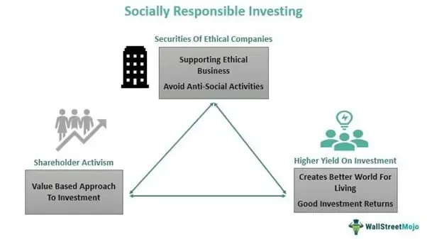

In today's rapidly evolving financial landscape, sustainable finance, ethical investing, and impact investing have gained notable significance in setting new benchmarks for investment strategy. Investors are increasingly prioritizing Environmental, Social, and Governance (ESG) criteria as critical components of their investment decisions in a bid to address global issues such as climate change, social inequality, and corporate governance. These efforts aim not only to generate long-term economic growth but also to foster a more equitable and sustainable future. 

Simultaneously, the financial sector has experienced a technological revolution with the advent of algorithmic trading. This approach leverages advanced computer algorithms to execute trades at a speed and volume that significantly surpass human capabilities, optimizing both efficiency and cost-effectiveness. Algorithmic trading has also enhanced market liquidity, contributing to a more dynamic trading environment. 



This article examines how these emerging trends—sustainable finance and algorithmic trading—are reshaping the investment world, offering both opportunities and challenges. Investors face the task of aligning their financial goals with ethical values, requiring them to consider how these two approaches can interact productively. We will explore the core principles behind each of these investment strategies, discussing their potential synergies and the implications for future financial practices. By understanding these dynamics, investors can better navigate the complexities of modern finance and work toward a future that balances economic performance with societal well-being.

## Table of Contents

## Understanding Sustainable Finance

Sustainable finance integrates Environmental, Social, and Governance (ESG) criteria into investment decisions, reflecting a comprehensive approach to evaluating potential investments. It embodies the recognition that financial decisions extend beyond mere economic gain, asserting the necessity of addressing pressing global challenges such as climate change and social inequities.

Investors who engage in sustainable finance endeavor to balance long-term financial return with these wider societal implications, fostering responsible investment that contributes positively to the world. The incorporation of ESG factors supports this by providing a framework through which investors can evaluate companies based on their impact on the environment, their treatment of employees and communities, and the robustness of their governance structures.

The environmental component considers how a company performs as a steward of nature. This includes assessing its energy use, waste, pollution, natural resource conservation, and treatment of animals. Similarly, the social aspect examines how the company manages relationships with employees, suppliers, customers, and the societies where it operates. Governance regards internal company metrics, including executive pay, audits, internal controls, and shareholder rights.

Various sustainable investment strategies have emerged as investors seek to incorporate [ESG](/wiki/esg-investing) criteria into their portfolios. One common approach is negative screening, where investments in companies or industries that fail to meet specific ESG criteria are excluded. Conversely, positive screening involves actively seeking out companies with strong ESG performances. Another popular strategy is impact investing, where the focus is on generating specific beneficial social or environmental effects alongside financial returns.

A fundamental model used in sustainable finance is the integration of ESG factors into traditional financial analysis, modifying the valuation of assets or the assessment of risks. For instance, cash flow projections might be adjusted for companies with high environmental compliance costs. This adaptation reflects the emerging consensus that ESG factors are material to financial performance and thus critical to comprehensive investment analysis.

Numerous tools and frameworks exist to support ESG integration, offering standardized metrics and methodologies for evaluating and reporting on these criteria. Entities such as the Global Reporting Initiative (GRI) and the Sustainability Accounting Standards Board (SASB) provide guidelines that facilitate the comparison of ESG practices across organizations.

In summary, sustainable finance, through the incorporation of ESG factors, fundamentally alters the landscape of investment by embedding ethical considerations into the core of financial decision-making processes. By doing so, it seeks to redirect capital flows toward solutions that contribute to global sustainability and equity.

## The Rise of Impact Investing

Impact investing represents a paradigm shift in the investment landscape by targeting both financial returns and measurable social or environmental impacts. This dual objective approach has gained traction as investors seek to address pressing global issues such as poverty, climate change, and inequality through their investment choices.

### History and Principles

The origins of impact investing can be traced back to the 1960s and 1970s when social movements encouraged individuals and organizations to consider the societal and environmental consequences of their investments. As these social concerns gained prominence, investors began to demand more from their portfolios than just financial returns. The term "impact investing" itself was coined at a 2007 meeting hosted by the Rockefeller Foundation, marking a formal recognition of this investment approach.

Impact investing operates on key principles that distinguish it from other investment strategies. Primarily, it emphasizes intentionality—meaning that investments are explicitly made to achieve positive social or environmental outcomes. Secondly, it requires that these impacts be measurable, necessitating tools and frameworks to quantify the beneficial outcomes achieved. Metrics such as the Impact Reporting and Investment Standards (IRIS) and Global Impact Investing Rating System (GIIRS) are often used to assess and report these impacts.

### Types of Impact Investments

Impact investments span a range of asset classes and sectors, reflecting the diversity of impact goals pursued by investors. Common investment vehicles include:

1. **Socially Responsible Bonds**: These bonds finance projects with positive social impacts, such as affordable housing or green infrastructure.

2. **Social Venture Capital**: This involves equity investments in startups and small enterprises that provide innovative solutions to societal challenges.

3. **Microfinance**: By providing financial services to underserved populations, microfinance enables economic empowerment and poverty alleviation.

4. **Sustainable Real Estate**: Investment in real estate projects designed to enhance sustainability and community development.

### Impact Investing vs. Socially Responsible Investing (SRI)

While impact investing shares some characteristics with Socially Responsible Investing (SRI), the two are not synonymous. SRI primarily focuses on incorporating ethical and moral concerns into investment decisions by avoiding companies or industries that do not align with an investor’s values. This often involves the exclusion of sectors like tobacco or fossil fuels from portfolios.

Impact investing, conversely, is more proactive and seeks to actively contribute to solutions for social and environmental challenges. Whereas SRI might avoid investing in organizations that pollute, impact investing might fund a company that develops renewable energy solutions.

### Conclusion

In summary, impact investing represents a powerful approach to aligning financial and social goals. Its focus on measurable outcomes and intentional social impact allows investors not just to minimize harm, but to foster positive change through their capital allocations. As the field continues to evolve, the integration of clear metrics and consistent reporting standards will be crucial in maximizing its efficacy and broadening its appeal.

## Algorithmic Trading in Modern Finance

Algorithmic trading utilizes sophisticated computer algorithms to execute trades with a level of speed and precision that far exceeds human capabilities. These algorithms can analyze vast datasets and execute orders across multiple markets almost instantaneously, making them instrumental in today's fast-paced financial environments. A primary advantage of [algorithmic trading](/wiki/algorithmic-trading) is cost reduction, as it minimizes the human intervention required in trading processes. This efficiency reduces transaction costs and slippage—a situation where the executed price of a trade differs from the anticipated price due to market movement—ultimately benefiting investors.

Moreover, algorithmic trading contributes significantly to increased market [liquidity](/wiki/liquidity-risk-premium). By executing numerous trades at high frequencies, algorithms enhance the availability of securities in the market, enabling smoother transactions and narrower bid-ask spreads. This, in turn, facilitates better price discovery and more efficient markets.

However, the rapid execution and [high frequency](/wiki/high-frequency-trading) of trades introduce potential risks, most notably market [volatility](/wiki/volatility-trading-strategies). While algorithms are designed to capitalize on price inefficiencies, their sheer [volume](/wiki/volume-trading-strategy) and speed can lead to erratic market behaviors, especially during times of financial turmoil. These swift market movements can occasionally trigger unintended consequences, such as 'flash crashes,' where markets experience sudden and severe price declines followed by rapid recoveries.

The advent of [artificial intelligence](/wiki/ai-artificial-intelligence) (AI) and [machine learning](/wiki/machine-learning) further propels algorithmic trading forward. These technologies provide algorithms with the ability to learn from historical data, identify patterns, and adapt trading strategies dynamically without explicit programming. Machine learning models can recognize intricate patterns within datasets, enabling more nuanced trading decisions. For example, AI can optimize trading strategies by forecasting asset price movements using predictive models.

Despite the benefits, the integration of AI and machine learning in trading algorithms necessitates stringent regulation and oversight. The complex nature of AI-driven algorithms makes it challenging to predict their behavior under all market conditions, which raises concerns about accountability and transparency. Regulatory bodies worldwide emphasize the importance of robust risk management frameworks and transparency in algorithmic strategies to mitigate potential market disruptions.

In summary, algorithmic trading offers substantial benefits in terms of cost efficiency and market liquidity but requires careful management of associated risks, particularly those related to volatility and system stability. The integration of AI and machine learning enhances these capabilities but necessitates diligent regulatory oversight to ensure these tools are used responsibly in the quest for more efficient markets.

## Integrating Sustainable Strategies with Algorithmic Trading

Integrating sustainable finance with algorithmic trading represents a significant advancement in aligning investment strategies with ethical and environmental objectives. The combination leverages technological capabilities to quickly and efficiently identify sustainable investment opportunities by incorporating Environmental, Social, and Governance (ESG) criteria into trading algorithms.

**ESG-Centric Trading Algorithms:**

Algorithmic trading utilizes predefined rules and conditions to conduct trades. When these rules are informed by ESG criteria, algorithms can prioritize stocks or assets with high ESG ratings. This is achieved by embedding ESG metrics directly into the decision-making models used by trading systems. For instance, an ESG-focused algorithm might screen global stock markets for companies with superior climate policies, robust governance structures, and strong social responsibility records. By doing so, it allocates capital towards entities contributing positively to societal and environmental goals, illustrating the principles of sustainable investment.

**Python Framework for ESG Integration:**

Below is a basic Python framework demonstrating how ESG criteria can be integrated into an algorithmic trading strategy. This example assumes access to an ESG dataset and a stock price data source.

```python
import pandas as pd
import yfinance as yf  # For more datasets, visit: https://paperswithbacktest.com/datasets

# Load ESG data
esg_data = pd.read_csv('esg_scores.csv')  # Sample ESG scores dataset

# Define a minimum ESG score threshold
min_esg_score = 70

# Filter stocks with high ESG scores
high_esg_stocks = esg_data[esg_data['ESG_Score'] >= min_esg_score]['Ticker'].tolist()

# Download historical prices for these stocks
prices = yf.download(high_esg_stocks, start='2022-01-01', end='2023-01-01')

# Define a simple moving average (SMA) strategy
def sma_strategy(prices, short_window=40, long_window=100):
    signals = pd.DataFrame(index=prices.index)
    signals['price'] = prices['Close']
    signals['short_mavg'] = prices['Close'].rolling(window=short_window, min_periods=1, center=False).mean()
    signals['long_mavg'] = prices['Close'].rolling(window=long_window, min_periods=1, center=False).mean()

    # Generate trade signals: buy when short moving average crosses above long moving average
    signals['signal'] = 0.0
    signals['signal'][short_window:] = np.where(signals['short_mavg'][short_window:] 
                                                > signals['long_mavg'][short_window:], 1.0, 0.0)

    # Generate trading orders
    signals['positions'] = signals['signal'].diff()

    return signals

# Execute the trading strategy for each high-ESG stock
for stock in high_esg_stocks:
    stock_prices = prices[stock]
    signals = sma_strategy(stock_prices)
    print(f"Trade signals for {stock}:")
    print(signals[signals['positions'].notnull()])

```

This framework filters a list of stocks based on ESG scores and applies a simple moving average trading strategy to identify trade opportunities. The use of a simple strategy is illustrative, yet more sophisticated machine learning techniques can also be employed to enhance decision accuracy in real-world applications.

**Conclusion:**

By integrating sustainable finance principles and algorithmic capabilities, investors can not only pursue traditional financial returns but also contribute to positive societal outcomes. The dynamically evolving field of sustainable algorithmic trading thus holds crucial potential for aligning the demands of modern finance with the responsibilities towards environmental preservation and impact-driven growth.

## Challenges and Considerations

The integration of sustainable finance with algorithmic trading holds significant promise but also presents several challenges. One of the primary obstacles is the regulatory framework governing these domains. Algorithmic trading, by its very nature, can create market volatility and systemic risks. Regulators are increasingly scrutinizing these activities to ensure market stability and protect investors. Policies such as the European Union's Markets in Financial Instruments Directive II (MiFID II) aim to enhance transparency and reduce the risk of market manipulation by imposing stringent requirements on algorithmic trading strategies.

In tandem, the sphere of sustainable finance grapples with the need for high-quality, standardized Environmental, Social, and Governance (ESG) data. The lack of standardized ESG metrics and reporting frameworks across regions often leads to inconsistent evaluations of companies' sustainability practices. This inconsistency can impede the accurate assessment of ESG factors in algorithmic strategies, thereby affecting investment decisions. The financial industry is responding with initiatives like the Sustainability Accounting Standards Board (SASB) and the Global Reporting Initiative (GRI), which strive to create a coherent framework for ESG reporting.

Algorithmic trading also faces the inherent risk of errors that can precipitate significant market disruptions. Flash crashes, where rapid trading anomalies lead to sharp market declines, are a notable risk associated with algorithmic systems. These incidents underscore the necessity for strict oversight and robust error-checking mechanisms within trading algorithms. Implementing real-time monitoring systems and employing fail-safes within algorithms are two approaches the industry is adopting to mitigate such risks.

Innovations in technology present both a challenge and a solution in integrating sustainable finance with algorithmic trading. On one hand, the rapid pace of technological advancements requires continuous adaptation from industry stakeholders. On the other hand, emerging technologies such as artificial intelligence and machine learning offer powerful tools for enhancing ESG-centric investment strategies. These technologies can improve the precision and responsiveness of trading algorithms, helping to identify and capitalize on sustainable investment opportunities more effectively.

Furthermore, collaborative frameworks between financial institutions, technology developers, and regulatory bodies are essential in navigating these challenges. Collaborative efforts can ensure that technological innovations align with regulatory expectations and that ESG data standards meet the needs of investors. Industry consortia and partnerships, such as those facilitated by the United Nations Principles for Responsible Investment (UNPRI), play a critical role in fostering such cooperation.

As the landscape of sustainable finance and algorithmic trading continues to evolve, addressing these challenges is crucial for harnessing the full potential of integrating these powerful domains. Such efforts will drive the shift towards more sustainable and efficient financial markets, encouraging the alignment of investment strategies with ethical and societal objectives.

## The Future of Sustainable Finance and Trading

As technological advancements persist, the confluence of sustainable finance and algorithmic trading is poised to redefine the financial landscape. This evolving relationship is driven by increasing investor demand and regulatory measures that emphasize transparency and accountability. These elements are crucial as they encourage market practices that prioritize long-term sustainability and ethical responsibility.

Investor interest in sustainable finance is reflected in their growing inclination towards Environmental, Social, and Governance (ESG) criteria. Understanding this trend, financial markets are adapting by integrating ESG factors into algorithmic trading models. Algorithms can be programmed to identify and prioritize investments based on high ESG scores, thereby optimizing portfolios for both financial returns and social impact. This automated approach accelerates the identification of sustainable investment opportunities and aligns capital allocation with sustainability goals.

Regulatory changes also play a pivotal role in shaping the future. Governments and international bodies are increasingly mandating disclosures of ESG practices, thereby enhancing the data available for algorithmic processing. These standards drive the development of robust, transparent ESG data sets, enabling more precise and informed trading decisions. The increased availability of data supports algorithmic models to not only assess current ESG compliance but also predict future performance based on projected sustainability trends.

Furthermore, technological advancements, particularly in artificial intelligence and machine learning, promise enhancements in trading efficiency and sustainability. These technologies can analyze vast amounts of data with unprecedented speed and accuracy, offering insights into patterns and opportunities that were previously unimaginable. Machine learning models can adapt to new information in real-time, refining their strategies to capitalize on trends that align with sustainable and ethical investment goals.

The convergence of sustainable finance and algorithmic trading holds the potential for better allocation of resources towards investments that yield positive societal outcomes. By prioritizing both economic returns and societal benefits, the financial sector can play an essential role in addressing global challenges such as climate change and social inequality.

As these trends align, the future of investment is one where funds are increasingly directed towards ventures that not only promise financial growth but also contribute to the betterment of society and the environment. This synergy between technology-driven trading and sustainable investment principles represents a transformative shift in how financial markets operate, offering a more holistic approach to assessing value and impact.

## Conclusion

Sustainable finance, ethical investing, and algorithmic trading currently stand at the forefront of modern investment strategies, representing a profound evolution in how financial markets operate. These approaches collectively offer investors a robust framework to align their financial goals with ethical commitments and broader societal needs, such as combating climate change and addressing social inequalities. By incorporating Environmental, Social, and Governance (ESG) criteria into investment decisions, sustainable finance and ethical investing emphasize long-term value creation while making a positive impact on society.

Algorithmic trading, using sophisticated computer algorithms, provides the speed and efficiency needed to implement these sustainability-focused strategies effectively. It enables the rapid identification and execution of opportunities that meet strict ESG criteria, facilitating a seamless integration of ethics into high-frequency trading environments. This synthesis of technology and responsible investing is a significant shift towards a more sustainable and equitable financial future. However, it also presents challenges, such as the need for reliable ESG data, regulatory complexities, and the potential volatility inherent in algorithmic systems.

The convergence of sustainable finance and algorithmic trading promises to enhance the efficiency and transparency of financial markets. It encourages a realignment of capital flows toward investments that deliver measurable positive societal impacts, thereby attracting a growing base of investors who prioritize both profit and purpose. As technological advancements continue to evolve, the synergy between these approaches is likely to deepen, heralding a transformation in the landscape of global finance. This paradigm shift not only offers new opportunities for growth but also demands an ongoing commitment to innovation, rigor, and responsibility from all participants in the financial ecosystem.

## References & Further Reading

[1]: Bergstra, J., Bardenet, R., Bengio, Y., & Kégl, B. (2011). ["Algorithms for Hyper-Parameter Optimization."](https://dl.acm.org/doi/10.5555/2986459.2986743) Advances in Neural Information Processing Systems 24.

[2]: ["Advances in Financial Machine Learning"](https://www.amazon.com/Advances-Financial-Machine-Learning-Marcos/dp/1119482089) by Marcos Lopez de Prado

[3]: Friede, G., Busch, T., & Bassen, A. (2015). ["ESG and financial performance: aggregated evidence from more than 2000 empirical studies."](https://www.tandfonline.com/doi/full/10.1080/20430795.2015.1118917) Journal of Sustainable Finance & Investment.

[4]: ["Machine Learning for Algorithmic Trading"](https://github.com/stefan-jansen/machine-learning-for-trading) by Stefan Jansen

[5]: Pástor, Ľ., Stambaugh, R. F., & Taylor, L. A. (2021). ["Sustainable investing in equilibrium."](https://www.sciencedirect.com/science/article/pii/S0304405X20303512) Journal of Financial Economics.

[6]: ["Quantitative Trading: How to Build Your Own Algorithmic Trading Business"](https://www.amazon.com/Quantitative-Trading-Build-Algorithmic-Business/dp/1119800064) by Ernest P. Chan