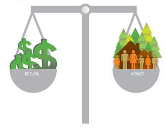

## Table of Contents

## What is socially responsible investing (SRI)?

Socially responsible investing (SRI) is a way of choosing investments based on certain ethical, social, and environmental values. People who practice SRI want their money to support companies that do good things for the world, like protecting the environment, treating workers fairly, and promoting equality. They avoid investing in companies that do harm, such as those involved in tobacco, weapons, or fossil fuels.

SRI is not just about feeling good; it can also be a smart financial choice. Many investors believe that companies with strong ethical practices are more likely to succeed in the long run. By focusing on these companies, SRI investors hope to achieve good returns while also making a positive impact on society and the planet.

## How does SRI differ from traditional investing?

Socially responsible investing (SRI) and traditional investing have different focuses. Traditional investing is all about making money. Investors look at a company's profits, growth, and how much risk there is. They want to pick investments that will give them the best financial return, no matter what the company does or how it treats people and the environment.

SRI, on the other hand, cares about more than just money. People who do SRI think about a company's impact on society and the planet, too. They choose to invest in companies that do good things, like helping the environment or treating workers well. They avoid companies that do harm, even if those companies might make a lot of money. So, SRI tries to balance making money with making the world a better place.

## What are the key principles guiding SRI?

The key principles guiding socially responsible investing (SRI) focus on making the world a better place while also making money. One big principle is to invest in companies that do good things for society and the environment. This means choosing companies that help protect the planet, treat their workers well, and support equality and fairness. SRI investors look for businesses that have strong ethical practices and make a positive impact on the world.

Another important principle is to avoid companies that do harm. This means staying away from businesses involved in things like tobacco, weapons, or fossil fuels, which can hurt people and the environment. SRI investors believe that by not supporting these companies, they can help push for a better future. They want their money to go towards making a difference, not just towards making more money.

Overall, SRI is guided by the idea that investing can be a powerful tool for change. By carefully choosing where to put their money, SRI investors aim to support companies that align with their values and contribute to a healthier, more just world. This approach combines financial goals with social and environmental goals, showing that it's possible to do well by doing good.

## What types of investments are considered socially responsible?

Socially responsible investments include companies that focus on helping the environment, like those that use renewable energy such as solar or wind power. These companies work to reduce pollution and fight climate change. Another type of socially responsible investment is in companies that treat their workers fairly. These businesses pay good wages, offer safe working conditions, and support their employees' rights. They might also support diversity and equality, making sure everyone has a fair chance to succeed.

In addition to companies, socially responsible investments can include funds that focus on specific social or environmental goals. For example, there are funds that invest in affordable housing, helping people who need a place to live. There are also funds that support education and health care, making sure more people can get the services they need. These funds choose investments that match their goals, trying to make a positive impact while also making money for their investors.

Overall, socially responsible investments can be in many different areas. They all have one thing in common: they aim to do good for the world. Whether it's helping the environment, supporting fair treatment of workers, or focusing on important social issues, these investments show that it's possible to make money and make a difference at the same time.

## How can an investor identify socially responsible investment opportunities?

An investor can start identifying socially responsible investment opportunities by looking at companies or funds that focus on doing good for the world. This means checking if a company uses renewable energy, treats its workers well, or supports important social issues like equality and education. There are also special funds called [ESG](/wiki/esg-investing) (Environmental, Social, and Governance) funds that focus on these areas. These funds choose investments based on how well a company helps the environment, treats people, and runs its business in a fair way.

Another way to find socially responsible investments is to use tools and resources that rate companies on their social and environmental impact. Websites and apps can give scores to companies based on things like how much they pollute, how they treat their workers, and whether they support diversity. Investors can use these scores to pick companies that match their values. Talking to a financial advisor who knows about SRI can also help. They can guide investors to the right opportunities and explain how to balance making money with making a positive impact on the world.

## What are the financial performance implications of SRI compared to traditional investments?

When it comes to financial performance, socially responsible investing (SRI) can be just as good as traditional investing. Many studies have shown that SRI investments can give similar returns to traditional investments over time. This means that by choosing companies that do good things for the world, investors don't have to give up making money. In fact, some people think that companies with strong ethical practices might do better in the long run because they are less likely to get into trouble or face big problems.

However, SRI might not always beat traditional investments in every situation. Sometimes, traditional investments might do better in the short term because they focus only on making money and don't care about the social or environmental impact. But over the long term, the difference in performance between SRI and traditional investments is often small. So, investors who care about making the world a better place can feel good about choosing SRI, knowing that they can still make money while supporting companies that align with their values.

## What are the common screening methods used in SRI?

One common screening method in socially responsible investing is called negative screening. This means investors avoid companies that do things they don't like. For example, they might stay away from businesses that make tobacco, weapons, or use a lot of fossil fuels. By not investing in these companies, investors show they don't support harmful activities.

Another method is positive screening, where investors look for companies that do good things. They might choose companies that help the environment, treat workers well, or support equality. These companies get picked because they match the investor's values and goals. This way, investors can put their money into businesses that make a positive impact on the world.

A third method is called thematic investing. This is when investors focus on specific issues they care about, like clean energy or affordable housing. They choose investments that directly help with these issues. Thematic investing helps investors support causes they believe in while still trying to make money.

## How do environmental, social, and governance (ESG) factors play a role in SRI?

Environmental, social, and governance (ESG) factors are really important in socially responsible investing (SRI). They help investors pick companies that do good things for the world. Environmental factors look at how a company treats the planet. This means checking if they use clean energy, reduce pollution, and fight climate change. Social factors focus on how a company treats people. This includes looking at how they treat their workers, support diversity, and help the community. Governance factors are about how a company is run. This means checking if the company is honest, fair, and has good leaders.

By using ESG factors, investors can make choices that match their values. They can avoid companies that do harm and choose ones that do good. This way, they can help the environment, support fair treatment of people, and make sure companies are run well. ESG factors show that investing can be about more than just making money. It can also be about making the world a better place.

## What are the challenges and criticisms faced by SRI?

One challenge with socially responsible investing (SRI) is that it can be hard to find enough good investments. If an investor wants to avoid certain industries like tobacco or fossil fuels, they might have fewer choices. This can make it harder to build a diverse investment portfolio, which is important for managing risk. Also, figuring out which companies are truly doing good things can be tricky. Companies might say they are helping the environment or treating workers well, but it's not always easy to know if they are telling the truth.

Another criticism of SRI is that it might not always make as much money as traditional investing. Some people think that by focusing on ethical values, SRI investors might miss out on the best financial opportunities. Traditional investing looks only at how much money a company can make, so it might find investments that do better in the short term. But over the long term, the difference in performance between SRI and traditional investments is often small, so this criticism isn't always true.

Overall, SRI faces challenges and criticisms, but many investors still believe it's worth it. They think that by supporting companies that do good things, they can help make the world a better place while still making money. Even though it can be hard to find the right investments and some people worry about the financial returns, SRI shows that investing can be a powerful tool for positive change.

## How can SRI impact corporate behavior and societal outcomes?

Socially responsible investing (SRI) can change how companies act by putting pressure on them to do better. When investors choose to put their money into companies that help the environment, treat workers well, and support equality, those companies get more money to grow. This encourages other companies to do the same good things so they can attract SRI investors too. If a company knows that investors care about things like clean energy or fair pay, it might start to focus more on those areas. This can lead to big changes in how businesses operate, making them more responsible and ethical.

SRI can also make a big difference in society. When companies change their ways because of SRI, it can lead to better outcomes for people and the planet. For example, if more companies use clean energy because of SRI, it helps fight climate change. If companies treat their workers better, it can improve people's lives and make workplaces fairer. By choosing to invest in companies that do good things, SRI investors can help create a world that's healthier and more just. This shows that investing can be a powerful way to make positive changes in society.

## What role do shareholder activism and engagement play in SRI?

Shareholder activism and engagement are important parts of socially responsible investing (SRI). When investors own shares in a company, they can use their power to push for changes. They might vote at shareholder meetings or talk directly to the company's leaders. By doing this, they can encourage the company to do better things for the environment, treat workers more fairly, or support important social issues. This kind of activism helps make sure that the companies SRI investors choose are really living up to their values.

Engagement also helps investors keep an eye on the companies they invest in. If a company starts to do something harmful, investors can speak up and try to stop it. This can lead to real changes in how the company acts. For example, investors might push a company to use less plastic or to pay workers more. By staying involved and active, SRI investors can help make sure their money is used to make the world a better place.

## What are the future trends and developments expected in the field of SRI?

In the future, socially responsible investing (SRI) is expected to grow a lot. More and more people are starting to care about how their money is used to help the environment and society. This means that SRI will become a bigger part of the investing world. Companies will have to do more good things to attract these investors. We might also see new rules and ways to measure how well companies are doing in areas like the environment, social issues, and how they are run. This will make it easier for investors to pick the right companies and make sure they are really making a difference.

Another trend is that technology will play a bigger role in SRI. There will be more tools and apps that help investors find and choose socially responsible investments. These tools will use data to show how companies are doing in terms of helping the environment and treating people well. This will make SRI easier and more popular. Also, as more people learn about SRI, schools and businesses will start teaching more about it. This will help more people understand how they can use their money to make the world a better place.

## References & Further Reading

[1]: Bergstra, J., Bardenet, R., Bengio, Y., & Kégl, B. (2011). ["Algorithms for Hyper-Parameter Optimization."](https://dl.acm.org/doi/10.5555/2986459.2986743) Advances in Neural Information Processing Systems 24.

[2]: ["Advances in Financial Machine Learning"](https://www.amazon.com/Advances-Financial-Machine-Learning-Marcos/dp/1119482089) by Marcos Lopez de Prado

[3]: Friede, G., Busch, T., & Bassen, A. (2015). ["ESG and financial performance: aggregated evidence from more than 2000 empirical studies."](https://www.tandfonline.com/doi/full/10.1080/20430795.2015.1118917) Journal of Sustainable Finance & Investment.

[4]: ["Machine Learning for Algorithmic Trading"](https://github.com/stefan-jansen/machine-learning-for-trading) by Stefan Jansen

[5]: Pástor, Ľ., Stambaugh, R. F., & Taylor, L. A. (2021). ["Sustainable investing in equilibrium."](https://www.sciencedirect.com/science/article/pii/S0304405X20303512) Journal of Financial Economics.

[6]: ["Quantitative Trading: How to Build Your Own Algorithmic Trading Business"](https://www.amazon.com/Quantitative-Trading-Build-Algorithmic-Business/dp/1119800064) by Ernest P. Chan