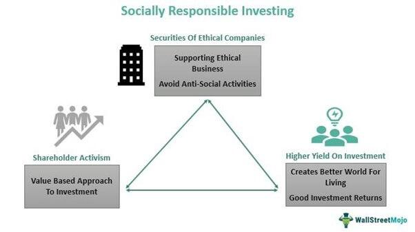

## Table of Contents

## What are socially responsible investment funds?

Socially responsible investment funds are a type of investment that focuses on companies that are good for society and the environment. These funds choose companies based on how they treat their workers, how they impact the environment, and if they support good causes. The idea is to make money while also making the world a better place.

People who invest in these funds care about more than just making money. They want their investments to help solve problems like climate change, unfair labor practices, and social inequality. By choosing socially responsible funds, investors can feel good about where their money is going and the positive impact it can have.

## How do socially responsible investment funds differ from traditional investment funds?

Socially responsible investment funds and traditional investment funds are different in what they focus on. Traditional funds look at how much money a company can make. They want to pick companies that will give them the best return on their investment. Socially responsible funds, on the other hand, care about more than just money. They also look at how a company treats its workers, how it affects the environment, and if it helps the community.

Because of these different focuses, the companies in socially responsible funds might be different from those in traditional funds. A traditional fund might invest in a company that makes a lot of money but pollutes the environment. A socially responsible fund would not invest in that company because it cares about the environment. Instead, it might choose a company that makes less money but does good things for the world. This means that socially responsible funds might have lower returns sometimes, but they help make the world a better place.

## What are the main criteria used to evaluate companies for inclusion in socially responsible investment funds?

Socially responsible investment funds use several main criteria to decide which companies to include. One important criterion is how a company treats its workers. This means looking at things like fair wages, safe working conditions, and equal opportunities for everyone. Another key [factor](/wiki/factor-investing) is the company's impact on the environment. Funds want to invest in companies that reduce pollution, use renewable energy, and work to fight climate change. They avoid companies that harm the environment, even if those companies make a lot of money.

Another criterion is whether a company supports good causes. This can include things like promoting human rights, supporting community projects, or helping to reduce poverty. Socially responsible funds also look at a company's governance, which means how it is run and managed. They want to see transparency, ethical behavior, and strong leadership that cares about more than just profits. By considering all these factors, socially responsible funds aim to invest in companies that not only make money but also make the world a better place.

## Can you provide examples of socially responsible investment funds?

One example of a socially responsible investment fund is the Vanguard FTSE Social Index Fund. This fund tries to match the performance of the FTSE4Good US Select Index, which includes companies that meet certain social, environmental, and ethical standards. The fund avoids companies involved in things like tobacco, weapons, and fossil fuels. Instead, it focuses on companies that treat their workers well, care about the environment, and support good causes.

Another example is the Parnassus Core Equity Fund. This fund looks for companies that are good for society and the environment. It uses strict criteria to make sure the companies it invests in are ethical and sustainable. The fund avoids companies that make money from things like alcohol, gambling, and nuclear power. Instead, it picks companies that help make the world a better place, like those that use clean energy or support fair labor practices.

A third example is the Calvert Equity Fund. This fund invests in companies that meet high standards for social and environmental responsibility. It looks at how companies treat their workers, how they impact the environment, and if they help their communities. The fund avoids companies that do harm, like those in the tobacco or weapons industries. Instead, it chooses companies that are working to solve problems like climate change and social inequality.

## What are the potential benefits of investing in socially responsible funds?

Investing in socially responsible funds can make you feel good because your money is helping to make the world a better place. These funds choose companies that treat their workers well, care about the environment, and support good causes. When you invest in these funds, you know your money is going to companies that are trying to solve problems like climate change and social inequality. This can give you a sense of purpose and satisfaction, knowing that your investment is making a positive impact.

Another benefit is that socially responsible funds can still make money. While they might not always have the highest returns, many of these funds perform well and can grow your money over time. Plus, as more people care about social and environmental issues, companies that focus on these areas may become more popular and successful. This means that socially responsible funds could potentially offer good financial returns while also doing good for society and the environment.

## What are the risks associated with socially responsible investment funds?

One risk of socially responsible investment funds is that they might not make as much money as traditional funds. These funds avoid companies that might be very profitable but do harm to the environment or society. By not investing in these companies, socially responsible funds might miss out on big profits. This means that if you're looking to make the most money possible, a socially responsible fund might not be the best choice.

Another risk is that these funds can be more complicated to manage. They have to look at a lot more than just how much money a company makes. They need to check how a company treats its workers, how it affects the environment, and if it supports good causes. This extra work can make it harder to find the right companies to invest in, and it might lead to higher fees for the fund. So, you might end up paying more to invest in a socially responsible fund than in a traditional one.

## How do socially responsible investment funds perform compared to traditional funds?

Socially responsible investment funds sometimes make less money than traditional funds. This is because they avoid companies that might be very profitable but do harm to the environment or society. For example, they might not invest in big oil companies because those companies pollute a lot. By not investing in these companies, socially responsible funds might miss out on big profits. But not always. Sometimes, these funds can do just as well or even better than traditional funds, especially if people start to care more about social and environmental issues.

It's hard to say for sure how socially responsible funds will do compared to traditional funds because it depends on many things. The economy, the companies they choose, and what people care about can all affect how well these funds perform. Over time, some studies have shown that socially responsible funds can have similar returns to traditional funds. But it's important to remember that past performance doesn't mean the same thing will happen in the future. So, if you're thinking about investing in socially responsible funds, you should look at how they've done in the past but also think about what you care about and what you're willing to risk.

## What role do environmental, social, and governance (ESG) factors play in socially responsible investing?

Environmental, social, and governance ([ESG](/wiki/esg-investing)) factors are really important in socially responsible investing. They help people decide which companies to invest in. Environmental factors look at how a company affects the planet. This includes things like pollution, using renewable energy, and fighting climate change. Social factors check how a company treats its workers and the community. This means looking at fair wages, safe working conditions, and supporting good causes. Governance factors focus on how a company is run. This includes transparency, ethical behavior, and strong leadership that cares about more than just making money.

By using ESG factors, socially responsible investment funds try to pick companies that are good for the world. These funds avoid companies that harm the environment, treat workers badly, or have poor governance. Instead, they choose companies that are trying to make things better. This way, investors can feel good about where their money is going because it's helping to solve big problems like climate change and social inequality. Even though these funds might not always make as much money as traditional funds, they can still offer good returns while making a positive impact.

## How can an investor start investing in socially responsible funds?

To start investing in socially responsible funds, an investor first needs to do some research. They should look for funds that focus on companies that are good for the environment, treat workers well, and support good causes. There are many resources online that list these kinds of funds, like the Vanguard FTSE Social Index Fund, the Parnassus Core Equity Fund, and the Calvert Equity Fund. Investors can also talk to a financial advisor who knows about socially responsible investing. They can help pick the right funds based on what the investor cares about and how much risk they're willing to take.

Once an investor has chosen a fund, they need to open an account with a brokerage or investment platform that offers socially responsible funds. Many big brokerages now have options for these types of investments. After opening an account, the investor can put money into the fund they've chosen. They should keep an eye on how the fund is doing and make sure it still matches their goals and values. Investing in socially responsible funds can feel good because it helps make the world a better place while still trying to make money.

## What are the tax implications of investing in socially responsible funds?

The tax implications of investing in socially responsible funds are pretty much the same as those for traditional funds. When you invest in any fund, you have to pay taxes on the money you make from it. This can include taxes on dividends, which are payments companies make to shareholders, and capital gains, which is the profit you make when you sell your shares for more than you paid for them. The tax rates for these can depend on how long you held the investment and your overall income.

One thing to keep in mind is that some socially responsible funds might invest in companies that get special tax breaks for being environmentally friendly or socially beneficial. These tax breaks could affect the overall tax you pay on your investment. But in general, the main thing to remember is that you'll need to report any income or gains from socially responsible funds on your taxes, just like you would with any other investment. It's always a good idea to talk to a tax advisor to understand how your specific investments will affect your taxes.

## How do regulatory frameworks affect socially responsible investment funds globally?

Regulatory frameworks around the world can have a big impact on socially responsible investment funds. Different countries have different rules about what these funds can invest in and how they need to report their investments. For example, some countries might have strict rules about what counts as a socially responsible investment, while others might be more relaxed. These rules can affect which companies the funds can choose and how they need to show that they are meeting social and environmental goals. This means that a fund might be able to invest in certain companies in one country but not in another because of different regulations.

These regulations can also change over time, which can make it harder for socially responsible funds to plan their investments. As more people care about social and environmental issues, governments might start to make new rules or change old ones to encourage more responsible investing. This can be good for these funds because it might open up more opportunities for them to invest in companies that are trying to make the world a better place. But it can also be challenging because the funds need to keep up with all the changes and make sure they are following the rules in each country where they operate.

## What future trends are expected in the field of socially responsible investing?

In the future, more and more people are expected to care about socially responsible investing. This means that more money will go into funds that focus on companies that are good for the environment, treat their workers well, and support good causes. As people become more aware of problems like climate change and social inequality, they will want their investments to help solve these issues. This could lead to more companies trying to be socially responsible so they can attract more investors. Governments might also make new rules to encourage this kind of investing, which could make it easier for socially responsible funds to grow.

Another trend we might see is the use of new technology to help with socially responsible investing. Tools like [artificial intelligence](/wiki/ai-artificial-intelligence) and big data could make it easier for funds to find companies that meet their criteria. These technologies can analyze a lot of information quickly to see how a company is doing in terms of the environment, social issues, and governance. This could make socially responsible investing more accurate and efficient. Overall, the future of socially responsible investing looks bright, with more people, companies, and technology working together to make the world a better place while still trying to make money.

## References & Further Reading

[1]: Friede, G., Busch, T., & Bassen, A. (2015). ["ESG and financial performance: aggregated evidence from more than 2000 empirical studies."](https://www.tandfonline.com/doi/full/10.1080/20430795.2015.1118917) Journal of Sustainable Finance & Investment, 5(4), 210-233.

[2]: Renneboog, L., Horst, J. T., & Zhang, C. (2008). ["Socially responsible investments: Institutional aspects, performance, and investor behavior."](https://www.sciencedirect.com/science/article/pii/S0378426607004220) Journal of Banking & Finance, 32(9), 1723-1742.

[3]: Khan, M., Serafeim, G., & Yoon, A. (2016). ["Corporate Sustainability: First Evidence on Materiality."](https://dash.harvard.edu/bitstream/handle/1/14369106/15-073.pdf) The Accounting Review, 91(6), 1697-1724.

[4]: Pedersen, L. H., Fitzgibbons, S., & Pomorski, L. (2021). ["Responsible investing: The ESG-efficient frontier."](https://www.sciencedirect.com/science/article/pii/S0304405X20302853) Journal of Financial Economics, 142(2), 436-454.

[5]: Giese, G., Lee, L. E., Melas, D., Nagy, Z., & Nishikawa, L. (2019). ["Foundations of ESG Investing: How ESG Affects Equity Valuation, Risk, and Performance."](https://www.semanticscholar.org/paper/Foundations-of-ESG-Investing:-How-ESG-Affects-Risk,-Giese-Lee/b98e87d4d6c6802f019730150fc5dcf01a81e761) The Journal of Impact and ESG Investing, 38(2), 44-68. 

[6]: Jessen, P., & Lont, D. (2019). ["Machine learning explained: fundamentals, real-world applications and future developments."](https://www.sciencedirect.com/science/article/pii/S004016252031218X) Journal of Financial Regulation and Compliance, 27(1), 34-42. 

[7]: Eccles, R. G., Ioannou, I., & Serafeim, G. (2014). ["The Impact of Corporate Sustainability on Organizational Processes and Performance."](https://www.jstor.org/stable/24550546) Management Science, 60(11), 2835-2857.