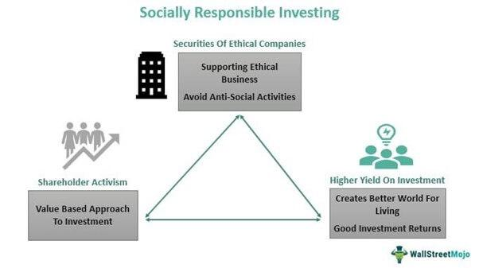

## Table of Contents

## What is socially responsible investment (SRI)?

Socially responsible investment (SRI) is a way of investing money that considers both financial returns and the impact on society and the environment. People who choose SRI want their investments to support companies that do good things, like protecting the environment, treating workers fairly, and promoting social justice. They avoid investing in companies that harm the environment or engage in unethical practices.

SRI can take many forms, such as choosing to invest in companies that have strong environmental, social, and governance (ESG) practices. Investors might also use their influence to encourage companies to improve their practices. By doing this, they hope to make a positive difference in the world while still earning money on their investments.

## How does SRI differ from traditional investment strategies?

Socially responsible investment (SRI) and traditional investment strategies have different goals. Traditional investing focuses mainly on making money. Investors look at how much profit a company makes and how much their investment might grow. They don't usually care about what the company does as long as it makes money. SRI, on the other hand, cares about more than just money. People who use SRI want to make money, but they also want to help the world. They choose companies that do good things for the environment, treat workers well, and support social justice.

The way SRI and traditional investing work is also different. Traditional investors might buy stocks, bonds, or funds without thinking about the company's impact on society. They might invest in any industry, even ones that harm the environment or have poor labor practices, as long as the financial return is good. SRI investors, however, carefully pick their investments. They might avoid certain industries like tobacco or fossil fuels. Instead, they look for companies with strong environmental, social, and governance ([ESG](/wiki/esg-investing)) practices. They might also use their power as shareholders to push companies to do better.

## What are the key principles guiding socially responsible investments?

Socially responsible investments follow key principles that guide how people choose where to put their money. One big principle is to care about the environment. This means [picking](/wiki/asset-class-picking) companies that try to protect the planet. They might use clean energy, reduce waste, or work to stop climate change. Another important principle is to treat people well. This includes making sure workers are paid fairly and work in safe places. It also means choosing companies that support human rights and don't harm communities.

Another guiding principle is to look at how a company is run. This means checking if the company's leaders are honest and fair. Companies that follow good governance practices are more likely to be chosen for SRI. Finally, SRI also aims to help society. This can mean investing in companies that work to solve big problems like poverty or inequality. By following these principles, SRI investors try to make the world a better place while still [earning](/wiki/earning-announcement) money on their investments.

## Can you provide examples of socially responsible investment funds?

One example of a socially responsible investment fund is the Vanguard FTSE Social Index Fund. This fund picks companies that meet certain social and environmental standards. It avoids companies that make tobacco, weapons, or nuclear power. It also looks for companies that treat their workers well and care about the environment. People who invest in this fund want to make money and help the world at the same time.

Another example is the Parnassus Core Equity Fund. This fund looks for companies that do good things for society and the environment. It avoids companies that harm the planet or have poor labor practices. Instead, it chooses companies that have strong environmental, social, and governance practices. This means they care about things like clean energy, fair pay, and honest leadership. By investing in this fund, people can support companies that make a positive difference.

## How do investors screen companies for SRI?

Investors screen companies for socially responsible investment by looking at different things. They check if the company helps the environment. This means they see if the company uses clean energy, reduces waste, and tries to stop climate change. They also look at how the company treats its workers. They want to know if the workers are paid fairly and work in safe places. If a company does bad things to the environment or treats workers poorly, investors might not choose it for SRI.

Another part of screening is looking at the company's leaders. Investors want to see if the leaders are honest and fair. They check if the company follows good governance practices. This means the company is run well and its leaders make good decisions. Investors also look at how the company helps society. They want to see if the company works to solve big problems like poverty or inequality. By looking at all these things, investors can pick companies that fit with the goals of socially responsible investment.

## What are the potential financial benefits of SRI?

Socially responsible investment (SRI) can offer financial benefits to investors. One benefit is that SRI can help investors find companies that are well-managed and have strong long-term growth potential. Companies that care about the environment, treat their workers well, and follow good governance practices often do better in the long run. This is because they are less likely to face big problems like lawsuits or fines. When these companies do well, the value of the investment goes up, and investors can make more money.

Another financial benefit of SRI is that it can help investors avoid risks. By not investing in companies that harm the environment or have poor labor practices, investors can steer clear of companies that might face big problems in the future. For example, a company that pollutes a lot might have to pay huge fines later on. By avoiding these risky companies, SRI investors can protect their money and possibly earn better returns over time.

## What are the common challenges and criticisms of SRI?

One common challenge of socially responsible investment (SRI) is figuring out which companies are really doing good things. It can be hard to tell if a company is just saying it cares about the environment or if it's actually doing something to help. This is called "greenwashing." Another challenge is that SRI might limit the choices of where to invest. If an investor avoids certain industries like oil or tobacco, they might miss out on some good investment opportunities. This can make it harder to earn as much money as they could with traditional investing.

There are also criticisms of SRI. Some people think that focusing on social and environmental issues might hurt financial returns. They believe that SRI might not make as much money as traditional investing because it leaves out some profitable companies. Another criticism is that SRI might not make a big enough difference. Even if many people invest in SRI, it might not be enough to change how big companies act. Critics say that to really make a difference, investors need to do more than just pick certain companies to invest in.

## How has the performance of SRI funds compared to conventional funds historically?

Over the years, studies have shown that SRI funds can perform just as well as conventional funds. Many reports have found that SRI funds often have similar returns to traditional funds. This means that people who invest in SRI can still make good money while also helping the world. For example, some studies have looked at SRI funds over long periods of time and found that they did just as well, or sometimes even better, than regular funds.

However, the performance of SRI funds can vary a lot depending on the time period and the specific funds being compared. Some years, SRI funds might do better than conventional funds, and other years they might do worse. It's important for investors to look at different time periods and different funds to get a good idea of how SRI funds perform compared to traditional ones. Overall, the evidence suggests that SRI can be a good choice for people who want to make money and do good at the same time.

## What role do environmental, social, and governance (ESG) criteria play in SRI?

Environmental, social, and governance (ESG) criteria are very important in socially responsible investment (SRI). They help investors pick companies that do good things for the world. Environmental criteria look at how a company affects the planet. This includes things like using clean energy, reducing waste, and fighting climate change. Social criteria focus on how a company treats people. This means checking if workers are paid fairly, work in safe places, and if the company supports human rights. Governance criteria look at how a company is run. Investors want to see if the company's leaders are honest and make good decisions.

Using ESG criteria helps SRI investors make choices that match their values. By looking at these three areas, investors can find companies that are not just trying to make money, but also trying to make the world a better place. This can lead to investments that support positive changes in society and the environment. Plus, companies that do well in ESG areas often run better and face fewer big problems, which can make them good investments over the long term.

## How can an individual start investing in socially responsible funds?

To start investing in socially responsible funds, an individual first needs to do some research. They should look for funds that focus on environmental, social, and governance (ESG) criteria. Many big investment companies, like Vanguard and Parnassus, offer SRI funds. Websites and financial news can help find these funds. Once they find a fund they like, they need to check its performance and fees. It's also good to see if the fund's values match their own goals for making the world a better place.

After choosing a fund, the next step is to invest. This can be done through a brokerage account, which is like a bank account for buying and selling investments. Many online brokers make it easy to buy SRI funds. The individual just needs to open an account, put money in it, and then buy shares of the SRI fund they picked. It's a good idea to start small and learn as they go. Over time, they can add more money to their investment and keep an eye on how the fund is doing.

## What impact does SRI have on corporate behavior and societal outcomes?

Socially responsible investment (SRI) can change how companies act. When investors put their money into companies that do good things for the environment and society, it sends a message to other companies. They see that people care about more than just making money. This can make companies want to be better. They might start using clean energy, treat their workers more fairly, or make sure their leaders are honest. If a company knows that investors will choose them because they do good things, they might try harder to meet those standards.

SRI can also make a difference in society. When more people invest in SRI funds, it helps companies that are trying to solve big problems like poverty and climate change. This can lead to more jobs in clean energy, better pay for workers, and safer workplaces. Over time, these changes can make the world a better place. While SRI alone might not fix everything, it can be part of a bigger effort to create positive change. By choosing where to put their money, investors can help steer companies and society in a better direction.

## What are the future trends and developments expected in the field of SRI?

In the future, more and more people are expected to choose socially responsible investment (SRI). This is because people are becoming more aware of big problems like climate change and inequality. They want their money to help make the world better. As a result, more investment funds will focus on environmental, social, and governance (ESG) criteria. These funds will try to find companies that do good things for the planet and society. Technology will also help. New tools and data will make it easier for investors to see which companies are really making a difference.

Another trend is that governments and big companies might start to do more to support SRI. They might make rules that encourage companies to be more responsible. This could mean more companies trying to meet ESG standards. Also, as more people invest in SRI, it could lead to bigger changes in how companies act. They might have to do more to show they are helping the environment and treating people well. Overall, SRI is expected to grow and play a bigger role in shaping a better future for everyone.

## References & Further Reading

[1]: Bergstra, J., Bardenet, R., Bengio, Y., & Kégl, B. (2011). ["Algorithms for Hyper-Parameter Optimization."](https://papers.nips.cc/paper/4443-algorithms-for-hyper-parameter-optimization) Advances in Neural Information Processing Systems 24.

[2]: ["Global Sustainable Investment Review 2020."](http://www.gsi-alliance.org/wp-content/uploads/2021/08/GSIR-20201.pdf) Global Sustainable Investment Alliance.

[3]: ["Advances in Financial Machine Learning"](https://www.amazon.com/Advances-Financial-Machine-Learning-Marcos/dp/1119482089) by Marcos Lopez de Prado

[4]: ["Evidence-Based Technical Analysis: Applying the Scientific Method and Statistical Inference to Trading Signals"](https://www.amazon.com/Evidence-Based-Technical-Analysis-Scientific-Statistical/dp/0470008741) by David Aronson

[5]: ["Machine Learning for Algorithmic Trading"](https://github.com/stefan-jansen/machine-learning-for-trading) by Stefan Jansen

[6]: ["Quantitative Trading: How to Build Your Own Algorithmic Trading Business"](https://www.amazon.com/Quantitative-Trading-Build-Algorithmic-Business/dp/1119800064) by Ernest P. Chan

[7]: R. G. Eccles, Ioannou, I., & Serafeim, G. (2014). ["The Impact of Corporate Sustainability on Organizational Processes and Performance."](https://www.jstor.org/stable/24550546) Management Science, 60(11), 2835-2857.

[8]: Friedman, M. (2007). ["The Social Responsibility of Business is to Increase its Profits."](https://link.springer.com/chapter/10.1007/978-3-540-70818-6_14) The New York Times Magazine.