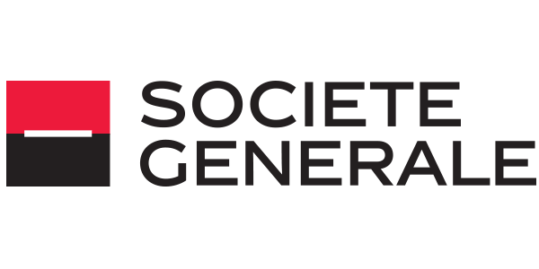

## Table of Contents

## What is Société Générale?

Société Générale is a big bank from France. It started in 1864 and helps people and businesses with their money. They have offices all over the world, not just in France. They help with things like saving money, borrowing money, and investing money.

The bank does many different things. It helps big companies and small businesses. It also helps regular people with their everyday banking needs. Société Générale wants to be a leader in banking and always tries to find new ways to help its customers.

## When was Société Générale founded?

Société Générale was founded in 1864. It started in France and has grown to be a big bank that helps people all over the world.

The bank helps with many things like saving money, borrowing money, and investing money. It works with big companies, small businesses, and regular people to meet their banking needs.

## Where is the headquarters of Société Générale located?

The headquarters of Société Générale is in Paris, France. It is located in a big building in the city.

Société Générale is a big bank that was started in 1864. It helps people and businesses with their money all over the world.

## What are the main services offered by Société Générale?

Société Générale offers many services to help people and businesses with their money. They have services for saving money, which means you can keep your money safe with them. They also help with borrowing money, like giving loans to people who need money for a house or a car. Another service they offer is investing money, where they help people put their money into things like stocks and bonds to try to make more money.

The bank also helps businesses in many ways. They can help a business get the money it needs to grow or start up. They offer services like managing money for big companies, helping them keep track of their money and make smart decisions. Société Générale also works with small businesses, giving them advice and support to help them succeed.

Overall, Société Générale tries to meet the needs of all kinds of customers. Whether you are a regular person saving for the future, or a big company looking to expand, they have services to help you manage your money better. They focus on finding new ways to serve their customers and be a leader in the banking world.

## Who are the main competitors of Société Générale?

Société Générale has many competitors in the banking world. Some of the main ones are BNP Paribas and Crédit Agricole, both of which are also big banks from France. These banks offer similar services like saving money, borrowing money, and investing money. They also help businesses in France and around the world.

Another big competitor is Deutsche Bank from Germany. Deutsche Bank is known for helping big companies and rich people with their money. They offer services like managing money for big businesses and helping people invest their money in different ways. Société Générale and Deutsche Bank often compete for the same customers, especially in Europe.

Outside of Europe, Société Générale also faces competition from banks like JPMorgan Chase in the United States. JPMorgan Chase is a huge bank that helps people and businesses with all kinds of money needs. They offer services like saving, borrowing, and investing, just like Société Générale. These banks compete to help customers all over the world.

## What is the market capitalization of Société Générale?

The market capitalization of Société Générale changes all the time because it depends on the price of its stock. As of the latest data available, Société Générale's market capitalization is around 18 billion euros. This number shows how much the whole company is worth based on what people are willing to pay for its stock.

Market capitalization is important because it tells us how big a company is compared to others. For Société Générale, being worth around 18 billion euros means it is a big bank, but it is smaller than some of its competitors like BNP Paribas, which has a much higher market capitalization. This can affect how Société Générale makes decisions and competes in the market.

## How has Société Générale performed financially in the last fiscal year?

In the last fiscal year, Société Générale had a mixed financial performance. The bank reported a total revenue of about 25 billion euros, which was a slight increase from the previous year. This growth was mainly driven by their corporate and investment banking divisions, which saw higher demand for their services. However, their retail banking in France faced some challenges, with lower interest rates affecting their profits.

Despite these challenges, Société Générale managed to improve its net income, reporting around 2 billion euros for the year. This was a significant improvement compared to the previous year, thanks to cost-cutting measures and better risk management. The bank also continued to invest in digital transformation to stay competitive and meet the changing needs of its customers. Overall, while there were some ups and downs, Société Générale ended the fiscal year on a positive note, showing resilience in a tough market.

## What are some major historical events or scandals associated with Société Générale?

One of the most famous events in Société Générale's history was the Jérôme Kerviel scandal in 2008. Jérôme Kerviel was a trader who worked for the bank. He made secret trades that lost the bank about 4.9 billion euros. This was one of the biggest trading losses ever. The scandal shocked the world and hurt Société Générale's reputation. It also happened during a time when the global economy was already struggling, which made things even harder for the bank.

Another important event was Société Générale's role during the 2008 financial crisis. The bank, like many others, faced big problems because of the crisis. It had to get help from the French government to stay strong. The government gave the bank money to help it keep going. This was a tough time for Société Générale, but it managed to survive and recover over time. These events show how big banks like Société Générale can be affected by the actions of just one person or by big economic problems.

## How does Société Générale contribute to sustainable development and corporate social responsibility?

Société Générale works hard to help the world become a better place through sustainable development and corporate social responsibility. They focus on things like protecting the environment, helping society, and making sure their business is run in a responsible way. One way they do this is by trying to lower their carbon footprint. They set goals to reduce their greenhouse gas emissions and help their clients do the same. They also invest in projects that are good for the environment, like renewable energy. This shows they care about the planet and want to help fight climate change.

Another way Société Générale contributes to sustainable development is by helping communities. They have programs to support education, health, and social inclusion. For example, they work with schools and charities to help young people learn and grow. They also support projects that help people who are less fortunate. This shows they care about making life better for everyone. By doing these things, Société Générale tries to be a good corporate citizen and make a positive impact on the world.

## What is Société Générale's strategy for digital transformation and innovation?

Société Générale is working hard to change and improve how they do things by using new technology. They call this their digital transformation. The bank wants to make banking easier and better for their customers. They are doing this by making new apps and online tools that people can use to manage their money anytime and anywhere. They are also using things like artificial intelligence and big data to help them make better decisions and offer new services. This way, they can understand what their customers need and want, and then give them the best help possible.

Another big part of Société Générale's plan is to keep coming up with new ideas and ways to do things. They have special places called innovation labs where people work together to think of new banking solutions. They also work with other companies and start-ups to bring fresh ideas into the bank. By doing all of this, Société Générale hopes to stay ahead of other banks and keep their customers happy. They want to be a leader in using technology to make banking better for everyone.

## How does Société Générale manage risk and compliance in its operations?

Société Générale works hard to manage risk and follow the rules in its operations. They do this by setting up strong systems and rules that everyone in the bank has to follow. They have special teams that watch over the bank's activities to make sure everything is safe and legal. These teams check for risks like losing money or breaking laws. They also use computers and data to help them see where problems might happen before they become big issues. By doing all of this, Société Générale tries to keep the bank safe and make sure it is doing the right thing.

The bank also trains its employees to understand and follow the rules. They have programs to teach people about risk and compliance so that everyone knows what to do. Société Générale also works with government and other groups to make sure they are meeting all the rules and laws. They report regularly to these groups and get checked to make sure they are doing everything correctly. This way, Société Générale can keep its customers' trust and make sure the bank stays strong and reliable.

## What are the future growth prospects and strategic plans of Société Générale?

Société Générale is looking to grow in the future by focusing on a few key areas. They want to keep expanding in places outside of France, especially in Africa and Central and Eastern Europe. These regions have growing economies, and Société Générale sees a lot of potential there. They also plan to keep working on their digital services, making them even better and easier to use. By doing this, they hope to attract more customers and keep the ones they already have happy. Another part of their plan is to keep helping big companies with their money needs, which is a big part of their business.

The bank also has plans to keep improving how it manages risk and follows the rules. They know that staying safe and doing things the right way is important for their future. Société Générale wants to be known as a bank that is strong and trustworthy. They are also looking into new ways to make money, like helping with sustainable projects and investing in technology. By focusing on these things, Société Générale hopes to keep growing and stay a leader in the banking world.

## References & Further Reading

[1]: Bergstra, J., Bardenet, R., Bengio, Y., & Kégl, B. (2011). ["Algorithms for Hyper-Parameter Optimization."](https://papers.nips.cc/paper/4443-algorithms-for-hyper-parameter-optimization) Advances in Neural Information Processing Systems 24.

[2]: ["Advances in Financial Machine Learning"](https://www.amazon.com/Advances-Financial-Machine-Learning-Marcos/dp/1119482089) by Marcos Lopez de Prado

[3]: ["Evidence-Based Technical Analysis: Applying the Scientific Method and Statistical Inference to Trading Signals"](https://www.amazon.com/Evidence-Based-Technical-Analysis-Scientific-Statistical/dp/0470008741) by David Aronson

[4]: ["Machine Learning for Algorithmic Trading"](https://github.com/stefan-jansen/machine-learning-for-trading) by Stefan Jansen

[5]: ["Quantitative Trading: How to Build Your Own Algorithmic Trading Business"](https://books.google.com/books/about/Quantitative_Trading.html?id=j70yEAAAQBAJ) by Ernest P. Chan