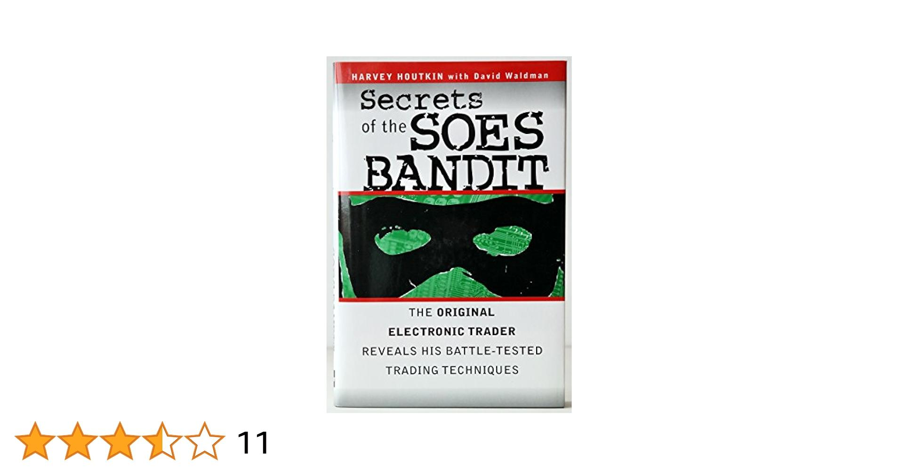

## Table of Contents

## What are SOES Bandits?

SOES Bandits were traders who used a system called SOES (Small Order Execution System) to make quick profits in the stock market. This system was set up by the Nasdaq to help small investors get better prices on their trades. However, some traders figured out how to use SOES to their advantage. They would quickly buy and sell stocks, taking advantage of small price differences that happened very fast.

These traders were called "bandits" because they were seen as taking advantage of the system. They used computers and fast internet connections to trade stocks faster than other people. This made it hard for regular investors to compete with them. The SOES Bandits became well-known in the 1990s, and their actions led to changes in how trading systems worked to make things fairer for everyone.

## When did the SOES Bandits first emerge?

The SOES Bandits first emerged in the early 1990s. This was when the Nasdaq introduced the Small Order Execution System (SOES) to help small investors get better prices on their trades. Some clever traders saw a chance to make quick money using this new system.

These traders, known as SOES Bandits, used fast computers and internet connections to buy and sell stocks very quickly. They took advantage of small price differences that happened fast. This made it hard for regular investors to compete, and it led to changes in trading rules to make things fairer for everyone.

## What is the SOES trading system and how did it work?

The SOES, or Small Order Execution System, was a trading system set up by the Nasdaq to help small investors. It was made to give small investors better prices when they bought or sold stocks. The system worked by automatically matching buy and sell orders for small amounts of stock, usually up to 1,000 shares. This meant that small investors could get their trades done quickly without having to go through a middleman.

However, some clever traders figured out how to use the SOES to their advantage. These traders, known as SOES Bandits, used fast computers and internet connections to buy and sell stocks very quickly. They would look for small price differences that happened fast and make quick trades to make money. This made it hard for regular investors to compete, and it led to changes in trading rules to make things fairer for everyone.

## How did SOES Bandits exploit the SOES system?

SOES Bandits exploited the SOES system by using fast computers and internet connections to buy and sell stocks very quickly. They looked for small price differences that happened fast. When they saw a stock price go up or down a little, they would quickly buy or sell the stock before the price changed again. This way, they could make money from these small price changes.

The SOES system was meant to help small investors get better prices on their trades. But the SOES Bandits used it to make quick profits. They would buy and sell stocks in small amounts, usually up to 1,000 shares, which the system was designed to handle automatically. This made it hard for regular investors to compete because the bandits were so fast and could take advantage of the system's rules.

## What were the typical strategies used by SOES Bandits?

SOES Bandits used a strategy called "[scalping](/wiki/gamma-scalping)." They would watch the stock prices very closely. When they saw a stock price go up or down a little, they would quickly buy or sell the stock. They did this to make money from the small price changes. They used fast computers and internet connections to do this faster than other people.

Another strategy they used was called "[momentum](/wiki/momentum) trading." They would look for stocks that were moving a lot in one direction. If a stock was going up, they would buy it quickly and then sell it when the price went up a bit more. If a stock was going down, they would sell it short and then buy it back when the price went down a bit more. This way, they could make money from the stock's movement.

These strategies worked because the SOES system was set up to handle small trades quickly. The bandits took advantage of this to make quick profits. They were able to do this because they had fast computers and internet connections, which let them trade faster than other people.

## Who were some of the most notable SOES Bandits?

One of the most famous SOES Bandits was Harvey Houtkin. He started trading in the early 1990s and made a lot of money using the SOES system. Houtkin used fast computers to buy and sell stocks quickly. He became well-known for his success and even wrote a book about his experiences called "The SOES Bandits' Guide to Real-World Trading."

Another notable SOES Bandit was Steve Gomez. He was known for using the SOES system to trade stocks very fast. Gomez made a lot of money by watching stock prices closely and making quick trades. His success helped show other people how to use the SOES system to make money too.

## What impact did SOES Bandits have on the stock market?

The SOES Bandits had a big impact on the stock market. They made a lot of money by using the SOES system to trade stocks very fast. This made it hard for regular investors to compete because the bandits could buy and sell stocks before the prices changed. The bandits used fast computers and internet connections to do this. This made people see that the stock market needed to change to be fair for everyone.

Because of the SOES Bandits, the rules for trading changed. The Nasdaq and other groups made new rules to stop people from taking advantage of the system. They made it harder for people to trade as fast as the bandits did. This helped make the stock market fairer for everyone. The SOES Bandits showed how important it is to keep the market fair and to keep up with new technology.

## How did regulatory bodies respond to the activities of SOES Bandits?

Regulatory bodies responded to the activities of SOES Bandits by making new rules to stop people from taking advantage of the system. They saw that the bandits were using fast computers and internet connections to trade stocks very quickly. This made it hard for regular investors to compete. So, the regulators decided to change the rules to make trading more fair for everyone. They put limits on how fast people could trade and made it harder to use the SOES system to make quick profits.

The Nasdaq and other groups worked together to make these new rules. They wanted to stop the bandits from using the SOES system to trade stocks so fast. They also wanted to make sure that small investors could still get good prices on their trades. The new rules helped to make the stock market more fair. They showed that it's important to keep up with new technology and to make sure that everyone has a fair chance to trade stocks.

## What were the legal and ethical implications of SOES Bandit activities?

The activities of SOES Bandits raised both legal and ethical questions. Legally, while the bandits were not breaking any specific laws at the time, their actions were seen as exploiting a loophole in the system. This led to regulatory changes to close the loophole and prevent such exploitation in the future. The bandits used the SOES system in ways that it was not intended, which made some people think it might be against the spirit of the law, even if it was not against the letter of the law.

Ethically, many people saw the bandits' actions as unfair. They were using fast computers and internet connections to trade stocks very quickly, which made it hard for regular investors to compete. This was seen as taking advantage of small investors who did not have the same technology. The bandits' actions showed that the stock market needed to change to be fair for everyone. This led to a lot of talk about what is fair and right in the world of trading.

## How did the activities of SOES Bandits influence modern trading technologies?

The activities of SOES Bandits showed people how important fast computers and internet connections are for trading. They used these tools to trade stocks very quickly and make money. This made other traders and companies want to use fast technology too. Now, many traders use computers and special software to trade stocks fast. This has led to new ways of trading, like high-frequency trading, where computers make trades in just a few seconds.

Because of the SOES Bandits, the rules for trading changed to make things more fair. The new rules helped stop people from taking advantage of the system. This made everyone think more about how to use technology in trading in a way that is fair for all. Today, trading systems are always getting better and faster, but they also have to follow rules to make sure everyone has a fair chance to trade.

## What lessons can be learned from the rise and fall of SOES Bandits?

The rise and fall of SOES Bandits teaches us that technology can change things quickly. The bandits used fast computers and internet to trade stocks fast and make money. This showed everyone how important fast technology is in trading. Now, many traders use computers and special software to trade quickly. But it also showed that just because you can do something with technology, it doesn't mean you should. The bandits took advantage of a system meant to help small investors, which was not fair.

The SOES Bandits also taught us about the need for fair rules in trading. When the bandits started using the SOES system to make quick profits, it made it hard for regular investors to compete. This led to new rules to stop people from taking advantage of the system. These rules helped make trading fairer for everyone. The story of the SOES Bandits shows that it's important to keep up with new technology, but also to make sure the rules keep things fair for all.

## How have the tactics of SOES Bandits evolved in today's trading environment?

The tactics used by SOES Bandits have changed a lot since the 1990s. Today, traders use high-frequency trading ([HFT](/wiki/high-frequency-trading-strategies)) systems to do what the bandits did, but on a much bigger scale. HFT uses very fast computers and special software to buy and sell stocks in just a few seconds. These systems can look at lots of data and make trades very quickly. They can take advantage of small price changes, just like the SOES Bandits did, but they do it much faster and with more trades.

The rules for trading have also changed a lot since the days of the SOES Bandits. Now, there are more rules to stop people from taking advantage of the system. These rules try to make sure that everyone has a fair chance to trade. Even though HFT is very fast, it has to follow these rules. This means that while the tactics of the SOES Bandits have evolved into more advanced forms, the trading world is always trying to balance speed with fairness.

## References & Further Reading

[1]: Sofge, Erik. (2012). ["The Curious Case of the NYSE Bandits."](https://muckrack.com/erik-sofge/articles) Popular Mechanics.

[2]: Harris, Larry. (2003). ["Trading and Exchanges: Market Microstructure for Practitioners."](https://www.amazon.com/Trading-Exchanges-Market-Microstructure-Practitioners/dp/0195144708) Oxford University Press.

[3]: Aldridge, Irene. (2013). ["High-Frequency Trading: A Practical Guide to Algorithmic Strategies and Trading Systems."](https://www.amazon.com/High-Frequency-Trading-Practical-Algorithmic-Strategies/dp/1118343506) Wiley.

[4]: Lewis, Michael. (2014). ["Flash Boys: A Wall Street Revolt."](https://en.wikipedia.org/wiki/Flash_Boys) W. W. Norton & Company.

[5]: Houtkin, Harvey. (1999). ["Secrets of the SOES Bandit: The Original Guide to Wall Street's Underground."](https://archive.org/details/secretsofsoesban00hout_1) HarperBusiness.