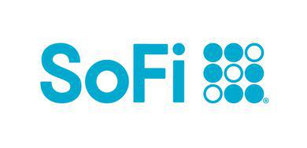

## Table of Contents

## What is SoFi Active Investing?

SoFi Active Investing is a platform where you can buy and sell stocks and other investments online. It's made by a company called SoFi, which helps people with their money. With SoFi Active Investing, you can pick which stocks or funds you want to invest in. It's good for people who like to choose their own investments and want to manage them actively.

The platform is easy to use and you can do everything on your computer or phone. SoFi Active Investing doesn't charge you to trade stocks, which means you can buy and sell without paying extra fees. They also have tools and information to help you make smart choices about your investments. It's a good choice if you want to start investing or if you already know a lot about it.

## How does SoFi Active Investing differ from other investment platforms?

SoFi Active Investing stands out from other investment platforms because it doesn't charge any fees for trading stocks and ETFs. This means you can buy and sell as much as you want without worrying about extra costs. Many other platforms charge a fee every time you make a trade, so SoFi's no-fee approach can save you money. Also, SoFi makes it easy to start investing with a simple and user-friendly app and website, which is great if you're new to investing or if you just want things to be straightforward.

Another way SoFi Active Investing is different is that it's part of a bigger company that offers lots of other financial services. This means you can do more than just invest in stocks; you can also get help with loans, banking, and even planning for your future. If you like having all your financial stuff in one place, SoFi could be a good choice. Plus, SoFi gives you access to tools and information to help you make smart investment choices, which might not be as easy to find on other platforms.

## What are the basic steps to start investing with SoFi Active Investing?

To start investing with SoFi Active Investing, first you need to sign up for an account on their website or app. You'll need to give some personal information like your name, address, and Social Security number. This is to make sure it's really you and to follow the rules. Once you're signed up, you'll need to add money to your account. You can do this by linking your bank account and transferring money over. It's pretty easy and you can start with as little or as much money as you want.

After you've got money in your account, you can start [picking](/wiki/asset-class-picking) what to invest in. SoFi Active Investing lets you buy stocks, ETFs, and even some cryptocurrencies. You can search for what you want to buy and then place an order. If you're not sure what to pick, SoFi has tools and information to help you decide. Once you've made your choices, you can keep an eye on your investments through the app or website and make changes whenever you want. It's all about making it simple for you to start and keep investing.

## What types of investment products does SoFi Active Investing offer?

SoFi Active Investing offers different types of investment products for you to choose from. You can buy stocks, which are pieces of big companies like Apple or Amazon. You can also invest in ETFs, which are like baskets of different investments all put together. These can help spread out your risk because they hold many different things. SoFi also lets you invest in cryptocurrencies, like Bitcoin and Ethereum, if you're interested in that kind of thing.

In addition to stocks, ETFs, and cryptocurrencies, SoFi Active Investing gives you the chance to invest in mutual funds. These are another way to spread out your money across many different investments, and they're managed by professionals. SoFi also has options for those who want to invest in IPOs, which are new companies just starting to sell their stocks to the public. With all these choices, you can pick what fits best with your goals and how much risk you're okay with taking.

## How does SoFi Active Investing's fee structure work?

SoFi Active Investing has a simple fee structure that makes it easy for you to start investing without worrying about extra costs. They don't charge any fees for trading stocks or ETFs. This means you can buy and sell as much as you want without paying anything extra for each trade. It's different from some other platforms that might charge you every time you make a trade.

While trading stocks and ETFs is free, there are some other fees to know about. If you want to invest in mutual funds, SoFi might charge a small fee for that. Also, if you're investing in cryptocurrencies, there could be fees for those trades. But overall, SoFi keeps things simple and tries to help you keep more of your money by not charging for the most common types of investments.

## What are the benefits of using SoFi Active Investing for beginners?

SoFi Active Investing is really good for beginners because it's easy to use. You can sign up and start investing without any confusing steps. The app and website are simple, so even if you're new to investing, you can figure things out quickly. Plus, SoFi doesn't charge any fees for trading stocks and ETFs, which means you can start investing without worrying about extra costs. This makes it easier for beginners to try investing without spending a lot of money right away.

Another great thing about SoFi Active Investing for beginners is that it offers lots of tools and information to help you learn. You can find guides and articles that explain how to pick investments and manage your money. SoFi also has customer support that can answer your questions if you're not sure what to do. Since SoFi offers other financial services too, like banking and loans, you can keep all your money stuff in one place, which makes it simpler to keep track of everything as you start your investing journey.

## How can one analyze the performance of their investments on SoFi Active Investing?

To analyze the performance of your investments on SoFi Active Investing, you can use the tools and features available on their app or website. You'll see a dashboard that shows how your investments are doing. It will tell you things like how much your investments have grown or shrunk in value, and how they're doing compared to the market. You can also look at charts and graphs that show how your investments have changed over time. This helps you see if your investments are going up or down and if they're doing what you hoped they would.

SoFi also gives you detailed information about each investment you own. You can click on a stock or [ETF](/wiki/etf-trading-strategies) to see its price history, news about the company, and what other people think about it. This can help you understand why your investments are performing the way they are. If you want to compare different investments, SoFi lets you do that too. You can see how different stocks or funds are doing side by side, which can help you decide if you should keep your money where it is or move it somewhere else.

## What advanced tools does SoFi Active Investing provide for experienced investors?

SoFi Active Investing offers advanced tools that can help experienced investors make smart choices. One of these tools is the ability to set up custom alerts. This means you can get notified when a stock reaches a certain price or when there's important news about a company you're interested in. This can help you make quick decisions without having to watch the market all the time. SoFi also lets you use advanced order types like limit orders and stop-loss orders. These let you buy or sell stocks at specific prices, which can help you manage risk and get the best deals.

Another useful feature for experienced investors is the detailed research and analysis tools. SoFi gives you access to analyst ratings, earnings reports, and other financial data that can help you understand how a company is doing. You can also compare different investments side by side, which makes it easier to see which ones might be a better fit for your goals. Plus, SoFi has a community where investors can share ideas and insights, which can be a valuable resource for getting different perspectives on the market.

## How does SoFi Active Investing integrate with other SoFi financial services?

SoFi Active Investing works well with other SoFi financial services because it's all part of the same company. This means you can use one account to do many different things with your money. For example, you can move money from your SoFi bank account to your investing account easily. This makes it simple to save up money and then invest it when you're ready. You can also use SoFi's tools to plan your financial future, like saving for a house or retirement, and see how your investments fit into those plans.

Another way SoFi Active Investing connects with other services is through their financial advice and planning tools. If you're using SoFi for loans or credit cards, you can see how those affect your overall financial picture. SoFi can help you understand how paying off a loan might free up money for investing. Plus, if you have questions about your investments or other financial stuff, you can talk to SoFi's team who can give you advice on everything in one place. This makes managing your money easier and more connected.

## What are some strategies for maximizing returns using SoFi Active Investing?

One way to maximize your returns using SoFi Active Investing is by diversifying your investments. This means spreading your money across different types of investments like stocks, ETFs, and even some cryptocurrencies. By not putting all your eggs in one basket, you can reduce the risk of losing money if one investment doesn't do well. SoFi makes it easy to buy different investments without charging fees for trading stocks and ETFs, so you can try this strategy without extra costs.

Another strategy is to keep an eye on your investments and make changes when needed. SoFi's tools can help you see how your investments are doing and get alerts when prices change or important news comes out. If you see that one of your investments is doing really well, you might want to buy more of it. If another one isn't doing so great, you might want to sell it and put your money somewhere else. Using SoFi's advanced order types like limit orders and stop-loss orders can help you buy and sell at the right times to make the most of your money.

## How does SoFi Active Investing handle security and data privacy?

SoFi Active Investing takes security and data privacy seriously. They use strong encryption to keep your information safe when you're using their app or website. This means that your personal details and money are protected from hackers. SoFi also follows strict rules to make sure your data is kept private. They only share your information when they have to, like when the law says they need to.

To keep your account safe, SoFi uses two-[factor](/wiki/factor-investing) authentication. This means you need more than just a password to log in, which adds an extra layer of protection. They also keep an eye out for anything strange happening in your account, like if someone tries to log in from a new place or make a big change. If they see something odd, they'll let you know right away so you can take action.

## What expert tips can enhance the use of SoFi Active Investing for seasoned investors?

Seasoned investors can make the most out of SoFi Active Investing by using its advanced features like custom alerts and advanced order types. Setting up alerts for specific price points or news events can help you stay on top of your investments without having to watch them all the time. Using limit orders and stop-loss orders can help you buy or sell at the best prices and manage risk. These tools let you make smart moves quickly, which is important for experienced investors who want to maximize their returns.

Another tip for seasoned investors is to take advantage of SoFi's research and analysis tools. You can dive deep into analyst ratings, earnings reports, and other financial data to understand how a company is doing. Comparing different investments side by side can help you see which ones might be the best fit for your portfolio. Plus, joining SoFi's community can give you new ideas and insights from other experienced investors. This can help you make better decisions and find new opportunities to grow your money.

## References & Further Reading

[1]: Bergstra, J., Bardenet, R., Bengio, Y., & Kégl, B. (2011). ["Algorithms for Hyper-Parameter Optimization."](https://papers.nips.cc/paper/4443-algorithms-for-hyper-parameter-optimization) Advances in Neural Information Processing Systems 24.

[2]: ["Advances in Financial Machine Learning"](https://www.amazon.com/Advances-Financial-Machine-Learning-Marcos/dp/1119482089) by Marcos Lopez de Prado

[3]: ["Evidence-Based Technical Analysis: Applying the Scientific Method and Statistical Inference to Trading Signals"](https://www.amazon.com/Evidence-Based-Technical-Analysis-Scientific-Statistical/dp/0470008741) by David Aronson

[4]: ["Machine Learning for Algorithmic Trading"](https://github.com/PacktPublishing/Machine-Learning-for-Algorithmic-Trading-Second-Edition) by Stefan Jansen

[5]: ["Quantitative Trading: How to Build Your Own Algorithmic Trading Business"](https://www.amazon.com/Quantitative-Trading-Build-Algorithmic-Business/dp/0470284889) by Ernest P. Chan