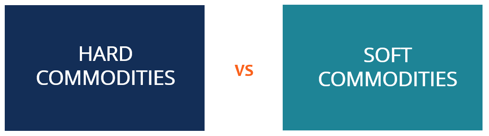

## Table of Contents

## What are commodities?

Commodities are basic goods that people use every day. They are things like oil, gold, wheat, and coffee. These items are traded all around the world. They are important because they help run our lives and economy. For example, oil is used to make gasoline for cars, and wheat is used to make bread.

People and companies buy and sell commodities in special markets called commodity markets. The prices of commodities can change a lot. They go up and down based on how much people want them and how much is available. If there is a lot of wheat one year, the price might go down. If there is not enough oil, the price might go up. This can affect the cost of many things we buy every day.

## What is the difference between soft commodities and hard commodities?

Soft commodities are things that come from plants or animals. They are called "soft" because they can spoil or go bad over time. Examples of soft commodities include wheat, coffee, sugar, and cotton. These items are grown on farms and ranches. The prices of soft commodities can change a lot because they depend on things like the weather and how much is planted or harvested.

Hard commodities are things that are mined or extracted from the earth. They are called "hard" because they are usually more durable and do not spoil like soft commodities. Examples of hard commodities include oil, gold, silver, and copper. These items are important for industries like energy and manufacturing. The prices of hard commodities can also change, but they are often influenced by different factors, like how much is found in the ground and how much it costs to get it out.

## Can you provide examples of soft commodities?

Soft commodities are things that come from plants or animals. They are called "soft" because they can go bad over time. Some examples of soft commodities are wheat, corn, and rice. These are all grains that people eat every day. Farmers grow them on their fields, and the amount they can grow depends on the weather and other things.

Another group of soft commodities comes from plants that are not grains. These include coffee, sugar, and cocoa. People use these to make drinks and sweets. The price of these commodities can change a lot because they depend on how well the plants grow and how much is harvested.

There are also soft commodities that come from animals. For example, cotton comes from the cotton plant, but it is used to make clothes. Another example is livestock, like cows and pigs, which are raised for meat. These commodities are important because they affect the cost of food and clothes that people buy every day.

## Can you provide examples of hard commodities?

Hard commodities are things that come from the ground. They are called "hard" because they do not spoil like food. Some examples of hard commodities are oil, natural gas, and coal. These are used to make energy. People use energy to power their homes and cars. The price of these commodities can change based on how much is found in the ground and how hard it is to get it out.

Another group of hard commodities includes metals like gold, silver, and copper. Gold and silver are often used to make jewelry. Copper is used in wires and pipes. These metals are important for many things we use every day. The price of these commodities can go up and down based on how much people want them and how much is available to mine.

These hard commodities are very important for our economy. They help make things we need and use every day. When the prices of these commodities change, it can affect the cost of many things we buy.

## How are soft commodities typically traded?

Soft commodities are things like wheat, coffee, and cotton. They are traded on special markets called commodity exchanges. These exchanges have rules that everyone follows to make sure trading is fair. Farmers and big companies can trade these commodities. They use something called futures contracts. A futures contract is an agreement to buy or sell a certain amount of the commodity at a set price in the future. This helps farmers know how much money they will get for their crops and helps companies know how much they will have to pay.

The trading of soft commodities can happen in two main ways. One way is through open outcry, where people shout and use hand signals on a trading floor. This is less common now. The other way is through electronic trading. This is done on computers and is much faster and easier. Most trading happens this way now. The prices of soft commodities can change a lot because they depend on things like the weather and how much is grown or harvested.

## How are hard commodities typically traded?

Hard commodities like oil, gold, and copper are traded on commodity exchanges, just like soft commodities. These exchanges have rules to make sure trading is fair. People and companies use futures contracts to trade hard commodities. A futures contract is an agreement to buy or sell a certain amount of the commodity at a set price in the future. This helps miners and companies know what prices to expect.

Trading of hard commodities can happen in two ways. The first way is through open outcry, where people shout and use hand signals on a trading floor. This method is less common now. The second way is through electronic trading, which is done on computers. Electronic trading is much faster and easier, and most trading happens this way now. The prices of hard commodities can change based on how much is found in the ground and how hard it is to get it out.

## What factors influence the prices of soft commodities?

The prices of soft commodities like wheat, coffee, and cotton can change a lot. One big reason is the weather. If there is too much rain or not enough, it can hurt the crops. This means there might be less of the commodity to sell, so the price goes up. Another reason is how much is planted. If farmers plant a lot of one crop, there might be too much of it, and the price can go down. Pests and diseases can also hurt crops, making less available and pushing prices up.

Another [factor](/wiki/factor-investing) that affects the prices of soft commodities is demand. If more people want to buy a commodity, the price can go up. For example, if more people start drinking coffee, the price of coffee beans might increase. Global events can also play a role. If there is a problem in a country that grows a lot of a certain commodity, it can affect the supply and the price. Governments can also change prices by making new rules or giving money to farmers to grow more of something. All these things together make the prices of soft commodities go up and down.

## What factors influence the prices of hard commodities?

The prices of hard commodities like oil, gold, and copper can change because of many things. One big reason is how much is found in the ground. If miners find a lot of a commodity, the price might go down because there is more to sell. If they find less, the price can go up because there is not enough to meet everyone's needs. Another reason is how hard and costly it is to get the commodity out of the ground. If it costs a lot of money to mine or drill, the price of the commodity can go up to cover those costs.

Demand is another important factor that affects the prices of hard commodities. If more people or companies want to buy a commodity, the price can go up. For example, if more people need oil to power their cars, the price of oil might increase. Global events can also change prices. If there is a problem in a country that produces a lot of a commodity, it can affect how much is available and push the price up. Governments can also influence prices by making new rules or changing taxes on commodities. All these things together make the prices of hard commodities go up and down.

## How do soft commodities impact the global economy?

Soft commodities like wheat, coffee, and cotton have a big impact on the global economy. They are things that people use every day, so when the prices of these commodities change, it can affect the cost of food and clothes. For example, if the price of wheat goes up, the cost of bread might go up too. This can make life harder for people who have less money to spend. Farmers also feel the impact because they need to know how much they will get for their crops. If prices are low, they might not make enough money to keep farming.

The global economy is also affected by how much of these soft commodities are grown and traded. If there is a big harvest of coffee one year, the price might go down, and countries that grow a lot of coffee might make less money. On the other hand, if there is not enough cotton because of bad weather, the price can go up, and this can help the countries that grow cotton but make clothes more expensive for everyone else. These changes can cause big shifts in the economy, affecting jobs and trade around the world.

## How do hard commodities impact the global economy?

Hard commodities like oil, gold, and copper are very important for the global economy. They are used to make energy and products that people need every day. When the prices of these commodities change, it can affect the cost of many things. For example, if the price of oil goes up, the cost of gasoline and shipping goods can go up too. This can make life harder for people and businesses because they have to pay more for energy. Countries that produce a lot of these commodities can make more money when prices are high, but they might struggle when prices are low.

The global economy also depends on how much of these hard commodities are found and mined. If there is a lot of a commodity, like copper, the price might go down because there is more to sell. This can be good for companies that use copper to make things like wires and pipes, but it can be bad for the countries that mine copper because they make less money. On the other hand, if there is not enough of a commodity, like oil, the price can go up, and this can cause problems for everyone who needs it. These changes can lead to big shifts in the economy, affecting jobs and trade around the world.

## What are the investment risks associated with soft commodities?

Investing in soft commodities like wheat, coffee, and cotton can be risky. One big risk is that the prices of these commodities can change a lot. They depend on things like the weather, how much is planted, and how many people want to buy them. If there is a bad harvest because of too much rain or not enough, the price can go up a lot. But if there is a good harvest and too much of the commodity, the price can go down. This makes it hard to know what will happen and can make investing in soft commodities risky.

Another risk is that soft commodities can spoil or go bad over time. This means you have to be careful about how long you keep them before selling. If you hold onto them for too long, you might lose money because they are no longer good to use. Also, global events like wars or new rules from governments can change the supply and demand of soft commodities. This can make prices go up and down in ways that are hard to predict. Because of all these things, investing in soft commodities can be a bit like gambling, and you might lose money if you are not careful.

## What are the investment risks associated with hard commodities?

Investing in hard commodities like oil, gold, and copper can be risky. One big risk is that the prices of these commodities can change a lot. They depend on how much is found in the ground and how hard it is to get it out. If miners find a lot of a commodity, the price might go down because there is more to sell. But if they find less, the price can go up because there is not enough to meet everyone's needs. This makes it hard to know what will happen and can make investing in hard commodities risky.

Another risk is that the cost of mining or drilling can change. If it costs a lot of money to get the commodity out of the ground, the price of the commodity can go up to cover those costs. But if new technology makes it cheaper to mine or drill, the price might go down. Also, global events like wars or new rules from governments can change the supply and demand of hard commodities. This can make prices go up and down in ways that are hard to predict. Because of all these things, investing in hard commodities can be a bit like gambling, and you might lose money if you are not careful.

## References & Further Reading

[1]: Hull, J. C. (2012). ["Options, Futures, and Other Derivatives"](https://www.semanticscholar.org/paper/Options%2C-Futures%2C-and-Other-Derivatives-Hull/89bdee500c8623864fc9eb7a471546aa713acc44). Pearson Education.

[2]: Geman, H. (2005). ["Commodities and Commodity Derivatives: Modelling and Pricing for Agriculturals, Metals and Energy"](https://download.e-bookshelf.de/download/0000/5675/90/L-G-0000567590-0015270354.pdf). Wiley.

[3]: Sloman, J., Garratt, D., & Guest, J. (2020). ["Economics for Business"](https://www.pearson.com/nl/en_NL/higher-education/subject-catalogue/economics/Sloman-economics-for-business.html). Pearson.

[4]: Lopez de Prado, M. (2018). ["Advances in Financial Machine Learning"](https://www.amazon.com/Advances-Financial-Machine-Learning-Marcos/dp/1119482089). Wiley.

[5]: Chan, E. P. (2009). ["Quantitative Trading: How to Build Your Own Algorithmic Trading Business"](https://github.com/ftvision/quant_trading_echan_book). Wiley.

[6]: Jansen, S. (2020). ["Machine Learning for Algorithmic Trading: Predictive Models to Extract Signals from Market and Alternative Data for Systematic Trading Strategies with Python"](https://www.amazon.com/Machine-Learning-Algorithmic-Trading-alternative/dp/1839217715). Packt.

[7]: Aronson, D. R. (2006). ["Evidence-Based Technical Analysis: Applying the Scientific Method and Statistical Inference to Trading Signals"](https://www.amazon.com/Evidence-Based-Technical-Analysis-Scientific-Statistical/dp/0470008741). Wiley.

[8]: Fabozzi, F. J., Focardi, S. M., & Kolm, P. N. (2010). ["Quantitative Equity Investing: Techniques and Strategies"](https://www.semanticscholar.org/paper/Quantitative-Equity-Investing%3A-Techniques-and-Fabozzi-Focardi/1c49a2a53919f7e65cb96f16691b8ff726fd3cd7). Wiley.