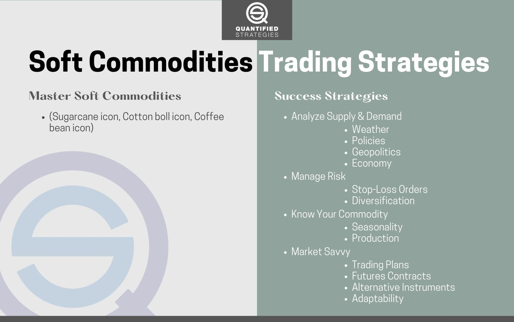

Futures trading in soft commodities plays a crucial role in the financial markets, encompassing both risk management and opportunities inherent in agricultural products such as cocoa, coffee, and sugar. Unlike hard commodities like metals or energy, which are extracted and non-perishable, soft commodities consist of agricultural goods that are cultivated and subject to perishability. This distinction significantly influences their trading dynamics.

This article provides an exploration into the mechanics of soft commodity markets, examining how automated and algorithmic trading methodologies can refine trading strategies. By employing rules-based algorithms, traders can enhance decision-making processes, optimize market positioning, and increase responsiveness to market changes. These sophisticated tools are progressively pivotal in navigating the complexities associated with soft commodity trading.



Further, the piece delves into regulatory and operational frameworks that structure these markets, offering insights into how they ensure fairness and stability. Understanding these elements is essential for traders aiming to leverage market volatility effectively. Mastery of these factors can lead to enhanced trading efficiency and the ability to capitalize on market movements within the soft commodities sector.

## Table of Contents

## Understanding Soft Commodity Markets

Soft commodities encompass a range of agricultural products integral to global markets, including cocoa, coffee, cotton, sugar, and orange juice. These commodities are characterized by their perishable nature and reliance on agricultural production, distinguishing them from hard commodities, which are typically mined. 

The prices of soft commodities are influenced heavily by environmental factors, such as weather conditions, which impact crop yields and quality. Seasonal trends also play a significant role, as different commodities have specific growing and harvesting periods. Geopolitical events, such as trade policies and international relations, can lead to fluctuations in supply and demand, affecting prices. As a result, traders must continuously monitor these variables to make informed trading decisions.

Futures contracts serve as a critical tool in managing the price volatility associated with soft commodities. They allow traders to hedge against adverse price movements by locking in prices for future delivery. For example, a cocoa producer can use futures contracts to sell their product at a predetermined price, mitigating the risk of market price declines. This hedging mechanism provides market participants with a level of price security and predictability.

The regulation of soft commodity markets is primarily overseen by the Commodity Futures Trading Commission (CFTC) and similar regulatory bodies worldwide. These agencies ensure that trading practices are fair, transparent, and in line with established standards, promoting market stability and protecting the interests of all stakeholders involved. This regulatory oversight is crucial for maintaining confidence in the markets and safeguarding against fraudulent and manipulative activities. In summary, an in-depth understanding of the factors influencing prices and the regulatory framework is essential for anyone participating in soft commodity markets.

## Algo Trading in Soft Commodity Futures

Algorithmic trading, or algo trading, employs automated, rule-based strategies to significantly enhance the efficiency and precision of trading activities, particularly in markets characterized by high [volatility](/wiki/volatility-trading-strategies) and complex data flows. In soft commodity futures trading, where products like cocoa, coffee, and sugar are subject to rapid price fluctuations due to various external factors, algo trading is increasingly essential.

Algo trading algorithms can sift through massive datasets at speeds far beyond human capability, providing timely insights that are crucial for making informed trading decisions. These systems can identify patterns and trends within the market data, harnessing predictive analytics to forecast potential market movements. For traders engaged in soft commodities, the ability to react swiftly to predictions and price changes is vital.

One fundamental application of algo trading in soft commodities is optimizing entry and [exit](/wiki/exit-strategy) points in the futures market. Algorithms can be designed to analyze historical price data, identify support and resistance levels, and execute trades at times that maximize potential returns while minimizing risks. By relying on predefined criteria, these algorithmic systems reduce the influence of emotional biases that can cloud decision-making under volatile trading conditions, thereby enhancing precision and systematic execution.

For example, a trader might utilize a moving average crossover strategy within an algorithm to determine entry points. In Python, such a strategy could be implemented as follows:

```python
import pandas as pd
import numpy as np

# Sample data
data = {'Date': pd.date_range(start='1/1/2021', periods=100, freq='D'),
        'Price': np.random.randint(100, 200, size=100)}

df = pd.DataFrame(data)

# Calculate moving averages
df['Short_MA'] = df['Price'].rolling(window=5).mean()
df['Long_MA'] = df['Price'].rolling(window=20).mean()

# Define entry and exit signals
df['Signal'] = 0
df.loc[df['Short_MA'] > df['Long_MA'], 'Signal'] = 1
df.loc[df['Short_MA'] < df['Long_MA'], 'Signal'] = -1

# Determine trading positions
df['Position'] = df['Signal'].diff()

# Display strategic points
print(df[['Date', 'Position']].dropna())
```

This script calculates short and long-term moving averages and generates trading signals when one moving average crosses another. Such algorithmic strategies allow traders to systematically manage their positions in soft commodities futures, mitigating the risks posed by sudden market shifts. 

As financial markets continue to evolve technologically, algo trading remains pivotal, offering enhanced opportunities for precision and efficiency in managing the complexities and volatilities inherent in soft commodity futures trading.

## Key Futures Contracts in Soft Commodities

Major futures contracts in the soft commodity market feature prominently as key instruments for traders seeking to manage risk and speculate on future price movements in agricultural products. These contracts cover commodities such as cocoa, coffee, cotton, frozen concentrated orange juice (FCOJ), and sugar. Each of these commodities presents its own unique trading characteristics, which are critical for traders to comprehend for effective market participation.

Cocoa futures, primarily traded on the ICE Futures U.S. and London International Financial Futures and Options Exchange (LIFFE), depend heavily on the supply from West Africa, where over 70% of the world's cocoa is produced. The standard contract size for cocoa is 10 metric tons, with delivery months typically set in March, May, July, September, and December. The pricing is usually quoted in U.S. dollars per metric ton.

Coffee futures are another significant segment in the soft commodity market, representing two main types: Arabica and Robusta. Arabica coffee is traded primarily through the ICE Futures U.S. and is delivered in March, May, July, September, and December. A standard contract size for coffee is 37,500 pounds, and traders must carefully consider global supply dynamics, particularly from leading producers like Brazil and Vietnam, as well as factors such as weather conditions and pest infestations that can affect yields.

Cotton futures, largely traded on the ICE Futures U.S., hold a standard contract of 50,000 pounds. These contracts are typically delivered in March, May, July, October, and December. Cotton prices are influenced by factors including acreage planted, weather conditions, and economic policies in producing countries like the United States, India, and China.

The FCOJ market provides an important hedging tool through its futures contracts traded on the ICE Futures U.S., with a standard contract size of 15,000 pounds of orange juice solids. These contracts are offered in January, March, May, July, September, and November. Pricing for FCOJ can be volatile due to its sensitivity to weather conditions in Florida and Brazil, the primary production regions.

Finally, sugar futures engage traders with contracts available on the ICE Futures U.S., for raw sugar, and the London LIFFE for white sugar. Raw sugar contracts, a benchmark for the global trade, have a standard size of 112,000 pounds, with sequential delivery months ranging throughout the year. Sugar prices can be affected by supply factors, including government policies, production forecasts from key countries like Brazil and India, and competing sweeteners' market dynamics.

In each of these soft commodities, traders must navigate not only the specific details of contract sizes, delivery months, and pricing units but also the broader market forces at play. A comprehensive understanding of these elements is essential for utilizing futures contracts effectively within the market.

## Market Dynamics and Trading Strategies

Soft commodity markets are profoundly influenced by a range of dynamic factors including seasonal trends, trade policies, and market sentiment. These elements dictate both pricing and availability, necessitating a nuanced approach to trading strategies.

Seasonal trends are particularly important in soft commodities due to the agricultural nature of these products. For instance, the production cycles and harvest times of coffee beans and cocoa can lead to predictable price patterns, providing traders with opportunities to anticipate and act on price movements. Such insights allow traders to align their strategies with the seasonal supply fluctuations inherent to these commodities.

Trade policies also significantly affect the pricing of soft commodities. Tariffs, quotas, and subsidies can alter the competitive landscape, impacting both the supply chain and price stability. Regulatory changes can lead to abrupt shifts in market conditions, requiring traders to adapt quickly to maintain their positions and minimize risks. By keeping abreast of policy changes, traders position themselves advantageously to anticipate potential disruptions or opportunities that may arise.

Market sentiment, driven by global economic conditions, political events, and speculative behavior, similarly plays a crucial role in influencing soft commodity prices. The perceptions of market participants, often reflected in trading volumes and price volatility, can lead to rapid price swings. Understanding and gauging market sentiment thus becomes invaluable for traders seeking to capitalize on short-term price movements.

In terms of strategies, successful trading involves hedging against price risks while also speculating on favorable market conditions. Hedging is typically conducted through futures contracts, allowing traders to lock in prices and protect against adverse price changes. For instance, a cocoa trader might use futures contracts to secure a purchase price several months ahead, mitigating the impact of potential price hikes due to weather disruptions.

Advanced trading strategies, such as spread trading, offer another layer of sophistication. Spread trading capitalizes on the price differences between various contracts rather than their absolute values. A trader might take a long position on one coffee futures contract while shorting another, taking advantage of discrepancies in their relative prices. This technique minimizes exposure to market-wide volatility while exploiting specific [arbitrage](/wiki/arbitrage) opportunities within the market.

These advanced strategies often involve computational tools and data analysis to identify optimal entry and exit points. For example, using Python, a trader could design algorithms to execute trades automatically based on predetermined criteria related to price spreads, volumes, or other market indicators:

```python
import pandas as pd

# Assume df is a DataFrame containing time series data of two different futures contracts
# Compute the price spread between two contracts
df['spread'] = df['contract1_price'] - df['contract2_price']

# Define trading strategy thresholds
entry_threshold = 5
exit_threshold = 1

# Initialize position
position = 0

# Trading logic: Spread trading
for i in range(1, len(df)):
    # Enter trade
    if df['spread'][i] > entry_threshold and position == 0:
        # Short contract1, Long contract2
        position = -1
        entry_point = df['spread'][i]
    elif df['spread'][i] < -entry_threshold and position == 0:
        # Long contract1, Short contract2
        position = 1
        entry_point = df['spread'][i]

    # Exit trade
    if position != 0 and abs(df['spread'][i] - entry_point) <= exit_threshold:
        position = 0
```

In conclusion, the intricate interplay of seasonal, political, and sentimental factors demands that traders apply a blend of strategic foresight and technical precision in navigating the complex marketplace of soft commodities.

## Risk Management in Soft Commodity Futures

Effective risk management in soft commodity futures is crucial due to the high volatility commonly associated with these markets. Key strategies such as stop-loss orders and diversification are foundational tools utilized to protect investments from unpredictable and adverse market movements.

Stop-loss orders are designed to limit potential losses by automatically executing a sale when a commodity's price reaches a pre-determined level. This strategy is particularly valuable in volatile markets, as it ensures a disciplined approach to exiting a position and prevents the emotional decision-making that can occur during market swings. For instance, if a trader purchases coffee futures at $100 per contract and sets a stop-loss order at $95, the position will be closed automatically if the price falls to $95, thereby limiting the loss to $5 per contract.

Diversification, another critical component of risk management, involves spreading investments across different commodities or sectors. In the context of soft commodities, this could mean holding positions in a variety of products such as cocoa, coffee, and sugar, rather than concentrating all investments in a single commodity. This strategy helps reduce the impact of adverse price movements in any one commodity on the overall portfolio performance.

In addition to these tools, traders must remain vigilant about potential market disruptions. External factors such as weather events, political instability, or changes in trade policies can significantly impact soft commodity prices, often with little warning. Staying informed about these developments allows traders to adjust their strategies accordingly. This might involve re-evaluating existing positions, amending stop-loss orders, or diversifying further to mitigate emerging risks.

An example of how traders can stay informed is by tracking weather patterns and forecasts, especially in regions where specific commodities are predominantly grown. For instance, droughts in Brazil, a major coffee producer, can lead to supply shortages and price spikes. By anticipating these events, traders can make informed decisions, such as increasing long positions in coffee futures in expectation of price hikes.

Additional advanced risk management techniques include the use of options, which provide the right, but not the obligation, to buy or sell a contract at a specified price before a certain date. This flexibility can safeguard traders from adverse movements while allowing them to benefit from favorable conditions.

Implementing effective risk management strategies, traders can better protect their investments while navigating the inherent volatility of soft commodity markets. By using stop-loss orders, diversifying investments, staying informed, and considering options strategies, traders can manage and mitigate risks, stabilizing returns even amid market turbulence.

## Conclusion

Futures trading in soft commodities presents a compelling opportunity for investors to capitalize on the dynamic agricultural markets. The sector is characterized by both volatility and sensitivity to external factors such as weather conditions, geopolitical events, and economic policies. These factors make it crucial for traders to employ robust strategies that not only seek profits but also mitigate risks effectively.

Leveraging [algorithmic trading](/wiki/algorithmic-trading) strategies offers a significant advantage in navigating this complexity. Algorithms facilitate high-frequency and precise trading actions, which are essential in managing the natural fluctuations in commodity prices. By utilizing these technologies, traders can gain deeper insights and enhanced control over their trading positions. Moreover, understanding the idiosyncrasies of each commodity—from the impact of seasonal trends to the influence of supply chain disruptions—renders traders better equipped to anticipate and react to market changes.

Combining technical and fundamental analyses is vital to maximizing trading outcomes. Technical analysis assists traders in identifying market trends and potential reversal points by studying price charts and indicators. On the other hand, [fundamental analysis](/wiki/fundamental-analysis) involves examining economic reports, weather forecasts, and other data that could impact supply and demand dynamics. Together, these approaches can provide a comprehensive view of the market, enabling traders to make informed decisions.

Risk management remains a cornerstone of successful trading. Stringent measures such as stop-loss orders and portfolio diversification are essential to prevent disproportionate losses. By continuously assessing and adjusting to market conditions, traders can protect their investments and optimize returns. In addition, keeping abreast of regulatory changes and global developments helps in aligning strategies with potential market shifts.

In conclusion, while the futures market in soft commodities presents inherent risks, the potential for substantial returns is attainable through a disciplined approach. By understanding market characteristics, leveraging automated trading tools, and maintaining a strong risk management framework, traders can effectively tap into the lucrative opportunities within these markets.

## References & Further Reading

[1]: ["Commodity Trading Advisors: Risk, Performance Analysis, and Selection"](https://cdn.preterhuman.net/texts/finance_and_marketing/stock_market/Commodity%20Trading%20Advisors%20-%20Risk,%20Performance%20Analysis,%20And%20Selection.pdf) by Greg N. Gregoriou  

[2]: Hull, J. C. (2017). ["Options, Futures, and Other Derivatives"](https://www.semanticscholar.org/paper/Options%2C-Futures%2C-and-Other-Derivatives-Hull/89bdee500c8623864fc9eb7a471546aa713acc44). Pearson Education.

[3]: Nuti, G., Mirghaemi, M., Treleaven, P., & Yingsaeree, C. (2011). ["Algorithmic Trading."](https://www.semanticscholar.org/paper/Algorithmic-Trading-Nuti-Mirghaemi/dec841dd0f1fce55ba930b26f3fb945e330dfcbb) In Handbook of Artificial Intelligence in Finance. Springer.

[4]: "Commodity Futures Trading for Beginners: The Essentials Guide to Learn the Fundamental Principles and Strategies to Trade Futures" by George K George

[5]: ["Understanding the Regulatory Framework of Commodity Futures Trading"](https://www.investopedia.com/terms/c/cftc.asp) - Commodity Futures Trading Commission (CFTC)

[6]: Irwin, S. H., & Sanders, D. R. (2011). ["Index Funds, Financialization, and Commodity Futures Markets"](https://www.jstor.org/stable/pdf/41237206.pdf). Annual Review of Resource Economics.

