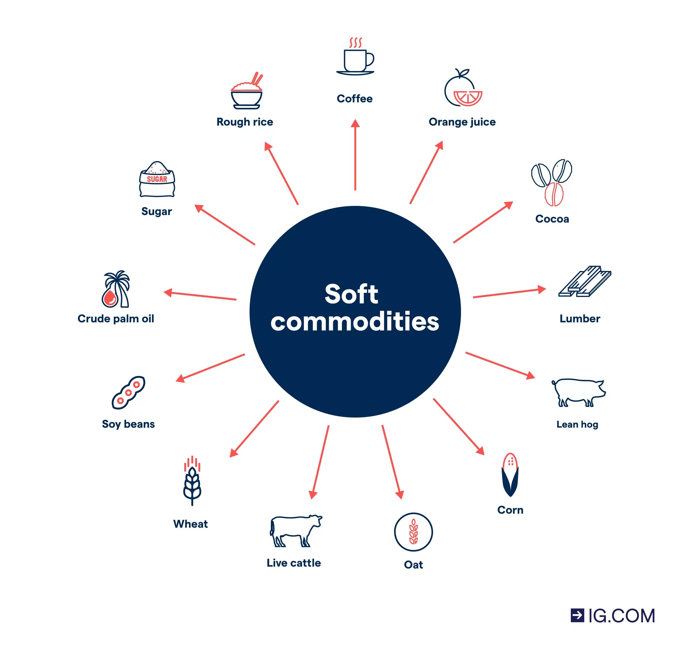

## Table of Contents

## What are soft commodities?

Soft commodities are things that are grown or raised on farms. They include things like wheat, corn, soybeans, coffee, sugar, and cotton. These are different from hard commodities, which are things like gold, oil, and metals that come from the ground or are mined.

People trade soft commodities on markets all over the world. Farmers and companies use these markets to buy and sell their crops. The prices of soft commodities can change a lot because they depend on things like weather, how much people want them, and how much is being grown. This makes trading soft commodities a bit risky, but it can also be a good way for farmers to make sure they can sell their crops and for companies to get what they need.

## How do soft commodity futures work?

Soft commodity futures are agreements to buy or sell a certain amount of a soft commodity, like wheat or coffee, at a set price on a future date. Farmers and companies use these futures to protect themselves from price changes. For example, a farmer might sell wheat futures to lock in a price for their crop before they even plant it. This way, if the price of wheat goes down by harvest time, the farmer still gets the price they agreed on in the futures contract.

On the other side, a company that needs wheat might buy futures to make sure they can get the wheat they need at a known price. If the price of wheat goes up, the company still pays the lower price they agreed on in the futures contract. Trading soft commodity futures happens on special markets where people can buy and sell these contracts. The prices can go up and down based on what people think will happen to the supply and demand of the commodity in the future.

## What are the most commonly traded soft commodities?

The most commonly traded soft commodities are grains like wheat, corn, and soybeans. These are big crops that many people around the world eat every day. Wheat is used to make bread and pasta, corn is used for animal feed and making things like corn syrup, and soybeans are used for oil and protein in food. Farmers grow a lot of these crops, and they are traded on big markets where people can buy and sell them.

Another group of commonly traded soft commodities includes coffee, sugar, and cocoa. These are often called "tropical softs" because they grow in warm places. Coffee and cocoa are used to make drinks that many people enjoy, and sugar is used in lots of foods and drinks to make them sweet. These commodities are important because they are used all over the world, and their prices can change a lot based on how much is grown and how much people want them.

Cotton is another soft commodity that is traded a lot. It's used to make clothes and other things like bed sheets. The price of cotton can go up and down based on how much is grown and how much people want to buy it. All these soft commodities are important because they affect what we eat, drink, and wear, and their prices can have a big impact on farmers and companies that use them.

## What are the benefits of trading soft commodity futures?

Trading soft commodity futures can help farmers and companies manage risk. Farmers can sell futures to lock in a good price for their crops before they even plant them. This way, if the price of the commodity goes down by the time they harvest, they still get the price they agreed on in the futures contract. Companies that need commodities can buy futures to make sure they can get what they need at a known price. If the price goes up, they still pay the lower price they agreed on. This helps both farmers and companies plan better and avoid big losses if prices change a lot.

Another benefit is that trading soft commodity futures can help balance supply and demand. If there's a lot of a commodity, like wheat, the price might go down, and farmers might decide to grow less of it next year. If there's not enough of a commodity, the price might go up, and farmers might decide to grow more. This helps keep the market stable. Also, trading futures can give people information about what might happen to prices in the future. This can help farmers, companies, and even governments make better decisions about what to grow, buy, or sell.

## What are the risks associated with soft commodity futures trading?

Trading soft commodity futures can be risky because prices can change a lot. Things like weather, how much people want the commodity, and how much is being grown can all affect the price. If the price goes down after someone buys a future, they might lose money. For example, if a company buys a wheat future and the price of wheat goes down, they will have to pay more than the new lower price when the future comes due. This can be a big problem if prices change a lot.

Another risk is that futures are agreements to buy or sell at a future date. If something unexpected happens, like a big change in the weather or a problem with the crop, it can make it hard to meet the agreement. This can lead to big losses if someone can't deliver the commodity they promised or if they have to buy it at a much higher price than they expected. It's important for people trading futures to understand these risks and have a plan to deal with them.

## How can beginners start trading soft commodity futures?

To start trading soft commodity futures, beginners should first learn about the basics of futures trading. They can find a lot of information online or in [books](/wiki/algo-trading-books) about how futures work, what affects the prices of soft commodities, and how to read market data. It's important to understand the risks and have a plan for managing them. Beginners might want to start by opening a demo account with a futures broker. This lets them practice trading without using real money, which can help them learn without risking any losses.

Once they feel ready, beginners can choose a reputable futures broker and open a real trading account. They'll need to deposit money into the account to start trading. It's a good idea to start small and only trade with money they can afford to lose. Beginners should also keep learning and stay updated on market news and trends. Trading soft commodity futures can be complicated, but with time and practice, beginners can get better at it and maybe even make some money.

## What are the key factors that influence soft commodity prices?

The prices of soft commodities like wheat, corn, and coffee can change because of many things. One big thing is the weather. If there's a lot of rain or a drought, it can hurt the crops and make less of the commodity available. This can make prices go up. Another thing is how much people want the commodity. If more people want to buy it, the price can go up. If fewer people want it, the price can go down. Also, what's happening in the world can affect prices. For example, if there's a problem in a country that grows a lot of a commodity, it can make less of it available and push prices up.

Another important thing that affects soft commodity prices is how much is being grown. If farmers plant a lot of a crop, there might be too much of it, and the price can go down. If they plant less, there might not be enough, and the price can go up. The cost of growing the commodity can also matter. If it costs more to grow the crop because of higher prices for things like fertilizer or fuel, farmers might grow less of it, which can make the price go up. Finally, what's happening with money around the world can affect prices. If the value of the dollar changes, it can make commodities more or less expensive for people in other countries, which can change the demand and the price.

## How do global events and weather patterns affect soft commodity futures?

Global events and weather patterns can really change the prices of soft commodity futures. When something big happens in the world, like a war or a trade problem, it can make it harder to get soft commodities from some places. This can make less of the commodity available, which can push the prices up. For example, if there's a problem in a country that grows a lot of wheat, it might mean there's less wheat to go around, and the price of wheat futures might go up. Also, if the value of money changes in different countries, it can make commodities more or less expensive for people in other places, which can change how much they want to buy and affect the price.

Weather patterns are another big thing that can change soft commodity futures prices. If there's a lot of rain or a drought, it can hurt the crops and make less of the commodity available. This can make the price go up because there's not enough to meet the demand. For example, if there's a drought in a place that grows a lot of corn, it might mean there's less corn, and the price of corn futures might go up. On the other hand, if the weather is good and there's a lot of the commodity, the price might go down because there's too much of it. So, keeping an eye on the weather can be really important for people trading soft commodity futures.

## What are some advanced strategies for trading soft commodity futures?

One advanced strategy for trading soft commodity futures is called spreading. This means buying and selling different futures contracts at the same time to make money from the difference in their prices. For example, someone might buy a wheat future for one month and sell a wheat future for a different month. If the price difference between the two months changes in a good way, they can make money. Spreading can be less risky than just buying or selling one future because it's about the difference in prices, not the overall price going up or down. But it still needs a lot of understanding of the market and how prices move.

Another strategy is called hedging. This is when someone uses futures to protect against price changes. For example, a farmer might sell wheat futures to lock in a good price for their crop before they even plant it. If the price of wheat goes down by harvest time, the farmer still gets the price they agreed on in the futures contract. Companies that need wheat might buy futures to make sure they can get the wheat they need at a known price. If the price goes up, they still pay the lower price they agreed on. Hedging can help people plan better and avoid big losses if prices change a lot, but it needs careful planning and understanding of the market.

A third strategy is technical analysis. This is when traders use charts and numbers to try to guess where prices might go next. They look at things like past prices, how much the price has moved up and down, and other patterns. If they see a pattern that has happened before and led to a price change, they might think it will happen again. Technical analysis can help traders make better decisions about when to buy or sell futures, but it's not perfect and needs a lot of practice and understanding. It's important for traders to keep learning and stay updated on market news and trends to use these strategies well.

## How can traders use technical analysis in soft commodity futures trading?

Traders can use technical analysis to help them make better choices when trading soft commodity futures. They look at charts and numbers to try to guess where prices might go next. They pay attention to things like past prices, how much the price has moved up and down, and other patterns. If they see a pattern that has happened before and led to a price change, they might think it will happen again. For example, if a certain pattern in the wheat futures chart has always led to the price going up, a trader might decide to buy wheat futures when they see that pattern again.

Technical analysis can be a useful tool, but it's not perfect. It needs a lot of practice and understanding to use it well. Traders also need to keep learning and stay updated on market news and trends. Even though technical analysis can help, it's important for traders to remember that other things, like weather and global events, can also affect soft commodity prices. So, using technical analysis along with other information can help traders make smarter decisions when trading soft commodity futures.

## What role do government policies and regulations play in soft commodity markets?

Government policies and regulations can have a big impact on soft commodity markets. They can change how much of a commodity is grown and how much it costs. For example, if the government gives money to farmers to grow more wheat, there might be more wheat available, which can make the price go down. On the other hand, if the government puts a limit on how much sugar can be imported, there might be less sugar available, which can make the price go up. Governments can also set rules about how commodities are traded, like making sure the trading is fair and that people don't try to cheat.

Another way government policies affect soft commodity markets is through things like subsidies and tariffs. Subsidies are when the government gives money to farmers to help them grow more of a certain crop. This can make more of the commodity available and change the price. Tariffs are taxes on imports, and they can make it more expensive to bring in commodities from other countries. This can make less of the commodity available and push the price up. So, when traders are looking at soft commodity markets, they need to keep an eye on what the government is doing because it can really change the prices.

## How can traders hedge their portfolios using soft commodity futures?

Traders can use soft commodity futures to hedge their portfolios by protecting themselves from price changes. For example, a farmer who grows wheat can sell wheat futures to lock in a good price for their crop before they even plant it. If the price of wheat goes down by harvest time, the farmer still gets the price they agreed on in the futures contract. This way, the farmer doesn't lose money if the price drops. On the other hand, a company that needs wheat might buy wheat futures to make sure they can get the wheat they need at a known price. If the price goes up, the company still pays the lower price they agreed on. This helps the company plan better and avoid big losses if prices change a lot.

Hedging with soft commodity futures can also be useful for investors who have other investments that are affected by commodity prices. For example, if an investor has a lot of money in a food company that uses corn, they might buy corn futures to protect against the price of corn going up. If the price of corn does go up, the investor loses money on the corn futures but makes money on the food company because the company can charge more for its products. This way, the investor's overall portfolio is protected from big price changes. Hedging can help traders and investors manage risk, but it needs careful planning and understanding of the market.

## References & Further Reading

[1]: ["Commodity Trading Advisors: Risk, Performance Analysis, and Selection"](https://cdn.preterhuman.net/texts/finance_and_marketing/stock_market/Commodity%20Trading%20Advisors%20-%20Risk,%20Performance%20Analysis,%20And%20Selection.pdf) by Greg N. Gregoriou  

[2]: Hull, J. C. (2017). ["Options, Futures, and Other Derivatives"](https://www.semanticscholar.org/paper/Options%2C-Futures%2C-and-Other-Derivatives-Hull/89bdee500c8623864fc9eb7a471546aa713acc44). Pearson Education.

[3]: Nuti, G., Mirghaemi, M., Treleaven, P., & Yingsaeree, C. (2011). ["Algorithmic Trading."](https://www.semanticscholar.org/paper/Algorithmic-Trading-Nuti-Mirghaemi/dec841dd0f1fce55ba930b26f3fb945e330dfcbb) In Handbook of Artificial Intelligence in Finance. Springer.

[4]: "Commodity Futures Trading for Beginners: The Essentials Guide to Learn the Fundamental Principles and Strategies to Trade Futures" by George K George

[5]: ["Understanding the Regulatory Framework of Commodity Futures Trading"](https://www.investopedia.com/terms/c/cftc.asp) - Commodity Futures Trading Commission (CFTC)

[6]: Irwin, S. H., & Sanders, D. R. (2011). ["Index Funds, Financialization, and Commodity Futures Markets"](https://www.jstor.org/stable/pdf/41237206.pdf). Annual Review of Resource Economics.

