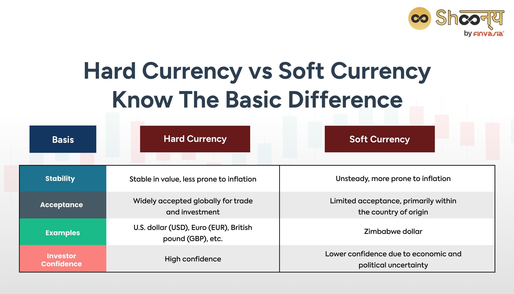

## Table of Contents

## What is soft currency?

Soft currency is money that is not very strong or stable. It is usually from countries that have a lot of economic problems. Because of this, people do not want to keep or use this money for a long time. They might quickly change it into a stronger currency, like the US dollar or the Euro, to keep their money safe.

Countries with soft currency often have high inflation, which means the prices of things go up a lot and the money becomes worth less. This makes it hard for people in these countries to buy things they need. Soft currency can also make it difficult for a country to trade with other countries because other countries might not want to accept it as payment.

## How does soft currency differ from hard currency?

Soft currency and hard currency are different because of how strong and stable they are. Soft currency comes from countries that have a lot of money problems. These countries often have high inflation, which means the prices of things go up quickly and the money loses value. Because of this, people do not trust soft currency and want to change it into a stronger currency as soon as they can. This makes it hard for countries with soft currency to do business with other countries because others might not want to accept it.

Hard currency, on the other hand, comes from countries with strong and stable economies. Examples of hard currency are the US dollar, the Euro, and the Japanese yen. These currencies are trusted around the world because they keep their value well over time. People and businesses are happy to hold onto hard currency because it is less likely to lose value suddenly. This makes it easier for countries with hard currency to trade and do business with other countries.

## What are some examples of countries that use soft currency?

Some countries that use soft currency are Venezuela, Argentina, and Zimbabwe. These countries have had big money problems. In Venezuela, the money has lost a lot of value because of high inflation. This means that prices go up very fast and people's money can't buy as much as before. In Argentina, the currency has also been weak, and people often change their money into US dollars to keep it safe. Zimbabwe had such bad inflation that they had to stop using their own money for a while and use other countries' money instead.

These countries show how hard it can be to have a soft currency. When a country's money is not trusted, it can make life very difficult for people living there. They might struggle to buy things they need because prices keep going up. It also makes it hard for these countries to trade with other countries because other countries might not want to accept their money. This can make the economy even weaker and cause more problems.

## What factors contribute to a currency being classified as soft?

A currency is classified as soft when a country has a lot of money problems. This often happens when a country has high inflation, which means prices go up quickly and the money loses value. When people see their money becoming worth less, they lose trust in it. They want to change it into a stronger currency, like the US dollar or the Euro, to keep their savings safe. This lack of trust makes the currency even weaker because fewer people want to use it.

Another factor that can make a currency soft is when a country's economy is not doing well. If a country has a lot of debt, or if it is not making enough money from selling things to other countries, its currency can become weak. Political problems or not having good rules for businesses can also make a currency soft. When other countries see these problems, they might not want to accept the soft currency in trade. This makes it hard for the country to buy things it needs from other places, which can make the economy even worse.

## How does the value of soft currency fluctuate?

The value of soft currency can go up and down a lot. This happens because the country's economy is not very strong. When a country has high inflation, the prices of things go up quickly. This makes the money worth less, so people want to change it into a stronger currency. If people think the economy will get worse, they might try to get rid of the soft currency even faster. This can make the value of the soft currency drop even more.

Sometimes, the government of a country with soft currency might try to do things to make the money stronger. They might change the rules about money or try to make the economy better. But if people do not trust these changes, the value of the soft currency can still go down. It can be hard for a country with soft currency to make it stronger because other countries might not want to trade with them or accept their money. This can make the value of the soft currency keep going up and down.

## What are the economic implications of using soft currency for a country?

Using soft currency can make life hard for people in a country. When a country's money is soft, it means the money is not strong and can lose value quickly. This is often because of high inflation, which makes prices go up fast. When prices go up, people's money can't buy as much as before. This can make it hard for people to buy things they need, like food and medicine. It can also make people lose trust in their money, so they might try to change it into a stronger currency, like the US dollar, to keep their savings safe.

Soft currency can also make it hard for a country to trade with other countries. Other countries might not want to accept soft currency because they think it will lose value. This can make it difficult for the country to buy things it needs from other places. When a country can't trade easily, its economy can get even weaker. This can lead to more problems, like higher unemployment and less money for the government to spend on things like schools and hospitals. So, having a soft currency can make a country's economic problems even worse.

## How do soft currencies impact international trade?

Soft currencies can make it hard for a country to do business with other countries. When a country's money is soft, other countries might not want to accept it because they think it will lose value quickly. This means the country with the soft currency might have to use a stronger currency, like the US dollar, to buy things from other places. But this can be expensive and make it harder for the country to afford what it needs.

This problem can make the country's economy even weaker. If a country can't trade easily, it might not be able to sell its own things to other countries. This can lead to fewer jobs and less money coming into the country. When a country's economy is struggling, it can be hard to fix the problems with the soft currency, which can make the situation even worse.

## What are the risks associated with holding soft currency?

Holding soft currency can be risky because it can lose value quickly. When a country's money is soft, it often means the country has a lot of money problems. High inflation can make prices go up fast, so the money becomes worth less. If people think the money will keep losing value, they might try to change it into a stronger currency, like the US dollar, to keep their savings safe. This can make the soft currency even weaker.

Another risk is that other countries might not want to accept soft currency. This can make it hard for a country to buy things it needs from other places. If a country can't trade easily, its economy can get even weaker. This can lead to more problems, like higher unemployment and less money for the government to spend on things like schools and hospitals. So, holding soft currency can make a country's economic problems even worse.

## How can governments stabilize or improve the value of their soft currency?

Governments can try to make their soft currency stronger by controlling inflation. They can do this by making rules about how much money they print and how much they spend. If they print less money and spend less, it can help stop prices from going up so fast. They can also work on making their economy better by helping businesses grow and creating more jobs. This can make people trust their money more and want to keep it instead of changing it into a stronger currency.

Another way governments can help is by making their country more attractive to other countries for trading. They can do this by making good rules for businesses and making it easier for other countries to accept their money. If other countries start trusting the soft currency more, it can become stronger. Governments can also ask for help from international groups like the International Monetary Fund, which can give them advice and money to help fix their economic problems. By doing these things, governments can slowly make their soft currency more stable and trusted.

## What role do soft currencies play in global financial markets?

Soft currencies do not have a big role in global financial markets. This is because they are not trusted by many people and businesses around the world. When a country's money is soft, it means the country has a lot of money problems. High inflation can make the money lose value quickly, so people want to change it into a stronger currency, like the US dollar. Because of this, soft currencies are not used much for trading between countries. Other countries might not want to accept soft currency because they think it will lose value soon.

Even though soft currencies are not very important in global financial markets, they can still affect them. If a country with a soft currency has big money problems, it can make other countries worry. This can make the global markets a bit unstable. For example, if a country with a soft currency cannot pay back its debts, it can cause problems for banks and businesses in other countries. So, even though soft currencies are not used much in global trading, their problems can still have an impact on the world's financial markets.

## How do exchange rates affect the functionality of soft currencies?

Exchange rates are very important for soft currencies. They show how much of one country's money can be traded for another country's money. For soft currencies, the exchange rate can change a lot. This is because people do not trust soft currencies and think they will lose value quickly. When the exchange rate goes down, it means the soft currency is worth less compared to other currencies. This can make it hard for a country to buy things from other countries because it needs more of its own money to get the same amount of foreign money.

When the exchange rate of a soft currency changes a lot, it can make life harder for people in that country. If the exchange rate goes down, the prices of things that are bought from other countries, like food or medicine, can go up. This is bad for people because their money can't buy as much as before. It can also make it difficult for businesses in the country to sell their things to other countries. If other countries do not want to accept the soft currency, businesses might have to sell their things for less money or not sell them at all. This can make the country's economy even weaker.

## What are the advanced strategies for investing in soft currencies?

Investing in soft currencies can be risky, but some people use advanced strategies to try to make money from them. One way is to use something called "currency carry trade." This means borrowing money in a country with a soft currency, where the interest rates are usually high, and then using that money to invest in a country with a hard currency, where the interest rates are lower. If the soft currency stays weak or gets weaker, the investor can make money from the difference in interest rates. But this strategy is risky because if the soft currency suddenly gets stronger, the investor could lose money.

Another strategy is to use "currency hedging." This means using financial tools to protect against the risk of the soft currency losing value. For example, an investor might buy a "currency option" that lets them exchange the soft currency for a hard currency at a set rate in the future. This can help them avoid losing money if the soft currency gets even weaker. But using these tools can be complicated and expensive, so it's not for everyone. Both of these strategies need a lot of knowledge about how currencies work and a good understanding of the risks involved.

## References & Further Reading

[1]: ["Advances in Financial Machine Learning"](https://www.amazon.com/Advances-Financial-Machine-Learning-Marcos/dp/1119482089) by Marcos Lopez de Prado

[2]: ["Quantitative Trading: How to Build Your Own Algorithmic Trading Business"](https://www.amazon.com/Quantitative-Trading-Build-Algorithmic-Business/dp/1119800064) by Ernest P. Chan

[3]: ["Machine Learning for Algorithmic Trading"](https://github.com/stefan-jansen/machine-learning-for-trading) by Stefan Jansen

[4]: ["Evidence-Based Technical Analysis: Applying the Scientific Method and Statistical Inference to Trading Signals"](https://www.amazon.com/Evidence-Based-Technical-Analysis-Scientific-Statistical/dp/0470008741) by David Aronson

[5]: Bergstra, J., Bardenet, R., Bengio, Y., & Kégl, B. (2011). ["Algorithms for Hyper-Parameter Optimization."](https://dl.acm.org/doi/10.5555/2986459.2986743) Advances in Neural Information Processing Systems 24.