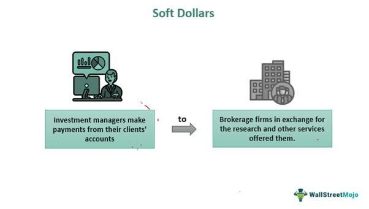

## Table of Contents

## What are soft dollars in the context of finance?

Soft dollars are a way that some investment firms pay for services they need, like research or data, using the commissions from their clients' trades instead of paying directly with cash. Imagine you're an investment manager and you need to buy research reports to make better investment decisions. Instead of paying for these reports out of your own pocket, you can use the commissions generated from your clients' stock trades to cover the cost. This practice is called using soft dollars.

The use of soft dollars can be controversial because it might not always be in the best interest of the clients. If an investment manager chooses a broker that charges higher commissions just because they offer free research, the clients end up paying more in trading costs. This could mean less money in their pockets over time. Regulators keep a close eye on soft dollar practices to make sure they are fair and transparent, but it's still a topic that sparks debate in the financial world.

## How do soft dollars differ from hard dollars?

Soft dollars and hard dollars are two different ways that investment firms can pay for things they need. Soft dollars are when an investment firm uses the money they make from their clients' trades to pay for services like research or data. Instead of paying with actual cash, they use these commissions. For example, if a firm needs a research report, they might use the money they earn from trading stocks to get it, rather than taking money out of their own pocket.

Hard dollars, on the other hand, are when an investment firm pays for things directly with cash. This means they use their own money to buy services or products, like paying for a research report with a check or a bank transfer. The key difference is that with hard dollars, the firm is using its own funds, while with soft dollars, they're using the money generated from their clients' trades. This can affect how much money clients end up paying in fees and commissions.

## What are the common uses of soft dollars in financial services?

Soft dollars are often used by investment firms to pay for research and data services. For example, a firm might use soft dollars to get research reports that help them make better investment choices. These reports can be about companies, industries, or economic trends. By using soft dollars, the firm doesn't have to pay for these reports out of their own pocket. Instead, they use the money they make from their clients' trades.

Another common use of soft dollars is to pay for financial data and analysis tools. These tools help investment managers keep track of market trends and analyze investment options. For instance, a firm might use soft dollars to subscribe to a service that provides real-time stock prices or detailed financial data. This can save the firm money because they're not using their own cash to pay for these services. However, it's important for firms to use soft dollars in a way that's fair to their clients, as the costs can affect the clients' investment returns.

## Can you explain the regulatory framework surrounding soft dollars?

The use of soft dollars is watched closely by regulators to make sure it's fair and clear. In the United States, the main rule that governs soft dollars is called Section 28(e) of the Securities Exchange Act of 1934. This rule says that investment firms can use soft dollars to pay for research and brokerage services, as long as they follow certain rules. The rule is meant to protect investors by making sure that the costs of these services are fair and that the firms are using soft dollars in a way that benefits their clients.

Regulators like the Securities and Exchange Commission (SEC) keep an eye on how firms use soft dollars. They want to make sure that firms are not using soft dollars to pay for things that don't help their clients, like office supplies or travel expenses. If a firm uses soft dollars in a way that's not allowed, they could get in trouble with the SEC. This means that firms have to be very careful about how they use soft dollars and make sure they're following the rules to avoid any problems.

## How do soft dollars impact investment decisions?

Soft dollars can affect investment decisions because they let investment firms get research and data without spending their own money. This means firms can use the money they make from their clients' trades to pay for things like research reports. These reports can help the firm learn more about different companies and markets, which can lead to better investment choices. But, if a firm picks a broker who charges more just because they offer free research, the clients might end up paying more in trading costs. This could mean less money for the clients over time.

Regulators watch how firms use soft dollars to make sure it's fair for clients. They want to make sure that the research paid for with soft dollars really helps the clients and doesn't just benefit the firm. If firms use soft dollars the right way, it can help them make smarter investment choices. But if they use it the wrong way, it could lead to higher costs for clients and might not help their investments as much. So, the way soft dollars are used can have a big impact on how well a firm can make investment decisions.

## What are the ethical considerations when using soft dollars?

Using soft dollars raises some big ethical questions. One main issue is whether it's fair to clients. When investment firms use soft dollars, they're using the money made from their clients' trades to pay for things like research. If a firm chooses a broker that charges more just because they offer free research, the clients end up paying more in trading costs. This could mean less money for the clients over time. So, firms need to think carefully about whether using soft dollars is really in the best interest of their clients.

Another ethical consideration is transparency. Firms should be clear with their clients about how they're using soft dollars. Clients have a right to know if their trading commissions are being used to pay for research or other services. If firms aren't open about this, it can lead to mistrust. Regulators keep a close eye on how firms use soft dollars to make sure they're following the rules and being fair to clients. But even with rules in place, it's up to the firms to make ethical choices about how they use soft dollars.

## How can soft dollars be reported and tracked effectively?

To report and track soft dollars effectively, investment firms need to keep good records. They should write down every time they use soft dollars to pay for something, like a research report. This helps them keep track of how much they're spending and where the money is going. They can use special software or spreadsheets to make this easier. By keeping detailed records, firms can make sure they're following the rules and being fair to their clients.

It's also important for firms to be clear with their clients about how they're using soft dollars. They can do this by including information about soft dollars in their regular reports to clients. This way, clients can see how their trading commissions are being used. Regulators also check these reports to make sure everything is being done correctly. By being open and keeping good records, firms can use soft dollars in a way that's both effective and ethical.

## What are the potential benefits of using soft dollars for a firm?

Using soft dollars can help a firm save money. Instead of paying for research and data services out of their own pocket, a firm can use the money they make from their clients' trades. This means they can get important information and tools without spending their own cash. This can be a big help, especially for smaller firms that might not have a lot of money to spend on research.

Soft dollars can also help a firm make better investment decisions. With the research and data they get, firms can learn more about different companies and markets. This can lead to smarter choices about where to invest their clients' money. If used the right way, soft dollars can help a firm do a better job for their clients, which could lead to more success and growth for the firm.

## What are the risks and drawbacks associated with soft dollars?

Using soft dollars can lead to higher costs for clients. When a firm uses soft dollars, they might choose a broker that charges more just because they offer free research. This means clients end up paying more in trading fees. Over time, these extra costs can add up and reduce the amount of money clients have in their investments. Firms need to be careful to make sure using soft dollars doesn't hurt their clients more than it helps.

Another risk is that soft dollars can create conflicts of interest. If a firm gets research for free because they use a certain broker, they might pick that broker even if they're not the best choice for their clients. This can lead to decisions that are better for the firm than for the clients. Regulators watch how firms use soft dollars to make sure they're not taking advantage of their clients, but it's still a tricky area that needs careful handling.

Keeping track of soft dollars can also be hard. Firms need to keep good records of how they're using soft dollars, which can be a lot of work. They also need to be clear with their clients about how they're using their trading commissions. If they're not open about it, it can lead to mistrust. So, while soft dollars can help firms save money and make better investment choices, they come with some big challenges that firms need to manage carefully.

## How have soft dollar practices evolved over time?

Soft dollar practices have changed a lot over the years. In the past, firms used soft dollars to pay for all sorts of things, not just research. They might use soft dollars to buy office supplies or pay for trips. But as time went on, regulators started to see that this wasn't always fair to clients. So, they made new rules to make sure soft dollars were used in a way that helped clients more. Now, firms can only use soft dollars for research and some brokerage services, and they have to be very careful about how they do it.

These days, firms have to keep better records of their soft dollar use and be more open with their clients about it. They use special software and tools to track how they're spending soft dollars. This helps them make sure they're following the rules and being fair to their clients. Even though soft dollars can still be helpful for firms, they have to use them in a way that doesn't hurt their clients. The changes in soft dollar practices show how important it is for firms to think about their clients first and follow the rules set by regulators.

## What are some case studies or examples of soft dollar usage in major financial institutions?

One example of soft dollar usage can be seen in the case of a large investment firm like Fidelity Investments. In the past, Fidelity used soft dollars to pay for research that helped them make better investment decisions. They would use the commissions from their clients' trades to get research reports about different companies and markets. This helped them pick the best stocks for their clients. But, they had to be careful to make sure they were following the rules and not spending too much on research that didn't really help their clients.

Another example comes from Goldman Sachs, a big bank that also manages investments. Goldman Sachs used soft dollars to pay for research and data services. They would use the money they made from trading to get detailed financial data and analysis tools. This helped their investment managers keep track of market trends and make smart investment choices. However, like all firms, they had to make sure they were using soft dollars in a way that was fair to their clients and followed the rules set by regulators.

## What future trends might affect the use of soft dollars in the finance industry?

The use of soft dollars in the finance industry might change a lot in the future because of new technology and stricter rules. As more firms start using computers and special software to do research, they might not need to use soft dollars as much. These tools can give firms a lot of information quickly and cheaply, so they might not need to use the money from their clients' trades to pay for research anymore. Also, regulators are keeping a closer eye on how firms use soft dollars to make sure it's fair for clients. They might make new rules that make it harder for firms to use soft dollars, or they might change the rules to make sure soft dollars are only used for things that really help clients.

Another thing that could change how firms use soft dollars is the way people think about investing. More and more people are looking for ways to invest that are clear and easy to understand. They want to know exactly how their money is being used and how much they're paying in fees. This means firms might need to be more open about how they use soft dollars. If firms can't show that using soft dollars is good for their clients, they might stop using them altogether. So, the future of soft dollars will depend a lot on new technology, stricter rules, and what people want from their investments.

## References & Further Reading

[1]: Edelen, R., & Kadlec, G. B. (1989). "Day of the week patterns in the distribution of stock returns: Evidence and explanations." Journal of Financial and Quantitative Analysis, 24(2), 177-198.

[2]: Chen, Z., & Velchev, I. (2013). ["Algorithmic Trading: Winning Strategies and Their Rationale."](https://www.wiley.com/en-us/Algorithmic+Trading%3A+Winning+Strategies+and+Their+Rationale-p-9781118460146) Wiley Finance Series.

[3]: Comerton-Forde, C., & Rydge, J. (2006). "The Influence of Soft Dollar Arrangements on Broker Research and Recommendations." Journal of Financial Markets, 9(2), 130-160.

[4]: Fabozzi, F. J., & Grantier, R. J. (2010). ["Handbook of Advanced Investments/trading."](https://archive.org/details/handbookofcommod0000fabo) Wiley 

[5]: ["Trading and Exchanges: Market Microstructure for Practitioners"](https://www.amazon.com/Trading-Exchanges-Market-Microstructure-Practitioners/dp/0195144708) by Larry Harris

[6]: Jones, C. M., & Lipson, M. L. (2009). "Execution Costs and the Cross Section of Stock Returns." Journal of Finance, 54(1), 153-186.

[7]: Ybarra, V., & Mehta, N. (2011). "Soft Dollars and MiFID II: Regulatory Implications and Manager Responses." Journal of Investment Management, 9(3), 90–104.