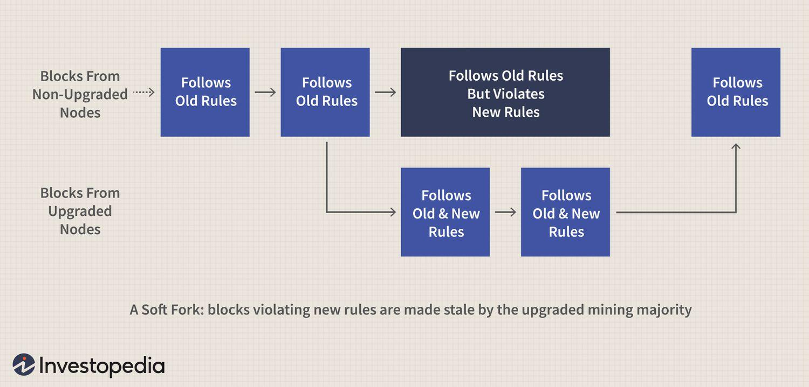

## Table of Contents

## What is a soft fork in cryptocurrency?

A soft fork in cryptocurrency is a change to the software of a blockchain that makes it more strict or adds new features, but still allows old versions of the software to work. Think of it like a software update that doesn't force everyone to update right away. For example, if a soft fork adds a new rule that makes transactions more secure, the old software can still process those transactions, but it won't be able to take advantage of the new security feature.

Soft forks are important because they help improve the blockchain without causing a split in the network. Since old and new software can still work together, most people in the network can agree to the change without causing big problems. However, if not enough people update to the new software, the changes might not be very effective. Soft forks are often used to fix security issues or to add new features that make the blockchain better over time.

## How does a soft fork differ from a hard fork?

A soft fork and a hard fork are two ways to change a blockchain, but they work differently. A soft fork is like a small update that makes the rules stricter or adds new features, but it still lets the old software work. So, if you don't update your software right away, you can still use the blockchain. This means everyone can keep using the same blockchain without splitting into different groups.

A hard fork, on the other hand, is like a big change that makes the old software stop working. If you don't update to the new software, you can't use the blockchain anymore. This can cause the blockchain to split into two different versions, with some people using the old one and others using the new one. Hard forks can be more disruptive, but they're needed for big changes that can't work with the old software.

## Why are soft forks important in blockchain technology?

Soft forks are important in blockchain technology because they allow the network to improve and update without causing big splits or disruptions. When a soft fork happens, the rules of the blockchain get a bit stricter or new features are added, but the old software can still work. This means that people who haven't updated their software yet can still use the blockchain. It's like getting a new update for a game that makes it better, but you can still play the game even if you don't update right away.

This ability to make changes without forcing everyone to update at the same time helps keep the blockchain community together. If most people agree to the changes, the blockchain can become more secure or get new features over time. Soft forks are often used to fix problems or make the blockchain better without causing big arguments or splits in the community. This makes it easier for everyone to keep using the same blockchain and benefit from the improvements.

## Can you explain the process of implementing a soft fork?

Implementing a soft fork starts with the developers of the blockchain deciding that a change is needed. They might want to fix a problem, make the blockchain more secure, or add a new feature. They write the new code for this change and share it with everyone who uses the blockchain. This new code makes the rules a bit stricter or adds something new, but it's designed so that people who haven't updated their software yet can still use the blockchain. The developers then ask people in the community to test the new code and give feedback.

Once the new code is tested and most people agree that it's a good change, the developers release the update. People can choose to update their software to use the new rules. Because the old software still works, there's no rush to update right away. Over time, more and more people update, and the blockchain starts using the new rules more often. This way, the blockchain can get better without splitting into different groups or causing big problems. Soft forks help keep the community together while making improvements.

## What are some examples of soft forks in major cryptocurrencies?

In Bitcoin, one example of a soft fork is the Segregated Witness (SegWit) update that happened in 2017. SegWit was made to fix a problem called transaction malleability and to help the blockchain handle more transactions. It worked by moving some data out of the main part of a transaction, making it smaller. This change let the old software still work, so people didn't have to update right away. Over time, more people updated, and SegWit helped make Bitcoin's transactions faster and cheaper.

Another example is the P2SH (Pay to Script Hash) soft fork in Bitcoin, which happened in 2012. P2SH made it easier to use complex scripts for transactions. Before P2SH, if you wanted to use a complicated script, you had to put the whole script in the transaction, which could be long and hard to handle. P2SH let you use a shorter hash of the script instead, making transactions simpler and more secure. Like SegWit, P2SH was a soft fork because the old software could still work with the new rules, allowing a smooth update for the Bitcoin network.

## How do soft forks affect miners and mining?

Soft forks can change how miners do their job. When a soft fork happens, the rules for what makes a valid block get a bit stricter or new features are added. Miners need to update their software to follow these new rules if they want to keep mining and [earning](/wiki/earning-announcement) rewards. But since the old software still works, miners can choose when to update. If most miners update, the blockchain starts using the new rules more often, and the soft fork becomes more effective. This means miners who don't update might find their blocks are less likely to be accepted by the network.

Soft forks can also affect how much miners earn. For example, if a soft fork makes transactions smaller or more efficient, like with Bitcoin's SegWit, it can help the blockchain handle more transactions. This can lead to more fees for miners, as more people use the blockchain. But if miners don't update, they might miss out on these extra fees. So, while soft forks can make things better for miners in the long run, it's important for them to keep up with updates to stay in the game.

## What are the potential risks associated with soft forks?

Soft forks can have some risks, even though they're meant to be less disruptive than hard forks. One risk is that not enough people might update to the new software. If most people don't update, the changes won't work well, and the blockchain might not get the benefits it was supposed to. This can make the soft fork less effective and might even cause confusion or disagreements in the community about whether the change was a good idea.

Another risk is that some miners might not update their software right away. If a lot of miners keep using the old software, they might keep making blocks that don't follow the new rules. This can slow down the process of the soft fork taking effect and might even lead to a temporary split in the blockchain if the old and new blocks don't agree with each other. While soft forks are designed to be smooth, these risks show that they can still cause some problems if not everyone is on board with the changes.

## How do soft forks maintain backward compatibility?

Soft forks keep backward compatibility by making the rules of the blockchain stricter or adding new features in a way that the old software can still work. When a soft fork happens, the new rules are designed so that blocks made with the old software are still seen as valid. This means that people who haven't updated their software yet can still use the blockchain without any problems. They might not be able to use the new features, but they can keep doing what they were doing before.

This backward compatibility helps keep the blockchain community together. Since the old and new software can work together, there's no rush for everyone to update at the same time. Over time, more people update their software, and the blockchain starts using the new rules more often. This way, the blockchain can improve and fix problems without causing big splits or disagreements in the community. Soft forks make it easier for everyone to keep using the same blockchain while still making it better.

## What role do soft forks play in network upgrades and improvements?

Soft forks are really important for making a blockchain better without causing big problems. They let the people who run the blockchain change the rules a little bit or add new things, but in a way that the old software can still work. This means that if you haven't updated your software yet, you can still use the blockchain. It's like getting a new update for a game that makes it better, but you can still play the game even if you don't update right away. This helps keep everyone using the same blockchain and working together.

Over time, more people update their software to use the new rules. As more people update, the blockchain starts using the new rules more often. This way, the blockchain can fix problems, become more secure, or get new features without splitting into different groups. Soft forks make it easier for everyone to keep using the same blockchain while still making it better. They help the blockchain grow and improve without causing big arguments or splits in the community.

## How can users and nodes prepare for a soft fork?

To get ready for a soft fork, users and nodes should keep an eye on the news and updates from the blockchain's developers. They should learn about the changes that are coming and why they're important. It's a good idea to join online groups or forums where people talk about the blockchain, so you can ask questions and get help if you need it. When the new software for the soft fork is released, users and nodes should test it to make sure it works well with their setup. This can help find any problems before the soft fork happens.

Once the soft fork is happening, users and nodes should update their software to the new version. But because soft forks are designed to work with the old software too, there's no rush to update right away. You can wait a bit to see how things go and make sure other people are updating without problems. Over time, as more people update, the blockchain will start using the new rules more often. By staying informed and updating when you're ready, users and nodes can help make the soft fork go smoothly and keep the blockchain working well.

## What are the governance implications of soft forks in decentralized systems?

Soft forks have important effects on how decisions are made in decentralized systems. In these systems, everyone who uses the blockchain has a say in what changes happen. When a soft fork is suggested, the people who run the nodes and the miners need to agree on the changes. If most people like the new rules and update their software, the soft fork can go ahead smoothly. But if not enough people agree, the changes might not work well, and the blockchain might not get better.

This way of making decisions helps keep the community together because it needs a lot of people to agree before big changes happen. Soft forks show that everyone in the system has a part in deciding how the blockchain grows and changes. This can make the system stronger because it's harder for one group to make changes without everyone else agreeing. But it can also make things slower because it takes time to get everyone on board with the new rules.

## How do soft forks impact the security and consensus of a blockchain?

Soft forks can help make a blockchain more secure. When a soft fork happens, the rules get a bit stricter or new features are added to fix problems or stop bad things from happening. For example, if a soft fork fixes a way that someone could cheat the system, it makes the blockchain safer for everyone. But, for the soft fork to really work, most people need to update their software. If not enough people update, the old software might still let the bad things happen, so the security improvements won't be as good.

Soft forks also affect how everyone agrees on what's happening on the blockchain, which is called consensus. When most people update their software and start using the new rules, the blockchain follows those rules more often. This helps everyone agree on what's valid and what's not. But if some people don't update, they might keep making blocks that don't follow the new rules. This can cause a bit of confusion or slow down the process of everyone agreeing on the changes. Soft forks are designed to keep everyone working together, but they need a lot of people to agree to really work well.

## References & Further Reading

[1]: Antonopoulos, A. M. (2017). ["Mastering Bitcoin: Unlocking Digital Cryptocurrencies"](https://books.google.com/books/about/Mastering_Bitcoin.html?id=IXmrBQAAQBAJ) (2nd ed.). O'Reilly Media.

[2]: Narayanan, A., Bonneau, J., Felten, E., Miller, A., & Goldfeder, S. (2016). ["Bitcoin and Cryptocurrency Technologies"](https://press.princeton.edu/books/hardcover/9780691171692/bitcoin-and-cryptocurrency-technologies). Princeton University Press.

[3]: Cont, R. (2001). ["Empirical properties of asset returns: stylized facts and statistical issues."](http://rama.cont.perso.math.cnrs.fr/pdf/empirical.pdf) Quantitative Finance, 1(2), 223-236.

[4]: DeFilippi, P., & Wright, A. (2018). ["Blockchain and the Law: The Rule of Code"](https://www.jstor.org/stable/j.ctv2867sp). Harvard University Press.

[5]: Harris, L. (2003). ["Trading and Exchanges: Market Microstructure for Practitioners"](https://academic.oup.com/book/52292). Oxford University Press.