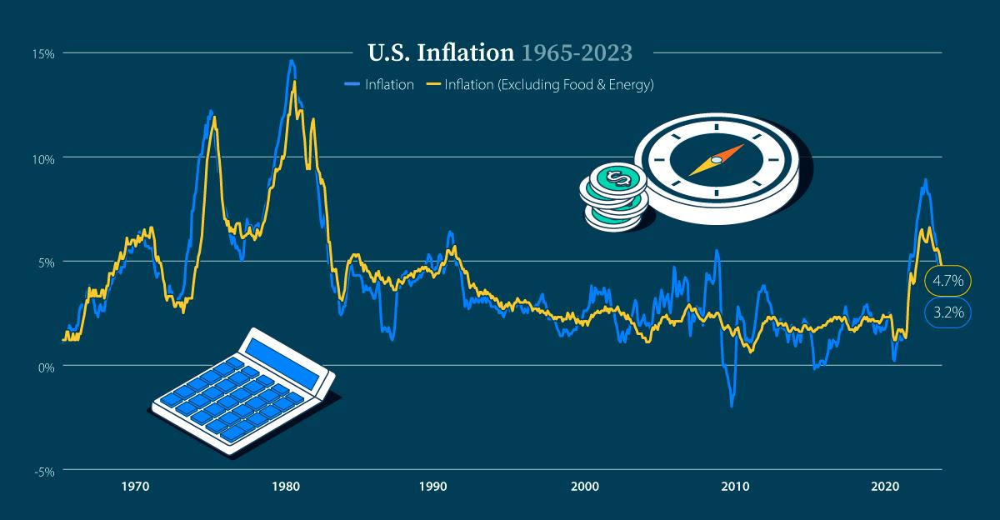

## Table of Contents

## What is a soft landing in economics?

A soft landing in economics happens when a country's economy slows down gently without going into a recession. It's like a plane landing smoothly on a runway. When this happens, the economy keeps growing, but at a slower pace. Central banks, like the Federal Reserve in the U.S., often try to achieve a soft landing by adjusting interest rates. They raise rates to cool down an overheating economy, but not so much that it causes a recession.

Achieving a soft landing is tricky because it requires a delicate balance. If the central bank raises interest rates too much, it can push the economy into a recession. On the other hand, if they don't raise rates enough, inflation might keep rising. Economists and policymakers watch many indicators, like employment rates and consumer spending, to guide their decisions. When a soft landing is successful, it helps maintain stability and growth in the economy without the harsh effects of a downturn.

## How does a soft landing differ from a hard landing?

A soft landing and a hard landing are two different ways an economy can slow down. A soft landing is when the economy slows down gently without going into a recession. It's like a plane landing smoothly on a runway. The economy keeps growing, but at a slower pace. Central banks try to achieve this by carefully adjusting interest rates to cool down the economy without causing too much damage.

On the other hand, a hard landing is when the economy slows down quickly and goes into a recession. It's like a plane crashing instead of landing smoothly. When this happens, there can be big problems like lots of people losing their jobs and businesses closing. Central banks might raise interest rates too much, causing the economy to crash. A hard landing can be very tough on people and businesses, so everyone hopes for a soft landing instead.

## What are the key indicators that a soft landing is occurring?

When a soft landing is happening, you can see it in a few ways. One big sign is that the economy keeps growing, but not as fast as before. It's like a car slowing down but still moving forward. You might see the GDP growth rate drop a bit, but it stays above zero, meaning the economy is still expanding. Another sign is that the unemployment rate stays low or even goes down a little. This means people are keeping their jobs and businesses are still hiring, even though the economy is slowing down.

Another important indicator is inflation. During a soft landing, inflation cools off but doesn't drop too much. It's like the economy is finding a happy middle ground where prices aren't going up too fast, but they're not falling either. You can also look at consumer spending, which stays steady or slows down gently. People keep buying things, but maybe not as much as before. All these signs together show that the economy is slowing down smoothly without crashing into a recession.

## Can you explain the role of central banks in achieving a soft landing?

Central banks play a big role in trying to make a soft landing happen. They do this mainly by changing interest rates. When the economy is growing too fast and prices are going up a lot, the central bank can raise interest rates. This makes borrowing money more expensive, so people and businesses spend less. By doing this, the central bank tries to slow down the economy without stopping it completely. It's like using a brake gently on a bike to slow down without falling off.

It's a tricky job because if the central bank raises rates too much, it can cause a hard landing, where the economy crashes into a recession. But if they don't raise rates enough, the economy might keep overheating and inflation could get out of control. So, central banks watch things like unemployment, consumer spending, and inflation very closely. They use all this information to decide when and how much to change interest rates. When they get it right, the economy slows down smoothly, and everyone can keep working and spending without too many problems.

## What economic policies are typically used to facilitate a soft landing?

Central banks use [interest rate](/wiki/interest-rate-trading-strategies) changes to help make a soft landing happen. When the economy is growing too fast and prices are going up a lot, the central bank can raise interest rates. This makes it more expensive for people and businesses to borrow money, so they spend less. By doing this, the central bank tries to slow down the economy gently, like putting on the brakes slowly on a bike. The goal is to keep the economy growing, but at a slower pace, so it doesn't crash into a recession.

Besides changing interest rates, central banks also use other tools like setting reserve requirements for banks and using open market operations. Reserve requirements are rules about how much money banks have to keep on hand, and changing these can affect how much money is available for lending. Open market operations involve the central bank buying or selling government bonds to control the money supply. By carefully using these tools, central banks can help guide the economy towards a soft landing, making sure it slows down without causing too many problems for people and businesses.

## How does a soft landing impact employment and inflation?

A soft landing helps keep employment stable. When the economy slows down gently, businesses don't have to lay off many workers. People keep their jobs, and the unemployment rate stays low or even goes down a little. This is good because it means people can keep [earning](/wiki/earning-announcement) money and spending it, which helps the economy keep going. If the economy had a hard landing instead, lots of people might lose their jobs, and that would be bad for everyone.

A soft landing also helps control inflation. When the economy is growing too fast, prices can go up a lot, which is called inflation. But during a soft landing, the central bank raises interest rates just enough to slow down the economy and cool off inflation. Prices still go up, but not as fast as before. This makes things more stable for everyone because they don't have to worry about prices going up too quickly. A soft landing finds a good balance where the economy slows down but doesn't crash, and inflation stays under control.

## What historical examples illustrate successful soft landings?

One good example of a soft landing happened in the United States in the mid-1990s. The Federal Reserve, which is like the country's central bank, raised interest rates to slow down the economy. They did this because the economy was growing too fast and prices were going up a lot. But they were careful not to raise rates too much. As a result, the economy slowed down gently without going into a recession. People kept their jobs, and inflation went down to a more normal level. This soft landing helped the economy stay strong and stable for a long time.

Another example is in Canada during the early 2000s. The Bank of Canada, which is Canada's central bank, also used interest rates to manage the economy. They raised rates to cool down the economy, which was growing quickly. But they did it in a way that didn't cause a big crash. The economy slowed down, but it didn't go into a recession. Unemployment stayed low, and inflation was kept under control. This soft landing helped Canada's economy stay healthy and avoid the problems that come with a hard landing.

## What are the challenges faced by policymakers in managing a soft landing?

Policymakers face a lot of challenges when trying to manage a soft landing. One big challenge is getting the timing right. They need to raise interest rates at the right time to slow down the economy without causing a recession. If they wait too long, inflation might get out of control. But if they act too soon, they might slow down the economy too much and cause a hard landing. It's like trying to catch a falling leaf without squishing it.

Another challenge is that the economy is always changing. Policymakers have to guess what will happen in the future based on what's happening now. But the economy can be unpredictable, and new problems can pop up out of nowhere. For example, a sudden drop in oil prices or a big event like a natural disaster can change everything. Policymakers have to be ready to change their plans quickly to keep the economy on track for a soft landing.

## How do market expectations influence the likelihood of a soft landing?

Market expectations play a big role in whether a soft landing happens. When people and businesses think the economy will slow down gently, they act in ways that help make it happen. For example, if they believe the central bank will raise interest rates just enough to cool down the economy, they might keep spending and investing. This helps the economy slow down without crashing. But if people expect a hard landing, they might start saving more and spending less, which can actually make a hard landing more likely.

Sometimes, market expectations can make things harder for policymakers. If everyone thinks the central bank will raise interest rates a lot, they might start acting like it's already happened. This can make the economy slow down too fast, even before the central bank does anything. Policymakers have to watch what people are expecting and try to guide those expectations in a way that helps the economy land softly. It's like trying to steer a big ship with lots of people on board, all with their own ideas about where to go.

## What are the long-term effects of a soft landing on an economy?

A soft landing can help an economy stay strong and stable for a long time. When the economy slows down gently, businesses don't have to lay off many workers. This means people keep their jobs and can keep spending money, which helps the economy keep growing. Also, because the economy doesn't crash into a recession, it can keep getting better and better. People feel more confident about the future, so they might spend more and invest more, which helps the economy grow even more.

In the long run, a soft landing can also help keep prices stable. When the economy slows down gently, inflation doesn't get out of control. This means prices go up slowly, which is good for everyone. People can plan their spending better because they know prices won't suddenly jump up. And because the economy stays strong, the government doesn't have to spend as much money to help people during a recession. This can help the government keep its budget in good shape, which is good for the whole country.

## How do international economic conditions affect the possibility of a soft landing?

International economic conditions can make it harder or easier for a country to have a soft landing. When other countries are doing well, they might buy more things from the country trying to land softly. This can help keep the economy growing slowly instead of crashing. But if other countries are having problems, like a recession, they might buy less. This can make it harder for the country to slow down gently because it loses money from exports. Also, if other countries have high inflation, it can make prices go up in the country trying to land softly, which can make it harder to control inflation.

Sometimes, international conditions can affect interest rates too. If other countries raise their interest rates a lot, money might move out of the country trying to land softly and into those other countries. This can make it harder for the central bank to control its own interest rates. And if there are big changes in the world, like a financial crisis or a big drop in oil prices, it can shake up the economy and make a soft landing much harder to achieve. Policymakers have to watch what's happening around the world and try to adjust their plans to keep the economy on track for a soft landing.

## What advanced economic models are used to predict and manage soft landings?

Economists use advanced models to help predict and manage soft landings. One popular model is the Dynamic Stochastic General Equilibrium (DSGE) model. This model looks at how different parts of the economy, like households, businesses, and the government, interact with each other. It uses math to guess what might happen if the central bank changes interest rates. By running different scenarios, economists can see what might help the economy slow down gently without crashing. These models are really helpful because they can show how small changes can affect the whole economy over time.

Another model that's used is the Vector Autoregression (VAR) model. This model looks at past data to find patterns and predict what might happen next. It can help economists see how things like unemployment, inflation, and interest rates have changed together in the past. By understanding these patterns, policymakers can make better guesses about what might happen if they raise or lower interest rates. Both DSGE and VAR models help economists and central banks make smart decisions to guide the economy towards a soft landing, even though it's still a tricky thing to do.

## References & Further Reading

[1]: Keynes, J. M. (1936). ["The General Theory of Employment, Interest, and Money."](https://www.files.ethz.ch/isn/125515/1366_KeynesTheoryofEmployment.pdf) Palgrave Macmillan.

[2]: Friedman, M. (1968). ["The Role of Monetary Policy."](https://www.aeaweb.org/aer/top20/58.1.1-17.pdf) American Economic Review, 58(1), 1–17.

[3]: CFTC and SEC. (2010). ["Findings Regarding the Market Events of May 6, 2010."](https://www.sec.gov/about/reports-publications/newsstudies2010marketevents-reportpdf) Report of the Staffs of the CFTC and SEC to the Joint Advisory Committee on Emerging Regulatory Issues.

[4]: Greenspan, A. (2007). ["The Age of Turbulence: Adventures in a New World."](https://en.wikipedia.org/wiki/The_Age_of_Turbulence) Penguin Press.

[5]: Lopez de Prado, M. (2018). ["Advances in Financial Machine Learning."](https://www.amazon.com/Advances-Financial-Machine-Learning-Marcos/dp/1119482089) Wiley.

[6]: Aronson, D. (2006). ["Evidence-Based Technical Analysis: Applying the Scientific Method and Statistical Inference to Trading Signals."](https://www.wiley.com/en-us/Evidence+Based+Technical+Analysis%3A+Applying+the+Scientific+Method+and+Statistical+Inference+to+Trading+Signals-p-9780470008744) Wiley.

[7]: Chan, E. P. (2008). ["Quantitative Trading: How to Build Your Own Algorithmic Trading Business."](https://github.com/ftvision/quant_trading_echan_book) Wiley.