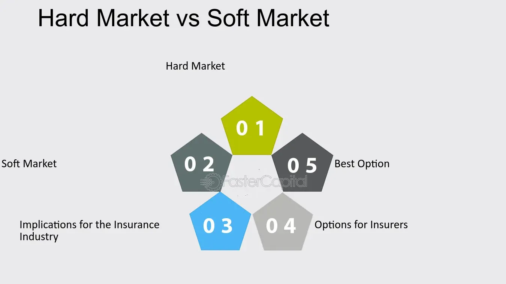

## Table of Contents

## What is a soft market?

A soft market is when there are more people selling something than people wanting to buy it. This can happen in many different areas, like real estate, stocks, or job markets. When there are too many sellers and not enough buyers, the prices for things usually go down. This is because sellers might lower their prices to try and attract buyers.

In a soft market, it can be harder for sellers to make money because they have to compete more. For buyers, it can be a good time because they might find lower prices and more choices. But, a soft market can also make people feel unsure about the future, because it might mean that the economy is not doing well.

## How does a soft market differ from a hard market?

A soft market is when there are more sellers than buyers. This makes prices go down because sellers want to attract buyers. It can be tough for sellers because they have to compete a lot. But it's good for buyers because they can find lower prices and more choices. A soft market can make people feel unsure about the future because it might mean the economy is not doing well.

A hard market is the opposite. It happens when there are more buyers than sellers. This makes prices go up because buyers are competing to buy things. It's good for sellers because they can sell easily and for higher prices. But it's hard for buyers because they have to pay more and might not find what they want. A hard market can make people feel more confident about the economy because it shows that people want to buy things.

These two types of markets show how supply and demand work. When there's a lot of something and not many people want it, you have a soft market. When there's not much of something and a lot of people want it, you have a hard market.

## What are the common causes of a soft market?

A soft market often happens when there are too many things for sale and not enough people wanting to buy them. This can be caused by a slowdown in the economy. When people feel unsure about their jobs or money, they might not want to spend as much. This means fewer buyers in the market, leading to a soft market. Also, if a lot of new products or houses are built all at once, it can make the market soft because there are suddenly too many things for sale.

Another cause of a soft market can be changes in what people want. If people start liking different things, the old things might not sell as well. For example, if everyone starts wanting electric cars instead of gas cars, the market for gas cars can become soft. Also, if interest rates go up, it can make borrowing money more expensive. This can make people less likely to buy big things like houses or cars, leading to a soft market in those areas.

## What industries are most affected by a soft market?

Industries like real estate and construction are often hit hard by a soft market. When people feel unsure about the economy, they might not want to buy new homes or invest in big building projects. This means fewer houses and buildings are sold, and prices can go down. Builders and real estate [agents](/wiki/agents) can have a tough time making money when there are too many homes for sale and not enough buyers.

Another industry that can suffer in a soft market is the car industry. Cars are expensive, and when people are worried about money, they might put off buying a new car. This can lead to a lot of cars sitting on dealership lots without being sold. Car makers and dealers might have to lower prices to try and attract buyers, which can hurt their profits.

The stock market can also be affected by a soft market. When investors think the economy is slowing down, they might sell their stocks to avoid losing money. This can make stock prices go down. Companies that were planning to raise money by selling new stocks might find it harder to do so because investors are less willing to buy.

## How can one identify the onset of a soft market?

You can start to see a soft market when there are more things for sale than people wanting to buy them. This might show up as houses staying on the market longer before they sell, or cars sitting on dealership lots without being sold. In the stock market, you might see stock prices going down because more people are selling than buying. When this happens, it's a sign that the market is becoming soft.

Another way to spot the start of a soft market is by looking at prices. If prices are going down because sellers are trying to attract buyers, it's a clue that the market might be getting soft. Also, if people start talking about the economy slowing down or feeling unsure about their jobs and money, it can lead to a soft market. These signs together can help you see that a soft market might be on its way.

## What are the economic implications of a soft market?

A soft market can slow down the economy because people and businesses feel less sure about spending money. When there are more things for sale than people wanting to buy, prices go down. This can make businesses earn less money, so they might have to cut back on spending or even lay off workers. When people see this happening, they might also spend less because they're worried about their jobs and money. This can lead to a cycle where the economy keeps slowing down because everyone is being careful with their money.

On the other hand, a soft market can also have some good effects. When prices go down, it can be a good time for people who want to buy things like houses or cars because they can find better deals. This can help some people and businesses that were waiting for lower prices to make big purchases. But overall, a soft market can make the economy feel shaky because it shows that people are not as confident about spending money as they used to be.

## How do businesses typically respond to a soft market?

When businesses see a soft market coming, they often start by cutting costs. They might do this by reducing the number of workers they have or by finding cheaper ways to make their products. They might also try to sell things at lower prices to attract more buyers. This can help them keep selling even when there are fewer people wanting to buy.

Some businesses might also try to change what they sell to match what people want more of. If they see that people are buying less of one thing, they might start selling something else that's more popular. This can help them stay in business even when the market is soft. But it can be hard to make these changes quickly, and not all businesses can do it easily.

## What strategies can companies use to survive a soft market?

When a soft market hits, companies often need to find ways to save money. They might start by cutting costs, like letting some workers go or finding cheaper ways to make their products. This helps them keep their business running even when people are not buying as much. Another way to save money is by trying to sell things at lower prices to attract more buyers. This can help them keep selling even when there are fewer people wanting to buy.

Companies might also try to change what they sell to match what people want more of. If they see that people are buying less of one thing, they might start selling something else that's more popular. This can help them stay in business even when the market is soft. But it can be hard to make these changes quickly, and not all businesses can do it easily.

Sometimes, companies might look for new ways to make money, like selling their products in new places or trying to reach new customers. They might also try to work together with other businesses to share costs and find new ways to sell. By being flexible and trying different things, companies can have a better chance of surviving a soft market.

## How does consumer behavior change during a soft market?

When there's a soft market, people often start to spend less money. They might feel unsure about their jobs or the economy, so they decide to save more and buy less. Instead of buying new things, people might try to fix what they already have or wait for prices to go down. They might also look for cheaper options or buy things on sale. This change in spending can make the soft market even worse because businesses sell less and might have to lower prices even more.

But not all changes in consumer behavior are bad. Some people see a soft market as a chance to get good deals. They might buy things they've been wanting for a while because the prices are lower. For example, someone might finally buy a house or a car because it's cheaper than before. So, while many people spend less, some people take advantage of the lower prices to make big purchases they couldn't afford before.

## What role do government policies play in managing a soft market?

Government policies can help manage a soft market by trying to make people feel more confident about spending money. They might do this by lowering interest rates, which makes it cheaper for people to borrow money to buy things like houses or cars. The government might also spend more money on projects like building roads or schools, which can create jobs and help the economy grow. By doing these things, the government hopes to get more people buying and selling, which can help turn a soft market into a stronger one.

Another way the government can help is by giving money directly to people or businesses that are struggling. They might offer tax breaks or send out checks to help people pay their bills. This extra money can make people feel less worried about their finances and more likely to spend. By supporting people and businesses, the government can help stop a soft market from getting worse and maybe even help the economy start to recover.

## How can investors take advantage of opportunities in a soft market?

Investors can take advantage of a soft market by buying things when prices are low. When there are more sellers than buyers, prices drop, and this can be a good time to buy stocks, real estate, or other investments at a discount. If investors believe the market will get better in the future, they can buy things now and sell them later for a profit. This strategy is called "buying the dip," and it can be a smart way to make money if the market turns around.

Another way investors can benefit from a soft market is by looking for companies that are strong enough to survive tough times. Some businesses might be cutting costs and finding new ways to make money, which can make them good investments. Investors can look for these companies and buy their stocks while they are cheap. If these companies do well when the market gets better, the investors can make a lot of money. By being careful and doing their research, investors can find great opportunities even when the market is soft.

## What are the long-term effects of prolonged soft market conditions on an economy?

If a soft market lasts a long time, it can slow down the whole economy. When people and businesses don't spend much money, it can lead to fewer jobs and lower incomes. Companies might have to lay off workers or close down because they're not making enough money. This can make people feel even more unsure about their jobs and money, so they keep spending less. It's like a cycle that keeps going, making the economy weaker and weaker. Over time, this can lead to bigger problems like a recession, where the economy shrinks instead of growing.

But a long soft market can also lead to some changes that might help in the future. For example, businesses might find new ways to save money or make new products that people want. This can make them stronger and ready for when the market gets better. Also, if prices stay low for a long time, it can help people who were waiting to buy big things like houses or cars. When the market starts to get better, these people can start spending more, which can help the economy start growing again. So while a long soft market can be tough, it can also set the stage for a stronger recovery later on.

## References & Further Reading

[1]: Bergstra, J., Bardenet, R., Bengio, Y., & Kégl, B. (2011). ["Algorithms for Hyper-Parameter Optimization."](https://dl.acm.org/doi/10.5555/2986459.2986743) Advances in Neural Information Processing Systems 24.

[2]: ["Advances in Financial Machine Learning"](https://www.amazon.com/Advances-Financial-Machine-Learning-Marcos/dp/1119482089) by Marcos Lopez de Prado

[3]: ["Evidence-Based Technical Analysis: Applying the Scientific Method and Statistical Inference to Trading Signals"](https://www.amazon.com/Evidence-Based-Technical-Analysis-Scientific-Statistical/dp/0470008741) by David Aronson

[4]: ["Machine Learning for Algorithmic Trading"](https://github.com/stefan-jansen/machine-learning-for-trading) by Stefan Jansen

[5]: ["Quantitative Trading: How to Build Your Own Algorithmic Trading Business"](https://www.amazon.com/Quantitative-Trading-Build-Algorithmic-Business/dp/1119800064) by Ernest P. Chan