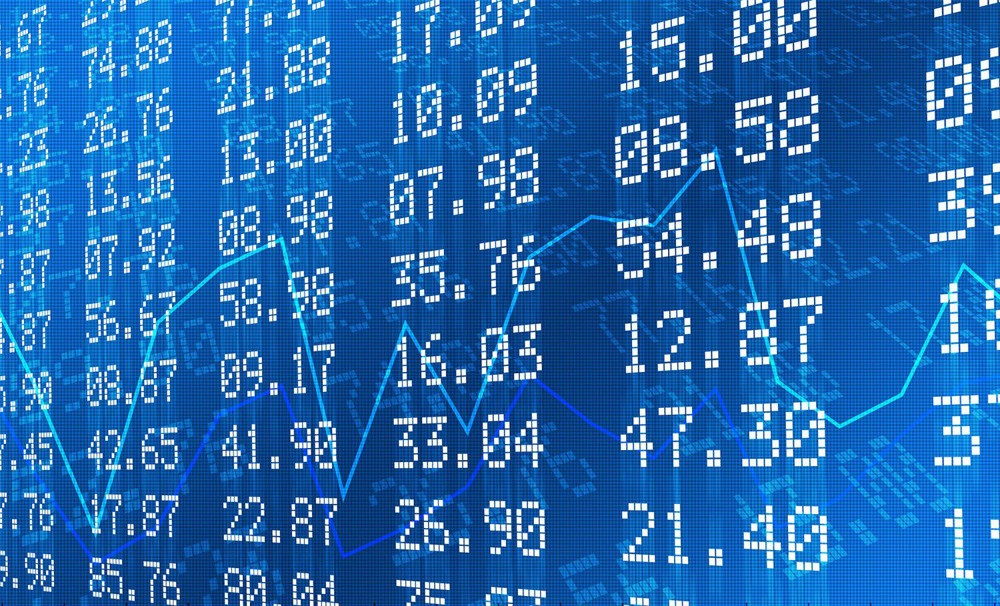

The intersection between campaign finance and modern financial technologies is transforming the landscape of political funding and democratic processes. Political funding mechanisms have evolved significantly over time, with traditional methods now coexisting alongside innovative financial technologies. Initially, political campaigns relied heavily on direct contributions from individuals and interest groups. Over time, mechanisms such as Political Action Committees (PACs) and Super PACs emerged, facilitating larger flows of money into the political system.

One critical aspect of campaign finance is the distinction between hard money and soft money. Hard money refers to contributions that are regulated and subject to limits, typically used directly by candidates for electoral activities. In contrast, soft money consists of unregulated funds raised by political parties for purposes like get-out-the-vote efforts and generic party advertising. Despite its strategic uses, soft money raises concerns about transparency and undue influence on political processes, as it can circumvent the limitations imposed on direct campaign contributions.

Algorithmic trading, a modern financial technology, involves the use of computer algorithms to automate trading decisions in financial markets. This technology is relevant to campaign finance strategies due to its ability to efficiently manage large volumes of transactions, rapidly execute trades, and potentially leverage market movements for political ends. The agility and precision offered by algorithmic trading can influence funding strategies by optimizing resource allocation and minimizing financial risks.

Understanding the intersection of these elements is crucial for shaping democratic processes. As financial technologies continue to advance, they present both opportunities and challenges for political funding. The integration of sophisticated trading systems into campaign finance could redefine traditional funding structures, emphasizing the need for regulatory measures that ensure transparency and accountability. Moreover, the ethical implications of employing technology in political contexts necessitate ongoing scrutiny and dialogue. This understanding is key to fostering a balanced political environment where innovation supports democratic ideals without compromising electoral integrity.

## Table of Contents

## Understanding Campaign Finance

Campaign finance refers to the methods by which political campaigns are funded. It is a critical aspect of electoral politics, allowing candidates to communicate their messages to the electorate. Within this system, two primary types of contributions exist: hard money and soft money.

Hard money refers to funds that are contributed directly to a political candidate's campaign and are subject to strict regulations and limits set by law. These contributions are reported to the Federal Election Commission (FEC) and are subject to contribution limits to prevent undue influence over elected officials. For instance, individuals can donate a finite amount directly to a candidate per election cycle.

Soft money, on the other hand, represents unregulated contributions used for party-building activities, rather than directly supporting a candidate’s campaign. This type of funding emerged as a contentious issue because it could be used indirectly to influence elections without the same limitations as hard money. Soft money contributions are typically funneled through party committees for activities such as voter registration drives and general party advertising.

The regulatory framework surrounding campaign finance in the United States has evolved significantly over time, particularly through landmark legislative acts. The Federal Election Campaign Act (FECA), enacted in 1971 and amended in 1974, was one of the first comprehensive efforts to regulate campaign finance. It established the FEC and introduced disclosure requirements for campaign contributions, as well as limits on contributions and expenditures.

The Bipartisan Campaign Reform Act (BCRA) of 2002, often referred to as the McCain-Feingold Act, sought to address issues arising from soft money by banning national political party committees from accepting or spending soft money. This act also introduced regulations on electioneering communications, which include broadcast ads referencing candidates close to elections.

Political Action Committees (PACs) and Super PACs play significant roles in campaign finance. PACs are organizations that raise and spend money to elect or defeat candidates, subject to contribution limits. In contrast, Super PACs, which emerged following the Supreme Court’s Citizens United v. FEC decision in 2010, can raise unlimited amounts of money from corporations, unions, associations, and individuals. Super PACs must operate independently from candidate campaigns and cannot donate directly to candidates.

These bodies have significantly influenced modern campaign finance by enabling large amounts of money to flow into the political process, often outside the scope of traditional financial regulations. Understanding these elements highlights the ongoing debate surrounding transparency, influence, and the balance of power in democratic processes.

## Soft Money in Political Campaigns

Soft money, a term entrenched in the political lexicon of the United States, refers to funds raised by political parties in a manner uninhibited by federal limits. Unlike hard money, which is subject to strict contribution caps and regulatory scrutiny, soft money can be utilized for party-building activities, such as voter registration drives and generic party advertising, rather than for advocating for specific candidates in federal elections. Despite its intended purpose, soft money has been a pivotal tool for exerting influence and shaping election results, often sparking debates over its impact and regulation.

**Raising and Spending Soft Money**

Political parties and organizations raise soft money primarily through donations from corporations, unions, and wealthy individuals. These resources are allocated to activities that indirectly support candidates, allowing parties to skirt the legal constraints imposed on direct candidate funding. The funds can be directed towards logistical campaigns, grassroots mobilization, and issue advocacy that aligns with the party's platform without explicitly calling for a candidate's election or defeat. This approach enables an extensive reach in electoral campaigns, bolstering party influence across different states and demographics.

**Impact on Political Influence and Election Outcomes**

The infusion of soft money into political campaigns has significantly amplified party influence over the electoral process. It helps consolidate political power, often resulting in the election of candidates who support the contributors' agendas. This financial dynamism allows parties to craft comprehensive strategies that can sway public opinion and voter turnout, subtly impacting election outcomes. However, critics argue that it creates an uneven playing field where wealthier entities have more significant sway over political decisions and public policy.

**Trends in Soft Money Post-Citizens United v. FEC**

The landmark Supreme Court decision in Citizens United v. FEC (2010) drastically altered the landscape of campaign finance by lifting restrictions on independent expenditures by corporations and unions. Post-decision, there has been a marked increase in soft money flows directed towards Super PACs, entities that can raise and spend unlimited sums independently of candidate campaigns. This change has led to unprecedented levels of spending in American elections, magnifying the role of soft money in influencing political discourse and outcomes.

**Challenges in Regulating Soft Money**

Regulating soft money presents numerous challenges, primarily due to its indirect correlation with candidate campaigns and its utilization for broad party activities. Efforts to increase transparency, such as the Bipartisan Campaign Reform Act (2002), aimed to close soft money loopholes by banning its use for federal elections. However, political entities often find ways to navigate these limitations, utilizing sophisticated financial and legal mechanisms to continue raising and deploying soft money effectively. The lack of transparency and regulatory evasions contribute to public mistrust in the political funding system.

**Case Studies of Significant Campaigns Influenced by Soft Money**

Numerous campaigns have demonstrated the formidable impact of soft money, showcasing its capacity to steer election outcomes. For instance, the 2000 U.S. presidential election underscored the influence of soft money, with significant party spending on issue advocacy that indirectly supported candidates. Similarly, the elections following the Citizens United decision have witnessed unprecedented spending levels by Super PACs, significantly shaped by soft money contributions from wealthy donors and corporate entities. These campaigns highlight the enduring significance of soft money in U.S. politics and the ongoing struggle for transparency and fair competition.

In conclusion, soft money continues to be a powerful and contentious component of political campaigns, raising crucial questions about influence, democracy, and equitable electoral processes. To address these challenges, ongoing regulatory efforts and public discourse are essential in crafting a transparent and balanced political finance landscape.

## The Rise of Algorithmic Trading

Algorithmic trading, often referred to as algo trading or automated trading, has significantly transformed the financial landscape by leveraging computer algorithms to execute trades at speeds and frequencies beyond human capabilities. This type of trading utilizes complex mathematical models and high-speed, automated decision-making systems to determine the timing, price, or quantity of a trade, often relying on pre-set rules or instructions. Algorithmic trading is a method that enables traders to capitalize on market inefficiencies with precision and efficiency, and it has grown rapidly since its inception.

### Key Technologies and Strategies

Algorithmic trading relies heavily on technologies such as high-frequency trading ([HFT](/wiki/high-frequency-trading-strategies)), statistical [arbitrage](/wiki/arbitrage), and [machine learning](/wiki/machine-learning). High-frequency trading, a subset of [algorithmic trading](/wiki/algorithmic-trading), involves executing a large number of orders at extremely high speeds, using advanced communication networks and powerful computer systems. Statistical arbitrage uses statistical methods to exploit price differences between different markets or instruments, aiming to achieve risk-free profits. Machine learning models, including neural networks and natural language processing, are increasingly used to identify patterns and make predictions based on historical and real-time market data.

Moreover, strategies such as [market making](/wiki/market-making), [trend following](/wiki/trend-following), and mean reversion are commonly employed in algorithmic trading. Market making aims to provide [liquidity](/wiki/liquidity-risk-premium) by consistently buying and selling securities, thereby capturing the spread. Trend-following strategies attempt to capitalize on market [momentum](/wiki/momentum), while mean reversion assumes that prices will revert to their historical averages over time.

### Advantages: Speed and Efficiency

The principal advantages of algorithmic trading are speed and efficiency. Trades are executed in fractions of a second, allowing traders to benefit from tiny price fluctuations that would be imperceptible to human traders. This capability not only increases the opportunity for profit but also reduces transaction costs and minimizes the market impact of large orders. Additionally, algorithms can scrutinize a vast array of market indicators and data feeds simultaneously, making decisions based on comprehensive information that far exceeds human processing capacity.

### Potential Risks and Ethical Considerations

Despite its advantages, algorithmic trading also presents several risks and ethical concerns. The complexity of algorithms and the opacity of automated processes can lead to unintended consequences, such as the infamous "flash crash" of May 6, 2010, when the Dow Jones Industrial Average plummeted and rebounded within minutes due to algorithmic trades. There is also the potential for market manipulation, as sophisticated algorithms can inadvertently or deliberately alter market dynamics. Ethical considerations include the potential for creating unfair trading advantages and the broader impact on market stability and fairness.

### Regulatory Responses and Frameworks

In response to the unique challenges posed by algorithmic trading, regulatory bodies have instituted various measures to ensure market integrity and fairness. For instance, the U.S. Securities and Exchange Commission (SEC) and the Commodity Futures Trading Commission (CFTC) have enacted regulations to increase transparency and accountability, such as the requirement for broker-dealers to ensure the effectiveness of their algorithms. Additionally, circuit breakers and limit-up/limit-down mechanisms are implemented to prevent extreme [volatility](/wiki/volatility-trading-strategies) caused by erratic trading activities.

Globally, financial authorities have been working to develop standards and frameworks to manage the impact of algorithmic trading on financial markets. These efforts aim to strike a balance between fostering innovation in trading technologies and safeguarding the principles of market efficiency, fairness, and transparency.

## Integrating Algorithmic Trading with Political Funding

Integrating algorithmic trading with political funding represents an innovative intersection of financial technology and political finance, with potentially transformative implications for how campaigns are funded. Algorithmic trading, which utilizes complex mathematical models and computer programs to execute trades at high speed, could significantly impact political funding mechanisms in various ways.

### Potential Benefits and Challenges

Algorithmic trading offers potential benefits for political funding by improving the efficiency and speed of raising and managing funds. Campaigns could leverage these technologies to optimize their financial strategies, reallocate resources quickly in response to market movements, and potentially predict funding shortages or surpluses. By enabling more precise asset management, campaigns might reduce wasteful spending and better target their financial efforts.

However, the integration of algorithmic trading in political funding also presents several challenges. The complexity and opacity of algorithmic systems might lead to a lack of transparency in how funds are managed and distributed. Moreover, the volatility inherent in high-frequency trading could introduce financial unpredictability, making campaigns vulnerable to sudden economic changes. Campaigns must ensure they retain control over these technologies to avoid potential misuse or unintended consequences.

### Emerging Market Products

Emerging products related to political event-driven trading are also gaining attention. These financial instruments allow traders to speculate on the outcomes of political events, such as elections, policy changes, or international agreements. By tapping into political event-driven markets, campaigns could potentially hedge against financial risks associated with political volatility or use insights derived from these markets to inform their strategies.

### Regulatory and Ethical Concerns

The use of algorithmic trading for political funding raises significant regulatory and ethical concerns. Regulators must address issues related to market manipulation, transparency, and the potential for conflicts of interest. There is a pressing need to develop regulations that balance technological innovation with the integrity of the political process. Ethical considerations also include ensuring that the use of such technologies does not lead to disproportionate influence or undermine democratic principles.

### Predictions for Future Developments

In predicting future developments, integration between algorithmic trading and political funding is likely to grow, driven by advancements in [artificial intelligence](/wiki/ai-artificial-intelligence) and data analytics. Future systems may become more adept at identifying patterns in political donations and campaign expenditures, leading to even more refined financial strategies. However, this trajectory must be accompanied by robust regulatory frameworks and ethical guidelines to ensure these innovations contribute positively to political processes.

As political campaigns consider the potential of algorithmic trading, it's paramount that they do so with careful consideration of the associated risks and opportunities. Both technological advancement and regulatory oversight will play crucial roles in shaping the future of campaign finance in this rapidly converging field.

## Ethical and Regulatory Implications

The integration of technology into politics raises substantial ethical and regulatory concerns, particularly as it pertains to transparency and accountability in modern campaign finance. The increasing use of advanced algorithms and digital platforms in political funding necessitates a reevaluation of existing frameworks to ensure fair and democratic processes.

Transparency is a cornerstone of democratic elections, yet technological advancements, such as algorithmic trading, can obscure the flow of campaign funds, making it difficult for regulators and the public to trace the origins and uses of these funds. The opacity inherent in complex financial technologies poses a significant challenge to maintaining accountability. For instance, algorithmic trading can be used to rapidly move large sums of money across financial markets, potentially influencing campaign funding with minimal transparency. This situation calls for robust regulatory measures to ensure that the speed and complexity of financial transfers do not undermine public trust in electoral processes.

To balance technological innovation with fair elections, it is crucial to establish regulatory frameworks that can adapt to rapid technological changes. This requires a two-fold approach: firstly, enhancing the capabilities of regulatory bodies to monitor and analyze complex financial transactions effectively; secondly, implementing stricter disclosure requirements for political contributions that involve advanced financial technologies. For example, mandating real-time reporting of campaign donations facilitated through algorithmic means could improve transparency.

Globally, there is a varied landscape concerning the regulation of political funding and algorithmic trading. In the United States, landmark decisions such as Citizens United v. FEC have significantly altered the political funding landscape, allowing for increased involvement of corporate and union capital in elections. In contrast, the European Union tends to adopt stricter regulatory measures to limit the influence of money in politics, emphasizing transparency and accountability. These differences highlight the need for international cooperation and the potential for global standards that address both technological advancements and democratic principles.

Calls for reform in campaign finance systems are growing louder as the intersection of technology and politics becomes more pronounced. To safeguard democratic integrity, there is a need for comprehensive reforms that not only enhance transparency but also incorporate emerging technologies in a way that supports fair election processes. This includes enacting policies that regulate the influence of algorithmic trading on political funding and ensuring that technological innovations do not compromise the equity of electoral competition.

In conclusion, addressing the ethical and regulatory implications of using technology in politics is essential for sustaining democratic values. By enhancing transparency, accountability, and regulatory adaptability, societies can better manage the complexities introduced by modern financial and technological innovations in campaign finance.

## Conclusion

In conclusion, the intricate dynamics of campaign finance, particularly the role of soft money, and the rise of algorithmic trading stand as pivotal elements reshaping modern political and financial landscapes. Understanding these components is crucial for grasping their deep-seated implications on democratic processes and electoral integrity. Soft money, with its indirect influence and lesser regulatory oversight, poses nuanced challenges in maintaining transparency and fairness in political funding. Simultaneously, algorithmic trading brings forth a new dimension to financial strategies, emphasizing speed, efficiency, and potentially influencing funding flows in political contexts.

The path forward necessitates an equitable balance between leveraging technological advancements and ensuring robust regulatory mechanisms to foster transparency and accountability in political campaigns. As these technologies evolve, so must our approaches to governance, aiming to curtail excesses and reinforce democratic ideals.

Looking ahead, the intersection of technology and politics invites reflection on the future trajectory of democracy. Innovations such as algorithmic trading hold transformative potential, yet they also pose ethical and regulatory dilemmas that require vigilant oversight. The critical task lies in crafting policies that accommodate technological growth while safeguarding electoral fairness and equity.

Therefore, it becomes imperative to encourage further research and dialogue to navigate this evolving field effectively. As we continue to explore and understand these intersecting domains, informed discourse and comprehensive studies will serve as invaluable tools in shaping a transparent, fair, and technologically integrated political landscape.

## References & Further Reading

[1]: Corrado, A., & Bradford, S. (2004). ["The New Soft Money: Outside Spending in Congressional Elections."](https://www.brennancenter.org/our-work/analysis-opinion/fact-finding-new-soft-money) Stanford University Press.

[2]: Magleby, D. B., & Patterson, K. D. (2013). ["The Battle for Congress: Consultants, Candidates, and Voters."](https://books.google.com/books/about/Battle_for_Congress.html?id=I2UeCwAAQBAJ) University of Washington Press.

[3]: Lopez de Prado, M. (2018). ["Advances in Financial Machine Learning."](https://www.amazon.com/Advances-Financial-Machine-Learning-Marcos/dp/1119482089) Wiley.

[4]: Johnson, B. (2010). ["Algorithmic Trading & DMA: An Introduction to Direct Access Trading Strategies."](https://archive.org/details/algorithmictradi0000john) 4Myeloma Press.

[5]: Patterson, S. (2012). ["Dark Pools: The Rise of the Machine Traders and the Rigging of the U.S. Stock Market."](https://www.amazon.com/Dark-Pools-Machine-Traders-Rigging/dp/0307887189) Crown Business.

[6]: Federal Election Commission. (n.d.). ["Campaign finance law quick reference for reporters."](https://ballotpedia.org/Federal_Election_Commission_v._Wisconsin_Right_to_Life,_Inc.) FEC.gov.

[7]: U.S. Securities and Exchange Commission (SEC). (2014). ["Equity Market Structure Literature Review Part II: High Frequency Trading."](https://www.sec.gov/marketstructure/research/hft_lit_review_march_2014.pdf) SEC.gov.

[8]: Citizens United v. Federal Election Comm'n, 558 U.S. 310 (2010). ["Supreme Court Decision."](https://supreme.justia.com/cases/federal/us/558/310/)

[9]: A Guide to the Federal Election Commission (FEC). (n.d.). ["Soft Money."](https://www.fec.gov/resources/cms-content/documents/policy-guidance/partygui.pdf) FEC.gov.