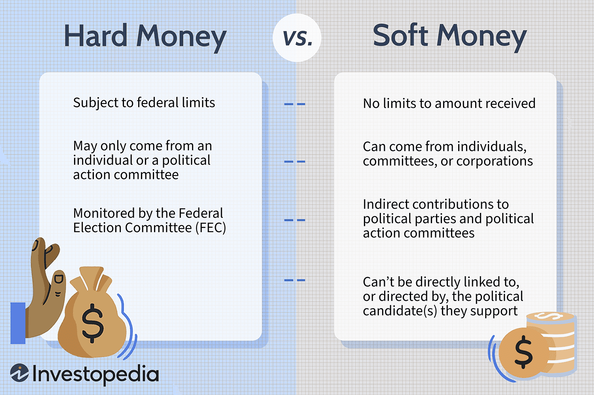

## Table of Contents

## What is soft money?

Soft money refers to funds that are given to political parties for activities that are not directly related to supporting a specific candidate in an election. This can include things like voter registration drives, get-out-the-vote efforts, and general party building. Unlike hard money, which is strictly regulated and can only be used to support specific candidates, soft money has fewer restrictions on how it can be spent.

Before 2002, soft money was often used by political parties to influence elections indirectly. However, the Bipartisan Campaign Reform Act (BCRA) of 2002, also known as the McCain-Feingold Act, banned the use of soft money for federal elections. This law aimed to reduce the influence of large donations from wealthy individuals and organizations on political campaigns. Despite this ban, soft money continues to play a role in state and local elections where regulations may be less strict.

## How does soft money differ from hard money?

Soft money and hard money are two types of money used in politics. Soft money is money given to political parties for things that don't directly help a specific candidate win an election. This can be things like helping more people register to vote or encouraging people to go vote. Soft money has fewer rules about how it can be spent, so it's more flexible. Before 2002, soft money was used a lot, but then a law called the Bipartisan Campaign Reform Act stopped it from being used in federal elections. However, it can still be used in some state and local elections.

Hard money, on the other hand, is money that is given directly to a specific candidate's campaign. It can only be used to help that candidate win their election. There are strict rules about how much hard money someone can give and how it can be spent. These rules are in place to make sure that no one person or group can have too much influence over who wins an election. The Bipartisan Campaign Reform Act made these rules even stricter, trying to make elections fairer.

## What are the primary functions of soft money?

Soft money is money given to political parties for activities that don't directly help a specific candidate win an election. It is used for things like helping more people register to vote, encouraging people to go vote, and building up the party's overall strength. These activities are important because they help the party grow and stay strong, even if they don't directly help one person win an election.

Before 2002, soft money was used a lot in federal elections, but then a law called the Bipartisan Campaign Reform Act changed things. This law said that soft money couldn't be used in federal elections anymore. However, soft money can still be used in some state and local elections, where the rules might not be as strict. This means that even though the rules have changed, soft money still plays a role in politics.

## Can you provide examples of soft money?

Soft money is money given to political parties for things that don't directly help a specific candidate win an election. For example, a big company might give money to a political party to help them run ads that encourage people to register to vote. These ads don't tell people to vote for a certain person, so they are allowed under the rules for soft money.

Another example of soft money is when a wealthy person gives money to a political party to help them organize events that get more people excited about the party. These events might include speeches, rallies, or other activities that make the party stronger overall. Even though this money doesn't go directly to a candidate, it helps the party in the long run.

## What is the historical origin of soft money?

Soft money started to become important in the United States during the 1970s. Before then, money in politics was mostly about helping specific candidates win elections. But then, the Federal Election Campaign Act (FECA) of 1971 and its amendments in 1974 set strict rules on how much money people could give directly to candidates. These rules were meant to make elections fairer by limiting the influence of big donors. However, these new rules had a loophole: they didn't limit how much money could be given to political parties for activities that didn't directly help a candidate. This is where soft money came in.

Political parties started using soft money for things like voter registration drives and get-out-the-vote efforts. These activities helped the parties grow stronger without breaking the new rules. Soft money became a big part of political funding, especially in the 1980s and 1990s. But people started to worry that soft money was letting big donors have too much influence over politics. This led to the Bipartisan Campaign Reform Act (BCRA) of 2002, which banned the use of soft money in federal elections. Even though the rules changed, soft money still plays a role in state and local elections where the rules might not be as strict.

## How has the regulation of soft money evolved over time?

The regulation of soft money has changed a lot over time. It started becoming important in the 1970s when new laws set strict rules on how much money people could give directly to candidates. These laws, called the Federal Election Campaign Act (FECA) of 1971 and its amendments in 1974, were meant to make elections fairer. But they had a loophole: they didn't limit how much money could be given to political parties for activities that didn't directly help a candidate. This is how soft money became a big part of political funding.

As time went on, people started to worry that soft money was letting big donors have too much influence over politics. This led to the Bipartisan Campaign Reform Act (BCRA) of 2002, also known as the McCain-Feingold Act. This law banned the use of soft money in federal elections, trying to reduce the power of big donations. Even though the rules changed, soft money still plays a role in state and local elections where the rules might not be as strict.

## What impact does soft money have on political campaigns?

Soft money can have a big impact on political campaigns, even though it's not supposed to be used to help a specific candidate win an election. Political parties use soft money for things like helping more people register to vote and encouraging people to go vote. These activities can make a big difference in an election because they help the party get more support. For example, if a party uses soft money to run ads that encourage people to vote, more of their supporters might show up at the polls, which can help their candidates win.

Even though the Bipartisan Campaign Reform Act of 2002 banned soft money in federal elections, it can still be used in state and local elections. This means that soft money can still play a role in shaping who wins those elections. For example, a big company might give soft money to a political party to help them run ads that get more people excited about the party. This can help the party's candidates in state and local races, even if the money isn't given directly to the candidates themselves.

## What are the arguments for and against the use of soft money?

People who support soft money say it helps political parties do important things like getting more people to register to vote and encouraging people to go vote. They think this makes democracy stronger because more people get involved. They also say that soft money lets parties do things that help them grow and stay strong, even if it doesn't help one person win an election. They believe that as long as there are rules to make sure soft money isn't used to help specific candidates, it can be good for politics.

On the other hand, people who are against soft money worry that it lets big donors have too much power over politics. They think that even though soft money isn't supposed to help specific candidates, it can still influence elections in big ways. For example, if a company gives a lot of soft money to a party, it might expect the party to support its interests. Critics also say that soft money can make it harder for regular people to have a say in politics because big donors can give so much more money. They believe that banning soft money, like what happened with the Bipartisan Campaign Reform Act, makes elections fairer.

## How do different countries regulate soft money?

Different countries have different rules about soft money. In the United States, soft money was banned from federal elections in 2002 with the Bipartisan Campaign Reform Act. This law was made to stop big donors from having too much power over politics. But soft money can still be used in some state and local elections where the rules might not be as strict. In Canada, there are also strict rules about political donations, including soft money. The Canada Elections Act limits how much money people and groups can give to political parties and candidates, and it also has rules about how that money can be spent.

In the United Kingdom, political parties can get soft money through things like membership fees and donations that are not for specific candidates. But there are still rules about how much money can be given and how it can be used. The Electoral Commission in the UK makes sure these rules are followed. In Germany, political parties can also get soft money, but there are limits on how much money can be given to them. The German Federal Constitutional Court has said that political parties need money to do their work, but there should be rules to make sure the money doesn't give too much power to big donors.

## What are the current trends in soft money usage?

Soft money is still used a lot in politics, even though there are more rules about it now. In the United States, soft money can't be used in federal elections anymore because of a law called the Bipartisan Campaign Reform Act. But it can still be used in some state and local elections. This means that big donors can still give a lot of money to political parties to help them with things like getting more people to register to vote or encouraging people to go vote. These activities can make a big difference in elections because they help the party get more support.

In other countries, the rules about soft money are different. In Canada, there are strict rules about how much money people and groups can give to political parties and candidates. The same goes for the United Kingdom, where political parties can get soft money through things like membership fees and donations that are not for specific candidates. In Germany, political parties can also get soft money, but there are limits on how much money can be given to them. Overall, the trend is that countries are trying to make rules to stop big donors from having too much power over politics, but soft money is still an important part of how political parties get the money they need to do their work.

## What are the potential future implications of soft money on political systems?

Soft money could change how political systems work in the future. Even though there are more rules about it now, soft money can still be used in some places to help political parties do things like getting more people to vote. This can make a big difference in elections because it helps the party get more support. If rules about soft money stay the same or get weaker, big donors might still have a lot of power over politics. This could make it harder for regular people to have a say in who wins elections.

On the other hand, if more countries make strict rules about soft money, it might make elections fairer. These rules could stop big donors from giving too much money to political parties, which means the parties would have to find other ways to get the money they need. This could make political parties focus more on what regular people want instead of what big donors want. But it's hard to know for sure what will happen because the rules about soft money can change over time.

## How can one track and analyze the flow of soft money in elections?

To track and analyze the flow of soft money in elections, you can start by looking at reports from election commissions or similar government agencies. These reports show how much money political parties get and where it comes from. For example, in the United States, the Federal Election Commission (FEC) keeps records of soft money donations to political parties. You can visit their website to see these records. In other countries, like Canada or the United Kingdom, you can find similar information from their election commissions. By looking at these reports, you can see which groups or people are giving a lot of soft money and how the political parties are using it.

Once you have the data, you can use it to understand how soft money affects elections. You might notice that certain donors give a lot of money to one political party, which could mean they want to influence that party's actions. You can also see if the soft money is being used for things like voter registration drives or get-out-the-vote efforts. By comparing this information over time, you can see if the amount of soft money is going up or down and how the rules about it are changing. This can help you understand how soft money might be making elections fairer or less fair.

## References & Further Reading

[1]: Corrado, A., & Bradford, S. (2004). ["The New Soft Money: Outside Spending in Congressional Elections."](https://www.brennancenter.org/our-work/analysis-opinion/fact-finding-new-soft-money) Stanford University Press.

[2]: Magleby, D. B., & Patterson, K. D. (2013). ["The Battle for Congress: Consultants, Candidates, and Voters."](https://books.google.com/books/about/Battle_for_Congress.html?id=I2UeCwAAQBAJ) University of Washington Press.

[3]: Lopez de Prado, M. (2018). ["Advances in Financial Machine Learning."](https://www.amazon.com/Advances-Financial-Machine-Learning-Marcos/dp/1119482089) Wiley.

[4]: Johnson, B. (2010). ["Algorithmic Trading & DMA: An Introduction to Direct Access Trading Strategies."](https://archive.org/details/algorithmictradi0000john) 4Myeloma Press.

[5]: Patterson, S. (2012). ["Dark Pools: The Rise of the Machine Traders and the Rigging of the U.S. Stock Market."](https://www.amazon.com/Dark-Pools-Machine-Traders-Rigging/dp/0307887189) Crown Business.

[6]: Federal Election Commission. (n.d.). ["Campaign finance law quick reference for reporters."](https://ballotpedia.org/Federal_Election_Commission_v._Wisconsin_Right_to_Life,_Inc.) FEC.gov.

[7]: U.S. Securities and Exchange Commission (SEC). (2014). ["Equity Market Structure Literature Review Part II: High Frequency Trading."](https://www.sec.gov/marketstructure/research/hft_lit_review_march_2014.pdf) SEC.gov.

[8]: Citizens United v. Federal Election Comm'n, 558 U.S. 310 (2010). ["Supreme Court Decision."](https://supreme.justia.com/cases/federal/us/558/310/)

[9]: A Guide to the Federal Election Commission (FEC). (n.d.). ["Soft Money."](https://www.fec.gov/resources/cms-content/documents/policy-guidance/partygui.pdf) FEC.gov.