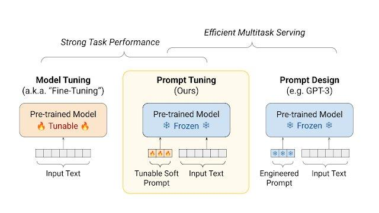

## Table of Contents

## What is Soft Prompt Tuning in machine learning?

Soft Prompt Tuning is a method used in machine learning to improve how models understand and process language. Instead of changing the whole model, which can be very time-consuming and resource-heavy, soft prompt tuning focuses on adjusting small parts of the input, called prompts. These prompts help guide the model to give better answers without needing to retrain the entire model from scratch. This makes it easier and faster to adapt a model to new tasks or to improve its performance on existing ones.

In soft prompt tuning, the prompts are not fixed words or phrases but are represented as vectors that can be fine-tuned. These vectors are added to the input before it goes into the model. By adjusting these vectors, the model can be gently nudged to perform better on specific tasks. For example, if you want a model to be better at answering questions about history, you can tune the prompts to focus more on historical context. This method is especially useful because it requires fewer computational resources compared to full model retraining, making it a practical choice for many applications.

## How does Soft Prompt Tuning differ from traditional fine-tuning methods?

Soft Prompt Tuning and traditional fine-tuning methods both aim to improve a model's performance, but they do so in different ways. Traditional fine-tuning involves adjusting all the parameters of a pre-trained model to better fit a new task. This means changing the weights and biases of the entire neural network, which can be very time-consuming and requires a lot of computational power. On the other hand, Soft Prompt Tuning focuses on modifying only a small part of the input, known as the prompt, without changing the main model. This makes it much quicker and less resource-intensive.

In Soft Prompt Tuning, the prompts are represented as vectors that can be fine-tuned to guide the model's responses. These vectors are added to the input before it enters the model, and by adjusting them, the model can be directed to perform better on specific tasks. For example, if you want the model to be better at answering questions about science, you can tune the prompts to focus more on scientific context. This method is particularly useful because it allows for quick adaptation to new tasks without the need for extensive retraining, making it a more efficient approach compared to traditional fine-tuning where the entire model is retrained.

## What are the main advantages of using Soft Prompt Tuning?

Soft Prompt Tuning offers several key advantages over traditional fine-tuning methods. One major benefit is that it requires less computational power. Instead of retraining the entire model, which can take a lot of time and resources, Soft Prompt Tuning only adjusts small parts of the input. This makes it much faster and more efficient, especially for people who don't have access to powerful computers.

Another advantage is that Soft Prompt Tuning allows for quick adaptation to new tasks. Since you're only changing the prompts and not the whole model, you can easily switch between different tasks without starting from scratch. This flexibility is really helpful in situations where you need to use the model for different purposes or when you want to improve its performance on specific types of questions or topics.

## Can you explain the process of implementing Soft Prompt Tuning?

Implementing Soft Prompt Tuning involves a few key steps. First, you need to start with a pre-trained model that you want to improve. Instead of changing the whole model, you focus on the input. You add a special part to the input called a "prompt," which is represented as a vector. This vector can be adjusted to guide the model's responses. You initialize these prompt vectors randomly or with some pre-defined values, and then you start the tuning process.

During the tuning process, you feed your data into the model along with the prompt vectors. As the model processes the data, you adjust the prompt vectors to minimize the error in the model's output. This is done using an optimization algorithm, like gradient descent, which updates the prompt vectors to improve the model's performance on your specific task. You keep doing this until the model's performance is good enough or until you reach a set number of iterations. This way, you can fine-tune the model to be better at certain tasks without changing the main part of the model.

For example, if you want to use a language model to answer questions about cooking, you would adjust the prompt vectors to focus more on culinary terms and concepts. You might start with a simple prompt vector and then use a code block to show how you update it during the tuning process:

```python
import torch

# Initialize the prompt vector
prompt_vector = torch.randn(1, model.config.hidden_size, requires_grad=True)

# During training
for batch in dataloader:
    input_ids, labels = batch
    inputs = torch.cat([prompt_vector.expand(input_ids.size(0), -1, -1), input_ids], dim=1)
    outputs = model(inputs, labels=labels)
    loss = outputs.loss
    loss.backward()
    optimizer.step()
    optimizer.zero_grad()
```

This code shows how you can integrate the prompt vector into the input and update it using backpropagation to minimize the loss.

## What types of models are most suitable for Soft Prompt Tuning?

Soft Prompt Tuning works best with large language models, like those used for understanding and generating text. These models have many parameters, which can make traditional fine-tuning very slow and expensive. By focusing on adjusting the input prompts instead of the whole model, Soft Prompt Tuning makes it much easier to improve these big models for specific tasks without needing a lot of time or computer power.

For example, models like BERT, RoBERTa, and GPT are good candidates for Soft Prompt Tuning. These models are pre-trained on huge amounts of text data, so they have a broad understanding of language. By tweaking the prompts, you can guide these models to perform better on tasks like answering questions, summarizing text, or even translating languages, without changing the core of the model. This makes Soft Prompt Tuning a practical choice for adapting these powerful models to new uses quickly and efficiently.

## How does Soft Prompt Tuning affect the performance of language models?

Soft Prompt Tuning helps language models work better by focusing on changing small parts of the input instead of the whole model. This means the model can learn new things faster and with less computer power. For example, if you want the model to be good at answering questions about animals, you can adjust the prompts to focus more on animal-related words and ideas. This way, the model gets better at understanding and answering questions about animals without needing to change everything about how it works.

The performance improvement from Soft Prompt Tuning can be seen in how well the model does on specific tasks. By tweaking the prompts, the model can give more accurate and relevant answers. This method is especially useful for big language models like BERT or GPT, where changing the whole model would take a lot of time and resources. Soft Prompt Tuning makes it easier to use these models for different purposes, like helping with homework or understanding news articles, by just changing a little bit of the input.

## What are the computational benefits of Soft Prompt Tuning compared to full model fine-tuning?

Soft Prompt Tuning saves a lot of computer power compared to full model fine-tuning. When you fine-tune a whole model, you have to change all its parts, which means you need a lot of time and a strong computer. But with Soft Prompt Tuning, you only change a small part of the input called the prompt. This makes the process much faster because you're not messing with the big model itself. So, if you don't have a powerful computer, Soft Prompt Tuning is a great way to still make your model better.

Another big benefit is that Soft Prompt Tuning uses less memory. When you fine-tune the whole model, you need to keep all its parts in the computer's memory, which can be a lot. But with Soft Prompt Tuning, you only need to keep the prompts in memory, which takes up much less space. This means you can work on making your model better even if your computer doesn't have a lot of memory.

## How can Soft Prompt Tuning be used to adapt pre-trained models to new tasks?

Soft Prompt Tuning is a smart way to make pre-trained models work on new tasks without starting over. Imagine you have a big language model that's already good at understanding text. Instead of teaching it everything again for a new job, like answering questions about cooking, you just change a small part of what you tell the model. This small part is called a prompt, and by tweaking it, you can guide the model to focus on cooking terms and ideas. This way, the model can quickly learn to be better at the new task without needing a lot of time or a powerful computer.

For example, if you want your model to be good at answering questions about animals, you can adjust the prompts to include more animal-related words. You start with a simple prompt and then use a computer program to make it better. Here's how you might do it in code:

```python
import torch

# Initialize the prompt vector
prompt_vector = torch.randn(1, model.config.hidden_size, requires_grad=True)

# During training
for batch in dataloader:
    input_ids, labels = batch
    inputs = torch.cat([prompt_vector.expand(input_ids.size(0), -1, -1), input_ids], dim=1)
    outputs = model(inputs, labels=labels)
    loss = outputs.loss
    loss.backward()
    optimizer.step()
    optimizer.zero_grad()
```

By using Soft Prompt Tuning, you can make your model work on new tasks quickly and easily, without changing the main part of the model. This makes it a great choice for people who want to use their models for different things without a lot of hassle.

## What are some common challenges faced when applying Soft Prompt Tuning?

One common challenge with Soft Prompt Tuning is finding the right prompts to use. Since the prompts are what guide the model, if they're not good enough, the model won't learn the new task well. It can take a lot of trying different things to get the prompts just right. This can be tricky because you need to understand what the model needs to focus on for the new task, and sometimes it's hard to figure that out.

Another challenge is that Soft Prompt Tuning might not work as well as full model fine-tuning for some tasks. While it's faster and uses less computer power, it might not make the model as good at the new task. This means you have to decide if the quicker and easier way of Soft Prompt Tuning is worth it, or if you need the better results that come from changing the whole model. Sometimes, you might have to try both ways to see which one works better for your specific needs.

## How do you evaluate the effectiveness of Soft Prompt Tuning in a model?

To evaluate how well Soft Prompt Tuning works, you need to see if the model gets better at the new task you're teaching it. You do this by using a test set, which is a bunch of examples the model hasn't seen before. You run these examples through the model and see how well it does. If the model gives more right answers or does the task better after you've used Soft Prompt Tuning, then it's working well. You can also compare the model's performance before and after tuning to see the difference.

Another way to check the effectiveness is by looking at how much better the model does compared to other methods, like full model fine-tuning. If Soft Prompt Tuning makes the model almost as good, but it's faster and uses less computer power, then it's a good choice. You might use a simple formula to measure the improvement, like $$ \text{Improvement} = \frac{\text{Performance}_{\text{after}} - \text{Performance}_{\text{before}}}{\text{Performance}_{\text{before}}} \times 100\% $$. This tells you the percentage of how much better the model got. If the improvement is big enough for your needs, then Soft Prompt Tuning is effective for your model.

## What recent research has been conducted on Soft Prompt Tuning and what are the key findings?

Recent research on Soft Prompt Tuning has focused on improving its efficiency and effectiveness across different types of models and tasks. One key study by Lester et al. (2021) found that Soft Prompt Tuning can achieve performance close to full model fine-tuning but with much less computational cost. They tested it on various language models and tasks, like translation and question-answering, and showed that by carefully tuning the prompts, the models could adapt to new tasks quickly. This research highlighted that Soft Prompt Tuning is especially useful for large models where full fine-tuning is too expensive.

Another important finding comes from Liu et al. (2022), who explored how to automate the process of finding the best prompts. They developed a method to generate and optimize prompts automatically, which made Soft Prompt Tuning even easier to use. Their results showed that automated prompt tuning could lead to better performance than manually designed prompts, making the technique more accessible and efficient for practical applications. Both studies emphasize the potential of Soft Prompt Tuning as a powerful tool for adapting pre-trained models to new tasks without the need for extensive retraining.

## How might Soft Prompt Tuning evolve in the future to address current limitations?

In the future, Soft Prompt Tuning might evolve to better handle the challenge of finding the right prompts. Researchers could develop smarter ways to automatically create and adjust prompts, making it easier and quicker to get good results. This could mean using [machine learning](/wiki/machine-learning) to learn what kinds of prompts work best for different tasks, so you don't have to guess as much. By making the process more automatic, Soft Prompt Tuning could become even more useful for people who want to adapt big models without a lot of hassle.

Another area where Soft Prompt Tuning could improve is in matching the performance of full model fine-tuning more closely. While Soft Prompt Tuning is already good at saving time and computer power, it sometimes doesn't make the model as good at new tasks as full fine-tuning does. Future research might find ways to tweak the prompts even better, maybe by using more complex optimization methods or by combining Soft Prompt Tuning with other techniques. This could help close the performance gap, making Soft Prompt Tuning a go-to method for many more tasks.

## References & Further Reading

[1]: Lester, B., Al-Rfou, R., & Constant, N. (2021). ["The Power of Scale for Parameter-Efficient Prompt Tuning."](https://arxiv.org/abs/2104.08691) Proceedings of the 2021 Conference on Empirical Methods in Natural Language Processing.

[2]: Liu, P., Yuan, W., Fu, J., Jiang, Z., Hayashi, H., & Neubig, G. (2022). ["Pre-train, Prompt, and Predict: A Systematic Survey of Prompting Methods in Natural Language Processing."](https://arxiv.org/abs/2107.13586) Transactions of the Association for Computational Linguistics.

[3]: Radford, A., Narasimhan, K., Salimans, T., & Sutskever, I. (2018). ["Improving Language Understanding by Generative Pre-Training."](https://cdn.openai.com/research-covers/language-unsupervised/language_understanding_paper.pdf) OpenAI.

[4]: Brown, T., Mann, B., Ryder, N., Subbiah, M., Kaplan, J., Dhariwal, P., ... & Amodei, D. (2020). ["Language Models are Few-Shot Learners."](https://arxiv.org/abs/2005.14165) Advances in Neural Information Processing Systems 33.

[5]: Raffel, C., Shazeer, N., Roberts, A., Lee, K., Narang, S., Matena, M., ... & Liu, P. J. (2020). ["Exploring the Limits of Transfer Learning with a Unified Text-to-Text Transformer."](https://arxiv.org/abs/1910.10683) Journal of Machine Learning Research, 21(140), 1-67.