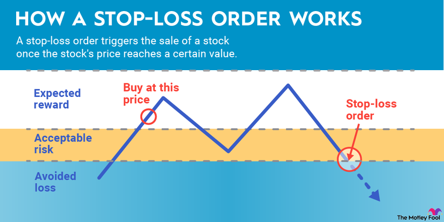

## Table of Contents

## What is a soft stop order?

A soft stop order is a type of order used in trading that helps manage risk. It's called "soft" because it's not a firm commitment to sell or buy at a specific price. Instead, it gives the trader some flexibility. When the price of a stock or other asset reaches a certain level, the soft stop order turns into a market order. This means the trade will happen at the next available price, which might be slightly different from the stop price.

Soft stop orders are useful because they can help traders limit their losses or protect their profits. For example, if a trader buys a stock at $50 and sets a soft stop order at $45, the order will activate if the stock price drops to $45. This can prevent the trader from losing more money if the stock keeps falling. However, because it's a market order once activated, the final sale price could be a bit lower than $45, depending on market conditions at that moment.

## How does a soft stop order differ from a hard stop order?

A soft stop order and a hard stop order are both used to manage risk in trading, but they work a bit differently. A soft stop order becomes a market order when the price hits the stop level. This means the trade will happen at the next available price, which might not be exactly the stop price. It gives the trader some flexibility but also means there's a chance the final price could be worse than expected.

On the other hand, a hard stop order, also known as a stop limit order, turns into a limit order when the price reaches the stop level. This means the trade will only happen at the stop price or better. If the price moves too quickly and skips over the stop price, the order might not get filled at all. So, a hard stop order gives the trader more control over the exact price but also carries the risk of not being executed if the market moves too fast.

## What is the purpose of using a soft stop order in trading?

The main purpose of using a soft stop order in trading is to help manage risk. When a trader buys a stock or other asset, they might set a soft stop order at a lower price to limit their potential losses. If the price of the asset drops to that level, the soft stop order turns into a market order, selling the asset at the next available price. This can help the trader avoid losing more money if the price keeps falling.

Soft stop orders are also useful for protecting profits. For example, if a trader's stock has gone up a lot, they might set a soft stop order at a price lower than the current price but still higher than their purchase price. This way, if the price starts to drop, they can still sell and keep some of their gains. Using a soft stop order gives traders a way to set a safety net, but they need to remember that the final sale price might not be exactly what they set because it turns into a market order.

## Can you explain the mechanics of how a soft stop order works?

A soft stop order is a tool traders use to manage risk. When a trader places a soft stop order, they pick a specific price at which they want the order to activate. If the price of the stock or asset reaches that level, the soft stop order turns into a market order. This means the trade will happen at the next available price, which might be a little different from the exact stop price the trader set.

For example, imagine a trader buys a stock for $50 and sets a soft stop order at $45. If the stock price drops to $45, the soft stop order kicks in and becomes a market order. The stock will then be sold at the next available price, which could be $45 or slightly less, like $44.90. This helps the trader limit their losses if the stock keeps going down, but they need to be okay with the final price being a bit off from the stop price they set.

## What are the potential benefits of using a soft stop order?

Using a soft stop order can help traders manage their risk better. When a trader sets a soft stop order, they pick a price where they want to sell if the price goes down. If the price hits that level, the order turns into a market order and the trade happens at the next available price. This can stop the trader from losing more money if the price keeps falling. It's like having a safety net that catches you before you fall too far.

Soft stop orders are also good for protecting profits. If a trader's stock goes up a lot, they can set a soft stop order at a price that's lower than the current price but still higher than what they paid. This way, if the price starts to drop, they can still sell and keep some of their gains. It's a way to lock in some profit while still giving the stock a chance to keep going up. But traders need to remember that the final price might not be exactly what they set because it turns into a market order.

## Are there any risks or drawbacks associated with soft stop orders?

Using a soft stop order can have some risks. One big risk is that when the soft stop order turns into a market order, the price you get might be worse than the stop price you set. This can happen if the market is moving fast or if there aren't many buyers or sellers at that moment. So, you might end up selling your stock for less than you planned, which means you could lose more money than you expected.

Another drawback is that soft stop orders don't guarantee you'll be able to sell at all. If the market is really busy or if the price jumps past your stop price without stopping at it, your order might not get filled right away. This can be a problem if the price keeps dropping fast. So, while soft stop orders can help manage risk, they also come with the chance that things might not go exactly as you planned.

## How do you set up a soft stop order on a trading platform?

To set up a soft stop order on a trading platform, you first need to find the order entry section. This is usually where you can choose different types of orders. Look for an option that says "stop order" or something similar. Once you find it, you'll need to enter the price at which you want the order to activate. This is the stop price. For example, if you bought a stock at $50 and want to sell it if it drops to $45, you would enter $45 as your stop price.

After setting the stop price, you need to make sure the order type is set to "market order" when the stop price is hit. This is what makes it a soft stop order. Some platforms might have a specific option for this, so check if there's a setting that says "stop market order" or something similar. Once everything is set, you can submit the order. Remember, when the stock price hits your stop price, it will turn into a market order and sell at the next available price, which might be a bit different from your stop price.

## Can you provide an example of a soft stop order in a real trading scenario?

Imagine you bought 100 shares of a company called ABC Corp for $50 each. You're happy with the stock, but you want to make sure you don't lose too much money if the price starts to drop. So, you decide to set a soft stop order at $45. This means if the price of ABC Corp's stock falls to $45, your order will turn into a market order and sell your shares at the next available price.

A few days later, the stock price of ABC Corp starts to go down. It hits $45, and your soft stop order kicks in. It turns into a market order and sells your 100 shares. The next available price happens to be $44.90, so you end up selling all your shares at that price. Even though it's a bit less than the $45 you set, you're glad you used a soft stop order because it helped you limit your losses. Without it, the stock could have kept falling, and you might have lost even more money.

## How do soft stop orders impact trading strategies?

Soft stop orders can really change how traders plan their moves. When a trader uses a soft stop order, they're setting a safety net for their trades. If they buy a stock and it starts to drop, the soft stop order can help them sell it before the price falls too far. This can be a big part of a trader's plan to manage risk. They might decide to use soft stop orders all the time, or just when they think the market might be risky. It's all about making sure they don't lose too much money if things go wrong.

Soft stop orders can also help traders keep their profits safe. If a stock goes up a lot, a trader might set a soft stop order at a price that's lower than where it is now but still higher than what they paid. This way, if the stock starts to go down, they can still sell it and keep some of the money they made. Traders need to remember that soft stop orders turn into market orders, so the price they get might not be exactly what they set. But even with this risk, soft stop orders can be a smart way to make sure a trader's plan works well in different market situations.

## What are the key considerations when deciding whether to use a soft stop order?

When deciding whether to use a soft stop order, you need to think about how much risk you're willing to take. Soft stop orders can help you limit your losses if a stock price drops, but they turn into market orders, which means you might not sell at the exact price you set. If the market is moving fast or there aren't many buyers or sellers, you could end up selling for less than you planned. So, it's important to think about how much you're okay with the price being off from what you set.

Another thing to consider is what you're trying to do with your trading. If you want to protect your profits or make sure you don't lose too much money, a soft stop order can be really helpful. It gives you a way to set a safety net, so you can focus on other parts of your trading plan without worrying too much about sudden price drops. But remember, soft stop orders might not always work out exactly as you want, so you need to be ready for that and have a plan for what to do if the price moves quickly past your stop price.

## How do market conditions affect the effectiveness of soft stop orders?

Market conditions can really change how well a soft stop order works. When the market is calm and there are lots of people buying and selling, a soft stop order usually works pretty well. If the stock price hits your stop price, it turns into a market order and sells at a price that's close to what you set. But if the market is moving fast or there aren't many people trading, things can get tricky. The price you get might be a lot different from your stop price, and you could end up selling for less than you wanted.

In times when the market is really busy or prices are jumping around a lot, a soft stop order might not work as well. If the price moves past your stop price without stopping at it, your order might not get filled right away. This can be a problem if the price keeps dropping fast. So, when you're thinking about using a soft stop order, you need to think about what the market is like right now. If it's calm, a soft stop order can be a good way to manage risk, but if it's wild, you might need to be ready for the price to be different from what you planned.

## What advanced techniques can traders use to optimize the use of soft stop orders?

Traders can optimize the use of soft stop orders by paying close attention to market conditions and adjusting their stop prices based on how the stock is moving. If a stock is going up steadily, a trader might move their soft stop order up too, so it's closer to the current price. This way, they can still protect their profits but give the stock more room to grow. On the other hand, if the market seems risky or the stock starts to get shaky, a trader might set their soft stop order at a price that's further away from the current price to make sure they can sell if things go bad quickly.

Another technique is to use soft stop orders along with other types of orders, like limit orders, to make a more complete trading plan. For example, a trader might use a soft stop order to limit their losses and a limit order to sell at a specific higher price if the stock goes up. This way, they can manage both their risks and their chances to make money. By mixing different kinds of orders, traders can make sure their plan works well no matter what the market does.

## References & Further Reading

[1]: Aldridge, I. (2010). ["High-Frequency Trading: A Practical Guide to Algorithmic Strategies and Trading Systems"](https://www.amazon.com/High-Frequency-Trading-Practical-Algorithmic-Strategies/dp/0470563761). Wiley.

[2]: Dempster, M.A.H., & Leemans, V. (2006). ["An automated FX trading system using adaptive reinforcement learning."](https://www.sciencedirect.com/science/article/pii/S0957417405003015) In Applications of Fuzzy Logic and Soft Computing.

[3]: Chan, E. (2013). ["Algorithmic Trading: Winning Strategies and Their Rationale"](https://github.com/ftvision/quant_trading_echan_book). Wiley.

[4]: Kissell, R. (2013). ["The Science of Algorithmic Trading and Portfolio Management"](https://www.sciencedirect.com/book/9780124016897/the-science-of-algorithmic-trading-and-portfolio-management). Academic Press.

[5]: Tetlock, P.C. (2007). ["Giving content to investor sentiment: The role of media in the stock market"](https://onlinelibrary.wiley.com/doi/abs/10.1111/j.1540-6261.2007.01232.x). The Journal of Finance, 62(3), 1139-1168.