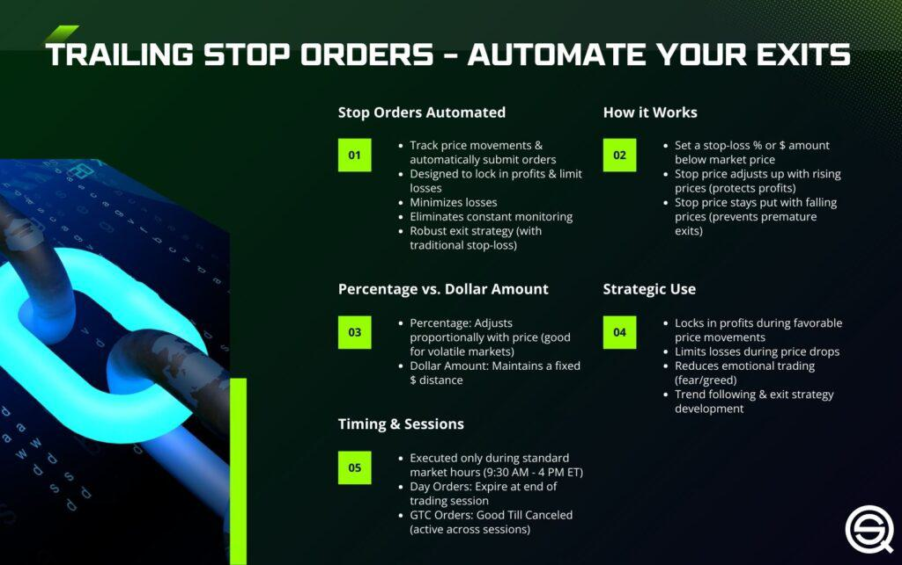

In today's fast-paced stock market, traders are increasingly leveraging a variety of order types and automated strategies to enhance their trading efficiency and outcomes. A key component of this evolution is the concept of soft stop orders, which, when integrated with algorithmic trading, provide tools for better decision-making and risk management. Soft stop orders offer a flexible approach that differs from traditional stop orders, allowing traders to balance psychological readiness with strategic planning. This article will describe how soft stop orders differ from other stop order types and discuss the role of algorithmic trading in optimizing trading performance. By gaining a deeper understanding of these concepts, traders can effectively navigate the complexities of modern financial markets. Moreover, the synergy between traditional trading orders and algorithmic innovations presents both opportunities and challenges, which we will discuss in detail. Understanding and leveraging this synergy is essential for traders looking to maintain a competitive edge in dynamic financial environments.

## Table of Contents



## What is a Soft Stop Order?

A soft stop order is an informal trading strategy where a trader makes a conscious decision to reconsider their trading position once a specific price point is reached, without necessarily executing a formal order with a broker. This approach stands in contrast to hard stop orders, which are predefined and automatically trigger a transaction upon reaching a specific price threshold. The key advantage of soft stop orders lies in their flexibility, allowing traders to reassess market conditions before deciding whether to proceed with a buy or sell action.

By employing soft stop orders, traders can establish flexible thresholds, which serve as guidelines for potential market timing strategies. This method does not mandate immediate execution, providing an opportunity to account for sudden changes in market dynamics or to incorporate additional data into their decision-making process. This flexibility is particularly beneficial for those looking to stay nimble in fast-paced market environments where conditions can shift rapidly.

Furthermore, soft stop orders highlight the critical role of psychological readiness in trading. Traders who utilize this type of order are better positioned to balance strategic planning with the inherent uncertainties of the market. This approach allows for a more personalized and reflective trading experience, catering to the instincts and insights of the individual trader.

In essence, soft stop orders encourage a proactive mindset. Traders are prompted to continuously analyze and interpret market data, fostering an environment where strategic adaptability is essential. This readiness to react, combined with the absence of automatic execution, empowers traders to make more informed and potentially beneficial decisions, even amidst volatile market conditions.

## Understanding Trading Orders

Trading orders are fundamental components of the financial markets, shaping how brokers execute trades for investors. They provide a structured approach to buying and selling securities by defining specific conditions under which trades should occur. Understanding the variety of trading orders is essential for investors looking to navigate markets effectively.

Market orders are the most straightforward type of trading order. When a trader places a market order, they instruct their broker to execute the order immediately at the best available price. This immediacy makes market orders particularly useful in highly liquid markets where quick execution is desired. However, because market orders do not guarantee a specific execution price, they may not be suitable in volatile markets where prices can change rapidly.

Limit orders offer more control over the execution price. A limit order specifies a particular price or better at which the trader is willing to buy or sell a security. For example, if an investor wants to buy a stock but is only willing to pay up to $50, a buy limit order can be set at this price. The order will only be executed if the market price reaches $50 or lower. This specificity allows traders to manage their entry and [exit](/wiki/exit-strategy) points more precisely, though there is a risk that the order may not be executed if the market never reaches the specified price.

Stop-loss orders are used as a risk management tool to limit potential losses. A stop-loss order is set at a price below the current market price for a long position. If the price falls to the stop level, the order becomes a market order and is executed at the next available price. For instance, an investor who bought shares at $60 might set a stop-loss order at $55 to sell the shares should the price drop to that level, thereby capping potential losses.

Stop-limit orders combine features of stop-loss and limit orders. They trigger a limit order once a specified stop price is reached. This means the order will only execute at the limit price or better, offering more control over execution but potentially leaving the order unfilled if the market price moves quickly past the limit price.

Soft stop orders introduce flexibility by functioning as mental notes rather than formal orders placed with a broker. Unlike stop-loss or stop-limit orders, soft stop orders are not automatically executed. Instead, they serve as guidelines for traders, allowing them to re-evaluate market conditions once a predetermined price threshold is approached. This approach enhances decision-making by incorporating market analysis and trader discretion, as the trader can choose whether to act upon reaching the soft stop level.

In essence, the diverse nature of trading orders equips investors with a comprehensive toolkit for executing trades under various market conditions, aligning with their risk tolerance and strategic objectives. Understanding these order types enables traders to optimize their transaction strategies, taking into account factors like market [volatility](/wiki/volatility-trading-strategies) and [liquidity](/wiki/liquidity-risk-premium).

## Integration with Algorithmic Trading

Algorithmic trading employs pre-defined algorithms to automate trade execution, optimizing both speed and accuracy. Integrating soft stop orders into [algorithmic trading](/wiki/algorithmic-trading) offers multiple advantages. One of the primary benefits is enhanced risk management, allowing traders to set specific conditions for trade reviews rather than immediate execution. This approach grants traders the flexibility to assess market conditions and respond accordingly, which can be particularly advantageous in volatile market environments.

By incorporating soft stop orders into their trading strategies, traders can utilise sophisticated algorithms programmed to alert them when certain conditions are met. Such alerts enable traders to conduct a strategic review of their holdings or market conditions before deciding to execute or amend a trade. This ensures that the decision-making process remains dynamic, adapting to real-time data as opposed to being locked into predetermined outcomes.

Moreover, the integration of soft stop orders with algorithmic systems allows for the exploitation of advanced data analytics and [machine learning](/wiki/machine-learning) tools. These tools can analyse vast datasets to uncover patterns or signals that inform trading decisions, optimizing the traders' strategies. For example, machine learning models could be employed to refine the conditions under which soft stop orders are triggered, taking into account historical volatility, trading [volume](/wiki/volume-trading-strategy), and other market indicators.

As financial markets continue to evolve, the prevalence of algorithmic trading and the use of nuanced order types such as soft stops are expected to increase. This evolution is driven by the need for greater precision and the ability to process and respond to information at speeds that exceed human capability. As a result, the integration of these technologies will become a vital component in the toolkit of modern traders, positioning them to effectively manage risk and capitalize on market opportunities.

## Pros and Cons of Soft Stop Orders

Soft stop orders offer a unique blend of flexibility and strategic analysis, providing traders the opportunity to make more nuanced trading decisions compared to more rigid order types. One of the primary advantages of soft stop orders is their ability to prevent automatic trade executions in unfavorable market conditions. This contrasts with hard stop orders, which can activate involuntarily during volatile market swings, potentially resulting in unintended financial losses. By opting for a soft stop approach, traders retain the discretion to assess market conditions and decide whether to execute the trade, hence enhancing their decision-making process.

However, this latitude introduces potential downsides. The reliance on personal judgment means that traders may experience indecision or fail to act quickly in fast-moving markets, potentially leading to missed opportunities. The success of soft stop orders heavily depends on the trader's ability to interpret market signals accurately and maintain psychological discipline. These subjective elements can pose significant challenges, particularly in high-stress environments where emotions might cloud judgment.

Integrating algorithmic support can offset some of these challenges by injecting objectivity into the decision-making process. Algorithms can analyze vast amounts of data and simplify complex market trends into actionable insights, thereby aiding traders in making informed decisions. A typical algorithmic solution might involve the use of Python to retrieve and analyze real-time market data, providing traders with notifications when specific soft stop conditions are met. Here is an example of a simple Python script that could be used in such a scenario:

```python
import yfinance as yf

# Define the stock and the soft stop condition
symbol = 'XYZ'
soft_stop_price = 30.00

# Function to check the current stock price
def get_stock_price(symbol):
    stock = yf.Ticker(symbol)
    return stock.history(period='1d')['Close'].iloc[-1]

# Alert function
def alert_soft_stop(symbol, price):
    current_price = get_stock_price(symbol)
    if current_price <= price:
        print(f"Alert: {symbol} has hit the soft stop price of ${price:.2f}. Consider your next move.")

# Checking the stock price every minute
import time

while True:
    alert_soft_stop(symbol, soft_stop_price)
    time.sleep(60)
```

Incorporating such automated tools into trading strategies can mitigate the risk of human error and enhance the precision of decisions related to soft stop orders. As financial markets continue to evolve, traders who can effectively leverage both human insight and technological tools are likely to navigate these environments more successfully.

## Real-World Applications

Traders leverage soft stop orders to strategically manage potential market movements without committing to immediate actions. For instance, a trader monitoring the stock of XYZ Corporation might decide on a soft stop order to sell shares if the price reaches $30. This decision would prompt the trader to assess ongoing market conditions and external factors before making a definitive move. Such an approach allows the trader to [factor](/wiki/factor-investing) in real-time changes and news that may influence the stock's future performance, thereby enhancing decision-making efficacy.

In algorithmic trading, soft stop orders serve a slightly different function. Instead of automatically executing trades, they can trigger alerts or initiate detailed analyses when certain conditions are met. This way, traders maintain control over their strategies while benefiting from the speed and analytical capabilities of algorithmic tools. It allows for a nuanced response to price fluctuations, where algorithms deliver valuable insights or predictions, yet preserve the trader's discretion over the final trading decisions.

Sophisticated trading strategies often rely on soft stop orders to adjust to market volatility. By setting flexible thresholds, traders can remain adaptive and responsive to unforeseen market events. In highly unpredictable trading environments, this approach minimizes the risk of reactive decisions that might yield unfavorable outcomes. Incorporating these orders into a broader strategy highlights their flexibility and usefulness in adapting to various market conditions, thereby providing a resilient strategy for risk management.

Overall, the application of soft stop orders underscores their versatility in contemporary trading environments. They enable traders to manage uncertainties with agility while optimizing the balance between automated processes and human decision-making.

## Future Trends in Algo Trading and Soft Stop Orders

The future of trading is poised to see a deeper integration of [artificial intelligence](/wiki/ai-artificial-intelligence) (AI) and machine learning (ML) in evaluating and setting soft stop orders. These technologies are expected to enhance the precision and adaptability of trading strategies. Predictive analytics, a subset of AI, enables traders to foresee potential market movements and adjust their orders accordingly. For instance, machine learning algorithms can analyze vast datasets to identify patterns or anomalies that signal upcoming price changes, allowing traders to set or adjust soft stop orders proactively.

As these technologies evolve, regulatory and ethical considerations will become increasingly significant within financial markets. Regulatory bodies may implement new guidelines to ensure the fair and ethical use of AI and ML, focusing on transparency, accountability, and the prevention of market manipulation. Traders and institutions will need to navigate these regulations carefully to maximize the benefits of algorithmic enhancements while ensuring compliance.

The expansion of algorithmic trading, characterized by rapid technological advancements, suggests a growing role for soft stop orders as a key component of a balanced and responsive trading toolkit. This approach combines the strategic forethought of human traders with the speed and efficiency of automated systems. By leveraging AI and ML, traders can execute strategies with greater precision, minimizing risk and optimizing returns.

For traders looking to maintain a competitive advantage, staying abreast of these developments will be crucial. Continuous education and adaptation to new technologies will be essential for effectively integrating soft stop orders and other dynamic trading tools into their strategies. Additionally, the collaboration between human insight and machine efficiency will likely define success in the future trading landscape, making it imperative for traders to cultivate both skills and technological acumen.

## Conclusion

Soft stop orders provide traders with the necessary flexibility to navigate volatile markets with precision and care. Unlike hard stop orders that are rigidly executed once market conditions are met, soft stops allow traders to assess the situation and make informed decisions. This adaptability is particularly valuable in fast-paced trading environments where the ability to respond to dynamic price movements can significantly impact outcomes.

Integrating soft stop orders with algorithmic trading offers a dynamic approach to risk management, effectively balancing automation with human oversight. Algorithms can be programmed to monitor market conditions and alert traders when a pre-set soft stop condition is met. This integration harnesses the power of data analytics and real-time market monitoring, providing a strategic advantage in executing trades. The combination of algorithmic precision and trader intuition can lead to optimized trading outcomes, as each trade is carefully considered in light of current market indicators.

However, challenges such as indecision and market volatility remain. Traders must possess the psychological discipline to act decisively when a soft stop condition triggers an alert. Hesitation in volatile markets can lead to missed opportunities or exacerbated losses. Successful application of soft stop orders requires a balance between leveraging algorithmic recommendations and relying on human judgment.

Emerging technologies promise to enhance the strategic deployment of soft stop orders. Advances in artificial intelligence and machine learning offer the potential to refine these orders with greater precision. Predictive analytics can help traders forecast market trends and adjust their strategies accordingly, aligning soft stop orders more closely with evolving market needs. As these technologies evolve, they will play an increasingly significant role in the effectiveness of soft stop orders.

Staying informed and adaptable will be key to leveraging the full potential of soft stop orders in an automated trading era. Traders who remain abreast of technological advancements and continuously refine their use of these tools will be better positioned to maintain a competitive edge in the financial markets. This combination of flexibility, strategic integration, and technological innovation is crucial for optimizing trading performance in the modern financial landscape.

## References & Further Reading

[1]: Aldridge, I. (2010). ["High-Frequency Trading: A Practical Guide to Algorithmic Strategies and Trading Systems"](https://www.amazon.com/High-Frequency-Trading-Practical-Algorithmic-Strategies/dp/0470563761). Wiley.

[2]: Dempster, M.A.H., & Leemans, V. (2006). ["An automated FX trading system using adaptive reinforcement learning."](https://www.sciencedirect.com/science/article/pii/S0957417405003015) In Applications of Fuzzy Logic and Soft Computing.

[3]: Chan, E. (2013). ["Algorithmic Trading: Winning Strategies and Their Rationale"](https://github.com/ftvision/quant_trading_echan_book). Wiley.

[4]: Kissell, R. (2013). ["The Science of Algorithmic Trading and Portfolio Management"](https://www.sciencedirect.com/book/9780124016897/the-science-of-algorithmic-trading-and-portfolio-management). Academic Press.

[5]: Tetlock, P.C. (2007). ["Giving content to investor sentiment: The role of media in the stock market"](https://onlinelibrary.wiley.com/doi/abs/10.1111/j.1540-6261.2007.01232.x). The Journal of Finance, 62(3), 1139-1168.