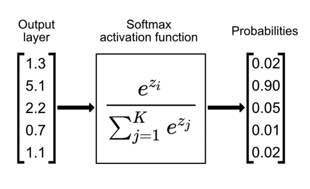

## Table of Contents

## What is the Softmax function in machine learning?

The Softmax function is a mathematical tool used in machine learning, especially in classification problems. It turns a set of numbers into probabilities that add up to one. Imagine you have a few different options, and you want to figure out how likely each one is. The Softmax function helps by making sure all the probabilities together equal 100%, which is really useful when you're trying to decide between different choices.

Here's how it works: if you have some numbers, the Softmax function takes those numbers and uses a formula to change them into probabilities. The formula is $$ \text{Softmax}(x_i) = \frac{e^{x_i}}{\sum_{j} e^{x_j}} $$. In this formula, \( x_i \) is one of your numbers, and the bottom part of the fraction (the denominator) is the sum of the exponentials of all your numbers. This way, even if your original numbers were very different, the Softmax function makes sure the output is a set of numbers between 0 and 1 that add up to 1. This is super helpful in things like neural networks, where you might want to pick the most likely answer from a set of possibilities.

## How does the Softmax function convert raw scores into probabilities?

The Softmax function takes a bunch of raw scores and turns them into probabilities. Imagine you have some numbers, and you want to know how likely each one is compared to the others. The Softmax function does this by using a special formula that makes sure all the probabilities add up to 1. This is useful because it helps us understand which option is the most likely when we're making decisions.

Here's how it works: if you have some numbers, the Softmax function uses the formula $$ \text{Softmax}(x_i) = \frac{e^{x_i}}{\sum_{j} e^{x_j}} $$. In this formula, \( x_i \) is one of your numbers, and the bottom part (the denominator) is the sum of the exponentials of all your numbers. So, if you have three numbers, say 1, 2, and 3, the Softmax function will take the exponential of each (e^1, e^2, e^3), add them up, and then divide each exponential by that sum. This way, you get three new numbers that are between 0 and 1 and add up to 1, which are your probabilities.

## Why is the Softmax function useful in classification tasks?

The Softmax function is super helpful in classification tasks because it takes a set of numbers and turns them into probabilities. Imagine you have a bunch of different options, and you want to know which one is most likely. The Softmax function does this by making sure all the probabilities together add up to 100%. This is really useful because when you're trying to decide between different choices, like figuring out if a picture is of a cat or a dog, you want to know how sure you are about each option.

In machine learning, especially in neural networks, the Softmax function helps by taking the raw scores from the last layer of the network and turning them into probabilities. The formula for the Softmax function is $$ \text{Softmax}(x_i) = \frac{e^{x_i}}{\sum_{j} e^{x_j}} $$. This formula might look complicated, but it's just a way to make sure all your probabilities add up to 1. By using this, the model can pick the most likely answer from all the possibilities, which makes it easier to make the right choice.

## Can you explain the mathematical formula of the Softmax function?

The Softmax function takes a set of numbers and turns them into probabilities that add up to one. Imagine you have some scores, and you want to know how likely each one is compared to the others. The Softmax function does this by using a special formula. The formula is $$ \text{Softmax}(x_i) = \frac{e^{x_i}}{\sum_{j} e^{x_j}} $$. In this formula, \( x_i \) is one of your numbers, and the bottom part (the denominator) is the sum of the exponentials of all your numbers. So, if you have three numbers, say 1, 2, and 3, the Softmax function will take the exponential of each (e^1, e^2, e^3), add them up, and then divide each exponential by that sum. This way, you get new numbers that are between 0 and 1 and add up to 1, which are your probabilities.

This process is really useful in machine learning, especially in classification tasks. When you're trying to decide between different choices, like figuring out if a picture is of a cat or a dog, you want to know how sure you are about each option. The Softmax function helps by taking the raw scores from the last layer of a neural network and turning them into probabilities. By using the Softmax function, the model can pick the most likely answer from all the possibilities, making it easier to make the right choice.

## How does the Softmax function handle numerical stability issues?

The Softmax function can run into problems with very big or very small numbers. When the numbers are too big, computers might not be able to handle them properly, and when they're too small, they might be treated as zero. To fix this, we can use a trick called "numerical stabilization". We do this by subtracting the biggest number in the set from all the numbers before we put them into the Softmax formula. This makes sure the numbers stay in a range that computers can work with easily.

Here's how it works: if you have a set of numbers, you find the biggest one and subtract it from all the numbers. Then you use the Softmax formula $$ \text{Softmax}(x_i) = \frac{e^{x_i - \max(x)}}{\sum_{j} e^{x_j - \max(x)}} $$. This way, the biggest number becomes zero, and all the other numbers become smaller, which helps avoid the problems with very big or very small numbers. This trick keeps the Softmax function working well, even with tricky numbers.

## What are the common applications of the Softmax function in neural networks?

The Softmax function is commonly used in neural networks for classification tasks. Imagine you're trying to decide if a picture shows a cat, a dog, or a bird. The neural network gives you some scores for each option, and the Softmax function turns these scores into probabilities. It does this by using the formula $$ \text{Softmax}(x_i) = \frac{e^{x_i}}{\sum_{j} e^{x_j}} $$. This way, the network can tell you how likely it thinks each option is, and you can pick the one with the highest probability.

Another important use of the Softmax function is in multi-class classification problems. For example, when you're sorting emails into different folders like "work", "personal", or "spam", the Softmax function helps by making sure the probabilities for each folder add up to 100%. This makes it easier for the neural network to decide where each email belongs. By using the Softmax function, the network can give you clear probabilities for each category, helping you make the best choice.

## How does the Softmax function relate to the cross-entropy loss?

The Softmax function is often used together with the cross-entropy loss in neural networks, especially for classification tasks. Imagine you have a bunch of options, like different types of animals in a picture, and you want to pick the right one. The Softmax function turns the raw scores from the neural network into probabilities, making sure they add up to 100%. This is helpful because it lets the network tell you how sure it is about each option. The formula for the Softmax function is $$ \text{Softmax}(x_i) = \frac{e^{x_i}}{\sum_{j} e^{x_j}} $$. By using this, the network can give you clear probabilities for each category.

The cross-entropy loss then measures how well the network's guesses match the actual answers. It looks at the probabilities from the Softmax function and compares them to what you know is true. If the network's guesses are far from the truth, the cross-entropy loss will be high, telling the network it needs to learn more. If the guesses are close to the truth, the loss will be low, showing the network is doing well. The formula for the cross-entropy loss is $$ \text{Cross-Entropy Loss} = -\sum_{i} y_i \log(p_i) $$, where \( y_i \) is the true label (1 if it's the right answer, 0 otherwise) and \( p_i \) is the probability from the Softmax function. By using the Softmax function and cross-entropy loss together, the neural network can learn to make better guesses over time.

## What are the differences between Softmax and other activation functions like sigmoid?

The Softmax function and the sigmoid function are both used in neural networks, but they work in different ways. The Softmax function is used when you have multiple options and want to turn scores into probabilities that add up to 100%. Imagine you're trying to decide if a picture is of a cat, a dog, or a bird. The Softmax function helps by making sure the chances for each animal add up to 100%. The formula for the Softmax function is $$ \text{Softmax}(x_i) = \frac{e^{x_i}}{\sum_{j} e^{x_j}} $$. This way, the network can tell you how likely it thinks each option is, and you can pick the one with the highest chance.

On the other hand, the sigmoid function is used when you have just two options, like yes or no. It turns a number into a probability between 0 and 1, but it doesn't care about other options. If you're trying to decide if an email is spam or not, the sigmoid function can help by giving you a chance that it's spam. The formula for the sigmoid function is $$ \text{Sigmoid}(x) = \frac{1}{1 + e^{-x}} $$. While the Softmax function is great for picking one option out of many, the sigmoid function is perfect for deciding between just two choices.

## How can the Softmax function be implemented in popular machine learning frameworks like TensorFlow or PyTorch?

In TensorFlow, you can use the Softmax function easily. Imagine you have some numbers, and you want to turn them into probabilities that add up to 100%. You can do this by using the `tf.nn.softmax` function. If you have a tensor called `scores`, you can turn it into probabilities with just one line of code: ```python
import tensorflow as tf
scores = tf.constant([1.0, 2.0, 3.0])
probabilities = tf.nn.softmax(scores)
``` This code takes the scores and turns them into probabilities using the formula $$ \text{Softmax}(x_i) = \frac{e^{x_i}}{\sum_{j} e^{x_j}} $$. It's really helpful when you're trying to decide between different choices in a neural network.

In PyTorch, it's just as simple to use the Softmax function. If you have a tensor with some numbers, you can turn them into probabilities using the `torch.nn.functional.softmax` function. For example, if you have a tensor called `scores`, you can do this with the following code: ```python
import torch
import torch.nn.functional as F
scores = torch.tensor([1.0, 2.0, 3.0])
probabilities = F.softmax(scores, dim=0)
``` Here, the `dim=0` part tells PyTorch to apply the Softmax function along the first dimension of the tensor. This uses the same formula $$ \text{Softmax}(x_i) = \frac{e^{x_i}}{\sum_{j} e^{x_j}} $$ to turn your numbers into probabilities, which is super useful in classification tasks.

## What are the potential drawbacks or limitations of using the Softmax function?

One potential drawback of the Softmax function is that it can be sensitive to extreme values. If one of the scores is much larger than the others, the Softmax function can make the probability for that score very close to 1, and the probabilities for the other scores very close to 0. This can make the model overconfident in its predictions, even if the correct answer is not the one with the highest score. To handle this, you can use a trick called numerical stabilization, which involves subtracting the largest score from all the scores before applying the Softmax function. The formula for this is $$ \text{Softmax}(x_i) = \frac{e^{x_i - \max(x)}}{\sum_{j} e^{x_j - \max(x)}} $$. This helps keep the numbers in a range that computers can handle easily.

Another limitation is that the Softmax function assumes that all classes are mutually exclusive. This means it works best when you're trying to pick just one answer out of many, like deciding if a picture is of a cat, a dog, or a bird. If you have a situation where multiple answers can be correct at the same time, like tagging a picture with multiple labels, the Softmax function might not be the best choice. In such cases, you might want to use other methods, like the sigmoid function for each class independently, to allow for multiple correct answers.

## How does temperature affect the Softmax function, and what is its impact on the output?

The temperature is a way to change how the Softmax function works. It's like a dial that you can turn to make the Softmax function more or less sure about its choices. When the temperature is high, the Softmax function spreads out the probabilities more evenly, making it less sure about which option is the best. When the temperature is low, the Softmax function makes the probabilities more focused on the highest score, making it more sure about its choice. The formula for the Softmax function with temperature is $$ \text{Softmax}(x_i) = \frac{e^{x_i / T}}{\sum_{j} e^{x_j / T}} $$, where \( T \) is the temperature.

Using temperature can be really helpful in training neural networks. If you set a high temperature during training, it helps the network explore different options and learn better. Once the training is done, you can lower the temperature to make the network more confident in its final choices. This way, you can control how sure the network is about its predictions, which can be useful in many different situations.

## Can you discuss advanced techniques involving Softmax, such as label smoothing or focal loss?

Label smoothing is a technique used to make the Softmax function work better by making the model less sure about its predictions. Imagine you're trying to decide if a picture is of a cat, a dog, or a bird. Normally, the Softmax function would give a probability of 100% to the correct answer and 0% to the others. With label smoothing, you change the target probabilities a little bit, so instead of 100% for the correct answer, you might use 90% or 80%. This helps the model learn to be more careful and not overconfident. The formula for label smoothing is $$ y_i' = y_i \cdot (1 - \alpha) + \frac{\alpha}{K} $$, where \( y_i \) is the original label, \( \alpha \) is a small number between 0 and 1, and \( K \) is the number of classes. By using label smoothing, you can help the model perform better on new data it hasn't seen before.

Focal loss is another advanced technique that helps the Softmax function focus on the hard examples during training. When you're training a model, it might be really good at guessing some examples but not so good at others. Focal loss makes the model pay more attention to the examples it gets wrong. It does this by changing the way it calculates the loss, so the loss is higher for the examples the model is unsure about. The formula for focal loss is $$ \text{FL}(p_t) = -\alpha_t (1 - p_t)^\gamma \log(p_t) $$, where \( p_t \) is the probability of the correct class, \( \alpha_t \) is a weighting factor, and \( \gamma \) is a focusing parameter. By using focal loss, you can help the model learn better from the examples it finds difficult, which can make it perform better overall.