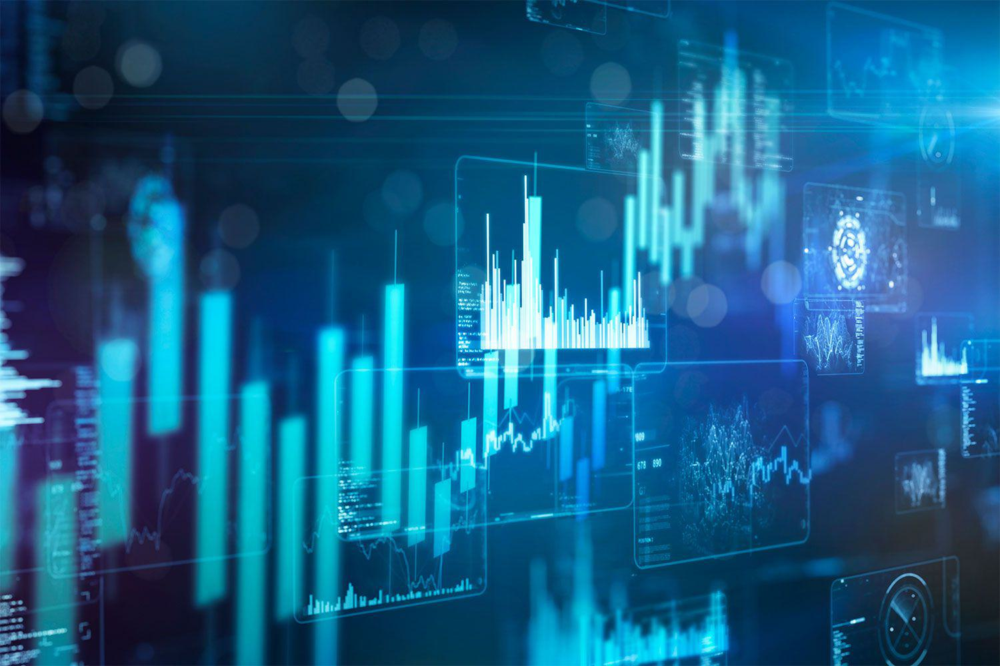

The software market, a pivotal segment of the broader technology sector, plays a fundamental role in driving innovation and enhancing operational efficiencies across various industries. Valued at trillions of dollars, this market encompasses diverse segments such as system infrastructure, enterprise application software, and custom programming services. The pervasiveness of software solutions is evident in their application across sectors including healthcare, finance, education, and entertainment, subtly revolutionizing how businesses operate and interact with their customers.

In today's digitally driven economy, software is indispensable for modern industries, enabling the development and deployment of applications that automate processes, enhance productivity, and provide critical insights through data analytics. Among these transformative solutions, algorithmic trading—often referred to as algo trading—emerges as a key area within the financial sector where software technology continues to expand its influence. Algorithmic trading employs complex algorithms and mathematical models to execute trades at speeds and frequencies that are impossible for human traders. Its growing relevance is fueled by the need for efficiency, accuracy, and the ability to process vast amounts of market data in real time.



This article aims to explore the intersection between the software industry and algorithmic trading. By examining how advancements in software have propelled the evolution of trading strategies and platforms, we can gain a deeper understanding of the critical role software plays in transforming financial markets. This exploration will cover the development of the software industry, the technological innovations facilitating algo trading, and the future implications for both the software and financial sectors.

## Table of Contents

## The Software Industry: An Overview

The software industry is a vital component of the global economy, encompassing the development, maintenance, and publication of software that operates on various devices and platforms. This industry is broadly defined to include entities and processes involved in the creation of software applications, system frameworks, and various service-oriented and open-source platforms. 

The scope of the software industry is extensive, touching numerous aspects of modern life and driving innovations across multiple sectors. It is divided into several key areas:

1. **Programming Services**: This sector involves the creation and customization of software applications to meet specific client or market needs. Programming services cater to a wide array of requirements, from developing application software for personal use to large-scale enterprise software systems.

2. **System Services**: System services include the development and implementation of software that supports the infrastructure of computer systems. This involves operating systems, middleware, and various back-end processes that ensure hardware and software efficiency and stability.

3. **Open Source**: Open-source software plays a significant role in the industry, characterized by openly shared code and collaborative development. It allows communities of developers to contribute and enhance software projects, resulting in widely used platforms like Linux, Apache, and Firefox.

4. **Software as a Service (SaaS)**: SaaS represents a rapidly growing sector where applications are hosted on the cloud and delivered to customers via the internet. This model allows for subscription-based usage, reducing the need for in-house hardware and software maintenance while enabling regular updates and scalability.

The evolution of the software industry began in the 1950s with the advent of the first programmable computers. Early software consisted mostly of coded instructions executed directly on these machines. This era marked the beginning of the software development lifecycle with structured programming.

As computing technology advanced, the 1970s and 1980s introduced high-level programming languages such as C and later, object-oriented programming languages like C++ and Java in the 1990s. These innovations allowed for more complex and user-friendly applications, fostering the growth of personal computing.

The 2000s saw the rise of internet-based services and e-commerce, changing the landscape of software development profoundly. The proliferation of web technologies enabled the advent of SaaS and cloud computing, offering significant flexibility and efficiency. Companies like Salesforce and Microsoft leveraged this model to transform enterprise software offerings.

In recent years, the software industry has been shaped by digital transformation trends, with [artificial intelligence](/wiki/ai-artificial-intelligence), blockchain, and the Internet of Things (IoT) emerging as influential forces. Today, software drives not only traditional computing but also mobile devices, embedded systems, and an increasingly interconnected world, making it indispensable in all facets of modern life.

## Technological Evolution in the Software Sector

The technological evolution in the software sector has been marked by significant advancements and a series of impactful innovations that have shaped its trajectory over decades. Beginning in the mid-20th century, the software industry experienced a foundational period during the 1950s and 1960s, characterized by the development of early programming languages such as FORTRAN and COBOL. This era marked the initiation of structured programming practices, setting a precedent for future development methodologies.

As the industry progressed through the 1970s and 1980s, the introduction of personal computers necessitated more intuitive software solutions, leading to the proliferation of graphical user interfaces and systems software. Notably, the advent of operating systems such as UNIX and later Windows became a cornerstone in enhancing user engagement and expanding the software market.

Moving into the 1990s, the rise of the internet catalyzed a paradigm shift, allowing for networked applications and e-commerce platforms, which heavily influenced software architecture and deployment models. This period also witnessed the beginnings of open-source software, with projects such as Linux gaining [momentum](/wiki/momentum), encouraging collaborative development and broader access.

The early 21st century marked the emergence of cloud computing, which revolutionized software development and deployment. Cloud computing enabled on-demand resource allocation and introduced scalable computing solutions, significantly reducing the barriers to entry for software developers and businesses. It facilitated a shift from traditional software delivery to a model that prioritizes accessibility and efficiency, heralding the Software as a Service (SaaS) era.

SaaS has fundamentally changed the market landscape, allowing users to access software applications through the internet without needing to manage underlying infrastructure. The flexibility and cost-effectiveness of SaaS have led to its widespread adoption across various industries, from business solutions like customer relationship management (CRM) software to personal services such as video streaming platforms. Key benefits of SaaS include automatic updates, reduced maintenance costs, and the capacity for rapid scaling, which have significantly transformed business operations and enabled innovative business models.

The implications of these technological evolutions are profound, offering software developers and companies the tools to innovate rapidly and meet the dynamic needs of modern industries. As cloud computing and SaaS continue to mature, their integration within broader technological frameworks will likely enhance their utility and application in solving real-world problems.

## Algorithmic Trading: Transforming Financial Markets

Algorithmic trading, often referred to as algo trading, involves the use of computer algorithms to automate trading decisions in financial markets. These algorithms execute pre-defined criteria for trading orders, such as timing, price, or [volume](/wiki/volume-trading-strategy). By utilizing sophisticated algorithms, traders aim to enhance efficiency and profitability, minimize human errors, and exploit short-lived market opportunities.

The significance of [algorithmic trading](/wiki/algorithmic-trading) lies in its impact on market dynamics. It facilitates faster trade execution, enhances [liquidity](/wiki/liquidity-risk-premium), and improves price discovery processes. Moreover, algo trading has been pivotal in risk management, enabling traders to implement complex strategies that balance portfolios and hedge against market [volatility](/wiki/volatility-trading-strategies). According to a 2020 study by the Bank for International Settlements, algorithmic trading accounted for roughly 70–80% of trading in U.S. equity markets, highlighting its growing dominance.

Software advancements have played a crucial role in enabling algorithmic trading. The emergence of high-speed trading systems, enhanced computational power, and the availability of massive datasets have collectively transformed trading methodologies. Modern trading platforms leverage distributed computing and parallel processing to handle large volumes of data and execute trades with low latency. This progression has been fueled by key technologies such as cloud computing, which offers scalable resources and cost-effective solutions for data storage and processing.

Major platforms driving algo trading include MetaTrader 4 and 5, developed by MetaQuotes Software, which provide robust environments for automated trading via scripts known as Expert Advisors (EAs). These platforms are widely used in retail and institutional trading, offering extensive libraries for technical indicators and seamless integration with custom algorithms. Additionally, FIX (Financial Information Exchange) protocol-based platforms ensure standardized communication for trading systems, facilitating rapid and reliable order placement.

QuantConnect and Quantopian represent another category of software driving algorithmic trading. These platforms offer a collaborative space for developers and traders to create, test, and deploy trading algorithms. QuantConnect, for example, utilizes the LEAN algorithm framework, an open-source engine that supports multiple asset classes and integrates with cloud solutions for [backtesting](/wiki/backtesting) and live deployment.

In conclusion, the amalgamation of advanced software technologies and financial innovation continues to drive the evolution of algorithmic trading. As these technologies advance further, they will likely deepen their influence on global financial markets, underscoring the importance of staying abreast of software developments for market participants.

## Key Software Technologies in Algorithmic Trading

Algorithmic trading has become an essential component of modern financial markets, employing sophisticated software technologies to execute trades based on pre-defined criteria. Key software technologies in algorithmic trading include the programming languages used to develop trading platforms, the integration of [machine learning](/wiki/machine-learning) and artificial intelligence to refine trading strategies, and the use of real-time data processing and analytics to optimize decision-making.

### Programming Languages and Tools

The choice of programming languages and tools is pivotal in developing algorithmic trading platforms, with performance and efficiency being critical factors. Python has become the preferred language for many developers due to its readability, extensive libraries, and support for quantitative analysis. Libraries such as NumPy, pandas, and SciPy are particularly valuable for handling large datasets, performing statistical analysis, and managing time-series data.

```python
import pandas as pd
import numpy as np

# Sample code to calculate moving average, commonly used in trading strategies
def moving_average(data, window_size):
    return data.rolling(window=window_size).mean()

# Sample data
data = pd.Series([1, 2, 3, 4, 5, 6])
ma = moving_average(data, window_size=3)
print(ma)
```

C++ is also widely used due to its high performance and speed, which are critical for high-frequency trading ([HFT](/wiki/high-frequency-trading-strategies)) strategies, where latency can significantly impact profits. Java and C# are utilized in environments where platform independence and enterprise-level integration are essential.

### Integration of Machine Learning and AI

Machine learning and artificial intelligence have revolutionized algorithmic trading by enabling the development of predictive models that analyze historical data to forecast market trends. Techniques such as regression analysis, decision trees, and neural networks are utilized to identify patterns and optimize trading strategies. TensorFlow and PyTorch are commonly used frameworks for developing complex machine learning models.

For instance, a simple linear regression model can be implemented using Python's scikit-learn library to predict future stock prices based on historical data.

```python
from sklearn.linear_model import LinearRegression
import numpy as np

# Sample data
X = np.array([[1], [2], [3], [4], [5]])
y = np.array([1, 3, 3, 2, 5])

# Creating linear regression model
model = LinearRegression().fit(X, y)
prediction = model.predict([[6]])
print(prediction)
```

### Real-time Data Processing and Analytics

The ability to process and analyze data in real-time is crucial for algorithmic trading, where decisions often need to be made within milliseconds. Apache Kafka and Redis are popular tools for managing real-time data streams and ensuring low-latency data processing. Furthermore, big data technologies, such as Hadoop and Apache Spark, allow processing vast amounts of data to derive actionable insights quickly.

Analytics play a vital role in formulating and adjusting trading strategies. By employing complex event processing (CEP) techniques, traders can detect and respond to market patterns and anomalies in real-time. The use of Python libraries such as statsmodels and TA-Lib further enhances the capability to conduct robust statistical analysis and develop advanced technical indicators.

In summary, the integration of cutting-edge software technologies, from programming languages and libraries to machine learning frameworks and real-time data processing tools, lies at the heart of successful algorithmic trading platforms. These technologies work synergistically to enhance the precision, efficiency, and speed of trading operations in the fast-paced financial markets.

## Market Trends and Future Outlook

The software market related to algorithmic trading is undergoing significant transformation, with several key trends emerging that are shaping its future. One of the most prominent trends is the increased reliance on software as a service (SaaS) models, which are becoming integral to the trading ecosystem. SaaS offers scalable, flexible, and cost-effective solutions that allow financial institutions to access sophisticated trading platforms without the need for extensive on-premises infrastructure. This shift towards cloud-based services facilitates rapid deployment of new features and updates, enhances collaboration, and allows for easier compliance with regulatory requirements. 

Moreover, the integration of artificial intelligence (AI) and machine learning (ML) capabilities into algorithmic trading platforms is another critical trend. These technologies are enhancing the ability of trading algorithms to process vast amounts of market data, identify patterns, and make informed decisions at unprecedented speeds. Real-time data processing and analytics are becoming essential, with software advancements supporting the need for low-latency trading where transactions are executed in fractions of a second. This technological evolution is allowing traders to react swiftly to market changes, thereby improving their potential for profit.

Looking ahead, the potential growth of SaaS within the trading ecosystem is substantial. As financial institutions continue to prioritize technological efficiency and cost reductions, SaaS providers are expected to innovate continually, offering more sophisticated, secure, and customizable solutions. The flexibility of SaaS platforms enables smaller financial entities to compete with larger institutions by reducing the barriers to entry. Additionally, as regulatory environments continue to evolve, SaaS solutions are better positioned to adapt quickly to new compliance standards, offering a strategic advantage.

Predictions for the future of software-driven trading environments include an increased emphasis on data security and privacy, particularly with the growing importance of cyber-resilience in financial markets. As algorithmic trading becomes more widespread, ensuring the integrity and security of trading algorithms and protecting sensitive data will be paramount. Moreover, the use of distributed ledger technology like blockchain is likely to expand, offering enhanced transparency and security in trade settlements and record-keeping.

Overall, the future of the software market in algorithmic trading is poised for growth and innovation, driven by advancements in SaaS, AI, and real-time data processing. As these technologies continue to evolve, they will likely reshape trading strategies and market dynamics, presenting both opportunities and challenges for financial institutions worldwide.

## Challenges and Considerations

### Challenges and Considerations

The integration of software within algorithmic trading poses several technical and regulatory challenges that the industry must address to ensure safe and efficient operations. One of the primary technical challenges is the need for high-performance computing systems capable of processing large volumes of data quickly and accurately. Algorithmic trading relies heavily on real-time data analysis, which necessitates robust software architectures to manage and execute trades at high speeds. The latency, or delay, in executing trades can significantly impact profitability, making it essential for firms to invest in cutting-edge technology for reducing latency.

From a regulatory perspective, the software industry faces an evolving landscape, with regulators increasingly scrutinizing trading algorithms to prevent market manipulation and ensure fair trading practices. In the United States, for example, the Securities and Exchange Commission (SEC) and the Commodity Futures Trading Commission (CFTC) impose stringent regulations on algorithmic trading to protect market integrity. Compliance with these regulations often requires extensive testing and validation of trading algorithms, adding another layer of complexity for software developers.

Security concerns and data privacy issues within trading platforms are also paramount considerations. Algorithmic trading systems must safeguard sensitive financial data against cyber threats and data breaches. The use of encryption, multi-[factor](/wiki/factor-investing) authentication, and regular security audits are some methods employed to enhance security. Additionally, the rapid dissemination of trading data across global networks necessitates adherence to data protection regulations such as the General Data Protection Regulation (GDPR) in the European Union, which mandates strict data handling and privacy protocols.

The balance between automation and human oversight in trading presents another significant challenge. While automation increases efficiency, it also poses the risk of malfunction or unintended trading behaviors, which can lead to significant financial losses. For instance, the "flash crash" of May 6, 2010, highlighted the potential dangers when automated trading systems interact unexpectedly. To mitigate such risks, algorithmic trading systems often include manual oversight mechanisms, whereby human traders can intervene to halt or adjust trading strategies as needed.

Aside from these significant challenges, firms must also consider the ethical implications of algorithmic trading, such as the potential for exacerbating market volatility or inequity. Creating algorithms that enhance overall market stability while providing competitive advantages to traders remains a priority for software developers in the financial sector.

In conclusion, navigating the inherent challenges in software for algorithmic trading requires continuous advancements in technology, rigorous adherence to regulatory standards, and a thoughtful approach to security and ethical considerations. As the landscape evolves, the balance between leveraging automation's benefits and maintaining human oversight will be crucial for future developments in algorithmic trading.

## Conclusion

The intersection between the software industry and algorithmic trading represents a significant transformation of financial markets. Algorithmic trading, driven by sophisticated algorithms and advanced technological frameworks, has dramatically changed the landscape of trading by enhancing efficiency and accuracy. It harnesses the power of software innovations to execute decisions at speeds and volumes impossible for human traders.

Over the years, software capabilities have evolved from basic programming solutions to complex systems involving artificial intelligence and machine learning. These advancements have been pivotal in the growth and sophistication of algorithmic trading strategies. The rapid processing of real-time data and the implementation of predictive analytics have equipped traders with tools that improve decision-making processes and optimize trading outcomes.

Looking ahead, the future of technology in financial markets is anticipated to be even more dynamic. Emerging technologies such as blockchain, quantum computing, and enhanced data analytics promise further transformation. These innovations may lead to more secure, transparent, and efficient trading systems. The expansion of SaaS (Software as a Service) within the trading ecosystem is expected to facilitate greater accessibility and cost-effectiveness, promoting wider adoption of algorithmic trading solutions.

Continued innovation and strategic investments remain crucial to sustaining and enhancing the integration of software technologies in financial markets. By fostering an environment that encourages creative technological solutions and addressing challenges such as regulatory compliance and data privacy, the financial industry can maintain a balance between technological advancements and operational security.

As the software industry and financial markets continue to evolve together, stakeholders are encouraged to invest in research, development, and collaborative efforts. These efforts should aim to push the boundaries of what software technologies can achieve in trading, ensuring that the benefits of algorithmic trading are maximized for a diverse range of market participants.

## References & Further Reading

[1]: Bergstra, J., Bardenet, R., Bengio, Y., & Kégl, B. (2011). ["Algorithms for Hyper-Parameter Optimization."](https://papers.nips.cc/paper/4443-algorithms-for-hyper-parameter-optimization) Advances in Neural Information Processing Systems 24.

[2]: ["Advances in Financial Machine Learning"](https://www.amazon.com/Advances-Financial-Machine-Learning-Marcos/dp/1119482089) by Marcos Lopez de Prado

[3]: ["Evidence-Based Technical Analysis: Applying the Scientific Method and Statistical Inference to Trading Signals"](https://www.amazon.com/Evidence-Based-Technical-Analysis-Scientific-Statistical/dp/0470008741) by David Aronson

[4]: ["Machine Learning for Algorithmic Trading"](https://github.com/stefan-jansen/machine-learning-for-trading) by Stefan Jansen

[5]: ["Quantitative Trading: How to Build Your Own Algorithmic Trading Business"](https://www.amazon.com/Quantitative-Trading-Build-Algorithmic-Business/dp/1119800064) by Ernest P. Chan