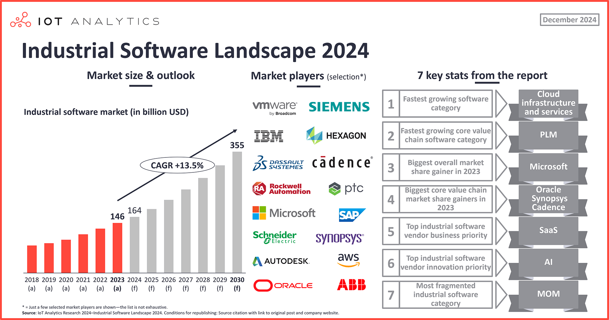

## Table of Contents

## What is the software industry?

The software industry is all about creating, selling, and maintaining software. Software is like a set of instructions that tells a computer what to do. Companies in this industry make different kinds of software, like apps for phones, programs for computers, and systems that help big businesses run smoothly. They also offer services to help people use their software better.

People who work in the software industry include programmers, who write the code, and software engineers, who design and build the software. There are also testers, who check if the software works right, and support staff, who help users with any problems. The industry is always changing because new technology keeps coming out, so people in this field need to keep learning and adapting.

## What are the main types of software products?

Software products come in different types, but the main ones are system software and application software. System software is like the basic stuff that makes your computer work. It includes things like the operating system, which is like the boss of your computer, telling it how to run. It also includes drivers, which help your computer talk to things like your printer or your mouse. Without system software, your computer wouldn't be able to do much at all.

Application software is different. It's the stuff you use to do specific tasks on your computer. For example, a word processor is an application that helps you write documents. Games, web browsers, and photo editors are also application software. They're made to help you do things you want to do, like playing a game or editing a picture. Application software needs system software to work, but it's what most people think of when they think about using a computer.

There's also another type called utility software, which helps keep your computer running smoothly. Utility software includes things like antivirus programs, which protect your computer from bad stuff, and disk cleanup tools, which help keep your computer organized. While not as well-known as system or application software, utility software is important for making sure your computer stays healthy and works well.

## How has the software industry evolved over the past decade?

Over the past decade, the software industry has changed a lot. One big change is the rise of cloud computing. Before, people had to install software on their own computers. Now, they can use software that's stored on the internet, which is called the cloud. This makes it easier for companies to update their software and for people to use it from anywhere. Another big change is the growth of mobile apps. With more people using smartphones, there's been a huge increase in apps for phones and tablets. This has made the software industry focus more on making things that work well on small screens.

Another important change is the way software is made. More companies are using agile methods, which means they work in small, quick steps instead of taking a long time to finish a big project. This helps them make software faster and fix problems more easily. Also, [artificial intelligence](/wiki/ai-artificial-intelligence) and [machine learning](/wiki/machine-learning) have become a big part of the software industry. These technologies help software learn and get better over time, which is used in things like voice assistants and recommendation systems. Overall, the software industry has become more about quick updates, mobile use, and smart technology.

## What are the key market segments in the software industry?

The software industry is split into different parts, called market segments. One big segment is enterprise software. This is software that big companies use to help them run their business. It includes things like software for managing customers, keeping track of money, and helping workers do their jobs better. Another segment is consumer software, which is made for regular people to use on their own computers or phones. This includes games, apps for taking pictures, and programs for writing documents.

Another important segment is the cloud software market. This is software that people can use over the internet instead of installing it on their own computers. It's popular because it's easy to update and people can use it from anywhere. The last big segment is the software as a service (SaaS) market. This is a type of cloud software where people pay to use the software, usually every month. It's like renting software instead of buying it, and it's used for things like email, project management, and customer support.

These segments show how the software industry has grown and changed. Each part of the industry focuses on different needs and types of customers. Enterprise software helps big businesses, consumer software is for everyday use, cloud software makes things easier to use and update, and SaaS gives people a new way to pay for and use software.

## Who are the major players in the software industry?

The software industry has many big companies that make important software. Some of the biggest names are Microsoft, which makes the Windows operating system and the Office suite of programs like Word and Excel. Another major player is Oracle, known for its database software that helps businesses keep track of their information. Adobe is also a big name, famous for its creative software like Photoshop and Illustrator, which are used by artists and designers.

Other important companies include Salesforce, which is a leader in customer relationship management (CRM) software, helping businesses manage their sales and customer interactions. Google is another giant, not just for its search engine but also for its G Suite, which includes tools like Gmail and Google Docs. Amazon, known for its online shopping, also plays a big role with its Amazon Web Services (AWS), providing cloud computing services that many businesses rely on.

These companies have a big impact on the software industry. They keep coming up with new ideas and products, and they often buy smaller companies to grow even more. Their software is used by millions of people and businesses around the world, making them key players in how technology keeps changing and improving.

## What are the current trends driving the software industry?

One of the biggest trends in the software industry right now is the move towards cloud computing. More and more companies are using the cloud to store their data and run their software. This means they don't need to keep big servers in their offices. Instead, they can use services like Amazon Web Services or Microsoft Azure to do their work. This makes it easier to update software and lets people work from anywhere. Another trend is the growth of artificial intelligence (AI) and machine learning. These technologies are being used to make software smarter. For example, they help with things like predicting what customers might want to buy or making voice assistants like Siri or Alexa better at understanding what people are saying.

Another important trend is the focus on cybersecurity. As more things move to the cloud and more people use the internet, keeping information safe is a big deal. Companies are spending more money on software that can protect against hackers and other bad guys. Also, there's a trend towards more personalized software. This means software that can change to fit what each person needs. For example, apps that learn what you like and show you things you might be interested in. These trends are changing the way software is made and used, making it more flexible, smart, and safe.

## How does the software development lifecycle impact the industry?

The software development lifecycle (SDLC) is like a roadmap that helps companies build software. It has steps like planning, building, testing, and putting the software out for people to use. This process is important because it helps make sure the software works well and is safe to use. When companies follow the SDLC, they can find and fix problems early, which saves time and money. It also helps them keep their customers happy because the software meets their needs and works the way it should.

The SDLC also affects how fast new software comes out. With methods like agile development, which is part of the SDLC, companies can work in small steps and update their software often. This means they can respond quickly to what customers want and fix any issues faster. This quick pace of development is a big part of why the software industry keeps growing and changing. By using the SDLC well, companies can stay ahead in a competitive market and keep making software that people want to use.

## What are the challenges faced by software companies today?

One big challenge for software companies today is keeping up with new technology. Things like artificial intelligence, cloud computing, and cybersecurity are changing fast. Companies need to learn about these new technologies and use them in their software. If they don't, they might fall behind other companies that are using the latest tech. Another challenge is finding and keeping good workers. People who know how to make software, like programmers and engineers, are in high demand. It can be hard for companies to find enough of these workers and to keep them happy and working for their company.

Another challenge is making sure their software is safe and secure. With more people using the internet and storing their information in the cloud, hackers are always trying to break into systems. Software companies need to spend a lot of time and money making sure their software is safe from these attacks. They also need to follow rules and laws about keeping data private, which can be hard and expensive. Finally, there's a lot of competition in the software industry. Companies need to keep coming up with new ideas and making their software better to stay ahead of other companies. This means they always have to be thinking about what's next and how to keep their customers happy.

## How do regulations and compliance affect the software industry?

Regulations and compliance are big deals for software companies. They have to follow rules set by governments and other groups to make sure their software is safe and fair. For example, there are laws about keeping people's personal information private, like the General Data Protection Regulation (GDPR) in Europe. Companies need to spend time and money to make sure their software follows these rules. If they don't, they could get in trouble and have to pay big fines. This can make it harder and more expensive for them to make and sell software.

Also, different countries have different rules, which can be confusing. A company that wants to sell its software all over the world needs to understand and follow all these different rules. This means they might need to change their software a bit for each country. Keeping up with these rules takes a lot of work and can slow down how fast they can make new software. But, it's important because it helps keep people's information safe and makes sure everyone is treated fairly.

## What role does open source software play in the industry?

Open source software is really important in the software industry. It's software that anyone can look at, change, and share. This means that lots of people can work together to make it better. Companies use open source software because it can save them money. Instead of building everything from scratch, they can use what's already been made and just add what they need. It also helps them work faster because they don't have to start from the beginning. Plus, having lots of people look at the code can make it safer and more reliable.

Another big thing about open source software is that it pushes the whole industry forward. When people share their ideas and code, it helps everyone learn and come up with new things. Big companies like Google and Microsoft even use open source software in their products. They also give back to the open source community by sharing their own code. This creates a cycle where everyone benefits. Open source software is a big part of how the software industry keeps growing and changing.

## How is artificial intelligence transforming the software industry?

Artificial intelligence, or AI, is changing the software industry in big ways. AI makes software smarter by letting it learn from data and make decisions on its own. This means software can do things like understand what people are saying, recognize faces, and even drive cars. Companies are using AI to make their products better. For example, when you use a search engine, AI helps find the best results for you. Or when you shop online, AI can suggest things you might like based on what you've looked at before. This makes the software more helpful and personalized for each user.

AI is also making it easier for companies to make new software. With AI tools, developers can write code faster and find mistakes more quickly. This speeds up the whole process of building software. Plus, AI can help with things like testing software to make sure it works right and keeping it safe from hackers. As AI keeps getting better, it's going to keep changing the software industry, making software more powerful and easier to use for everyone.

## What are the future predictions for the growth and direction of the software industry?

The software industry is expected to keep growing a lot in the future. More and more people will use software for work and at home. The cloud will become even more important, with more companies using it to store their data and run their software. This will make it easier for them to work from anywhere and update their software quickly. Artificial intelligence will also play a bigger role. Software will get smarter and be able to do more things on its own, like helping people find information or making decisions. This will make software more useful and personalized for everyone.

Another big change will be in how software is made. More companies will use new ways of building software, like agile methods, to make it faster and better. They will also use AI to help them write code and test their software. Cybersecurity will be a big focus too, as companies work to keep their software safe from hackers. The software industry will keep changing and growing, driven by new technology and the need for better, safer, and more helpful software for everyone.

## References & Further Reading

[1]: Bergstra, J., Bardenet, R., Bengio, Y., & Kégl, B. (2011). ["Algorithms for Hyper-Parameter Optimization."](https://papers.nips.cc/paper/4443-algorithms-for-hyper-parameter-optimization) Advances in Neural Information Processing Systems 24.

[2]: ["Advances in Financial Machine Learning"](https://www.amazon.com/Advances-Financial-Machine-Learning-Marcos/dp/1119482089) by Marcos Lopez de Prado

[3]: ["Evidence-Based Technical Analysis: Applying the Scientific Method and Statistical Inference to Trading Signals"](https://www.amazon.com/Evidence-Based-Technical-Analysis-Scientific-Statistical/dp/0470008741) by David Aronson

[4]: ["Machine Learning for Algorithmic Trading"](https://github.com/stefan-jansen/machine-learning-for-trading) by Stefan Jansen

[5]: ["Quantitative Trading: How to Build Your Own Algorithmic Trading Business"](https://www.amazon.com/Quantitative-Trading-Build-Algorithmic-Business/dp/1119800064) by Ernest P. Chan