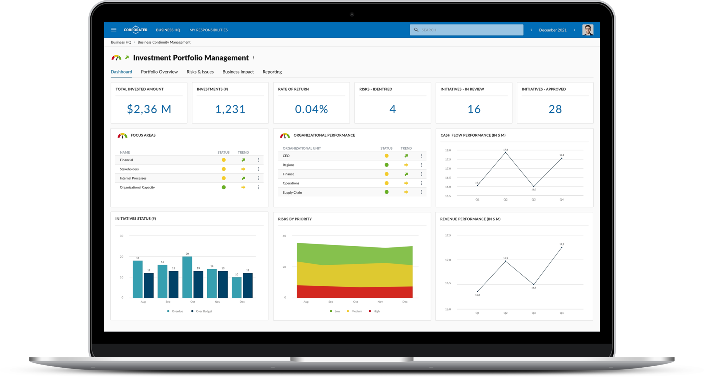

## Table of Contents

## What is portfolio management and why is it important?

Portfolio management is the process of managing a collection of investments, like stocks, bonds, and other assets, to meet specific financial goals. It involves choosing the right mix of investments and regularly adjusting them to balance risk and reward. Think of it as organizing your financial resources to help you achieve things like saving for retirement, buying a house, or funding your child's education.

It's important because it helps you make the most of your money while keeping risks under control. By spreading your investments across different types of assets, you can reduce the impact of any single investment performing poorly. This way, you're not putting all your eggs in one basket. Good portfolio management also involves keeping an eye on your investments and making changes as needed, which can lead to better long-term financial stability and growth.

## What are the basic features to look for in portfolio management software?

When looking for portfolio management software, you want something that's easy to use and helps you keep track of your investments. The software should let you see all your investments in one place, like stocks, bonds, and funds. It should also show you how your investments are doing over time with clear charts and graphs. This way, you can quickly understand if your portfolio is growing or if you need to make changes.

Another important feature is the ability to set up alerts and notifications. This means the software can tell you when something important happens, like if a stock price drops a lot or if it's time to rebalance your portfolio. It's also helpful if the software can give you reports and analysis, so you can see how well your investments are doing compared to your goals. This can help you make smarter decisions about where to put your money.

Lastly, good portfolio management software should let you make trades and adjust your investments right from the platform. It should be secure, so your financial information stays safe. And if you're not sure about something, it's great if the software has tools to help you learn more about investing or even connects you with financial advisors for advice.

## How do beginner investors benefit from using portfolio management software?

Beginner investors can really benefit from using portfolio management software because it makes keeping track of their investments easy. The software shows all their investments in one place, like a big picture of their money. This helps them see how each part of their portfolio is doing without having to look at different accounts or websites. It's like having a helper that organizes everything for them, so they don't feel overwhelmed.

Another big help is that the software often gives beginners tips and alerts. For example, it might tell them when it's a good time to buy or sell something, or remind them to check their investments regularly. This can be super useful for people who are new to investing because it's like having a guide to help them make better choices. Plus, many programs have learning tools or even connect users with financial advisors, so beginners can learn as they go and feel more confident about their investments.

## What are some popular portfolio management software options for beginners?

For beginners looking to manage their investments, some popular portfolio management software options are Mint, Personal Capital, and Betterment. Mint is great because it's free and easy to use. It helps you see all your money in one place, not just investments but also your bank accounts and bills. Personal Capital is another good choice. It offers a free tool to track your investments and gives you advice on how to do better. It's a bit more focused on investments, so if you want to keep a close eye on your stocks and funds, this could be the one for you.

Betterment is a bit different because it's a robo-advisor. This means it not only helps you track your investments but also makes choices for you based on your goals and how much risk you want to take. It's user-friendly and can be a good fit if you're new to investing and want some help with the decisions. All these options are designed to be easy for beginners, so you can pick the one that feels right for you and start managing your money better.

## How can portfolio management software help with diversification?

Portfolio management software helps with diversification by showing you all your investments in one place. This way, you can see if you're putting too much money into one type of investment, like all in stocks or all in one company. The software can help you spread your money across different types of investments, like stocks, bonds, and real estate. This is important because it reduces the risk of losing a lot of money if one investment does badly.

The software often has tools that suggest how to diversify better. It might tell you if you need more of one kind of investment to balance out your portfolio. For example, if you have a lot of risky stocks, the software might suggest adding some safer bonds. By following these suggestions, you can make your investments more balanced and less likely to be hurt by big ups and downs in the market.

## What advanced features should intermediate users look for in portfolio management software?

Intermediate users should look for portfolio management software that offers advanced analytics and risk assessment tools. These features help you dive deeper into your investments. For example, the software should be able to show you detailed performance metrics, like the Sharpe ratio or alpha, which tell you how well your investments are doing compared to the market. It should also have risk analysis tools that can show you how different investments might affect your portfolio's overall risk. This way, you can make smarter decisions about where to put your money and how to balance risk and reward.

Another important feature for intermediate users is the ability to backtest strategies. This means you can try out different investment ideas using past data to see how they would have worked. It's like a practice run for your investment strategy. The software should also support customizable alerts and more detailed reporting options, so you can keep a close eye on your investments and get the information you need to make changes quickly. These advanced features help intermediate users manage their portfolios more effectively and make more informed decisions.

## How does portfolio management software assist with tax optimization?

Portfolio management software helps with tax optimization by showing you how to make smart moves with your investments to pay less in taxes. It can suggest ways to sell investments at the right time to take advantage of tax benefits, like using losses to offset gains. This is called tax-loss harvesting, and the software can keep track of when and how to do it best. It also helps you understand the tax impact of different investments, so you can choose ones that will help you keep more of your money.

The software can also give you reports that show you how much tax you might have to pay on your investments. This can help you plan better and make changes to your portfolio to lower your tax bill. By keeping everything organized and giving you clear information, the software makes it easier for you to make choices that save you money on taxes.

## What are the key differences between desktop and cloud-based portfolio management software?

Desktop portfolio management software is installed directly on your computer. This means you have full control over your data because it stays on your device. It can be faster and more reliable since it doesn't depend on an internet connection to work. However, you have to make sure your computer is safe and up to date, and if you want to use the software on another device, you'll need to install it there too. Also, updates and new features might not come as quickly as with cloud-based software.

Cloud-based portfolio management software, on the other hand, runs on the internet. You can access it from any device with a web browser, which makes it easy to check your investments from anywhere. The software company takes care of updates and security, so you don't have to worry about that. But, you need a good internet connection to use it, and there might be concerns about the safety of your data since it's stored online. Also, you usually need to pay a subscription fee to keep using the service.

## How can expert users leverage API integrations in portfolio management software?

Expert users can use API integrations in portfolio management software to connect different tools and services together. This means they can pull in data from many places, like stock markets, financial news, and other investment platforms, all into one spot. By doing this, they can see a complete picture of their investments and make better decisions. For example, they might connect their portfolio software to a stock market API to get real-time prices and trends, or to a financial news API to stay updated on events that could affect their investments.

These API integrations also let expert users automate parts of their investment strategy. They can set up rules and triggers that make trades or send alerts based on certain conditions. For instance, if a stock reaches a certain price, the software can automatically buy or sell it. This saves time and helps them stick to their investment plan without having to watch the markets all the time. By using APIs, expert users can make their portfolio management more efficient and tailored to their specific needs.

## What are some of the best portfolio management software options for professional investors?

For professional investors, some of the best portfolio management software options are Bloomberg Terminal, Morningstar Direct, and FactSet. Bloomberg Terminal is a top choice because it gives you a lot of detailed information about the markets and lets you trade right from the platform. It's great for professionals who need to keep up with everything happening in the financial world and make quick decisions. Morningstar Direct is another good option. It's known for its powerful tools to analyze investments and create detailed reports, which can help professionals make smart choices about where to put their money.

FactSet is also popular among professional investors. It combines data from many sources and has strong tools for research and analysis. This helps professionals see the big picture and find new investment opportunities. All these software options are designed to meet the needs of people who manage money for a living, with features that help them track their investments closely, make trades, and stay on top of market trends.

## How do you evaluate the security features of portfolio management software?

When evaluating the security features of portfolio management software, it's important to check if the software uses strong encryption to protect your data. Encryption is like a secret code that keeps your information safe from hackers. You should also look for software that has two-[factor](/wiki/factor-investing) authentication. This means you need two ways to prove it's really you before you can log in, like a password and a code sent to your phone. It's also good to see if the software gets regular security updates to fix any new problems that might come up.

Another thing to consider is where the software stores your data. If it's cloud-based, make sure the company follows strict rules to keep your information safe. They should have clear policies on who can see your data and how they protect it. It's also helpful if the software lets you know about any security issues right away, so you can take action quickly. By looking at these things, you can feel more confident that your investments are safe and secure.

## What future trends should experts be aware of in portfolio management software development?

Experts should keep an eye on how portfolio management software is becoming smarter with [artificial intelligence](/wiki/ai-artificial-intelligence) (AI) and [machine learning](/wiki/machine-learning). These technologies help the software learn from past data to make better predictions and give more personalized advice. For example, AI can suggest when to buy or sell investments based on market trends and your personal goals. It can also help with things like figuring out the best way to diversify your portfolio or how to save on taxes. As AI gets better, it will make managing investments easier and more effective for everyone.

Another trend to watch is the growing use of blockchain and cryptocurrencies in portfolio management software. More and more people are investing in digital currencies, so software that can handle these new types of investments is becoming important. Blockchain technology can also make transactions safer and more transparent. This means experts will need to understand how to use these new tools and how they can fit into a traditional investment strategy. Keeping up with these trends will help professionals stay ahead in the fast-changing world of finance.

## References & Further Reading

[1]: Bergstra, J., Bardenet, R., Bengio, Y., & Kégl, B. (2011). ["Algorithms for Hyper-Parameter Optimization."](https://dl.acm.org/doi/10.5555/2986459.2986743) Advances in Neural Information Processing Systems 24.

[2]: ["Advances in Financial Machine Learning"](https://www.amazon.com/Advances-Financial-Machine-Learning-Marcos/dp/1119482089) by Marcos Lopez de Prado

[3]: ["Evidence-Based Technical Analysis: Applying the Scientific Method and Statistical Inference to Trading Signals"](https://www.amazon.com/Evidence-Based-Technical-Analysis-Scientific-Statistical/dp/0470008741) by David Aronson

[4]: ["Machine Learning for Algorithmic Trading"](https://github.com/stefan-jansen/machine-learning-for-trading) by Stefan Jansen

[5]: ["Quantitative Trading: How to Build Your Own Algorithmic Trading Business"](https://www.amazon.com/Quantitative-Trading-Build-Algorithmic-Business/dp/1119800064) by Ernest P. Chan