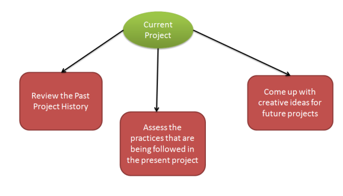

## Table of Contents

## What is software risk?

Software risk refers to the potential problems or uncertainties that can arise during the development and use of software. These risks can affect the project's timeline, budget, and overall quality. For example, if a team member leaves unexpectedly, it might delay the project because the remaining team has to cover their work.

Managing software risk involves identifying, analyzing, and responding to these potential issues before they become major problems. This can include setting up backup plans, like having extra team members ready to step in, or using tools to track progress and spot issues early. By addressing risks proactively, teams can increase the chances of successfully completing their software projects on time and within budget.

## Why is it important to manage software risk?

Managing software risk is important because it helps keep projects on track. When you know what could go wrong, you can plan ahead to stop small problems from turning into big ones. This means you can finish your project on time and not spend more money than you planned. It's like knowing it might rain, so you bring an umbrella to stay dry.

Also, managing risk makes everyone on the team feel more confident. When people know that there are plans to deal with possible problems, they worry less and can focus better on their work. This can make the whole team work better together and create a better software product. It's like having a safety net that lets you try new things without being too scared of falling.

## What are the common types of software risks?

There are several common types of software risks that can affect a project. One type is schedule risk, which happens when the project takes longer than expected. This can be because of things like not having enough people to work on the project, or because some tasks take more time than planned. Another type is budget risk, where the project costs more money than expected. This can happen if the team needs to buy more tools or if they have to work extra hours to finish the project.

Technical risk is another big type, and it happens when the technology used in the project doesn't work as expected. This could be because the software is too hard to use, or because there are bugs that need fixing. There's also resource risk, where the team might not have the right skills or enough people to do the work. This can slow down the project or make it harder to finish.

Lastly, there's operational risk, which is about how the software works once it's done. If the software is hard to use or doesn't do what it's supposed to, it can cause problems for the people using it. There's also external risk, which comes from things outside the project, like changes in the law or new competitors. All these risks can make it harder to finish the project on time and within budget, so it's important to think about them and plan ahead.

## How can software risks be identified?

Software risks can be identified by talking to everyone involved in the project. This means having meetings with the team, talking to the people who will use the software, and even asking experts for their thoughts. By asking questions and listening to what everyone says, you can find out what might go wrong. For example, if the team says they need more time to learn a new tool, that's a sign of a technical risk.

Another way to identify software risks is by looking at past projects. If similar projects had problems before, those same problems might happen again. This can be done by reading old project reports or talking to people who worked on those projects. Also, using tools like checklists can help make sure you don't miss any common risks. For instance, if past projects often ran over budget, you can check if the same thing might happen this time.

Lastly, keeping an eye on the project as it goes along can help spot risks early. This means regularly checking how things are going and making changes if needed. If something starts to go wrong, like a team member leaving or a tool not working, you can see it quickly and figure out what to do. This way, you can fix problems before they get too big.

## What are some tools and techniques used for software risk analysis?

One common tool for software risk analysis is the Risk Register. This is like a big list where you write down all the risks you can think of, how likely they are to happen, and what you can do about them. It helps everyone on the team see what might go wrong and plan ahead. Another tool is the SWOT Analysis, which stands for Strengths, Weaknesses, Opportunities, and Threats. This helps you look at the good and bad parts of your project and find risks that come from inside and outside the project.

There are also techniques like brainstorming, where everyone on the team gets together to think of all the things that could go wrong. This can help find risks that one person might not see on their own. Another technique is the Delphi Method, where experts are asked to give their opinions without talking to each other. This helps get different views on what risks might be important. Both of these techniques help make sure you don't miss any risks by talking to a lot of people and getting different ideas.

Lastly, using software tools like Monte Carlo Simulation can help with risk analysis. This tool uses math to guess how likely different risks are to happen and how they might affect the project. It's like playing out different versions of the project to see what might go wrong. By using these tools and techniques, you can get a good picture of the risks and make plans to deal with them before they cause big problems.

## How do you prioritize software risks?

To prioritize software risks, you need to look at how likely each risk is to happen and how bad it would be if it did happen. For example, if a risk has a high chance of happening and would cause a lot of problems, it should be at the top of your list. This means you need to pay more attention to it and make plans to stop it from happening or fix it quickly if it does.

Another way to prioritize risks is by thinking about how they affect the project's goals. If a risk could make the project late or cost more money, it's more important than a risk that just makes things a little harder but doesn't change the big picture. By sorting risks this way, you can focus on the ones that matter most and make sure the project stays on track.

## What strategies can be used to mitigate software risks?

One strategy to mitigate software risks is to have a backup plan. This means thinking about what could go wrong and figuring out what to do if it does. For example, if there's a risk that a team member might leave, you could train someone else to do their job. This way, if the person leaves, the project can keep going without too much delay. Another way to mitigate risks is by regularly checking on the project. This helps you see problems early and fix them before they get big. If you notice that a part of the software isn't working right, you can fix it quickly instead of waiting until the end of the project.

Another strategy is to use tools and techniques to help manage risks. For example, a risk register can help you keep track of all the risks and what you're doing about them. By writing everything down, you can make sure nothing gets forgotten. Also, talking to everyone on the team and listening to their ideas can help find risks that you might not see on your own. By working together and using these tools, you can make the project safer and more likely to succeed.

## How does software risk management integrate with project management?

Software risk management is a big part of project management. It helps make sure the project goes smoothly by finding and dealing with problems before they get too big. When you manage risks, you look at what could go wrong and make plans to stop it from happening. This means you can finish the project on time and not spend more money than you planned. Project managers use risk management to keep everything under control, like a captain steering a ship through rough waters.

In a project, risk management works hand in hand with other parts of project management. For example, when you plan the project, you think about the risks and include ways to deal with them in your plan. During the project, you keep checking on the risks and make changes if you need to. This is like having a safety net that lets you try new things without being too scared of falling. By doing this, you can make sure the project stays on track and everyone on the team feels more confident and focused on their work.

## What are the best practices for documenting software risks?

Documenting software risks is important to keep track of what might go wrong and what you're doing about it. A good way to do this is by using a risk register. This is like a big list where you write down all the risks you can think of, how likely they are to happen, and what you can do about them. You should update this list often, so everyone on the team knows what's going on. It's also helpful to write down who is in charge of dealing with each risk. This way, everyone knows their job and can work together to keep the project safe.

Another good practice is to keep the risk documentation simple and easy to understand. Use clear language so that everyone on the team can read it and know what it means. You can also add examples or stories to make the risks easier to understand. It's important to keep the risk documentation in a place where everyone can see it, like on a shared computer or in a team meeting. By doing this, you make sure that everyone is on the same page and can help manage the risks together.

## How can software risk management be adapted for agile development environments?

In agile development environments, software risk management needs to be flexible and quick to change. Agile teams work in short cycles called sprints, so they need to check for risks often and update their plans fast. Instead of making a big risk plan at the start, agile teams keep an eye on risks all the time. They talk about risks in their daily meetings and can change what they're doing if a new risk comes up. This way, they can deal with problems as soon as they see them, which helps keep the project moving smoothly.

Using tools like a risk register can still be helpful in agile environments, but it needs to be simple and easy to update. The team can add new risks and change old ones as they go along. Also, because agile teams work closely together, they can use their meetings to talk about risks and come up with ideas to fix them. By keeping risk management simple and part of their everyday work, agile teams can make sure they're ready for anything that might go wrong and keep their projects on track.

## What are the challenges in software risk management and how can they be overcome?

One big challenge in software risk management is that it can be hard to see all the risks at the start of a project. Things can change as the project goes on, and new risks can pop up that no one thought of before. This can make it hard to plan ahead and keep the project on track. To overcome this, teams need to keep checking for risks all the time. By talking to everyone involved and looking at how the project is going, they can spot new risks early and make plans to deal with them. It's like being ready to change your plans if the weather changes while you're on a trip.

Another challenge is that managing risks can take a lot of time and effort. People might feel like they're spending too much time worrying about what could go wrong instead of actually doing the work. But not paying attention to risks can lead to big problems later. To solve this, teams can use simple tools and techniques to make risk management easier. For example, they can use a risk register to keep track of risks and update it quickly. Also, by making risk management part of their everyday work, like talking about risks in meetings, teams can handle it without it taking too much time. This way, they can focus on their work and still be ready for any problems that might come up.

## How can organizations measure the effectiveness of their software risk management processes?

Organizations can measure the effectiveness of their software risk management processes by looking at how well they can spot and deal with risks. If the team finds risks early and makes good plans to handle them, it means their risk management is working well. They can also check if the project stays on time and within budget, which shows that the risk management helped avoid big problems. Talking to the team and seeing if they feel confident and prepared can also tell you a lot about how effective the risk management is.

Another way to measure effectiveness is by comparing the current project with past projects. If the current project has fewer surprises and less trouble than before, it means the risk management is better. Organizations can use tools like surveys or feedback forms to ask the team about their experience with risk management. By looking at all these things together, organizations can see if their risk management is helping them finish projects successfully and if there are any areas they need to improve.

## References & Further Reading

[1]: Aldridge, I. (2013). ["High-Frequency Trading: A Practical Guide to Algorithmic Strategies and Trading Systems."](https://www.amazon.com/High-Frequency-Trading-Practical-Algorithmic-Strategies/dp/1118343506) Wiley.

[2]: Cartea, Á., Jaimungal, S., & Penalva, J. (2015). ["Algorithmic and High-Frequency Trading."](https://assets.cambridge.org/97811070/91146/frontmatter/9781107091146_frontmatter.pdf) Cambridge University Press.

[3]: Jones, C. M. (2013). ["What do we know about high-frequency trading?"](https://papers.ssrn.com/sol3/papers.cfm?abstract_id=2236201) Columbia University Working Paper.

[4]: U.S. Securities and Exchange Commission & Commodity Futures Trading Commission. (2010). ["Findings Regarding the Market Events of May 6, 2010."](https://www.sec.gov/news/studies/2010/marketevents-report.pdf)

[5]: Kissell, R. (2013). ["The Science of Algorithmic Trading and Portfolio Management."](https://www.sciencedirect.com/book/9780124016897/the-science-of-algorithmic-trading-and-portfolio-management) Academic Press.