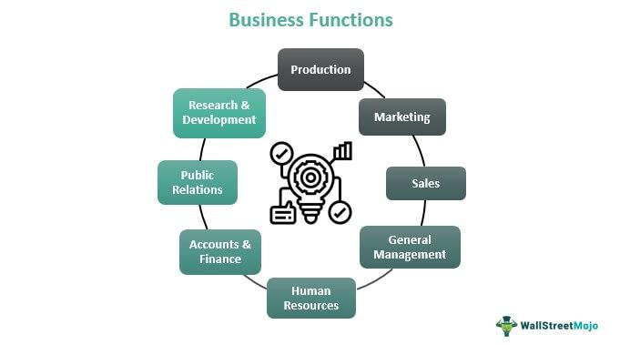

## Table of Contents

## What is Solana (SOL) and what is its primary purpose?

Solana (SOL) is a blockchain platform designed to be fast and efficient. It was created to help developers build applications that can process many transactions quickly and at a low cost. The main technology behind Solana is called Proof of History (PoH), which helps speed up the process of verifying transactions on the blockchain.

The primary purpose of Solana is to make it easier for developers to create decentralized applications (dApps) and for users to interact with these applications. Solana aims to solve the problem of slow transaction speeds and high costs that are common in other blockchain systems. By doing this, Solana wants to make blockchain technology more accessible and useful for everyday use.

## Who founded Solana and when was it launched?

Solana was founded by Anatoly Yakovenko. He used to work at a company called Qualcomm, where he helped make technology for phones. Anatoly came up with the idea for Solana because he wanted to make a blockchain that could handle a lot of transactions very quickly.

Solana was officially launched in March 2020. Since then, it has grown a lot and many people and companies have started using it to build different kinds of applications. Solana's goal is to make blockchain technology easier to use and more helpful for everyone.

## How does Solana's blockchain technology work?

Solana's blockchain technology works by using a special system called Proof of History (PoH). PoH is like a clock that everyone on the blockchain can see. It helps everyone agree on the order of transactions without having to check with each other all the time. This makes the blockchain faster because it doesn't have to wait for everyone to confirm every single transaction. Instead, the transactions are quickly added to the blockchain in the order they happen, making the whole process much quicker.

Another important part of Solana is its way of handling lots of transactions at the same time. Solana can process many transactions at once because it splits them into smaller groups and works on them in parallel. This is like having many workers doing different parts of a job at the same time, which makes everything go faster. By doing this, Solana can handle thousands of transactions per second, which is much faster than many other blockchains. This speed and efficiency make Solana a good choice for building applications that need to work quickly and smoothly.

## What makes Solana different from other blockchain platforms like Ethereum?

Solana is different from Ethereum mainly because it is much faster and can handle more transactions at the same time. Ethereum can get slow and expensive when a lot of people are using it, but Solana uses a special technology called Proof of History (PoH) that helps it process transactions quickly and cheaply. This makes Solana a good choice for applications that need to work fast, like games or financial services.

Another big difference is how Solana is designed to work with other systems. Solana can easily connect with other blockchains and traditional systems, which makes it more flexible. Ethereum, on the other hand, has been working on improving its speed and connectivity, but it's still not as fast as Solana. This ability to work well with others and handle a lot of transactions makes Solana stand out in the world of blockchain technology.

## What is the role of SOL, the native cryptocurrency of Solana?

SOL is the main cryptocurrency used on the Solana blockchain. It's like the money that people use to pay for things on Solana. When someone wants to use an application built on Solana, they usually need to pay a small amount of SOL to cover the cost of the transaction. This is similar to how you might pay a small fee when you use a credit card or a bank.

SOL also plays a big role in keeping the Solana network running smoothly. People who help run the network, called validators, get paid in SOL for their work. They use their computers to check and add transactions to the blockchain. By using SOL, the Solana network can reward these validators and make sure that the system stays secure and fast.

## How does Solana achieve high transaction speeds and scalability?

Solana achieves high transaction speeds and scalability through its unique Proof of History (PoH) technology. PoH works like a clock that everyone on the Solana network can see. It helps everyone agree on the order of transactions without needing to check with each other all the time. This makes the blockchain faster because it doesn't have to wait for everyone to confirm every single transaction. Instead, transactions are quickly added to the blockchain in the order they happen, making the whole process much quicker.

Another way Solana achieves high transaction speeds is by processing many transactions at the same time. Solana splits transactions into smaller groups and works on them in parallel. This is like having many workers doing different parts of a job at the same time, which makes everything go faster. By doing this, Solana can handle thousands of transactions per second, which is much faster than many other blockchains. This speed and efficiency make Solana a good choice for building applications that need to work quickly and smoothly.

## What are some of the key features of Solana that benefit developers?

Solana has several key features that make it easier for developers to build applications. One of the biggest advantages is its speed and low cost. Solana can handle thousands of transactions per second, which means that apps built on Solana can work quickly and smoothly. This is really helpful for developers who are making things like games or financial tools that need to process a lot of information fast. Plus, the cost to use Solana is usually low, so developers don't have to worry about their users paying high fees.

Another important feature is that Solana works well with other systems. It can connect easily with other blockchains and traditional systems, which makes it more flexible for developers. They can build apps that work with different technologies without a lot of extra work. This ability to connect with other systems makes it easier for developers to create apps that can be used in many different places. Solana also has tools and resources that help developers get started and keep their apps running smoothly, which makes the whole process of building on Solana easier and more enjoyable.

## Can you explain the consensus mechanism used by Solana?

Solana uses a special way to make sure everyone agrees on what's happening on the blockchain. This way is called Proof of History (PoH) combined with Proof of Stake (PoS). PoH works like a clock that everyone can see. It helps everyone agree on the order of transactions without having to check with each other all the time. This makes the blockchain faster because it doesn't have to wait for everyone to confirm every single transaction. Instead, the transactions are quickly added to the blockchain in the order they happen, making the whole process much quicker.

In addition to PoH, Solana uses Proof of Stake (PoS) to help keep the network secure. In PoS, people who own SOL, the cryptocurrency of Solana, can become validators. Validators are like helpers who use their computers to check and add transactions to the blockchain. They get paid in SOL for their work. By using PoS, Solana makes sure that the people who help run the network have a stake in keeping it safe and working well. This combination of PoH and PoS helps Solana be both fast and secure.

## What are some popular applications and projects built on Solana?

One popular application built on Solana is Serum, which is a decentralized exchange. This means it's a place where people can trade different types of cryptocurrencies without needing a middleman like a bank. Serum is special because it can handle a lot of trades very quickly and at a low cost, thanks to Solana's fast blockchain. Another cool project on Solana is Raydium, which works with Serum to make trading even easier. Raydium is like a tool that helps you find the best prices for your trades and does it all very fast.

Another interesting application is Audius, a music streaming platform built on Solana. Audius lets artists upload their music directly to the blockchain, so they can share it with fans without needing big companies in the middle. This means artists can keep more of their money and have more control over their work. Solana's speed and low cost make it perfect for a platform like Audius, where lots of people are listening to music at the same time.

There's also Solflare, which is a wallet for Solana. A wallet is like a digital bank account where you can keep your SOL and other cryptocurrencies safe. Solflare is easy to use and helps you manage your money on the Solana blockchain. It's a great example of how Solana's technology can be used to make things simpler and more secure for everyday users.

## How does Solana handle security and what are its potential vulnerabilities?

Solana keeps its network safe using a system called Proof of Stake (PoS). In PoS, people who own SOL, the cryptocurrency of Solana, can become validators. Validators are like helpers who use their computers to check and add transactions to the blockchain. They get paid in SOL for their work. By using PoS, Solana makes sure that the people who help run the network have a reason to keep it safe and working well. This helps protect the network from attacks because if someone tries to do something bad, the validators can stop them and keep the system running smoothly.

However, like any technology, Solana has some potential vulnerabilities. One issue that has come up is the risk of network outages. Sometimes, if too many people try to use Solana at the same time, it can slow down or even stop working for a little while. This can be frustrating for users and can make it hard for them to use the apps built on Solana. Another concern is that if a group of validators work together, they could try to control the network. This is called a "51% attack," where a group with enough power could try to change things on the blockchain. Solana's team is always working to fix these problems and make the network safer and more reliable for everyone.

## What are the future developments and upgrades planned for Solana?

Solana's team is always working on making the blockchain better. They are planning to make the network even faster and more reliable. One big thing they are working on is improving how the network can handle a lot of people using it at the same time. This will help stop the network from slowing down or stopping when it gets busy. They are also looking at ways to make the system even more secure, so people can trust it more and use it for important things like money and business.

Another important part of Solana's future plans is making it easier for developers to build apps on the blockchain. They want to create more tools and resources that can help developers get started quickly and make their apps work well. This will make Solana a more popular place for people to build new and exciting applications. By focusing on speed, reliability, security, and developer support, Solana hopes to grow and become even more useful for everyone who uses it.

## How can someone get started with using or investing in Solana?

To get started with using or investing in Solana, the first thing you need to do is set up a digital wallet that supports Solana. A popular wallet for Solana is called Phantom, which you can download as a browser extension or use on your phone. Once you have your wallet set up, you'll need to get some SOL, the cryptocurrency used on Solana. You can buy SOL from a cryptocurrency exchange like Binance or Coinbase, and then transfer it to your wallet. After you have SOL in your wallet, you're ready to start using Solana's network and the applications built on it.

If you're interested in investing in Solana, you can buy SOL on a cryptocurrency exchange. It's a good idea to do some research first to understand how Solana works and what makes it different from other blockchains. You might also want to look at what projects and applications are being built on Solana, as this can give you an idea of how the network is growing and being used. Remember, investing in cryptocurrencies can be risky, so it's important to only invest money you can afford to lose and to keep learning about Solana and the crypto world.

## References & Further Reading

[1]: Yakovenko, A. (2018). ["Solana: A new architecture for a high-performance blockchain."](https://solana.com/solana-whitepaper.pdf) Solana Whitepaper.

[2]: Gudgeon, L., Perez, D., Harz, D., Livshits, B., & Gervais, A. (2020). ["The Decentralized Financial Crisis: Attacking DeFi."](https://arxiv.org/abs/2002.08099) arXiv preprint arXiv:2002.08099.

[3]: Vasconcelos, M. B., & Vega-Oliveros, D. A. (2021). ["Cryptocurrencies, blockchain, and security: Problems and future directions."](https://dl.acm.org/doi/10.1145/3471140) Journal of Information Security and Applications.

[4]: Lopez de Prado, M. (2018). ["Advances in Financial Machine Learning."](https://www.amazon.com/Advances-Financial-Machine-Learning-Marcos/dp/1119482089) Wiley.

[5]: Schmitz, J. A., & Keim, M. (2021). ["Blockchain Scalability and the Fragmentation of Markets."](https://www.sciencedirect.com/science/article/pii/S1084804521002307) Social Science Research Network.