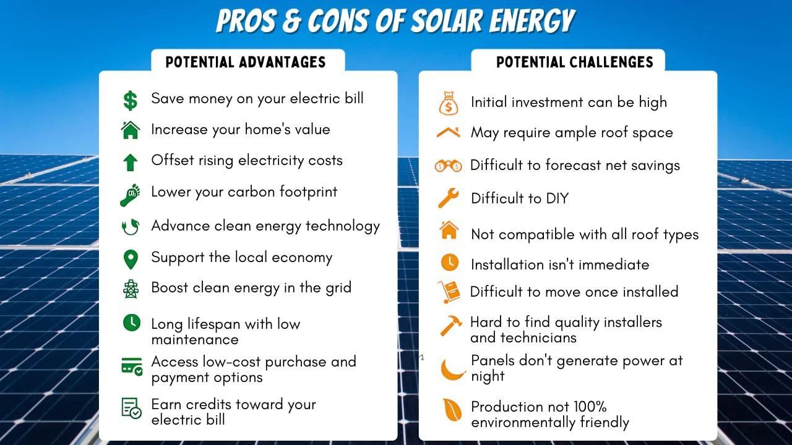

Renewable energy sources, particularly solar power, have emerged as pivotal elements in addressing climate change. These energy solutions offer an efficient and sustainable alternative to the traditional, environmentally detrimental fossil fuels. Solar energy, derived from the sun's rays, presents a vast potential that is both inexhaustible and capable of being harnessed in a manner that minimizes the ecological footprint. As technology progresses, solar power has become increasingly cost-effective, driving its adoption at various scales—from individual households to large-scale solar farms.

Concurrent with the advancements in renewable energy, there has been a significant evolution in financial technology, particularly in the domain of energy markets. Algorithmic trading, a mechanism that utilizes complex algorithms to execute trades with precision and efficiency, has gained traction. This rise is due to its ability to handle the intricacies and volatilities of energy markets, particularly those involving renewable sources. These algorithms can process vast amounts of data, making quick decisions that can optimize trading outcomes and enhance market efficiency.



The convergence of solar energy and algorithmic trading signals a transformative potential within energy markets. By integrating these two domains, there lies an opportunity to create synergies that not only improve the operational efficiency of energy distribution and consumption but also enhance the sustainability of energy systems. This blend of renewable energy with advanced trading technologies could potentially reshape market dynamics, offering a pathway toward improved environmental outcomes and energy independence.

In this article, we will explore how solar power and algorithmic trading intersect, investigating their combined impact on energy market operations and sustainability objectives.

## Table of Contents

## Understanding Solar Power as a Renewable Energy Source

Solar energy is a rapidly growing sector in the renewable energy landscape, driven by its ability to provide a clean and sustainable alternative to traditional fossil fuels. Solar power harnesses energy from the sun using technologies such as photovoltaic (PV) cells, solar thermal power systems, and concentrating solar power (CSP) systems. This form of energy is abundant and inexhaustible, making it an attractive option compared to depleting fossil fuel reserves.

One of the primary advantages of solar energy is its sustainability. Solar power generation does not produce greenhouse gases or pollutants that contribute to air and water pollution, thereby reducing the environmental impact associated with energy production. Additionally, solar energy promotes energy independence by allowing countries and regions to utilize local resources rather than relying on imported fossil fuels. This can enhance energy security and reduce the geopolitical risks associated with energy supply chains.

Financially, solar energy has become increasingly cost-competitive. The levelized cost of electricity (LCOE) for solar has decreased significantly over the past decades, due in part to advancements in technology and economies of scale. This cost reduction has made solar power one of the cheapest forms of new electricity generation in many parts of the world, according to reports from the International Renewable Energy Agency (IRENA) and other energy analysts.

Despite these advantages, solar power faces several challenges that need to be addressed to maximize its potential. Intermittency is a major issue; solar power generation is dependent on sunlight availability, which can be inconsistent due to weather conditions and the day-night cycle. This necessitates the development of energy storage systems capable of storing excess energy for use when solar generation is low or non-existent.

Land use is another concern, as large-scale solar installations require significant space, which can compete with agriculture and natural habitats. Innovative solutions, such as agrivoltaics—where solar panels are installed above crops—aim to mitigate this issue by combining agriculture with solar energy production.

Additionally, the scarcity and cost of certain materials used in solar technologies, like silicon for PV cells or rare earth elements, pose supply chain and environmental challenges. Research into alternative materials and the recycling of solar components at the end of their lifecycle is crucial for sustainable growth.

Efforts to overcome these challenges are ongoing, with technological advancements and policy measures playing a pivotal role. The continuous development and integration of solar energy systems signify a promising shift towards a more sustainable and independent energy future.

## Algorithmic Trading in Energy Markets

Algorithmic trading, often referred to as algo trading, employs sophisticated algorithms to automate trading processes based on predetermined strategies. In energy markets, particularly those involving renewable resources like wind and solar, algo trading is pivotal in managing the intrinsic [volatility](/wiki/volatility-trading-strategies) associated with power generation.

The core principle behind [algorithmic trading](/wiki/algorithmic-trading) in energy markets is to process large volumes of data swiftly, executing trades at optimal times based on statistical models. These algorithms analyze real-time market data, weather forecasts, and historical patterns to predict short-term price movements, thus facilitating quick decision-making. The execution speed and precision enabled by algo trading surpass human capabilities, ensuring that trading signals are efficiently acted upon.

One fundamental advantage of algo trading is its ability to enhance trading efficiency. By streamlining transaction processes, it reduces the time and cost associated with manual trades. Algorithms can place high-frequency trades in milliseconds, capitalizing on market opportunities and minimizing slippage. Furthermore, this mechanization helps in processing complex transactions, managing hedge portfolios, and conducting [arbitrage](/wiki/arbitrage) trading more effectively.

Market monitoring is another critical benefit facilitated by algorithmic trading. Algorithms continuously track market conditions, adapting to fluctuations and irregularities in supply and demand. For instance, sudden changes in weather conditions affecting solar power output can be quickly accounted for by recalibrating strategies to maintain grid stability and operational efficiency.

Algo trading also optimizes trading decisions in real-time, crucial in the context of renewable energy markets where supply can be unpredictable. Real-time optimization involves iterative adjustments and recalculations, allowing market participants to efficiently balance supply and demand, and stabilize prices. These algorithms can incorporate [machine learning](/wiki/machine-learning) techniques to improve predictions and optimize decisions, adjusting automatically to new data and evolving trends.

In conclusion, algorithmic trading in energy markets instrumentalizes technological advancements to enhance efficiency, accuracy, and responsiveness in managing the inherently volatile nature of renewable energy sources like solar and wind. By automating and optimizing trading strategies, it paves the way for a more stable and efficient energy market, crucial for integrating renewable energy into global systems.

## The Synergy Between Solar Energy and Algo Trading

The confluence of solar energy and algorithmic trading heralds a pivotal transformation in the dynamics of energy markets. Solar energy, known for its intermittency due to variable weather conditions, requires precise management to be efficiently integrated into power grids. Algorithmic trading provides a solution by employing advanced computational models to forecast energy production and consumption patterns accurately. These models analyze vast datasets, including historical weather data, solar panel output, and market trends, to predict fluctuations and optimize trading decisions.

Algorithmic trading systems deploy machine learning algorithms and [artificial intelligence](/wiki/ai-artificial-intelligence) to refine these forecasts. For example, neural networks can be used to model complex relationships between input variables, enhancing the predictability of solar power output. Additionally, [reinforcement learning](/wiki/reinforcement-learning), a subfield of machine learning, is employed to develop dynamic trading strategies that adapt to market changes in real-time. The algorithms can be trained to buy or sell electricity not only based on current supply and demand but also considering future market conditions, thereby stabilizing prices and mitigating the risks associated with solar energy variability.

The scalability of solar technology, combined with sophisticated algorithmic trading, is pivotal for achieving energy independence and sustainability. As solar panels become more affordable and efficient, their deployment can be expanded, and more data can be harnessed to improve the algorithms governing energy trades. Python, with its robust libraries such as NumPy for numerical computations and TensorFlow for machine learning, offers a powerful toolset for developing these advanced trading systems.

Here is an example of a simple Python script using the NumPy library to model energy predictions based on historical solar output data:

```python
import numpy as np

# Sample historical data of solar output (in kWh)
historical_output = np.array([400, 420, 395, 410, 430, 405, 420])

# Simple moving average to forecast future output
def moving_average(data, window_size):
    return np.convolve(data, np.ones(window_size)/window_size, mode='valid')

# Calculate 3-day moving average as a prediction
predicted_output = moving_average(historical_output, window_size=3)

print("Predicted future solar outputs (kWh):", predicted_output)
```

By integrating sophisticated trading algorithms with solar technology, market participants can achieve greater stability and efficiency, ultimately contributing to a sustainable and reliable energy future. This synergy not only optimizes the flow of solar power into the grid but also aligns with global ambitions to reduce carbon emissions and foster renewable energy adoption.

## Challenges and Considerations

The integration of solar energy and algorithmic trading, while promising, presents several challenges that need to be addressed to harness its full potential. One major challenge is market volatility. The variability in solar power generation due to changing weather conditions can lead to fluctuations in energy supply, affecting market prices. This unpredictability requires sophisticated algorithms capable of real-time adjustments to trading strategies to maintain balance in the market. These algorithms must be optimized to handle massive data inputs and deliver accurate forecasts, which is a complex task given the numerous variables involved.

Another critical challenge is the need for robust energy storage solutions. Energy storage technologies like batteries are essential for managing supply and demand mismatches inherent in solar power. Without effective storage systems, excess energy generated during peak solar hours can be wasted, and insufficient power during low production periods can lead to shortages. Innovations in storage technologies are needed to increase capacity, reduce costs, and improve efficiency, supporting a stable energy supply.

The regulatory framework for algorithmic trading in energy markets is still evolving, posing challenges regarding market transparency and fairness. Current regulations vary widely across regions, leading to inconsistencies that might deter investment and innovation. There's a risk that poorly regulated markets could become susceptible to manipulation or unfair trading practices, undermining confidence in the system. Therefore, developing a comprehensive regulatory framework that ensures fairness and transparency is crucial. This involves setting clear rules for algorithmic trading, monitoring market activities, and implementing mechanisms to safeguard against abuse.

Smart policies and continuous innovation are imperative to overcome these challenges. Policymakers need to collaborate with industry stakeholders to create standards that accommodate the technological advancements in both renewable energy and trading algorithms. Encouraging research and development in areas like predictive analytics, blockchain for transparency, and next-generation batteries will be pivotal in addressing these barriers. 

To illustrate, a simple Python function to simulate market response to solar power input could look like this:

```python
def market_response(solar_input, price_sensitivity, storage_capacity):
    demand = 100  # assume a constant demand for simplicity
    supply_variability = solar_input * price_sensitivity
    stored_energy = min(storage_capacity, max(0, supply_variability - demand))
    market_price = (demand - stored_energy) * 0.1  # simple elasticity model
    return round(market_price, 2)

solar_input = 80  # example of solar power input
price_sensitivity = 1.2  # hypothetical sensitivity factor
storage_capacity = 50  # example of storage capacity

price = market_response(solar_input, price_sensitivity, storage_capacity)
print("Market Price:", price)
```

This simplified model highlights the balance needed between solar input, storage, and market prices, and underscores the complexities involved in managing these dynamics. Addressing these interrelated challenges through strategic innovation and policy can enable the successful integration of solar energy and algorithmic trading, fostering a more sustainable and efficient energy future.

## Conclusion

The convergence of solar energy and algorithmic trading signifies a pivotal advancement towards achieving a more sustainable and efficient future. By merging these two innovations, we stand to harness the full potential of renewable energy while simultaneously refining market operations. Solar energy offers a sustainable alternative to traditional fossil fuels, and when coupled with sophisticated trading algorithms, it can greatly enhance the predictability and management of energy markets. This integration not only improves the efficiency of energy distribution but also aids in mitigating the challenges posed by the intermittency of solar power.

Algorithmic trading, with its capability to process vast amounts of data in real-time, optimizes trading decisions and enhances the responsiveness of energy markets. Such synergy allows for precise forecasting and the strategic management of supply-demand dynamics. As a result, the seamless incorporation of solar energy into the energy grid becomes more manageable, promoting energy independence and environmental sustainability.

Ongoing advancements in both solar technology and algorithmic trading will play a critical role in driving progress towards global energy goals. Continued innovation will address existing challenges and improve market transparency and fairness. By emphasizing smart policies and investments in technology, the integration of these fields will lead to achieving significant milestones in energy efficiency and sustainability.

In summary, the intersection of solar energy and algorithmic trading holds tremendous promise for the future. As these technologies evolve, they will substantially contribute to the realization of a greener economy and the fulfillment of international environmental targets.

## References & Further Reading

[1]: International Renewable Energy Agency (2019). ["Renewable Power Generation Costs in 2019."](https://www.irena.org/publications/2020/Jun/Renewable-Power-Costs-in-2019) International Renewable Energy Agency.

[2]: Macal, C. M., & North, M. J. (2005). ["Tutorial on Agent-Based Modeling and Simulation."](https://link.springer.com/article/10.1057/jos.2010.3) Proceedings of the 2005 Winter Simulation Conference.

[3]: Marcos López de Prado (2018). ["Advances in Financial Machine Learning."](https://www.amazon.com/Advances-Financial-Machine-Learning-Marcos/dp/1119482089) John Wiley & Sons.

[4]: Kjaer, C., & Jaeger-Waldau, A. (2002). ["Photovoltaics: A World in Transition."](https://www.semanticscholar.org/paper/How-photovoltaics-can-contribute-to-GHG-emission-of-J%C3%A4ger-Waldau-Kougias/96bf520795e04cae9af9ab74f07b9a6543f2fc87) Renewable Energy, 25(3), 317-328.

[5]: Stefan Jansen (2020). ["Machine Learning for Algorithmic Trading."](https://github.com/stefan-jansen/machine-learning-for-trading) Packt Publishing.