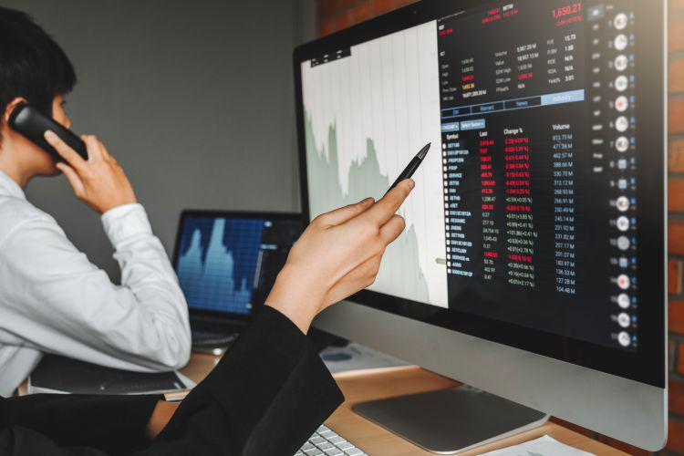

The financial markets are dynamic ecosystems characterized by constant change and complexity, influenced by a myriad of factors that include investor behavior, economic indicators, and technological advancements. These markets function as vast networks where buying and selling transactions occur, forming a critical component of the global economy. Market participants, ranging from individual investors to large institutional entities, rely on various data inputs and analytical tools to make informed decisions that drive market activities.

This article aims to explore the multifaceted aspects of financial markets, particularly focusing on sold-out markets, economic conditions, market dynamics, and the impact of algorithmic trading. A sold-out market is a condition characterized by inadequate liquidity, often resulting from a mass exit of market participants, which can cause significant volatility and limited trading activities. These occurrences highlight the intricate balance between supply and demand that governs market operations.



Economic conditions, such as GDP growth, inflation, employment rates, and fiscal policies, serve as fundamental drivers influencing market behavior. Fluctuations in these economic indicators can shift investor sentiment and precipitate changes in market dynamics, thereby affecting liquidity and pricing structures. Understanding these forces is crucial for traders and investors who seek to navigate the complex and often turbulent landscape of financial markets.

Technological innovations, particularly algorithmic trading, have reshaped the way markets operate. Algorithmic trading leverages advanced computer programs to implement trading strategies at speeds and efficiencies unattainable by human traders. While this has enhanced market liquidity and efficiency, it also introduces new challenges such as the propensity for rapid market movements and potential flash crashes.

The intricate interplay between these elements underscores the importance of strategic decision-making in financial markets. By comprehending how market dynamics, economic conditions, and technological advancements interact, investors and traders can better position themselves to manage risks and capitalize on opportunities. As the financial market landscape continues to evolve, staying informed and adaptable is essential for success.

## Table of Contents

## Understanding Market Dynamics

Market dynamics refer to the complex interplay of forces that influence investor behavior and determine market conditions. The core components of market dynamics are supply and demand equilibrium, market efficiency, and various external influences. Each of these elements contributes significantly to pricing and liquidity in financial markets, impacting how assets are valued and traded.

Supply and demand equilibrium is a fundamental concept in understanding market dynamics. It is based on the premise that prices are determined by the point at which the quantity of an asset that sellers are willing to sell equals the quantity that buyers are willing to purchase. When demand exceeds supply, prices tend to rise, leading to a potential increase in market [liquidity](/wiki/liquidity-risk-premium) as more participants are drawn into trading activities. Conversely, an oversupply can lead to a decrease in prices and potentially lower liquidity as asset attractiveness diminishes.

Market efficiency is another critical element influencing market dynamics. In an efficient market, asset prices reflect all available information, ensuring that securities are correctly valued. The Efficient Market Hypothesis (EMH) posits three forms of market efficiency: weak, semi-strong, and strong, each differing in the level of information reflected in prices. A market that is not fully efficient might exhibit mispriced assets, thereby creating [arbitrage](/wiki/arbitrage) opportunities for investors who can profit from these discrepancies.

External influences such as economic indicators, regulatory changes, and geopolitical events also play a significant role in shaping market dynamics. Economic indicators like interest rates, employment figures, and consumer confidence can impact investor sentiment, altering the supply-demand balance and, thus, market conditions. Regulatory changes may affect market access, trading costs, and compliance requirements, influencing how markets operate and how participants act.

To analyze these dynamics effectively, investors often employ technical and [fundamental analysis](/wiki/fundamental-analysis). Technical analysis involves evaluating statistical trends from historical trading activity, such as price movement and [volume](/wiki/volume-trading-strategy). Fundamental analysis, on the other hand, assesses a security's intrinsic value by examining related economic factors, company performance, and industry conditions. Both methods aim to anticipate market trends and enable investors to make informed decisions.

Understanding market dynamics is vital for anticipating and responding to market trends. Investors who grasp these dynamics can predict potential shifts in liquidity and pricing, better managing their investment strategies to mitigate risks and capitalize on opportunities. As market conditions evolve, continuous analysis and adjustment of strategies are essential for maintaining a competitive edge.

## Economic Conditions and Their Influence

Economic conditions are pivotal in shaping market dynamics, as they dictate the broader economic environment in which financial markets operate. Key indicators such as Gross Domestic Product (GDP) growth, inflation, employment rates, and fiscal policies are essential in understanding these conditions and their far-reaching effects on investor behavior and market trends.

GDP growth serves as a measure of economic health, reflecting the total value of goods and services produced over a specific period. A rising GDP indicates a robust economy, typically resulting in increased investor confidence and higher market valuations. Conversely, stagnating or declining GDP can signal economic distress, often leading to decreased investor confidence and market sell-offs.

Inflation, the rate at which the general level of prices for goods and services rises, erodes purchasing power. It influences central bank policies, which in turn affect interest rates and liquidity in the financial markets. High inflation might lead the Federal Reserve or other central banks to increase interest rates to curb excessive price increases, affecting borrowing costs, investment decisions, and ultimately, market liquidity and valuations. 

Employment rates provide insight into the economy's capacity to generate jobs, influencing consumer spending and economic growth. High employment rates generally correlate with increased consumer spending, boosting economic performance. On the other hand, rising unemployment can reduce consumer confidence and spending, negatively impacting markets.

Fiscal policies, encompassing government spending and tax policies, directly impact economic conditions. Expansionary fiscal policies, involving tax cuts and increased public spending, can stimulate economic growth, leading to positive market responses. Conversely, contractionary fiscal policies, with increased taxes and reduced spending, may dampen economic activity, potentially leading to market downturns.

Shifts in these economic conditions can lead to changes in investor sentiment. For instance, if investors anticipate economic growth based on positive GDP forecasts, they may increase their market exposure, driving up stock prices. Conversely, negative inflation reports might prompt investors to reassess risk, potentially leading to a market downturn.

Understanding these economic conditions allows investors to better assess risks and identify opportunities within financial markets. By analyzing economic indicators, investors can make informed decisions to optimize their portfolios according to prevailing economic trends. Such insights enable investors to strategically manage their investments, potentially enhancing returns while mitigating risks associated with adverse economic conditions.

## Sold-Out Markets: Definition and Examples

A sold-out market is characterized by a significant reduction in liquidity, primarily due to the majority of investors having exited their positions. This scenario often leads to limited trading activity and heightened [volatility](/wiki/volatility-trading-strategies) in prices. Such conditions can occur in various market segments, with futures markets being a notable example.

In a futures market, contracts are agreements to buy or sell an asset at a predetermined price on a specified future date. As these contracts near expiration, liquidity can diminish sharply. This occurs because traders who initially entered contracts for speculative reasons may decide to [exit](/wiki/exit-strategy) their positions to avoid taking delivery of the underlying asset. When most participants leave the market, willing buyers or sellers become scarce, leading to a sold-out market scenario.

For instance, consider a futures contract on a commodity like [crude oil](/wiki/crude-oil). As the expiration date approaches, traders with no intention of physical delivery will start unwinding their positions. This can cause a rapid decline in open interest – the total number of active contracts – which in turn reduces liquidity. Consequently, even minor market orders can lead to significant price swings, reflecting increased volatility.

Moreover, sold-out market conditions are not only triggered by futures contract expirations. They can also arise in response to broader economic shifts, investor sentiment changes, or geopolitical events that prompt a mass exit by market participants. When trust in the market's direction diminishes, investors may withdraw en masse, further compounding liquidity issues.

Managing and understanding sold-out markets is crucial for traders. This requires recognizing the signals of declining liquidity and adapting strategies accordingly, such as employing algorithmic techniques to optimize trade execution. By doing so, traders can mitigate risks associated with erratic price movements and capitalize on opportunities arising from these unique market phases.

## Algorithmic Trading and Its Impact

Algorithmic trading refers to the utilization of computer algorithms designed to execute trading orders automatically based on predefined criteria such as timing, price, and volume. By leveraging technology, [algorithmic trading](/wiki/algorithmic-trading) enhances market efficiency and liquidity by executing orders at speeds and frequencies that are beyond human capabilities. This type of trading is employed across various asset classes, including equities, futures, and foreign exchange markets.

The primary advantage of algorithmic trading is its ability to optimize trade execution, thereby reducing transaction costs. By harnessing advanced mathematical models and real-time data, algorithms can identify and capitalize on fleeting market opportunities with precision. This can result in improved price discovery and narrower bid-ask spreads, contributing to overall market efficiency.

However, algorithmic trading is not without its challenges and risks. One significant concern is that it may exacerbate market volatility, leading to events like flash crashes. Flash crashes are abrupt market downturns within a very short time frame, often triggered by high-frequency trading algorithms interacting in unforeseen ways. A notable example occurred on May 6, 2010, when the Dow Jones Industrial Average plunged nearly 1,000 points within minutes, only to rebound shortly thereafter. Investigations revealed that a large sell order executed by an algorithm set off a chain reaction among high-frequency traders, amplifying market movements.

Algorithmic strategies also play a crucial role in managing volatility during periods of market turbulence. Traders may employ various algorithmic approaches, such as [statistical arbitrage](/wiki/statistical-arbitrage), market-making, and mean reversion, to navigate complex market conditions. For instance, market-making algorithms provide liquidity by continuously quoting buy and sell prices, thus stabilizing markets during turbulent periods.

Moreover, advancements in [machine learning](/wiki/machine-learning) and [artificial intelligence](/wiki/ai-artificial-intelligence) are further refining the efficiency and adaptability of algorithmic trading. By analyzing vast datasets and learning from historical patterns, algorithms can enhance their predictive capabilities, giving traders an edge in dynamically shifting markets. A typical Python implementation might involve using libraries like NumPy for numerical computations and pandas for data manipulation, enabling developers to create sophisticated trading strategies.

In conclusion, while algorithmic trading contributes to market efficiency and liquidity, it also introduces new complexities and risks, necessitating robust risk management practices and regulatory oversight to safeguard market stability. Through continuous innovation and adaptation, algorithmic trading is poised to remain a vital component of modern financial markets.

## Managing Sold-Out Market Conditions

Managing sold-out market conditions requires a strategic approach to ensure stability and capitalize on potential market inefficiencies. Traders must navigate these scenarios by employing various strategies, integrating risk management practices, and adapting algorithmic trading systems.

One effective strategy for managing sold-out markets is the diversification of trades. Diversification involves distributing investments across different asset classes or securities to reduce exposure to risks associated with a specific market segment. By doing so, traders can buffer against the limited liquidity and heightened volatility typical of sold-out conditions. Diversification can be implemented through asset allocation models that optimize the balance between risk and return.

Market-making algorithms also play a critical role in these conditions. These algorithms are designed to provide liquidity by continuously quoting buy and sell prices, thus facilitating trading even when market interest is low. Deploying market-making strategies can bridge liquidity gaps, increase trading activity, and stabilize prices.

Risk management is paramount when dealing with sold-out markets. Traders can mitigate potential losses through stop-loss orders, which automatically sell a security when it reaches a predetermined price, thereby limiting losses. Real-time monitoring of market conditions is also crucial, allowing traders to swiftly react to market changes and adjust their strategies accordingly.

Algorithmic trading systems need to be flexible and adaptive to maintain effectiveness in sold-out markets. Frequent reassessment and calibration of algorithms are necessary to align with the prevailing market conditions. For instance, algorithms can be programmed to adjust trading parameters based on volatility indicators or changes in market depth.

Here is an example of a simple Python code snippet that demonstrates the use of a basic stop-loss mechanism:

```python
class Portfolio:
    def __init__(self, cash, positions):
        self.cash = cash
        self.positions = positions  # {'stock_ticker': (quantity, purchase_price)}

    def check_stop_loss(self, current_prices, stop_loss_threshold):
        for ticker, (quantity, purchase_price) in self.positions.items():
            current_price = current_prices.get(ticker, purchase_price)
            loss_percentage = (purchase_price - current_price) / purchase_price
            if loss_percentage >= stop_loss_threshold:
                self.sell(ticker, quantity, current_price)

    def sell(self, ticker, quantity, sell_price):
        self.cash += quantity * sell_price
        del self.positions[ticker]
        print(f"Sold {quantity} of {ticker} at {sell_price}")

# Example usage
portfolio = Portfolio(10000, {'AAPL': (10, 150)})
current_market_prices = {'AAPL': 140}
portfolio.check_stop_loss(current_market_prices, 0.05)
```

In this code, the `Portfolio` class represents a simple portfolio management system. The `check_stop_loss` method evaluates if any of the stocks in the portfolio have hit the stop-loss threshold and executes a sale if necessary, thereby managing exposure and limiting losses in unstable market conditions.

Adopting these strategies and technologies is crucial for traders aiming to effectively manage sold-out market conditions, ensuring they remain agile and responsive to market challenges.

## Conclusion

Understanding market dynamics, economic conditions, and algorithmic trading strategies is essential for effectively navigating sold-out markets. These components are interrelated and play a significant role in shaping the financial landscape. Market dynamics, which include supply and demand equilibrium, market efficiency, and external factors, directly impact pricing and liquidity. Economic conditions such as GDP growth, inflation, employment rates, and fiscal policies further influence market behavior by affecting investor sentiment and triggering market fluctuations.

Algorithmic trading offers significant advantages in terms of efficiency and liquidity but also introduces risks, such as increased volatility and flash crashes. By utilizing algorithmic trading strategies, traders and investors can optimize their execution during periods of market turbulence, manage volatility, and ensure better market stability. For instance, strategies like market-making algorithms or real-time monitoring using stop-loss orders can be crucial in managing risks associated with sold-out market conditions.

To capitalize on opportunities, it is important for investors and traders to leverage insights from these areas. Staying informed about the latest economic indicators, understanding how they affect markets, and employing sophisticated algorithmic strategies are key to enhancing decision-making processes. Moreover, continued research and adaptation to technological advancements are crucial as financial markets evolve. As algorithms become more sophisticated and data availability increases, the ability to interpret and act on market signals will significantly benefit those navigating the complexities of modern financial ecosystems.

Ultimately, the integration of comprehensive market analysis with robust trading strategies enables participants to manage risk effectively and exploit potential opportunities, even in challenging scenarios like sold-out markets. This holistic approach is necessary for achieving sustainable success and maintaining stability within the dynamic environment of global financial markets.

## References & Further Reading

[1]: Lopez de Prado, M. (2018). ["Advances in Financial Machine Learning"](https://www.amazon.com/Advances-Financial-Machine-Learning-Marcos/dp/1119482089). Wiley.

[2]: Aronson, D. R. (2007). ["Evidence-Based Technical Analysis: Applying the Scientific Method and Statistical Inference to Trading Signals"](https://onlinelibrary.wiley.com/doi/book/10.1002/9781118268315). Wiley.

[3]: Jansen, S. (2020). ["Machine Learning for Algorithmic Trading: Predictive models to extract signals from market and alternative data for systematic trading strategies"](https://www.amazon.com/Machine-Learning-Algorithmic-Trading-alternative/dp/1839217715). Packt Publishing.

[4]: Chan, E. (2009). ["Quantitative Trading: How to Build Your Own Algorithmic Trading Business"](https://github.com/ftvision/quant_trading_echan_book). Wiley.

[5]: Malkiel, B. G. (2015). ["A Random Walk Down Wall Street: The Time-Tested Strategy for Successful Investing"](https://www.amazon.com/Random-Walk-Down-Wall-Street/dp/0393358380). W. W. Norton & Company.

[6]: Fama, E. F. (1970). ["Efficient Capital Markets: A Review of Theory and Empirical Work."](https://www.jstor.org/stable/2325486) The Journal of Finance, 25(2), 383-417.

[7]: Aldridge, I. (2009). ["High-Frequency Trading: A Practical Guide to Algorithmic Strategies and Trading Systems"](https://www.ahmetbeyefendi.com/wp-content/uploads/2020/07/High-Frequency-Trading-Irene-Aldridge.pdf). Wiley.