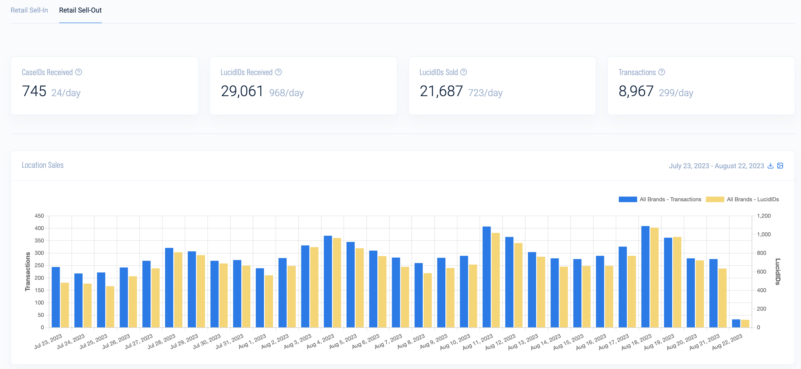

## Table of Contents

## What is a sold-out market?

A sold-out market is when all the products or tickets for an event are sold and there are none left to buy. This can happen with things like concert tickets, sports events, or popular new products. When something is sold out, it means that the demand for it was higher than the supply. People who want to buy it after it's sold out might have to wait for more to be made or look for it from other sellers, sometimes at a higher price.

Sometimes, when a market is sold out, people might try to sell the product or tickets at a higher price. This is called scalping or reselling. For example, if someone bought tickets to a popular concert and then sold them for more money, that's reselling. This can make it hard for other people to get what they want at a fair price. Companies and event organizers often try to stop this by limiting how many tickets one person can buy or by using special systems to control sales.

## How does a market become sold-out?

A market becomes sold-out when the number of people wanting to buy something is more than the number of items available. This can happen with things like concert tickets, new video games, or limited edition products. When a company makes a product, they decide how many to make based on what they think people will want. If they don't make enough, and more people want to buy it than there are items available, the market becomes sold-out.

Sometimes, a product or event becomes very popular very quickly. This can happen because of good advertising, celebrity endorsements, or because it's something new and exciting. When this happens, a lot of people rush to buy it all at once. If the company didn't expect this big rush, they might not have made enough, and the market can become sold-out faster than they thought. This can leave some people disappointed because they can't get what they wanted.

## What are the common signs of a sold-out market?

When a market is sold-out, you might see a few clear signs. One big sign is that the product or tickets are no longer available on the official website or store. If you go to buy something and it says "sold out" or "out of stock," that means there are no more left. Another sign is that people start talking about it a lot on social media or in the news. They might be upset that they can't get what they wanted, or they might be trying to find it from other people.

Another common sign is that the item starts showing up for sale at much higher prices on other websites or from people trying to resell it. This happens because some people were able to buy the item when it was still available, and now they want to make money by selling it to others who missed out. If you see the same product being sold for a lot more money than it originally cost, that's a good clue that the market is sold-out.

## Can you provide examples of sold-out markets in different industries?

In the music industry, a sold-out market often happens with concert tickets. For example, when a very popular band like BTS or Taylor Swift goes on tour, their tickets can sell out in minutes. Fans rush to buy them as soon as they go on sale, and if the band doesn't have enough shows or big enough venues, many fans are left without tickets. Sometimes, these tickets then show up on resale websites for much higher prices, showing that the market is sold out.

In the gaming industry, new video game releases can lead to sold-out markets. When a highly anticipated game like "The Legend of Zelda: Tears of the Kingdom" comes out, stores might not have enough copies for everyone who wants one. People line up early at stores, and if the game sells out, it can be hard to find until more are made. Sometimes, people buy extra copies to resell them at a higher price, which is another sign that the market is sold out.

In the fashion industry, limited edition clothing or sneakers can create a sold-out market. For instance, when a brand like Nike releases a new pair of Air Jordan sneakers, they might only make a small number. Sneaker fans, or "sneakerheads," try to buy them as soon as they're available, and if they sell out quickly, it can be tough to get a pair. These sneakers often end up on resale sites at much higher prices, showing that the market for them is sold out.

## What are the implications of a sold-out market for consumers?

When a market is sold out, it can be really frustrating for consumers. They might have been excited to buy a new video game or get tickets to a concert, but if everything is sold out, they can't get what they want. This can make them feel disappointed and left out. Sometimes, they might have to pay a lot more money to buy the item from someone else who is reselling it. This isn't fair because it means only people with more money can get what they want.

Another problem is that consumers might have to wait a long time before they can buy the item again. If a company didn't make enough of a product, it could take weeks or even months for them to make more. During this time, people who missed out the first time might keep missing out. They might also start to feel like they can't trust the company to have enough stock in the future, which can make them less likely to try to buy things from that company again.

## How do businesses benefit from a sold-out market?

When a market is sold out, businesses can benefit in a few ways. First, it creates a lot of excitement and buzz around their product. People talk about it a lot, which is like free advertising. This can make more people want to buy the product next time it's available. Also, when something is sold out, it can make it seem more valuable and special. People might think it's really popular and worth buying, which can help the business sell more in the future.

Another way businesses can benefit is by making more money. If people really want the product and are willing to pay more, the business can raise the price next time or make a limited edition version that costs more. Sometimes, businesses can even sell the same product again at a higher price because people missed out the first time. This can lead to more profit for the business, even if it means some customers are unhappy.

## What strategies can businesses use to manage a sold-out market?

When a market is sold out, businesses can use a few strategies to manage it better. One way is to make more of the product. If they see that something is really popular and sells out quickly, they can start making more right away. This helps make sure more people can buy it and don't have to wait too long. Another strategy is to use a waiting list or pre-orders. This lets people sign up to buy the product as soon as it's available again, which can make customers happier because they know they'll get a chance to buy it.

Another thing businesses can do is to limit how many items one person can buy. This stops people from buying a lot and reselling them at higher prices. By making sure everyone has a fair chance to buy the product, businesses can keep their customers happy. They can also use special systems to control sales, like online lotteries or timed releases, to spread out the buying and make sure more people get what they want.

## How can consumers navigate a sold-out market effectively?

When a market is sold out, consumers can still find ways to get what they want. One good way is to sign up for waiting lists or pre-orders if the business offers them. This can help you get the product as soon as it's available again without having to pay more. Another way is to keep an eye on official websites and stores for restocks. Sometimes, businesses will make more of the product and put it back on sale, so it's a good idea to check back often.

Another strategy is to be careful about buying from resellers. Sometimes, people will sell sold-out items at much higher prices, but it's important to make sure they are trustworthy. Look for reviews and check the prices to make sure you're not getting ripped off. If you do decide to buy from a reseller, try to find one who is selling at a fair price. Also, staying patient can help. Sometimes, waiting a little longer means you can get the product at a normal price when more are made.

## What are the economic theories behind sold-out markets?

Sold-out markets are often explained by the economic theory of supply and demand. This theory says that the price of something goes up when more people want it than there is available. When a product or event is sold out, it means that the demand for it was higher than the supply. Companies might not make enough of a product because they don't know how popular it will be, or they might make it limited on purpose to make it seem more special. When this happens, the price can go up because people are willing to pay more to get what they want.

Another important idea is the concept of scarcity. When something is hard to get, it can seem more valuable to people. This can make them want it even more, which can drive up the price. Businesses can use this to their advantage by creating limited editions or by not making enough of a product at first. This can lead to a sold-out market, where the product becomes more desirable because it's rare. But it can also make some people unhappy because they can't get what they want, and they might have to pay a lot more if they find it from someone else.

## How do sold-out markets affect supply chain management?

When a market is sold out, it can make supply chain management a lot harder. Supply chain management is all about making sure products get from the place they are made to the customers who want to buy them. When something sells out really fast, it can be a surprise to the people in charge of the supply chain. They might not have enough of the product ready to send out, and it can take time to make more. This means they have to work quickly to make more of the product and get it to stores or customers as fast as they can.

Sold-out markets can also make supply chain managers think about how they plan for the future. If a product sells out, it shows that more people wanted it than they thought. Next time, they might try to make more of the product from the start, or they might have a plan ready to make more quickly if it sells out again. This can help them avoid running out of stock and keep customers happy. But it's a tricky balance because making too much can be a waste if the product doesn't sell as well the next time.

## What role does technology play in identifying and managing sold-out markets?

Technology helps businesses know when a market is sold out by keeping track of how many products are sold and how many are left. Special computer programs can watch sales in real time and send alerts when something is about to sell out. This helps businesses see what's popular and make more of it before it's too late. Websites and apps also let customers know right away if something is sold out, so they don't waste time trying to buy it.

Technology also helps manage sold-out markets by making it easier to restock and sell products again. Businesses can use the internet to tell customers when more of a product will be available and let them sign up for waiting lists or pre-orders. This way, people who missed out the first time can still get what they want. Also, technology can help stop people from buying too many items to resell them at higher prices, by limiting how many one person can buy or using special systems to control sales.

## How can predictive analytics be used to anticipate sold-out market conditions?

Predictive analytics can help businesses guess when a market might sell out by looking at past sales data and other information. It uses special computer programs to find patterns and figure out how many people might want to buy a product in the future. For example, if a new video game sold out really fast last time, predictive analytics can help the business know to make more copies next time. It can also look at things like social media buzz or how well the product is doing in different stores to make better guesses.

By using predictive analytics, businesses can plan better and avoid running out of stock. If the computer program says a lot of people will want a product, the business can start making more of it earlier. This way, they can have enough ready when people start trying to buy it. It can also help them decide when to put the product on sale or how to advertise it to make sure it doesn't sell out too fast and leave people unhappy. Predictive analytics makes it easier for businesses to keep up with what customers want and make sure they have enough of the popular products.

## References & Further Reading

[1]: Lopez de Prado, M. (2018). ["Advances in Financial Machine Learning"](https://www.amazon.com/Advances-Financial-Machine-Learning-Marcos/dp/1119482089). Wiley.

[2]: Aronson, D. R. (2007). ["Evidence-Based Technical Analysis: Applying the Scientific Method and Statistical Inference to Trading Signals"](https://onlinelibrary.wiley.com/doi/book/10.1002/9781118268315). Wiley.

[3]: Jansen, S. (2020). ["Machine Learning for Algorithmic Trading: Predictive models to extract signals from market and alternative data for systematic trading strategies"](https://www.amazon.com/Machine-Learning-Algorithmic-Trading-alternative/dp/1839217715). Packt Publishing.

[4]: Chan, E. (2009). ["Quantitative Trading: How to Build Your Own Algorithmic Trading Business"](https://github.com/ftvision/quant_trading_echan_book). Wiley.

[5]: Malkiel, B. G. (2015). ["A Random Walk Down Wall Street: The Time-Tested Strategy for Successful Investing"](https://www.amazon.com/Random-Walk-Down-Wall-Street/dp/0393358380). W. W. Norton & Company.

[6]: Fama, E. F. (1970). ["Efficient Capital Markets: A Review of Theory and Empirical Work."](https://www.jstor.org/stable/2325486) The Journal of Finance, 25(2), 383-417.

[7]: Aldridge, I. (2009). ["High-Frequency Trading: A Practical Guide to Algorithmic Strategies and Trading Systems"](https://www.ahmetbeyefendi.com/wp-content/uploads/2020/07/High-Frequency-Trading-Irene-Aldridge.pdf). Wiley.