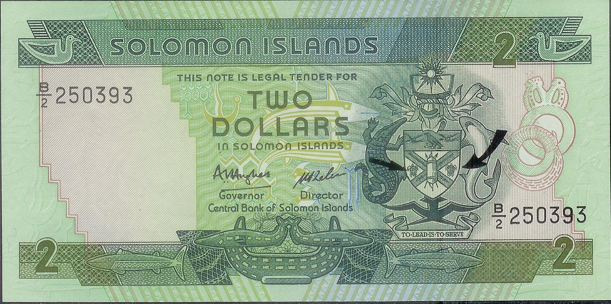

The Solomon Islands Dollar (SBD) serves as the official currency of the Solomon Islands, a nation that stands as a unique player in both regional and global economic arenas. As an integral part of the country's financial framework, the SBD influences economic activities ranging from local trade to international transactions. The currency's historical trajectory, since its adoption in 1977, highlights its evolution and adaptation to various economic phases, underscoring its significance in shaping the economic landscape of the Solomon Islands.

Historically, the SBD replaced the Australian Dollar, marking a step towards monetary independence for the Solomon Islands. This transition reflected the country's desire to forge its own economic identity and tailor its monetary policies to better serve its national interests. Today, the SBD not only facilitates everyday transactions but also plays a vital role in the Solomon Islands' interactions with the global economy, particularly in sectors such as agriculture, fishing, and logging—key industries that underpin the nation's export market.



In exploring the facets of the SBD, it is crucial for investors and traders to grasp its potential within the forex trading sphere. Understanding the currency's operational dynamics and value fluctuations can provide valuable insights for those looking to diversify their portfolios. The SBD's exchanges with dominant global currencies like the US Dollar (USD) and the Australian Dollar (AUD) offer both opportunities and challenges, influenced by geopolitical and economic factors.

Moreover, the rise of algorithmic trading introduces innovative methods for engaging with the SBD in forex markets. This approach, utilizing sophisticated algorithms and data analysis, allows for the efficient execution of trading strategies while mitigating human errors and biases. By employing tools such as machine learning and artificial intelligence, traders can enhance their predictive capabilities and optimize their investment decisions.

In sum, the SBD represents more than just a unit of currency; it embodies the economic ambitions of the Solomon Islands while presenting a myriad of opportunities in the forex landscape. Through a nuanced understanding of its intricacies, coupled with modern trading methodologies, the SBD can be navigated with greater precision, offering a strategic advantage to those invested in its potential.

## Table of Contents

## The Solomon Islands Dollar (SBD)

The Solomon Islands Dollar (SBD) serves as the official currency of the Solomon Islands and is critical for facilitating a wide array of transactions and economic exchanges across the nation. Established in 1977, the SBD replaced the Australian Dollar, marking an important step towards financial independence for the Solomon Islands. Managed by the Central Bank of Solomon Islands, the SBD plays a vital role in both domestic trade and international dealings. This central financial institution oversees monetary policy, striving to maintain the currency's stability amidst varying economic conditions such as inflation trends and changes in the global financial landscape.

The SBD is available in both banknotes and coins. These denominations not only serve a functional purpose but also reflect the cultural and historical heritage of the Solomon Islands through their intricate designs. For investors and [forex](/wiki/forex-system) market enthusiasts, a deeper understanding of the SBD is advantageous. By studying its operational framework and monitoring its evolving value, investors can gain insights into its potential impacts on financial markets. The currency's journey through different economic climates provides lessons on the interplay between fiscal policy and market demands, enabling forex traders to make informed decisions.

In financial markets, the value of a currency like the SBD can provide critical indicators regarding a country's economic health. Forex traders closely analyze such data to develop strategies that involve SBD-based currency pairs. By staying informed about the economic factors influencing the SBD, investors can better anticipate market movements and identify potential trading opportunities. As such, the Solomon Islands Dollar represents not just a medium of exchange but also a subject of analytical interest for those engaging in currency trading.

## Economic Role and Challenges

The Solomon Islands Dollar (SBD) plays a significant economic role in the Solomon Islands, affecting various vital sectors such as agriculture, fishing, and forestry. These industries form the backbone of the nation's economy and highly depend on the stability and functionality of the SBD for both local and international trade.

Agriculture, known for crops like cocoa, palm oil, and copra, is a key economic driver. The SBD facilitates transactions within this sector, allowing for efficient trade of these goods domestically and exportation to global markets. Similarly, fishing represents another critical sector, with the Solomon Islands boasting rich marine resources. The SBD is indispensable in negotiating international deals, especially in the high-demand tuna industry. Forestry, marked by the export of timber, also relies on the SBD for transnational transactions, where exchange rates significantly impact profitability and trade balances.

Central to the economic role of the SBD are exchange rates and economic stability, which profoundly influence the currency's value. Changes in exchange rates affect the SBD's purchasing power and the country's trade balance. A weaker SBD may boost exports by making goods cheaper abroad, yet it can also lead to higher import costs, affecting domestic pricing and inflation.

The SBD faces several economic challenges, including inflation. Historically, the Solomon Islands have witnessed periods of inflation, which directly impact the currency's stability. Inflation decreases purchasing power, thus affecting both consumers and producers. Infrastructure issues also pose challenges, impeding effective trade and economic growth. Poor infrastructure can lead to increased costs and inefficiencies, having a cascading effect on the economy and, consequently, on the SBD.

Understanding these economic roles and challenges is crucial for evaluating the potential of the SBD in forex trading. Traders and investors need to consider these elements when assessing the SBD's reliability and predictability in the global market. Exchange rate fluctuations, inflationary trends, and infrastructural conditions are key indicators of the currency's performance, providing insights into its future trajectory in forex trades.

## Algorithmic Trading and the SBD

Algorithmic trading, commonly referred to as 'algo trading', leverages automated systems to execute trading strategies, significantly reducing human error and emotional bias. In the context of the Solomon Islands Dollar (SBD), the integration of algorithmic strategies can transform traditional approaches to forex trading by enhancing precision and efficiency.

To implement these strategies with the SBD, it is essential to analyze a broad spectrum of data across forex markets. This analysis includes predicting trends and identifying trading opportunities through various methods. Key to this process is the use of technical indicators—tools that synthesize historical data to forecast future market movements. Indicators such as moving averages, Relative Strength Index (RSI), and Bollinger Bands can be systemically applied to SBD-based currency pairs to anticipate fluctuations and market directions.

Traders can design bespoke models tailored to the specific behaviors and characteristics of SBD currency pairs. Employing historical data allows these models to simulate potential scenarios and react to market changes instantaneously. This bespoke approach ensures that trading strategies are aligned with the unique patterns of the SBD, thereby optimizing decision-making processes.

The appeal of [algorithmic trading](/wiki/algorithmic-trading) lies in its flexibility and precision, attributes that are especially beneficial for handling the [volatility](/wiki/volatility-trading-strategies) inherent in foreign exchange markets like those involving the SBD. Unlike manual trading, which can be susceptible to timing errors and subjective judgments, algorithmic systems operate on predefined criteria, allowing for consistent execution and enhanced ability to capitalize on minute market variances.

Incorporating advanced technologies such as [artificial intelligence](/wiki/ai-artificial-intelligence) and [machine learning](/wiki/machine-learning) further augments trading strategies. These technologies enable traders to refine their models continuously, adapting to new market conditions and improving the accuracy of predictions. For instance, machine learning algorithms can process vast quantities of data to uncover patterns that may not be immediately evident to human traders, thus offering a competitive edge in optimizing asset allocation and maximizing potential returns.

Through the synthesis of data-driven analysis and computational technologies, algorithmic trading with the SBD presents robust opportunities for investors aiming to navigate the complexities of the forex market. This modern approach not only bolsters the efficiency of trading operations but also provides a strategic framework for capturing and exploiting market opportunities.

## Forex Market Opportunities

The foreign exchange market offers significant opportunities for trading the Solomon Islands Dollar (SBD), largely due to its interactions with major currencies such as the U.S. Dollar (USD), Australian Dollar (AUD), and British Pound (GBP). These relationships are important as the SBD is often traded in pairs with these currencies, reflecting both regional economic ties and global financial flows.

For traders, keeping abreast of political and economic factors within the Solomon Islands is essential. The country's economic dynamics, such as government policies, trade agreements, and economic indicators (e.g., GDP growth rate, inflation), can have profound impacts on SBD's value in forex markets. Moreover, external factors such as global commodity prices, which affect the country’s primary exports like timber and fish, also play a role in influencing the currency's fluctuations.

The SBD's volatility and trading [volume](/wiki/volume-trading-strategy) can create unique opportunities for both short-term and long-term foreign exchange trades. This volatility can be seen as a double-edged sword: while it introduces higher risk, it also allows for potentially elevated returns if accurately predicted and timed. Traders engaged in SBD forex need to employ sophisticated risk management strategies to take advantage of these fluctuations while minimizing potential losses.

Algorithmic trading can substantially enhance the capability to capture these opportunities. Using automated systems, traders can execute strategies based on historical data analysis, technical indicators, and real-time market conditions without the delays or emotional biases associated with manual trading. For instance, algorithmic models can incorporate moving averages, Bollinger Bands, or relative strength index (RSI) to determine optimal entry and [exit](/wiki/exit-strategy) points. Below is a simple Python example of calculating a moving average which could be used as part of an algorithmic strategy:

```python
import pandas as pd

# Load the currency pair data
data = pd.read_csv('SBD_USD.csv')

# Calculate moving averages
data['MA50'] = data['Close'].rolling(window=50).mean()
data['MA200'] = data['Close'].rolling(window=200).mean()

# Determine trading signals
data['Signal'] = 0
data.loc[data['MA50'] > data['MA200'], 'Signal'] = 1  # Buy signal
data.loc[data['MA50'] < data['MA200'], 'Signal'] = -1  # Sell signal
```

Utilizing AI and machine learning algorithms can further optimize trading strategies by identifying patterns and predictive signals within complex datasets. Continuous analysis of market trends and macroeconomic signals, made seamless by algorithmic trading, aids in crafting strategic trading decisions that align with changing market conditions. In doing so, traders can remain nimble, adaptive, and proactive, ensuring robust market engagement and leveraging the full potential of SBD trades in the forex market.

## Conclusion

The Solomon Islands Dollar (SBD) embodies economic independence and plays a significant role in the forex market, where it attracts the interest of investors aiming to diversify their portfolios. Understanding the multifaceted applications of the SBD within forex trading can provide substantial benefits, offering insights into currency pair dynamics, trade balances, and economic indicators. Investors who comprehend these intricacies are better equipped to navigate the global foreign exchange landscape.

Algorithmic trading is increasingly becoming a cornerstone in modern trading ecosystems, offering a blend of precision and efficiency that is otherwise difficult to achieve through traditional trading methods. By employing advanced algorithmic models, traders can efficiently process vast amounts of market data related to the SBD, minimizing human error and decision-making biases. This technological approach is crucial in optimizing trading strategies and allocating assets effectively, particularly given the volatility of forex markets.

The evolving nature of global trade and economic environments necessitates a keen understanding of how currencies like the SBD operate within these contexts. Such understanding not only aids in making informed trading decisions but also positions investors to leverage market shifts optimally. The SBD, with its unique opportunities and challenges, serves as an intriguing case study for the integration of both conventional and contemporary trading strategies.

As market dynamics continue to transform, those interested in strategic trading can look to the SBD as a representative study in balancing traditional methods with cutting-edge algorithmic strategies. This dual approach enhances their ability to engage competently with the ever-changing financial markets, promising potentially significant returns in a diverse investment portfolio.

## References & Further Reading

[1]: ["Solomon Islands Economic Outlook"](https://www.worldbank.org/en/country/pacificislands/brief/solomon-islands-country-economic-memorandum-2024) - World Bank

[2]: Bergstra, J., Bardenet, R., Bengio, Y., & Kégl, B. (2011). ["Algorithms for Hyper-Parameter Optimization."](https://dl.acm.org/doi/10.5555/2986459.2986743) Advances in Neural Information Processing Systems 24.

[3]: ["Advances in Financial Machine Learning"](https://www.amazon.com/Advances-Financial-Machine-Learning-Marcos/dp/1119482089) by Marcos Lopez de Prado

[4]: ["Central Bank of Solomon Islands Publications"](https://www.cbsi.com.sb/publications/) - Central Bank of Solomon Islands

[5]: ["Quantitative Trading: How to Build Your Own Algorithmic Trading Business"](https://www.amazon.com/Quantitative-Trading-Build-Algorithmic-Business/dp/1119800064) by Ernest P. Chan