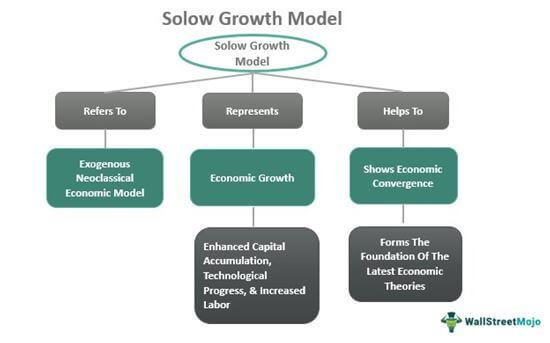

In the ever-evolving landscape of economic theory and applied finance, the Solow Residual and Total Factor Productivity (TFP) stand out as crucial concepts for understanding economic growth and productivity. These concepts, initially introduced by Nobel laureate Robert Solow, describe the portion of output growth in an economy that cannot be attributed to traditional inputs like labor and capital. The Solow Residual, a significant component of TFP, reveals the impact of technological advancements and efficiency improvements on an economy's output, providing insights into how economies grow beyond merely increasing labor or capital input.

Algorithmic trading, which uses mathematical models and computer algorithms to execute trades at high speed and frequency, has increasingly become a staple in financial markets. Integrating economic insights such as the Solow Residual and TFP into algorithmic trading models offers a potential edge, enabling traders to develop strategies anchored in macroeconomic fundamentals. By accounting for efficiency gains and technological progress, traders can refine their predictive models, anticipate market trends more accurately, and optimize decision-making processes.



This article aims to bridge the concepts of the Solow Residual and TFP with algorithmic trading, offering a comprehensive exploration of how these economic indicators can enhance trading strategies. Through this lens, we will examine the potential for leveraging TFP as a tool for navigating complex financial markets, thereby contributing to innovative and efficient trading practices.

## Table of Contents

## Understanding the Solow Residual and Total Factor Productivity (TFP)

The Solow Residual, a concept central to growth accounting in economics, offers a framework for analyzing the sources of economic growth beyond what can be attributed to traditional factors like labor and capital. Often synonymous with Total Factor Productivity (TFP), it serves as a measure of how efficiently these inputs are utilized in the production process. The foundational work by Robert Solow highlighted that only a portion of output growth could be attributed to increased inputs, with the remainder, the Solow Residual, representing advances in technology and improvements in efficiency.

TFP is pivotal as it functions as a proxy for technological progress within an economy. It captures how innovation allows for more output without increasing the levels of capital and labor inputs. This is critical in understanding long-term economic growth as it suggests that improvements in the way resources are deployed can lead to significant gains in productivity. Economies can experience substantial growth through advancements in technology that enable the production of more goods and services without a proportional increase in capital or labor. This kind of growth is sustainable and less dependent on depleting natural resources or intensifying labor inputs.

Identifying the impact of TFP on productivity is essential for economists and policymakers focused on promoting sustainable economic growth. Analyzing TFP allows for insights into how factors such as technological advancements and increased efficiencies contribute to economic performance. Understanding these dynamics helps in formulating policies that foster innovation and investment in technology-driven growth, which are crucial for maintaining competitiveness and improving living standards in the long term.

## The Importance of Productivity in Economic Growth

Productivity improvements are foundational to achieving long-term economic growth. At its core, enhanced productivity signifies the ability of an economy to generate greater output without a corresponding increase in input costs. This dynamic not only contributes to higher standards of living but also ensures that an economy remains competitive and resilient in a rapidly changing global environment.

Total Factor Productivity (TFP) growth is intrinsically linked to innovation and advancements in technology. These elements are critical for sustained economic prosperity as they allow economies to operate more efficiently. By enabling the production of more goods and services with the same or even reduced labor and capital, TFP encapsulates the impact of technological progress and innovation on productivity. For example, the introduction of automation in manufacturing processes or the adoption of advanced information technology systems can significantly enhance output without necessitating additional labor or capital.

In the context of global markets, differences in TFP levels are pivotal in explaining the disparate rates of economic development observed between countries. Economies with high TFP typically experience accelerated growth and are better equipped to adapt to new technological paradigms. Conversely, countries with stagnant or negative TFP growth may struggle to maintain growth [momentum](/wiki/momentum), often resulting in widening economic disparities on the global stage.

An illustrative example of TFP's impact on economic development can be observed in the technological sector. As industries innovate and adopt new technologies, they experience increases in TFP, which facilitate more efficient production processes and improved product quality. This, in turn, leads to competitive advantages in international markets, spurring further economic growth and development.

In conclusion, productivity improvements, particularly those driven by TFP, are indispensable for fostering long-term economic growth. They not only optimize resource utilization within an economy but also enhance its capacity for innovation and adaptation, ultimately contributing to a higher quality of life for its population. As global economies continue to integrate and evolve, understanding and leveraging TFP will be crucial in navigating the complexities of modern economic landscapes.

## Solow Residual in Practice: Measuring and Analyzing TFP

The Solow Residual, representing Total Factor Productivity (TFP), is critical in differentiating output growth attributable to traditional inputs like labor and capital from that which arises through productivity increases. Mathematically, TFP is expressed as:

$$
\text{TFP} = \frac{Y}{K^\alpha \cdot (L \cdot H)^{1-\alpha}}
$$

where:
- $Y$ denotes total output or GDP,
- $K$ signifies the capital input,
- $L$ refers to the labor input,
- $H$ stands for human capital (e.g., the education and skill levels of the workforce),
- $\alpha$ is the output elasticity of capital, reflecting the share of output contributed by capital.

This equation stems from the Solow Growth Model, an economic model that postulates economic growth as driven by increases in labor, capital investment, and productivity enhancements not captured by traditional inputs. By using this formula, economists can isolate the portion of growth that results from technological progress and increased efficiency, thus gaining insights into how well an economy uses its resources beyond the simple accumulation of capital and labor.

For practical implementation, researchers often employ econometric methods to estimate the parameters within the above formula. This involves using national account data and econometric techniques to infer $\alpha$ and evaluate how well these inputs predict outputs over time. The unexplained residual part of the production, represented by the Solow Residual, thus indicates variations in TFP.

Computational tools and programming languages like Python are used extensively for this analysis. A typical approach involves aggregating macroeconomic data, running regression analyses on time-series data to estimate the parameters, and thereby calculating the TFP. Here's a simple Python snippet illustrating the calculation of TFP given the relevant data:

```python
def calculate_tfp(output, capital, labor, h_capital, alpha):
    return output / (capital ** alpha * (labor * h_capital) ** (1 - alpha))

# Example values: - consistent with real-world data units
Y = 1000  # Output
K = 300   # Capital
L = 100   # Labor
H = 1.2   # Human Capital Adjustment Factor
alpha = 0.3

tfp = calculate_tfp(Y, K, L, H, alpha)
print(f"Total Factor Productivity (TFP): {tfp:.2f}")
```

In this way, researchers and policymakers can grasp the efficiency of resource utilization in advancing an economy, guiding decisions on potential areas to boost productivity, such as investing in technology or enhancing educational infrastructure.

## The Role of TFP in Algorithmic Trading

Algorithmic trading, which harnesses sophisticated models and algorithms to execute trades, can benefit considerably from the integration of Total Factor Productivity (TFP) factors. TFP, by capturing the influence of technological progress and efficiency on economic output, provides a macroeconomic dimension that could enhance the predictive power of trading models.

By considering TFP in [algorithmic trading](/wiki/algorithmic-trading) models, traders can gain a deeper understanding of macroeconomic trends that influence market dynamics. These models can then inform strategic decisions on asset allocation, risk management, and portfolio diversification. Incorporating TFP factors allows traders to better anticipate shifts in market conditions that may arise from changes in productivity trends.

To effectively integrate TFP into trading strategies, it's essential to have a nuanced understanding of both economic signals and technological advancements. This involves analyzing data that reflects productivity changes, such as innovation rates, efficient use of resources, and technological diffusion. A firm grasp of these variables aids in identifying opportunities and risks in the financial markets.

Assessing TFP can inform decisions in algorithmic trading through statistical and econometric methods. For instance, [machine learning](/wiki/machine-learning) models can be trained on historical data where TFP serves as one of the input features, enhancing the model's ability to learn patterns associated with economic growth. A Python implementation might involve using libraries like `StatsModels`, `Scikit-learn`, or `PyTorch` for model building and validation. An illustrative example could be developing a regression model that forecasts market prices incorporating TFP as an explanatory variable:

```python
import numpy as np
import pandas as pd
from sklearn.model_selection import train_test_split
from sklearn.linear_model import LinearRegression
from sklearn.metrics import mean_squared_error

# Sample data: assume TFP and market_data are preloaded DataFrame columns
X = pd.DataFrame({'TFP': tfp_data, 'Other_Macroeconomic_Variables': other_data})
y = market_prices

# Split data into training and testing sets
X_train, X_test, y_train, y_test = train_test_split(X, y, test_size=0.2, random_state=42)

# Create and train the model
model = LinearRegression()
model.fit(X_train, y_train)

# Make predictions
predictions = model.predict(X_test)

# Evaluate the model
mse = mean_squared_error(y_test, predictions)
print(f'Mean Squared Error: {mse}')
```

Incorporating TFP into these algorithmic models necessitates overcoming the challenges associated with measuring and interpreting TFP data. However, doing so effectively can lead to more robust predictions and ultimately, a competitive edge in the fast-paced realm of algorithmic trading.

## Limitations and Challenges in Measuring the Solow Residual

Accurate measurement of the Solow Residual, which represents Total Factor Productivity (TFP), presents several challenges crucial to economists and analysts seeking to understand productivity dynamics. One primary issue is data aggregation. In the calculation process, economic data such as outputs, labor, and capital inputs must be aggregated over different sectors and time periods, which can introduce inconsistencies and distortions. Ensuring data uniformity and comparability across diverse economic activities and temporal scales complicates the measurement process.

Measurement errors further challenge the precision of Solow Residual calculations. Errors can originate from incorrect or outdated data regarding capital stocks, labor inputs, and outputs. Moreover, biases in statistical data arising from outdated surveys or inaccurate sampling methods can affect the reliability of TFP estimates. Such inaccuracies hinder the ability to discern true productivity improvements from mere statistical noise.

Distinguishing between different productivity factors, including technological advancements and policy changes, adds complexity. The Solow Residual traditionally captures the effects of technological progress, yet it does not inherently differentiate between various innovation types, such as improvements in organizational efficiency or developments in human capital. This limitation makes it difficult to attribute productivity gains to specific sources within the economy.

Additionally, the Solow Residual lacks sensitivity to changes in management practices. Modern economies are significantly influenced by management innovations, which do not neatly align with traditional measures of technological advancement. Since these management practices can affect production efficiency and organizational productivity, overlooking them can result in an incomplete analysis of TFP.

Overall, these challenges underscore the intricacies involved in accurately measuring the Solow Residual. Improved methods for data collection and advanced econometric techniques may help mitigate these issues. However, the inherent complexity of economic systems means that capturing all dimensions of productivity accurately remains a formidable task. Future research and advancements in data analytics are essential to refine TFP measurement strategies, thus providing more comprehensive insights into economic growth and efficiency.

## Real-World Applications and Case Studies

Countries like China have exhibited significant fluctuations in Total Factor Productivity (TFP) growth, which have had profound implications for their economic strategies and policy decisions. The changes in TFP growth in China can be attributed to the varying pace of technological advancement, industrial reforms, and capital utilization efficiency over different periods.

China's rapid economic growth, particularly from the late 20th century onward, has often been attributed to substantial capital investment and labor force expansion. However, as the economy matures, sustaining high growth rates necessitates improvements in productivity, primarily through innovation and technological progress, which are captured by TFP. During the early 2000s, China benefited from reforms that enhanced the efficiency of capital and improved labor market dynamics, contributing positively to TFP growth. However, recent years have seen a relative slowdown in TFP, prompting the Chinese government to shift focus towards high-tech industries and innovation-driven growth models.

Real-world examples and case studies further underscore the importance of consistently monitoring TFP trends to gauge economic performance accurately and to set informed market strategies. For instance, advanced economies like Japan and South Korea have historically leveraged steady TFP growth through technology and innovation, contributing permanently to their competitive advantage and economic stability. These nations invested heavily in research and development, education, and technology that have continuously fueled TFP enhancements.

Furthermore, fluctuations in TFP growth are not limited to national scales but are influential at sectoral and corporate levels. For example, manufacturing companies worldwide have adopted automation and data analytics to boost productivity, reflecting positive TFP changes. They use metrics derived from TFP analysis to steer strategic decisions concerning operations and investments, potentially involving sophisticated algorithmic mechanisms and AI-driven insights.

The application of TFP in strategic market decisions is also evident in financial sectors, where firms analyze TFP trends to predict macroeconomic conditions affecting investment portfolios. By integrating TFP metrics into financial models, firms can craft dynamic strategies to navigate varying economic cycles.

In summary, monitoring TFP trends provides essential insights into economic performance, guiding policy decisions and market strategies that are aligned with sustainable growth and competitiveness, both globally and at intra-national levels.

## Conclusion and Future Directions

Total Factor Productivity (TFP) remains an essential component in understanding economic growth, particularly the portion of growth that standard inputs like labor and capital cannot account for. The Solow Residual serves as the primary measure of TFP, highlighting technology's role and efficiency improvements. While traditional inputs are relatively straightforward to quantify, TFP provides nuanced insights into how economies can grow sustainably through innovation and efficiency advancements.

Integrating TFP into algorithmic trading offers both challenges and opportunities. The complexity of financial markets demands that trading algorithms account for macroeconomic variables such as TFP, which influences asset values and risk profiles. By incorporating TFP factors, algorithmic traders can develop models that are responsive to economic fluctuations, potentially improving their accuracy in predicting market trends and enhancing decision-making.

Nonetheless, the incorporation of TFP into algorithmic trading is not without challenges. It requires a profound understanding of economic indicators and the ability to adapt to shifting economic landscapes. Moreover, significant expertise is required to accurately model the influence of TFP within complex trading algorithms, given the inherent [volatility](/wiki/volatility-trading-strategies) and unpredictability of financial markets.

Future research could focus on refining the measurement techniques of TFP. Currently, measuring TFP involves significant challenges such as dealing with data aggregation issues and disentangling the various factors that contribute to productivity growth. Enhanced measurement techniques could provide clearer insights into how TFP influences economic and market dynamics.

Moreover, exploring the implications of TFP in global trading systems warrants further investigation. As global markets become increasingly interconnected, variations in TFP across countries can significantly impact international trade and investment. Understanding these dynamics can lead to more robust trading strategies that capitalize on international productivity trends.

In conclusion, while TFP offers rich insights into unexplained economic growth, its integration into algorithmic trading systems requires sophisticated approaches and ongoing refinement. As measurement techniques improve and global trading systems evolve, TFP's potential applications in financial markets are likely to expand, offering significant benefits to traders and economists alike.

## References & Further Reading

[1]: Solow, R. M. (1956). ["A Contribution to the Theory of Economic Growth."](https://pages.nyu.edu/debraj/Courses/Readings/Solow.pdf) The Quarterly Journal of Economics, 70(1), 65-94.

[2]: Solow, R. M. (1957). ["Technical Change and the Aggregate Production Function."](http://piketty.pse.ens.fr/files/Solow1957.pdf) The Review of Economics and Statistics, 39(3), 312-320.

[3]: Jorgenson, D. W., & Griliches, Z. (1967). ["The Explanation of Productivity Change."](https://www.semanticscholar.org/paper/The-Explanation-of-Productivity-Change-Jorgenson-Griliches/ed779bfcfb8f0a0b3aad25dbb2bfd63763b2a729) The Review of Economic Studies, 34(3), 249-283.

[4]: Basu, S., & Fernald, J. G. (2008). ["Information and communications technology as a general-purpose technology: Evidence from U.S. industry data."](https://onlinelibrary.wiley.com/doi/full/10.1111/j.1468-0475.2007.00402.x) American Economic Review, 98(5), 1459-1476.

[5]: Brynjolfsson, E., & Hitt, L. M. (2000). ["Beyond Computation: Information Technology, Organizational Transformation and Business Performance."](https://www.aeaweb.org/articles?id=10.1257/jep.14.4.23) Journal of Economic Perspectives, 14(4), 23-48.

[6]: Feldstein, M. (2003). ["R&D and Productivity Growth at the Industry Level: Is There Still a Relationship?"](https://www.nber.org/papers/w0850) In Innovation Policy and the Economy, Vol. 3, pp. 67-86.

[7]: Fernandez-Villaverde, J., & Rubio-Ramirez, J. F. (2010). ["Macroeconomics and Volatility: Data, Models, and Estimation."](https://www.nber.org/system/files/working_papers/w16618/w16618.pdf) Journal of Economic Dynamics and Control, 34(5), 825-841.

[8]: Lopez de Prado, M. (2018). ["Advances in Financial Machine Learning."](https://www.amazon.com/Advances-Financial-Machine-Learning-Marcos/dp/1119482089) Wiley.

[9]: Jovanovic, B., & Rousseau, P. L. (2005). ["General Purpose Technologies."](https://www.nber.org/papers/w11093)01018-X) In Handbook of Economic Growth, pp. 1181-1224.