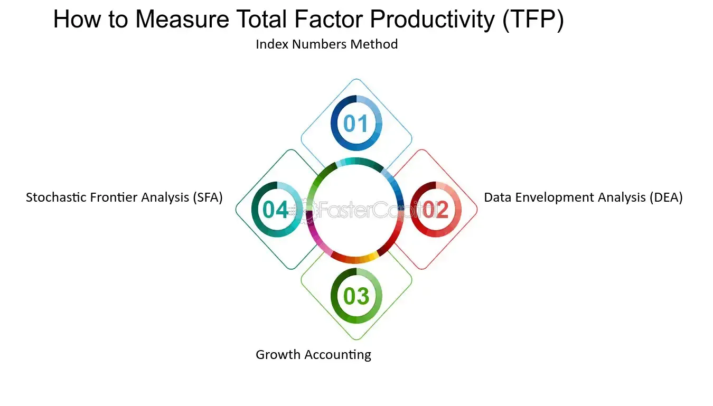

## Table of Contents

## What is the Solow Residual?

The Solow Residual, also known as total factor productivity (TFP), is a measure used in economics to figure out how much of an economy's growth is due to things other than just adding more workers or machines. It was named after the economist Robert Solow, who developed a model to understand economic growth. In simple terms, if you see a country's economy growing, you might think it's because they have more people working or more machines to produce goods. But the Solow Residual helps us see if there's more to the story, like better technology or more efficient ways of working.

To calculate the Solow Residual, economists look at how much the economy grows and then subtract the growth that can be explained by increases in labor and capital. Whatever is left over is the Solow Residual. This leftover part is important because it shows how much growth comes from improvements in how things are done, rather than just having more stuff to work with. For example, if a factory starts using a new technology that makes workers more productive, that increase in productivity would show up in the Solow Residual. It's a way to highlight the role of innovation and efficiency in driving economic growth.

## How is the Solow Residual calculated?

The Solow Residual is calculated by looking at how much an economy grows and then figuring out how much of that growth comes from adding more workers or machines. To do this, economists use a formula that compares the growth rate of total output (like all the goods and services produced in a country) with the growth rates of labor and capital. The formula is: Solow Residual = Growth rate of output - (Share of labor x Growth rate of labor + Share of capital x Growth rate of capital). The shares of labor and capital are usually based on how much of the total income goes to workers and how much goes to owners of machines and buildings.

For example, if the total output of an economy grows by 3%, and the labor and capital together would have been expected to cause a 2% growth, the Solow Residual would be 1%. This 1% represents the growth that can't be explained by just having more workers or machines. It could come from things like better technology, improved management, or new ways of organizing work. By calculating the Solow Residual, economists can see how much of the economic growth is due to these kinds of improvements rather than just having more inputs.

## What is Total Factor Productivity (TFP)?

Total Factor Productivity (TFP), also known as the Solow Residual, is a way to measure how efficiently an economy turns its inputs, like workers and machines, into outputs, like goods and services. It's like a score that shows how well an economy is doing at making the most out of what it has. If TFP is high, it means the economy is using its workers and machines in smart ways to produce more than you would expect just by looking at the number of workers and machines.

Economists calculate TFP by looking at how much the total output of an economy grows and then subtracting the growth that comes from having more workers or more machines. The part that's left over is the TFP. This leftover part is important because it shows how much of the growth is due to things like new technology, better ways of organizing work, or improvements in how businesses are run. So, TFP helps us understand how much of an economy's growth comes from being smarter and more efficient, rather than just having more stuff to work with.

## How does TFP relate to the Solow Residual?

Total Factor Productivity (TFP) and the Solow Residual are really the same thing. They both measure how much an economy grows that can't be explained just by adding more workers or machines. If you think of an economy like a big factory, TFP is like a score that shows how well the factory is using its workers and machines to make things. If the factory starts using a new machine that helps workers do their jobs better, that would show up in the TFP.

The Solow Residual is just another name for TFP, named after the economist Robert Solow who came up with a way to calculate it. To find the Solow Residual, you look at how much the economy grows and then subtract the growth that comes from having more workers or more machines. The part that's left over is the Solow Residual, which is the same as TFP. This helps economists see how much of the economy's growth comes from being smarter and more efficient, rather than just having more stuff to work with.

## Why are the Solow Residual and TFP important in economic growth models?

The Solow Residual and Total Factor Productivity (TFP) are important in economic growth models because they help us understand where growth really comes from. Imagine an economy as a big machine that turns workers and machines into goods and services. If the economy grows, it's easy to think it's just because there are more workers or more machines. But the Solow Residual and TFP show us that there's more to the story. They measure how much of the growth comes from using workers and machines more efficiently, like through new technology or better ways of organizing work. This is important because it tells us that to keep growing, an economy needs to keep getting smarter, not just bigger.

In economic growth models, knowing the Solow Residual and TFP helps policymakers and economists figure out how to make the economy grow faster. If a country's TFP is low, it might mean they need to focus on things like education, innovation, and improving how businesses work. On the other hand, if TFP is high, it shows that the country is already doing a good job at using its resources smartly. By looking at the Solow Residual and TFP, economists can give better advice on how to help an economy grow in the long run, not just by adding more workers or machines, but by making everything work better together.

## What factors can influence changes in TFP?

Changes in Total Factor Productivity (TFP) can be influenced by many things. One big [factor](/wiki/factor-investing) is technology. When new inventions or better ways of doing things come along, they can make workers and machines more productive. For example, if a factory starts using computers to help with its work, it might be able to make more stuff without needing more people or machines. Another factor is how well businesses are run. If a company figures out a smarter way to organize its work, like using teams instead of having everyone work alone, that can make the whole place more efficient. Education and skills also play a role. When workers learn new skills or get better education, they can do their jobs better, which can boost TFP.

Other things that can affect TFP include government policies and the overall health of the economy. If the government makes it easy for new businesses to start up or for people to learn new skills, that can help TFP grow. On the other hand, if there are a lot of rules that make it hard for businesses to do new things, TFP might not grow as fast. The economy's health matters too. In good times, businesses might be more willing to try new things and invest in new technology, which can help TFP. But in bad times, they might hold back, and TFP might not grow as much. So, TFP can change based on a mix of technology, how businesses are run, education, government policies, and the economy's overall condition.

## How can the Solow Residual be used to measure technological progress?

The Solow Residual is a way to measure how much of an economy's growth comes from things other than just adding more workers or machines. It's like a score that shows how well an economy is using new technology or better ways of working. When economists calculate the Solow Residual, they look at how much the total output of an economy grows and then subtract the growth that comes from having more workers or more machines. The part that's left over is the Solow Residual, which tells us how much of the growth is due to technological progress. If the Solow Residual is high, it means that new technology or smarter ways of working are making a big difference in how much the economy can produce.

For example, if a country starts using a new kind of machine that makes workers more productive, the growth in output that comes from this machine would show up in the Solow Residual. This helps economists see how much of the economy's growth is because of new technology, rather than just having more people working or more machines. By looking at changes in the Solow Residual over time, economists can track how fast technological progress is happening. If the Solow Residual keeps getting bigger, it's a sign that the economy is getting better at using new technology to grow.

## What are the limitations of using the Solow Residual as a measure of TFP?

Using the Solow Residual to measure Total Factor Productivity (TFP) has some problems. One big issue is that it's hard to measure exactly how much workers and machines contribute to growth. This means the numbers we use to calculate the Solow Residual might not be perfect. If we're wrong about how much workers or machines help, then our calculation of the Solow Residual will be off too. Another problem is that the Solow Residual can mix up different things. It's supposed to show how much growth comes from new technology or better ways of working, but it can also include things like changes in how hard people work or how well businesses are run. So, it's not always clear what the Solow Residual is really telling us.

Another limitation is that the Solow Residual can be affected by things outside the economy, like changes in the weather or big events like wars. These things can make it hard to see the real impact of technology on growth. Also, the Solow Residual assumes that the way workers and machines contribute to growth stays the same over time, but this isn't always true. As technology changes, the way workers and machines work together can change too. So, while the Solow Residual can give us a good idea of how technology is helping the economy grow, it's not perfect and needs to be used carefully.

## Can you explain how the Solow Residual is applied in real-world economic analysis?

In real-world economic analysis, the Solow Residual is used to figure out how much of a country's growth comes from things like new technology or better ways of working, rather than just having more workers or machines. Economists look at how much the total output of an economy grows and then subtract the part that can be explained by more workers or more machines. The leftover part is the Solow Residual. For example, if a country's economy grows by 4% in a year, but only 2% of that growth can be explained by more workers and machines, the Solow Residual would be 2%. This tells economists that new technology or smarter ways of working are making a big difference in how much the economy can produce.

Economists use the Solow Residual to compare how different countries are doing at using technology to grow their economies. If one country has a higher Solow Residual than another, it means that country is better at turning new technology into growth. This can help policymakers decide where to focus their efforts. For example, if a country's Solow Residual is low, it might mean they need to invest more in education or research to come up with new ideas. By looking at changes in the Solow Residual over time, economists can also see if a country is getting better or worse at using technology to grow. This helps them give better advice on how to keep the economy growing in the long run.

## How do economists account for measurement errors when using the Solow Residual?

Economists know that the Solow Residual can have some mistakes because it's hard to measure exactly how much workers and machines help the economy grow. They try to fix these mistakes by using better data and smarter ways to calculate things. For example, they might use more detailed information about how many hours people work or how much machines are used. They also try different ways to figure out how much workers and machines contribute to growth, to see if it changes the Solow Residual a lot. By doing this, they can get a better idea of how much of the growth comes from new technology or better ways of working.

Another way economists deal with measurement errors is by looking at the Solow Residual over a long time. If they see it going up or down in a clear way, they can be more sure that it's showing real changes in how well the economy is using technology. They also compare the Solow Residual with other things, like how much money is spent on research and development or how many new patents are filed. If these other things match up with changes in the Solow Residual, it makes economists more confident that they're seeing real growth from technology, not just mistakes in their calculations. By using these different methods, economists can get a clearer picture of what the Solow Residual is really telling them about the economy.

## What advanced methodologies are used to refine estimates of TFP?

Economists use several advanced ways to make their guesses about Total Factor Productivity (TFP) better. One way is to use better data. They might look at how many hours people work, how old the machines are, and even how well people are educated. This helps them understand how much workers and machines really help the economy grow. They also use computers to do something called "econometric analysis." This is like using math to find patterns in the data that can help them see how much of the growth comes from new technology or better ways of working.

Another way economists refine their TFP estimates is by using something called "growth accounting." This is a method that breaks down economic growth into different parts, like how much comes from workers, machines, and other things like technology. They also use a method called "panel data analysis," which looks at data from many different countries or regions over time. This helps them see how TFP changes in different places and why. By using these advanced methods, economists can get a clearer picture of how much of an economy's growth comes from being smarter and more efficient, rather than just having more stuff to work with.

## How does the Solow Residual help in understanding the sources of economic growth beyond capital and labor?

The Solow Residual is a way to figure out how much an economy grows that can't be explained just by adding more workers or machines. It's like a score that shows how well an economy is using new technology or better ways of working. Economists calculate the Solow Residual by looking at how much the total output of an economy grows and then subtracting the growth that comes from having more workers or more machines. The part that's left over is the Solow Residual. If it's high, it means that new technology or smarter ways of working are making a big difference in how much the economy can produce.

By looking at the Solow Residual, economists can see that economic growth isn't just about having more stuff to work with. It's also about how well an economy uses what it has. For example, if a country starts using a new kind of machine that makes workers more productive, the growth in output that comes from this machine would show up in the Solow Residual. This helps economists understand that to keep growing, an economy needs to keep getting smarter, not just bigger. It's a way to highlight the role of innovation and efficiency in driving economic growth.

## What is the Solow Residual in Practice: How to Measure and Analyze TFP?

The Solow Residual, representing Total Factor Productivity (TFP), is critical in differentiating output growth attributable to traditional inputs like labor and capital from that which arises through productivity increases. Mathematically, TFP is expressed as:

$$
\text{TFP} = \frac{Y}{K^\alpha \cdot (L \cdot H)^{1-\alpha}}
$$

where:
- $Y$ denotes total output or GDP,
- $K$ signifies the capital input,
- $L$ refers to the labor input,
- $H$ stands for human capital (e.g., the education and skill levels of the workforce),
- $\alpha$ is the output elasticity of capital, reflecting the share of output contributed by capital.

This equation stems from the Solow Growth Model, an economic model that postulates economic growth as driven by increases in labor, capital investment, and productivity enhancements not captured by traditional inputs. By using this formula, economists can isolate the portion of growth that results from technological progress and increased efficiency, thus gaining insights into how well an economy uses its resources beyond the simple accumulation of capital and labor.

For practical implementation, researchers often employ econometric methods to estimate the parameters within the above formula. This involves using national account data and econometric techniques to infer $\alpha$ and evaluate how well these inputs predict outputs over time. The unexplained residual part of the production, represented by the Solow Residual, thus indicates variations in TFP.

Computational tools and programming languages like Python are used extensively for this analysis. A typical approach involves aggregating macroeconomic data, running regression analyses on time-series data to estimate the parameters, and thereby calculating the TFP. Here's a simple Python snippet illustrating the calculation of TFP given the relevant data:

```python
def calculate_tfp(output, capital, labor, h_capital, alpha):
    return output / (capital ** alpha * (labor * h_capital) ** (1 - alpha))

# Example values: - consistent with real-world data units
Y = 1000  # Output
K = 300   # Capital
L = 100   # Labor
H = 1.2   # Human Capital Adjustment Factor
alpha = 0.3

tfp = calculate_tfp(Y, K, L, H, alpha)
print(f"Total Factor Productivity (TFP): {tfp:.2f}")
```

In this way, researchers and policymakers can grasp the efficiency of resource utilization in advancing an economy, guiding decisions on potential areas to boost productivity, such as investing in technology or enhancing educational infrastructure.

## References & Further Reading

[1]: Solow, R. M. (1956). ["A Contribution to the Theory of Economic Growth."](https://pages.nyu.edu/debraj/Courses/Readings/Solow.pdf) The Quarterly Journal of Economics, 70(1), 65-94.

[2]: Solow, R. M. (1957). ["Technical Change and the Aggregate Production Function."](http://piketty.pse.ens.fr/files/Solow1957.pdf) The Review of Economics and Statistics, 39(3), 312-320.

[3]: Jorgenson, D. W., & Griliches, Z. (1967). ["The Explanation of Productivity Change."](https://www.semanticscholar.org/paper/The-Explanation-of-Productivity-Change-Jorgenson-Griliches/ed779bfcfb8f0a0b3aad25dbb2bfd63763b2a729) The Review of Economic Studies, 34(3), 249-283.

[4]: Basu, S., & Fernald, J. G. (2008). ["Information and communications technology as a general-purpose technology: Evidence from U.S. industry data."](https://onlinelibrary.wiley.com/doi/full/10.1111/j.1468-0475.2007.00402.x) American Economic Review, 98(5), 1459-1476.

[5]: Brynjolfsson, E., & Hitt, L. M. (2000). ["Beyond Computation: Information Technology, Organizational Transformation and Business Performance."](https://www.aeaweb.org/articles?id=10.1257/jep.14.4.23) Journal of Economic Perspectives, 14(4), 23-48.

[6]: Feldstein, M. (2003). ["R&D and Productivity Growth at the Industry Level: Is There Still a Relationship?"](https://www.nber.org/papers/w0850) In Innovation Policy and the Economy, Vol. 3, pp. 67-86.

[7]: Fernandez-Villaverde, J., & Rubio-Ramirez, J. F. (2010). ["Macroeconomics and Volatility: Data, Models, and Estimation."](https://www.nber.org/system/files/working_papers/w16618/w16618.pdf) Journal of Economic Dynamics and Control, 34(5), 825-841.

[8]: Lopez de Prado, M. (2018). ["Advances in Financial Machine Learning."](https://www.amazon.com/Advances-Financial-Machine-Learning-Marcos/dp/1119482089) Wiley.

[9]: Jovanovic, B., & Rousseau, P. L. (2005). ["General Purpose Technologies."](https://www.nber.org/papers/w11093)01018-X) In Handbook of Economic Growth, pp. 1181-1224.