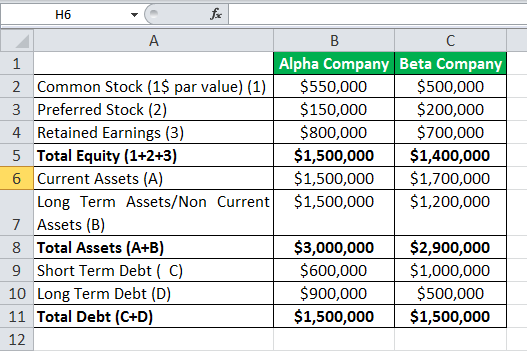

The financial world is rife with complexities, and managing these is crucial for success. In this article, we examine the intersection of risk management, finance, and algorithmic trading through the lens of the solvency cone.

Understanding key concepts like risk management and the solvency cone is essential for leveraging financial strategies effectively. Risk management acts as the bedrock of financial stability, focusing on identifying, evaluating, and prioritizing potential threats to investments. The solvency cone, on the other hand, provides a mathematical framework to assess transaction costs such as bid-ask spreads, empowering traders to refine their strategies and make informed decisions.

We'll explore how these principles are applied in modern financial markets, particularly focusing on algorithmic trading. Algorithmic trading uses complex mathematical models and powerful computing capabilities to execute trades at unprecedented speeds. This has transformed the landscape of financial trading, necessitating tools like solvency cones to model transaction costs effectively and optimize returns.

As technology evolves, so do the methods and tools at our disposal, making it necessary to continually adapt and optimize strategies. The rapid advancement of technology in the financial sector offers both opportunities and challenges. Traders must remain agile, ready to integrate advanced tools and methodologies into their strategies to stay ahead in the competitive landscape.

Join us as we unpack these concepts and discuss their relevance in today's fast-paced trading environment. Together, risk management, solvency cones, and algorithmic trading form a powerful toolkit that enables traders to navigate the complexities of the financial world with precision and insight. By combining these elements, trading strategies can be both robust and adaptable, ensuring sustained profitability in ever-changing markets.

## Table of Contents

## Understanding Risk Management in Finance

Risk management is an essential facet of financial planning, tasked with the identification, assessment, and prioritization of risks. Central to this discipline is the goal of mitigating potential losses and safeguarding investments. This involves a continuous process of analyzing both anticipated and unforeseen uncertainties that could impact financial outcomes.

Effective risk management strategies rely on a variety of tools and frameworks designed to address different types of financial risks. Quantitative models play a significant role in this process. These models use mathematical and statistical methods to understand risk exposures, predict potential future risks, and assess the financial impact of these risks. Financial instruments such as derivatives—options, futures, and swaps—serve as vital components in hedging against fluctuations in market prices and interest rates. By strategically utilizing these instruments, investors and traders can reduce their exposure to adverse market movements.

The landscape of risk management has evolved with the advent of [algorithmic trading](/wiki/algorithmic-trading). In this context, risk management has become increasingly sophisticated, being seamlessly integrated into automated trading systems. These systems use algorithms to execute trades at optimal conditions based on pre-defined rules and criteria. They allow for rapid decision-making, minimizing human error, and enhancing the efficiency of trades. The integration of risk management in these systems ensures that algorithms can dynamically adjust to changing market conditions, thus safeguarding against potential losses.

However, the failure to appropriately manage risk can result in significant financial losses. Historical precedents underscore the importance of robust risk management frameworks. For example, the 2008 financial crisis highlighted the dangers of inadequate risk assessment and the need for advanced risk management strategies. As a critical component of any trading strategy, managing risks not only protects investments but also fortifies the ability of firms to navigate volatile markets.

In sum, understanding risk management and employing effective strategies can significantly impact the success of financial operations. The models and systems used in managing risk continue to develop, driven by advances in technology and the growing complexity of global financial markets. These developments underscore the imperative for traders and investors to continually adapt and refine their risk management approaches to stay competitive and secure in the financial landscape.

## Demystifying the Solvency Cone

A solvency cone is an essential mathematical construct used in finance to account for transaction costs, including the bid-ask spread, when evaluating trading strategies. This model articulates the boundary of feasible trades, allowing traders to pinpoint which transactions can be executed without incurring a net loss. It is particularly useful in environments where high-frequency trading ([HFT](/wiki/high-frequency-trading-strategies)) is prevalent, as even minor costs can substantially impact profitability.

At its core, the solvency cone integrates market frictions into the trading strategy by including transaction costs as a constraint. By modeling these costs, the cone narrows down the spectrum of available trades to those that are potentially profitable and strategically sound. This is particularly crucial in high-frequency trading, where low margins mean that transaction costs, if not managed appropriately, can erode profits swiftly.

Mathematically, the solvency cone can be represented in a vector space where each vector corresponds to a portfolio position. Given a portfolio vector $x$ and a transaction cost matrix $C$, the solvency cone $K$ can be expressed as:
$$

K = \{ y \in \mathbb{R}^n \;|\; x + y \text{ is solvent with respect to transaction costs} \}. 
$$
Where a position $x + y$ is solvent if it can be liquidated at non-negative cost, considering market frictions.

Traders utilize solvency cones to model and simulate the financial market environment, allowing for better predictions regarding both profits and losses. This modeling helps in understanding how transaction costs can shift the demand and supply boundaries within the trading system. By predicting the impact of these costs, traders can make more informed decisions and optimize their trading strategies accordingly.

In practice, implementing solvency cones requires a precise estimation of transaction costs, which includes spreads as well as additional factors such as market impact and [liquidity](/wiki/liquidity-risk-premium) constraints. These models enable traders to derive the most effective strategies by considering both market conditions and potential trade-offs involved in executing trades.

Moreover, solvency cones contribute considerably to enhancing the performance of algorithmic trading systems. By incorporating these mathematical models, algorithms can seamlessly integrate transaction cost considerations into their strategy execution, reducing overhead costs and maximizing net returns. This integration ensures that the trading algorithms are robust and efficient, capable of operating in various market conditions while minimizing risks associated with transaction fees.

In summary, the solvency cone acts as a navigational map for traders, offering a structured approach to handling transaction costs. It enables them to focus on trades that are not only feasible but also aligned with profitability objectives, proving indispensable in dynamic trading environments such as high-frequency trading platforms.

## Algorithmic Trading and the Role of Solvency Cones

Algorithmic trading leverages sophisticated computer programs to execute trades based on set criteria, often involving intricate mathematical models. This trading method relies heavily on data analysis and high-speed processing capacities to evaluate financial markets and make informed trading decisions. In this complex environment, solvency cones play a critical role in optimizing trading algorithms by accounting for various costs, including the bid-ask spread and transaction fees, thus ensuring a comprehensive cost analysis before executing trades.

Solvency cones serve as a filtering mechanism that narrows down potential trades to those that are not only feasible but also potentially profitable after considering transaction costs. These cones represent a set of trading strategies that maintain a trader's financial solvency, factoring in the non-linear impact of market constraints and transaction costs. By incorporating solvency cones, algorithmic trading systems can more accurately simulate real-market conditions, thus offering a strategic advantage in foreseeing and mitigating costs that could diminish profits.

One primary advantage of solvency cones in algorithmic strategies is their capability to reduce execution costs and improve profitability. By aligning the trading algorithms with real market dynamics, traders can effectively predict and adapt to the evolving cost structures. This is crucial in high-frequency trading, where even the smallest margin of error in cost estimation can lead to significant financial impacts.

Moreover, merging risk management strategies with solvency cones enhances the robustness and precision of trading systems. Risk management tactics, when integrated with the solvency cone framework, can provide a systematic approach to anticipate market fluctuations and adjust trading algorithms accordingly. This integration ensures that the trading systems are not only focused on maximizing profits but also on maintaining financial stability under varying market conditions.

In summary, the use of solvency cones in algorithmic trading is instrumental in optimizing trading strategies by providing a deeper understanding of transactional dynamics and ensuring cost-effectiveness. These tools enable traders to maintain a competitive edge in the fast-paced trading environment, emphasizing the necessity of blending traditional financial principles with cutting-edge technological solutions.

## Practical Applications and Challenges

Implementing solvency cones in real-world trading scenarios requires a thorough understanding of market dynamics and the ability to adapt to changes such as price [volatility](/wiki/volatility-trading-strategies). The solvency cone concept assists traders in identifying trades that account for all transaction costs, including the bid-ask spread, thereby narrowing down feasible trading options that could be potentially profitable. By providing a structured method to evaluate trade feasibility, solvency cones serve as integral tools in developing comprehensive trading strategies.

One of the significant challenges in applying solvency cones is the accurate modeling of transaction costs. Given that these costs can vary with market conditions, creating predictive models that can adapt to fluctuations is not trivial. Moreover, trading algorithms need to be sufficiently flexible to respond to varying environments, a task that involves sophisticated computational techniques and real-time data processing. Ensuring these algorithms can perform robustly under different scenarios is an ongoing challenge for quantitative analysts.

Despite these complexities, solvency cones provide a coherent framework to mitigate trading risks. Through the geometric modeling of trade constraints, solvency cones enable the systematic evaluation of potential trades, offering insights into the cost implications of each. For traders looking to mimic expert strategies, solvency cones can help bridge performance differences by quantitatively assessing cost impacts that might not be immediately apparent.

Looking ahead, advancements in computing power and data analytics will likely enhance the capabilities of solvency cones significantly. Increased computational resources allow for more detailed simulations and back-testing, which can improve model precision and execution efficiency. Additionally, developments in [artificial intelligence](/wiki/ai-artificial-intelligence) and [machine learning](/wiki/machine-learning) may lead to more adaptive algorithms, capable of adjusting to market conditions in real-time thus optimizing the application of solvency cones in trading strategies. These technological improvements promise to broaden the applicability of solvency cones in finance, potentially leading to more efficient markets and better financial outcomes for traders and investors alike.

## Conclusion

The integration of risk management, solvency cones, and algorithmic trading provides a formidable toolkit for addressing the challenges of modern financial markets. These interconnected components enable traders to optimize strategies, thereby maximizing profitability despite the inherent complexities of trading. By effectively leveraging risk management techniques, such as hedging and diversification, alongside the precise calculations of solvency cones that account for transaction costs, traders can navigate the financial landscape more effectively. Algorithmic trading further enhances this capability by implementing automated strategies that are both adaptive and rigorous, ensuring swift responses to market fluctuations.

Understanding and applying these concepts is vital for maintaining a competitive edge in an ever-evolving financial environment. As technology progresses, the landscape of finance continues to transform, bringing with it novel opportunities and challenges. Continuous innovation in risk management systems, the mathematical modeling of solvency cones, and the deployment of advanced algorithmic trading strategies are likely to redefine the boundaries of financial trading.

Moving forward, the intertwining of these elements will undeniably shape the future of finance and trading practices. As sophisticated computational methods become more accessible and data analysis techniques more refined, the potential applications of these tools will only expand. Despite technological advancements, the foundational principles of finance, such as risk management, remain indispensable. They provide a stable framework that underpins complex trading strategies, ensuring that technology is guided by a robust understanding of financial theory. 

Ultimately, while advancements in technology offer powerful solutions, the essential principles of finance provide the enduring foundation upon which these innovations are built.

## References & Further Reading

[1]: Cover, T. M., & Thomas, J. A. (2006). ["Elements of Information Theory."](https://onlinelibrary.wiley.com/doi/book/10.1002/047174882X) Wiley-Interscience.

[2]: Bertsekas, D. P. (1999). ["Nonlinear Programming."](https://link.springer.com/article/10.1057/palgrave.jors.2600425) Athena Scientific.

[3]: Bertsimas, D., & Thiele, A. (2006). ["Robust and Data-Driven Optimization: Modern Decision-Making Under Uncertainty."](https://www.mit.edu/~dbertsim/papers/Robust%20Optimization/Robust%20and%20data-driven%20optimization-%20modern%20decision-making%20under%20uncertainty.pdf) INFORMS Journal.

[4]: Bouchaud, J. P., & Potters, M. (2009). ["Financial Applications of Random Matrix Theory: A Short Review."](https://arxiv.org/abs/0910.1205) Physica A: Statistical Mechanics and its Applications.

[5]: Gatheral, J. (2006). ["The Volatility Surface: A Practitioner's Guide."](https://onlinelibrary.wiley.com/doi/book/10.1002/9781119202073) Wiley Finance.