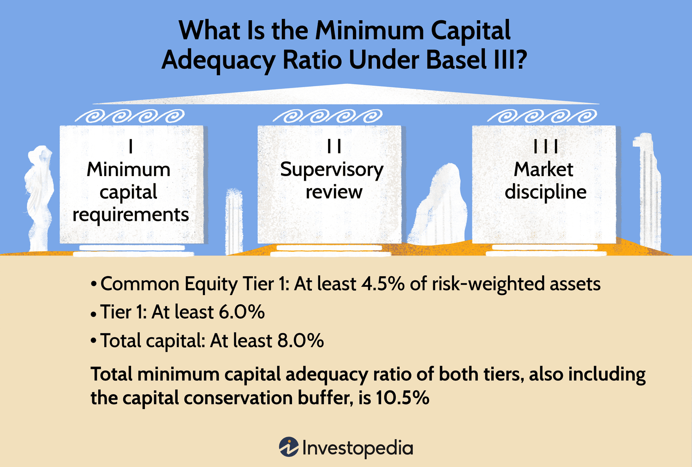

Basel III is an international regulatory framework established by the Basel Committee on Banking Supervision in response to the financial crisis of 2007-09. The fallout from the crisis highlighted significant weaknesses in the global banking system, necessitating a revised set of regulations aimed at strengthening the sector's foundations. Basel III's primary objective is to enhance the regulation, supervision, and risk management within the banking sector, reflecting the need for greater resilience against financial and economic shocks.

Central to Basel III is the introduction of more stringent capital requirements, intended to improve the ability of banks to absorb losses and remain solvent during periods of financial stress. This necessitates an emphasis on risk management and increased transparency in banks' operations, ensuring that they can better withstand disruptions and maintain trust among consumers and investors alike.

The framework introduces several important measures, including higher minimum capital ratios, the introduction of a leverage ratio, and liquidity requirements that banks must adhere to, thus ensuring better stability and soundness. These measures are designed to limit excessive leverage and mitigate liquidity risk, factors prominently contributing to the previous financial crisis.

This article specifically examines how the solvency ratio requirements under Basel III impact the banking sector, with a particular focus on their interaction with algorithmic trading. The evolving regulatory landscape presents both challenges and opportunities for financial institutions engaged in algorithmic and high-frequency trading activities. As banks navigate the complexities of enhanced capital requirements and adapt their trading strategies, they must strive to maintain a competitive edge while complying with tighter regulatory standards. This exploration includes a detailed analysis of solvency ratios, capital requirements, and the corresponding implications for trading strategies within the purview of Basel III.

## Table of Contents

## Understanding Basel III Solvency Ratios

Basel III requires banks to uphold a minimum capital adequacy ratio (CAR) of 8%, a pivotal measure reflecting a bank’s capital vis-à-vis its risk-weighted assets (RWA). This ratio is imperative for maintaining financial stability, enabling banks to meet unforeseen long-term debt obligations. The CAR is calculated using the formula:

$$
\text{CAR} = \frac{\text{Total Capital}}{\text{Risk-Weighted Assets}} \times 100\%
$$

Risk-weighted assets are determined by evaluating the risk profile of various asset classes held by banks, ensuring that higher-risk assets require more capital to provide a buffer against potential losses. This ensures that banks have enough capital to absorb losses without collapsing, thereby promoting overall economic stability.

Basel III mandates two primary categories of capital: Tier 1 and Tier 2, which are integral to comprehending the capital adequacy framework.

**Tier 1 Capital** primarily serves as a bank’s core capital, designed to absorb losses while the bank remains a going concern. It is the most secure and reliable form of capital that includes:

- **Common Equity Tier 1 (CET1):** Comprising common shares, stock surplus, retained earnings, and other comprehensive income, CET1 is the highest quality of capital that banks must hold. Basel III requires CET1 to be at least 4.5% of RWA, ensuring a strong foundational buffer.

- **Additional Tier 1 Capital (AT1):** Consisting of non-cumulative preferred stock, contingent convertible securities, and other similar instruments, AT1 acts as supplementary shock absorbers for the bank’s solvency position.

**Tier 2 Capital** provides additional protection but is considered less secure than Tier 1. It acts as a buffer during winding down:

- **Subordinated Debt:** Debt that ranks lower than ordinary depositors and other senior debt holders in the event of a bank's liquidation.

- **Hybrid Instruments and Other Items:** Instruments that possess both debt and equity-like properties are included in this category.

The total capital under Basel III is the sum of Tier 1 and Tier 2 capital, ensuring that banks possess sufficient high-quality capital to withstand adverse conditions. By defining stringent regulations around capital adequacy, Basel III aspires to fortify the banking system against financial distress and enhance its resilience, especially during periods of financial instability.

## Impact of Basel III on Banking Operations

Basel III has introduced significant reforms to banking operations, primarily by increasing capital requirements. These changes compel banks to reconsider their operational and strategic approaches. A core element of Basel III is the enhancement of common equity requirements, which means that banks must maintain higher-quality capital to withstand financial distress. This increased focus on high-quality capital is achieved through the introduction of additional capital buffers. Banks are required to hold a "capital conservation buffer" of 2.5% above the minimum capital adequacy ratio, designed to absorb losses during periods of financial stress without breaching minimum capital requirements.

These regulatory measures are critical in strengthening a bank's resilience, essentially providing a financial cushion to manage unexpected shocks. With these measures, the aim is to mitigate the risk associated with banking crises and to reinforce consumer confidence by ensuring financial institutions are better equipped to withstand economic downturns.

The introduction of these heightened requirements directly impacts banks' lending practices, investment strategies, and the financial products they offer. Banks may become more selective in their lending practices, focusing on quality borrowers to minimize risk-weighted assets. This shift may lead to stricter credit assessments and possibly reduced lending to riskier borrowers, thereby impacting credit availability in certain market segments.

Investment strategies are also influenced by these regulatory changes. Banks may need to reassess their asset allocations and risk management techniques to optimize capital usage. Efficiently managing risk-weighted assets becomes paramount, prompting banks to explore innovative financial instruments or adjust their investment portfolios to align with Basel III norms, while still pursuing profitability.

The impacts of Basel III on profitability and competitiveness are notable. Increased capital requirements can constrain profitability as banks hold a larger portion of their assets in low-yield equity rather than interest-generating assets. Moreover, compliance costs associated with meeting these new standards can further erode margins. Competitively, banks operating under less stringent regulatory environments might have a temporary edge, as they can deploy capital more freely and potentially secure higher returns. However, the long-term benefits of a more stable financial system are intended to outweigh these short-term competitive disadvantages.

Overall, while Basel III introduces challenges, particularly in aligning capital structures with regulatory expectations, it also offers opportunities for banks to innovate in capital management and risk assessment. By adopting advanced financial technologies and practices, banks can navigate the demands of Basel III, focus on sustainable growth, and contribute to the system's overall stability.

## Algorithmic Trading and Regulatory Challenges

Algorithmic trading is characterized by the use of computer-generated algorithms to analyze market variables and execute orders at speeds unattainable by human traders. This approach to trading has become a fundamental part of modern financial markets, offering advantages in trading efficiency, cost reduction, and the ability to quickly react to market conditions. However, with the advent of Basel III, [algorithmic trading](/wiki/algorithmic-trading) faces new regulatory challenges, particularly stemming from the increased capital requirements imposed on banks.

Basel III, an enhancement of prior Basel accords, has introduced more stringent capital requirements to bolster financial stability and reduce systemic risk. For banks heavily engaged in high-frequency trading ([HFT](/wiki/high-frequency-trading-strategies)), the need for maintaining higher levels of capital can constrain their capacity to operate at existing levels. HFT requires significant investment in technology infrastructure, which, combined with higher capital requirements, may pressure banks to reassess their risk-return profiles and potentially limit their involvement in high-frequency operations.

An important facet of Basel III is its encouragement of derivatives trading on centralized exchanges, which contrasts with over-the-counter (OTC) trading environments traditionally favored by many banks. Centralized exchanges bring transparency, standardized contractual terms, and mitigated counterparty risk, aligning with the Basel III goals of improved systemic resiliency. However, this requirement presents implications for algorithmic and proprietary trading desks that optimized their strategies for less regulated OTC markets. Banks are now tasked with ensuring that their proprietary algorithms are compliant with centralized exchange rules, which may require substantial revision of existing trading models.

The risks associated with algorithmic trading, such as market [volatility](/wiki/volatility-trading-strategies) amplification, systemic errors, and technology failures, must be managed within this stringent regulatory context. Banks employ various strategies to mitigate these risks, including rigorous algorithm testing, real-time monitoring, and incorporating fail-safes to avert or mitigate erroneous trades. Ensuring compliance while optimizing trading strategies presents a significant operational challenge. Algorithms may need to be adapted to not only comply with regulatory constraints but also to maintain competitive trading performance in the face of new market structures dictated by Basel III.

Technological advancements play a crucial role by allowing banks to enhance regulatory compliance and efficiency. Machine learning and AI are increasingly utilized to optimize trading algorithms, helping banks strike a balance between profitability and compliance. For instance, through [backtesting](/wiki/backtesting) and simulation, financial institutions can preemptively adjust their trading algorithms to adapt to new Basel III-induced market dynamics.

This landscape necessitates a careful navigation of compliance requirements with strategic growth. Financial institutions that successfully innovate in their trading strategies are likely to gain competitive advantages, despite the constraints imposed by regulatory frameworks. Ultimately, thorough understanding and strategic adaptation to Basel III's nuances will be imperative for sustaining efficiency and profitability in algorithmic trading operations.

## Balancing Compliance and Strategic Growth

Banks today face the dual challenge of adhering to stringent regulatory requirements set forth by Basel III while simultaneously striving to achieve strategic growth. Compliance with Basel III compels banks to strike a balance between short-term profitability and long-term stability. This section investigates into how banks can leverage technology and innovation to optimize their capital usage and improve operational efficiency.

### Leveraging Technology and Innovation

Technology plays a crucial role in helping banks meet regulatory requirements while also enhancing their growth potential. Advanced data analytics, [artificial intelligence](/wiki/ai-artificial-intelligence) (AI), and [machine learning](/wiki/machine-learning) (ML) offer significant opportunities for optimizing capital allocation, improving risk management, and increasing operational efficiencies. For instance, AI algorithms can predict and mitigate operational risks by analyzing vast datasets to identify patterns indicative of market shifts or potential risks.

By incorporating technology-driven solutions, banks can enhance decision-making processes, streamline operations, and reduce costs. This enables them to allocate resources more effectively and pursue strategic growth opportunities without compromising regulatory compliance.

### Case Studies of Strategic Balance

Several financial institutions have successfully navigated the balancing act between regulatory compliance and strategic growth. For example, JPMorgan Chase has invested heavily in technology and innovation to streamline compliance processes and enhance customer service. By implementing blockchain technologies and AI-driven risk management systems, the bank has improved its operational efficiency and resilience while maintaining compliance with Basel III norms.

Another case is that of HSBC, which has adopted a flexible approach towards compliance by integrating advanced fintech solutions into their daily operations. These technological advancements allow HSBC to adapt swiftly to changing regulatory landscapes while pursuing new market opportunities and products.

### Future Trends in Banking Regulations

As the banking sector continues to evolve, future trends in regulations are expected to have a profound impact on market dynamics. The increasing integration of digital technologies and fintech solutions will likely lead to the development of more dynamic regulatory frameworks. These frameworks may emphasize real-time monitoring and reporting, demanding even greater transparency and adaptability from banks.

Additionally, the rise of sustainable finance and environmental, social, and governance ([ESG](/wiki/esg-investing)) criteria is expected to reshape the regulatory landscape. Banks will need to integrate these new dimensions into their compliance and strategic planning processes.

In summary, while Basel III introduces significant compliance challenges, it also presents opportunities for banks to innovate and optimize their operations. By strategically leveraging technology and innovation, banks can successfully navigate the regulatory environment and position themselves for sustainable growth in an increasingly competitive market.

## Conclusion

Basel III reforms significantly enhance the stability and security of the global banking system. These regulations address vulnerabilities in the financial system exposed during the 2007-09 crisis, aiming to prevent future crises by strengthening bank capital requirements and improving risk management practices. Particularly in algorithmic trading, these reforms present both challenges and opportunities for innovation and resilience in banking operations.

Algorithmic trading, which relies on high-frequency, complex models and data to execute trades, can be resource-intensive. The increased capital requirements under Basel III necessitate that banks involved in such trading activities reassess their strategies to meet regulatory standards while maintaining profitability. Despite these challenges, the regulatory framework encourages banks to innovate, optimizing trading algorithms for compliance and efficiency.

By comprehending and adapting to Basel III's stringent requirements, banks can leverage these challenges as opportunities to improve their long-term sustainability. Compliance does not necessarily hinder growth; rather, it offers a platform for banks to integrate robust risk management and capital efficiency into their strategic planning. This strategic integration aids banks in securing a competitive advantage while safeguarding against unforeseen financial disruptions.

As the financial industry continues to evolve, ongoing research and development will undoubtedly bring new insights and adaptations in response to regulatory changes. Banks must remain agile and forward-thinking, incorporating Basel III compliance into their growth strategies without sacrificing innovation. The future success of financial institutions will depend on their ability to harmonize regulatory adherence with strategic growth initiatives, fostering a balance that ensures both stability and competitive positioning in a dynamic market landscape.

## References & Further Reading

[1]: Basel Committee on Banking Supervision. (2010). ["Basel III: A Global Regulatory Framework for More Resilient Banks and Banking Systems."](https://www.bis.org/publ/bcbs189_dec2010.htm) Bank for International Settlements.

[2]: Santiago Carbó Valverde, Edward Kane, & Francisco Rodríguez Fernández. (2020). ["Technological Disruption in Banking and Its Impact on Competition."](https://www.chicagofed.org/-/media/others/events/2011/bsc/carbo-valverde-kane-rodriguez-fernandez-0506-pdf.pdf) Bank of Canada.

[3]: ["Trading and Exchanges: Market Microstructure for Practitioners"](https://www.amazon.com/Trading-Exchanges-Market-Microstructure-Practitioners/dp/0195144708) by Larry Harris

[4]: Lopez de Prado, M. (2018). ["Advances in Financial Machine Learning."](https://www.amazon.com/Advances-Financial-Machine-Learning-Marcos/dp/1119482089) Wiley.

[5]: ["Quantitative Risk Management: Concepts, Techniques, and Tools"](https://www.amazon.com/Quantitative-Risk-Management-Techniques-Princeton/dp/0691122555) by Alexander J. McNeil, Rüdiger Frey, and Paul Embrechts

[6]: Allen, F., & Carletti, E. (2013). ["New Theories to Underpin Financial Reform"](https://www.sciencedirect.com/science/article/pii/S1572308911000404) Journal of Financial Services Research, 47(4), 341-363.