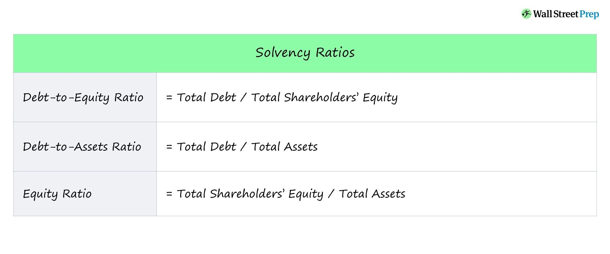

## Table of Contents

## What are solvency ratios and why are they important?

Solvency ratios are financial metrics that show how well a company can meet its long-term financial obligations. They help to see if a company has enough money or assets to pay off what it owes over time. These ratios are important because they tell us about the financial health of a company. If a company has good solvency ratios, it means it is more likely to stay in business and not go bankrupt.

These ratios are used by investors, creditors, and managers to make decisions. Investors look at solvency ratios to decide if a company is a safe place to put their money. Creditors use them to see if a company can pay back loans. Managers use these ratios to plan for the future and make sure the company stays financially stable. In simple terms, solvency ratios give a clear picture of a company's ability to survive financially in the long run.

## Can you explain the difference between solvency and liquidity?

Solvency and liquidity are two important concepts in finance, but they focus on different aspects of a company's financial health. Solvency is about a company's ability to meet its long-term financial commitments. It looks at whether a company has enough assets to cover its debts over time. For example, if a company has a lot of debt but also owns valuable assets like buildings or equipment, it might still be solvent if it can sell those assets to pay off the debt.

Liquidity, on the other hand, is about a company's ability to quickly turn assets into cash to meet short-term obligations. This could mean paying off immediate bills or covering payroll. Liquidity focuses on how easily a company can access cash or convert assets into cash without losing value. For instance, a company might have a lot of inventory, but if it can't sell that inventory quickly, it might struggle to pay its bills on time, even if it's solvent in the long run.

In summary, solvency is about long-term financial stability, while liquidity is about short-term financial flexibility. A company can be solvent but not liquid if it has assets that can't be quickly turned into cash, and it can be liquid but not solvent if it can pay short-term bills but has too much long-term debt. Both are crucial for a company's overall financial health.

## What are the most common solvency ratios used in financial analysis?

The most common solvency ratios used in financial analysis are the debt to equity ratio, the interest coverage ratio, and the equity ratio. The debt to equity ratio compares a company's total debt to its total equity. It shows how much the company relies on debt to finance its operations. A lower ratio means the company is using less debt and is generally seen as more financially stable. The interest coverage ratio measures how easily a company can pay the interest on its debt with its earnings before interest and taxes (EBIT). A higher ratio means the company can more easily cover its interest payments, which is a good sign of solvency.

The equity ratio looks at the proportion of a company's total assets that are financed by shareholders' equity. A higher equity ratio suggests that the company is less dependent on debt and more on its own funds, which is a positive indicator of solvency. These ratios help analysts, investors, and creditors understand the long-term financial health of a company. By looking at these ratios, they can see if a company is likely to be able to meet its long-term obligations and stay in business.

## How do you calculate the Debt to Equity Ratio?

The Debt to Equity Ratio is a way to see how much a company is borrowing compared to what the owners have put in. To calculate it, you take the total amount of debt the company has and divide it by the total amount of equity. Debt includes things like loans and bonds, while equity is the money that shareholders have invested in the company plus any profits that have been kept in the business. The formula looks like this: Debt to Equity Ratio = Total Debt / Total Equity.

This ratio helps people understand if a company is using a lot of borrowed money to run its business. A lower ratio means the company is not relying too much on debt, which is usually a good sign. A higher ratio might mean the company could have trouble paying back what it owes if things don't go well. By looking at this number, investors and creditors can decide if the company is a safe place to put their money or give loans to.

## What does the Interest Coverage Ratio measure and how is it calculated?

The Interest Coverage Ratio measures how easily a company can pay the interest on its debt. It shows if a company's earnings are enough to cover the interest payments it needs to make. This ratio is important because it helps people see if a company is at risk of not being able to pay its debts. A higher ratio means the company can more easily pay its interest, which is a good sign that it's financially healthy.

To calculate the Interest Coverage Ratio, you take the company's earnings before interest and taxes (EBIT) and divide it by the interest expenses. The formula is: Interest Coverage Ratio = EBIT / Interest Expenses. For example, if a company has earnings of $100,000 before interest and taxes and its interest expenses are $20,000, the Interest Coverage Ratio would be $100,000 / $20,000 = 5. This means the company's earnings are five times the amount needed to cover its interest payments, which is a strong sign of financial stability.

## What is the Equity Ratio and how can it be used to assess a company's financial health?

The Equity Ratio is a way to see how much of a company's total assets are paid for by the money from its owners, not from loans or debts. It's calculated by dividing the total equity of the company by its total assets. Equity is the money that shareholders have put into the company plus any profits that have been kept in the business. A higher Equity Ratio means that more of the company's assets are owned outright by the company, which is generally a good sign of financial health.

This ratio helps people understand if a company is relying too much on borrowed money to buy its assets. If the Equity Ratio is high, it means the company is using less debt and more of its own money, which can make it more stable in the long run. On the other hand, a low Equity Ratio might mean the company is taking on a lot of debt, which can be risky if the company's profits drop or if it has trouble paying back what it owes. By looking at the Equity Ratio, investors and creditors can get a better idea of whether a company is financially strong or if it might be at risk of financial trouble.

## How does the Debt Ratio provide insight into a company's solvency, and what is its formula?

The Debt Ratio is a simple way to see how much of a company's assets are paid for by debt. It tells us about the company's solvency, which is its ability to pay back what it owes over time. A lower Debt Ratio means the company is using less debt and is generally more financially stable. If the Debt Ratio is high, it might mean the company is taking on a lot of debt, which can be risky if the company's profits drop or if it has trouble paying back what it owes.

The formula for the Debt Ratio is easy to understand. You just take the total amount of debt the company has and divide it by the total amount of assets. The formula looks like this: Debt Ratio = Total Debt / Total Assets. For example, if a company has $50,000 in debt and $200,000 in assets, the Debt Ratio would be $50,000 / $200,000 = 0.25, or 25%. This means that 25% of the company's assets are financed by debt, which can help people decide if the company is in good financial shape.

## Can you describe the Cash Flow to Debt Ratio and its significance in solvency analysis?

The Cash Flow to Debt Ratio is a way to see if a company can pay off its debts using the money it makes. It looks at how much cash the company brings in compared to how much debt it has. To calculate it, you take the company's operating cash flow and divide it by its total debt. A higher ratio means the company is making enough cash to cover its debts, which is a good sign that it can stay in business and pay what it owes.

This ratio is important because it shows if a company is financially strong enough to handle its debts. If the Cash Flow to Debt Ratio is high, it means the company is doing well and can easily pay off its loans. But if the ratio is low, it might mean the company is struggling and could have trouble paying back what it owes. By looking at this ratio, investors and creditors can decide if the company is a safe place to put their money or give loans to.

## What advanced solvency ratios should financial analysts consider, and how are they calculated?

Financial analysts often look at advanced solvency ratios like the Fixed Charge Coverage Ratio and the Debt Service Coverage Ratio to get a deeper understanding of a company's financial health. The Fixed Charge Coverage Ratio measures how well a company can cover its fixed charges, which include interest payments and lease payments, with its earnings before interest, taxes, depreciation, and amortization (EBITDA). To calculate it, you add the lease payments to the interest expenses, then divide the EBITDA by this total. A higher ratio means the company can easily handle its fixed charges, which is a good sign of solvency.

The Debt Service Coverage Ratio (DSCR) is another important ratio that shows how well a company can pay its debt obligations, including both interest and principal payments, with its net operating income. To calculate the DSCR, you take the net operating income and divide it by the total debt service. A DSCR greater than 1 means the company has enough income to cover its debt payments, which is a positive indicator of solvency. These advanced ratios help analysts see if a company is strong enough to meet its long-term financial commitments and stay in business.

## How can solvency ratios be used to compare companies within the same industry?

Solvency ratios help people compare how well different companies in the same industry can handle their long-term debts. When you look at ratios like the Debt to Equity Ratio, the Interest Coverage Ratio, and the Equity Ratio, you can see which companies are using less debt and which ones might be taking on too much risk. For example, if Company A has a lower Debt to Equity Ratio than Company B, it means Company A is using less debt to run its business, which is usually a good sign. By comparing these ratios, investors and creditors can decide which companies are safer to invest in or lend money to.

These ratios also show how easily a company can pay the interest on its debts. If you see that Company C has a much higher Interest Coverage Ratio than Company D, it means Company C is making enough money to cover its interest payments easily, while Company D might be struggling. This can help people understand which companies are financially stronger and more likely to stay in business in the long run. By using solvency ratios to compare companies, it becomes easier to see which ones are in a better position to handle their financial obligations and which ones might be at risk.

## What are the limitations of using solvency ratios for financial analysis?

Solvency ratios can be really helpful, but they don't tell the whole story about a company's financial health. One big problem is that these ratios use numbers from the past, like last year's earnings or debts. But a company's situation can change a lot over time. What looked good last year might not be so good now. Also, different industries have different ways of doing things. A ratio that's normal for one industry might be bad for another. So, it's hard to compare companies in different industries just by looking at their solvency ratios.

Another thing to think about is that solvency ratios don't show everything about a company's finances. They focus on debt and how well a company can pay it back, but they don't say much about other important things like how well the company is making money or how fast it's growing. Plus, companies can sometimes make their numbers look better by playing around with how they report things. This means the ratios might not always give a true picture of how the company is doing. So, while solvency ratios are useful, they should be used with other tools to get a full understanding of a company's financial health.

## How can changes in solvency ratios over time help in forecasting a company's financial stability?

Watching how solvency ratios change over time can tell us a lot about where a company might be headed financially. If a company's Debt to Equity Ratio is going down over time, it means they're using less debt and more of their own money to run the business. This is usually a good sign that the company is getting stronger and more stable. On the other hand, if the ratio is going up, it might mean the company is taking on more debt, which could be risky if they can't pay it back.

Looking at the Interest Coverage Ratio over time can also help forecast a company's financial health. If this ratio is getting higher, it means the company is making more money compared to the interest it has to pay on its debts. This is a good sign that the company is in a better position to handle its debts in the future. But if the ratio is going down, it might mean the company is struggling to make enough money to cover its interest payments, which could lead to financial trouble down the road. By keeping an eye on these changes, people can make better guesses about whether a company will stay stable or face problems in the future.

## What are Solvency Ratios and How Can We Understand Them?

Solvency ratios are financial metrics employed to evaluate a company's capacity to satisfy its long-term liabilities. These ratios play a crucial role in financial analysis by providing insight into the relationship between the cash flow generated from business operations and the company's overall liabilities. By understanding this relationship, stakeholders can assess the long-term financial health and risk profile of a company.

Among the essential solvency ratios, the debt-to-equity ratio, debt-to-assets ratio, and interest coverage ratio stand out. The debt-to-equity ratio is calculated by dividing a company’s total liabilities by its shareholder equity, illustrating the proportion of debt used to finance the company's assets relative to equity. This ratio is expressed as:

$$
\text{Debt-to-Equity Ratio} = \frac{\text{Total Liabilities}}{\text{Shareholder Equity}}
$$

The debt-to-assets ratio measures the percentage of a company’s assets that are financed by debt, calculated by dividing total debt by total assets:

$$
\text{Debt-to-Assets Ratio} = \frac{\text{Total Debt}}{\text{Total Assets}}
$$

The interest coverage ratio indicates how easily a company can handle its interest expenses on outstanding debt, derived by dividing earnings before interest and taxes (EBIT) by the interest expenses:

$$
\text{Interest Coverage Ratio} = \frac{\text{EBIT}}{\text{Interest Expenses}}
$$

These solvency ratios provide distinct perspectives on a firm's financial stability, helping investors and prospective lenders evaluate the risk associated with investing in or lending to a company. By assessing these ratios, stakeholders can determine the creditworthiness and potential for long-term growth within the company. This form of analysis is critical in making informed decisions regarding financial strategies and investments.

## What are the types of solvency ratios?

Solvency ratios are essential financial metrics that help evaluate a company's long-term financial stability and its capacity to fulfill long-term debt obligations. Among the various solvency ratios, the Debt-to-Equity (D/E) Ratio, Total-Debt-to-Total-Assets Ratio, and Interest Coverage Ratio are particularly significant.

The **Debt-to-Equity (D/E) Ratio** provides insights into a company's financial leverage by comparing its total liabilities to shareholders' equity. It is computed using the formula:

$$
\text{Debt-to-Equity Ratio} = \frac{\text{Total Liabilities}}{\text{Shareholders' Equity}}
$$

A higher D/E Ratio indicates that a company is heavily financed by debt relative to its equity, which may suggest higher financial risk. Conversely, a lower ratio implies a more conservative approach to financing and potentially lower risk.

The **Total-Debt-to-Total-Assets Ratio** reveals the percentage of a company's assets that are financed by debt. It is calculated as follows:

$$
\text{Total-Debt-to-Total-Assets Ratio} = \frac{\text{Total Debt}}{\text{Total Assets}}
$$

This ratio assesses the proportion of assets that are funded through borrowing, providing a clear picture of a company's leverage. A higher ratio suggests that a significant portion of the company's assets are financed through debt, potentially increasing financial risk, whereas a lower ratio could indicate a more stable financial structure.

The **Interest Coverage Ratio** evaluates a company's ability to pay interest expenses on its outstanding debt. It is determined using the formula:

$$
\text{Interest Coverage Ratio} = \frac{\text{Earnings Before Interest and Taxes (EBIT)}}{\text{Interest Expense}}
$$

This ratio acts as a measure of a company's financial buffer against potential earnings [volatility](/wiki/volatility-trading-strategies) impacting its ability to meet interest obligations. A higher Interest Coverage Ratio indicates that a company has a comfortable buffer to cover interest payments, suggesting lower financial risk. In contrast, a lower ratio may signal financial distress or vulnerability to fluctuations in earnings.

These ratios provide diverse views on a company's financial health, helping investors assess potential risks and returns associated with different investment opportunities. By offering insights into different facets of financial stability, solvency ratios are vital tools for comprehensively understanding a firm's financial standing.

## What is the difference between Solvency and Liquidity Ratios?

Solvency and [liquidity](/wiki/liquidity-risk-premium) ratios are essential tools in assessing the financial health of a company, and they return distinct insights regarding a firm’s financial structure. Solvency ratios are crucial for understanding how well a company can meet its long-term commitments, providing a view of the company's ability to sustain operations over an extended period. In essence, they analyze the proportion of debt relative to equity and other financial figures that indicate a company’s capability to repay its long-term obligations. Key solvency ratios, such as the Debt-to-Equity Ratio and the Interest Coverage Ratio, highlight a company’s long-term risk profile and financial stability by examining the extent and cost of its debt relative to its revenue and equity.

Conversely, liquidity ratios focus on a company's short-term financial health, evaluating its ability to convert assets into cash promptly to satisfy imminent liabilities. These ratios, including the Current Ratio and the Quick Ratio, give a snapshot of a company's capability to handle its short-term obligations, indicating whether the firm possesses enough liquid assets to cover its immediate liabilities. The quick ratio, for instance, is calculated as:

$$
\text{Quick Ratio} = \frac{\text{Current Assets} - \text{Inventories}}{\text{Current Liabilities}}
$$

Both types of ratios play a vital role in financial analysis, yet their emphasis differs significantly. Solvency ratios provide insights into the financial sustainability and risk exposure over a long duration, while liquidity ratios focus on short-term financial robustness and immediate fiscal responsiveness. For comprehensive financial analysis, especially in developing trading strategies, differentiating and understanding the implications of these ratios is crucial. Their combined analysis offers a holistic view of a company's financial standing, enabling better-informed investment and strategic decisions.

## References & Further Reading

[1]: ["Financial Ratios for Executives: How to Assess Company Strength, Fix Problems, and Make Better Decisions"](https://link.springer.com/book/10.1007/978-1-4842-0731-4) by Michael Rist

[2]: ["Principles of Corporate Finance"](https://www.amazon.com/Principles-Corporate-Finance-Richard-Brealey/dp/1260565556) by Richard A. Brealey, Stewart C. Myers, and Franklin Allen

[3]: ["The Intelligent Investor: The Definitive Book on Value Investing"](https://www.amazon.com/Intelligent-Investor-Definitive-Investing-Essentials/dp/0060555661) by Benjamin Graham

[4]: ["Ratio Analysis Fundamentals: How 17 Financial Ratios Can Allow You to Analyse Any Business on the Planet"](https://www.amazon.com/Ratio-Analysis-Fundamentals-Financial-Business/dp/1494922630) by Axel Tracy

[5]: ["Accounting for Value"](https://www.amazon.com/Accounting-Columbia-Business-School-Publishing/dp/0231151187) by Stephen Penman

[6]: ["Investments"](https://www.bankrate.com/investing/best-investments-for-beginners/) by Zvi Bodie, Alex Kane, and Alan J. Marcus