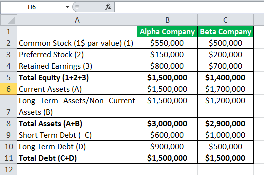

Financial metrics are essential in assessing the health and performance of businesses, serving as indicators of a company's financial condition and operational efficiency. Among these metrics, solvency ratios hold particular significance for evaluating a company's ability to fulfill its long-term debt obligations. These ratios, such as the debt-to-equity ratio, debt-to-assets ratio, and interest coverage ratio, provide insights into the proportion of debt in a company's capital structure, its capacity to generate cash flow, and its risk of financial distress.

In the context of algorithmic trading, the use of solvency ratios becomes even more critical. Algorithmic trading leverages computer algorithms to automate trading decisions, requiring precise and reliable metrics to execute trades effectively. By incorporating solvency ratios into financial analysis, traders can gain valuable insights into a company's financial stability and investment potential. This is particularly important as solvent companies are more likely to endure economic downturns, thereby reducing investment risk.



The role of solvency ratios within financial analysis extends beyond mere stability assessment. These metrics help identify robust financial positions, enabling investors to spot potential long-term opportunities. Understanding solvency ratios can lead to deeper insights into a company's capacity to sustain operations and grow, ultimately guiding more informed trading strategies.

Overall, solvency ratios are indispensable tools in financial analysis and play a pivotal role in enhancing the sophistication of algorithmic trading strategies. They not only illuminate a company's financial health but also contribute to developing trading decisions that are evidence-based and consider the financial robustness of underlying entities.

## Table of Contents

## Understanding Solvency Ratios

Solvency ratios are financial metrics employed to evaluate a company's capacity to satisfy its long-term liabilities. These ratios play a crucial role in financial analysis by providing insight into the relationship between the cash flow generated from business operations and the company's overall liabilities. By understanding this relationship, stakeholders can assess the long-term financial health and risk profile of a company.

Among the essential solvency ratios, the debt-to-equity ratio, debt-to-assets ratio, and interest coverage ratio stand out. The debt-to-equity ratio is calculated by dividing a company’s total liabilities by its shareholder equity, illustrating the proportion of debt used to finance the company's assets relative to equity. This ratio is expressed as:

$$
\text{Debt-to-Equity Ratio} = \frac{\text{Total Liabilities}}{\text{Shareholder Equity}}
$$

The debt-to-assets ratio measures the percentage of a company’s assets that are financed by debt, calculated by dividing total debt by total assets:

$$
\text{Debt-to-Assets Ratio} = \frac{\text{Total Debt}}{\text{Total Assets}}
$$

The interest coverage ratio indicates how easily a company can handle its interest expenses on outstanding debt, derived by dividing earnings before interest and taxes (EBIT) by the interest expenses:

$$
\text{Interest Coverage Ratio} = \frac{\text{EBIT}}{\text{Interest Expenses}}
$$

These solvency ratios provide distinct perspectives on a firm's financial stability, helping investors and prospective lenders evaluate the risk associated with investing in or lending to a company. By assessing these ratios, stakeholders can determine the creditworthiness and potential for long-term growth within the company. This form of analysis is critical in making informed decisions regarding financial strategies and investments.

## Types of Solvency Ratios

Solvency ratios are essential financial metrics that help evaluate a company's long-term financial stability and its capacity to fulfill long-term debt obligations. Among the various solvency ratios, the Debt-to-Equity (D/E) Ratio, Total-Debt-to-Total-Assets Ratio, and Interest Coverage Ratio are particularly significant.

The **Debt-to-Equity (D/E) Ratio** provides insights into a company's financial leverage by comparing its total liabilities to shareholders' equity. It is computed using the formula:

$$
\text{Debt-to-Equity Ratio} = \frac{\text{Total Liabilities}}{\text{Shareholders' Equity}}
$$

A higher D/E Ratio indicates that a company is heavily financed by debt relative to its equity, which may suggest higher financial risk. Conversely, a lower ratio implies a more conservative approach to financing and potentially lower risk.

The **Total-Debt-to-Total-Assets Ratio** reveals the percentage of a company's assets that are financed by debt. It is calculated as follows:

$$
\text{Total-Debt-to-Total-Assets Ratio} = \frac{\text{Total Debt}}{\text{Total Assets}}
$$

This ratio assesses the proportion of assets that are funded through borrowing, providing a clear picture of a company's leverage. A higher ratio suggests that a significant portion of the company's assets are financed through debt, potentially increasing financial risk, whereas a lower ratio could indicate a more stable financial structure.

The **Interest Coverage Ratio** evaluates a company's ability to pay interest expenses on its outstanding debt. It is determined using the formula:

$$
\text{Interest Coverage Ratio} = \frac{\text{Earnings Before Interest and Taxes (EBIT)}}{\text{Interest Expense}}
$$

This ratio acts as a measure of a company's financial buffer against potential earnings [volatility](/wiki/volatility-trading-strategies) impacting its ability to meet interest obligations. A higher Interest Coverage Ratio indicates that a company has a comfortable buffer to cover interest payments, suggesting lower financial risk. In contrast, a lower ratio may signal financial distress or vulnerability to fluctuations in earnings.

These ratios provide diverse views on a company's financial health, helping investors assess potential risks and returns associated with different investment opportunities. By offering insights into different facets of financial stability, solvency ratios are vital tools for comprehensively understanding a firm's financial standing.

## Solvency vs. Liquidity Ratios

Solvency and [liquidity](/wiki/liquidity-risk-premium) ratios are essential tools in assessing the financial health of a company, and they return distinct insights regarding a firm’s financial structure. Solvency ratios are crucial for understanding how well a company can meet its long-term commitments, providing a view of the company's ability to sustain operations over an extended period. In essence, they analyze the proportion of debt relative to equity and other financial figures that indicate a company’s capability to repay its long-term obligations. Key solvency ratios, such as the Debt-to-Equity Ratio and the Interest Coverage Ratio, highlight a company’s long-term risk profile and financial stability by examining the extent and cost of its debt relative to its revenue and equity.

Conversely, liquidity ratios focus on a company's short-term financial health, evaluating its ability to convert assets into cash promptly to satisfy imminent liabilities. These ratios, including the Current Ratio and the Quick Ratio, give a snapshot of a company's capability to handle its short-term obligations, indicating whether the firm possesses enough liquid assets to cover its immediate liabilities. The quick ratio, for instance, is calculated as:

$$
\text{Quick Ratio} = \frac{\text{Current Assets} - \text{Inventories}}{\text{Current Liabilities}}
$$

Both types of ratios play a vital role in financial analysis, yet their emphasis differs significantly. Solvency ratios provide insights into the financial sustainability and risk exposure over a long duration, while liquidity ratios focus on short-term financial robustness and immediate fiscal responsiveness. For comprehensive financial analysis, especially in developing trading strategies, differentiating and understanding the implications of these ratios is crucial. Their combined analysis offers a holistic view of a company's financial standing, enabling better-informed investment and strategic decisions.

## Analyzing Solvency Ratios in Financial Analysis

Comprehensive financial analysis incorporates a variety of financial ratios to gauge a company's economic health and potential for growth or risk. Among these, solvency ratios are pivotal in assessing a firm's capacity to sustain its operations and meet long-term obligations, which is crucial for various investment strategies including [algorithmic trading](/wiki/algorithmic-trading).

Algorithmic trading relies heavily on precise and accurate financial metrics to develop strategies that can effectively respond to market conditions. Solvency ratios, such as the debt-to-equity ratio and interest coverage ratio, provide essential insights into a company's financial robustness. These metrics help traders determine which companies possess strong financial positions, making them potential candidates for long-term investments. By identifying firms with healthy solvency ratios, traders can better anticipate how these companies might fare in dynamic market environments, which can inform decisions on whether to hold or sell assets.

The role of solvency ratios extends beyond merely identifying financially stable companies; they also reveal trends and financial behaviors that indicate underlying risks or stability levels. For instance, a consistently high debt-to-equity ratio might suggest an aggressive financing strategy, which could introduce risk if not supported by corresponding revenue growth. Conversely, an improving interest coverage ratio over time might reflect stronger earnings and better financial health, indicating stability.

For those developing trading algorithms, integrating solvency ratios into the analytical framework can enhance the accuracy of forecasting models. By leveraging historical data and market trends, algorithms can assess the implications of solvency metrics on stock performance or creditworthiness. This, in turn, allows for more informed and strategic trading decisions that align with an investor's risk tolerance and financial goals.

Furthermore, using programming languages like Python, traders can create algorithms that automate the analysis of solvency ratios. For example, a Python script could fetch financial data, compute key solvency ratios, and generate signals based on predefined parameters:

```python
import pandas as pd

# Example function to calculate solvency ratios
def calculate_solvent_ratios(financial_data):
    ratios = {}
    ratios['debt_to_equity'] = financial_data['total_debt'] / financial_data['shareholders_equity']
    ratios['interest_coverage'] = financial_data['ebit'] / financial_data['interest_expense']
    return ratios

# Sample financial data for a company
financial_data = {
    'total_debt': 10000,
    'shareholders_equity': 4000,
    'ebit': 3000,
    'interest_expense': 500
}

# Calculate and display the ratios
ratios = calculate_solvent_ratios(financial_data)
print(ratios)
```

This example demonstrates how financial analysis using solvency ratios can efficiently integrate real-time decision-making capabilities into trading strategies. Overall, while solvency ratios are integral in assessing financial health and guiding investment strategies, they should always be considered alongside other financial metrics to provide a comprehensive evaluation of an entity's financial position.

## Solvency Ratios in Algorithmic Trading

Algorithmic trading strategies increasingly utilize solvency ratios as critical components in evaluating corporate fiscal health and executing informed trades. These financial ratios, which include the debt-to-equity ratio, total-debt-to-total-assets ratio, and interest coverage ratio, provide a quantitative measure of a company's ability to meet long-term obligations, offering insights into its financial stability.

In the construction of algorithmic trading algorithms, solvency ratios are employed to systematically assess and respond to market movements. These ratios enable algorithms to filter and select trades by analyzing solvency metrics alongside other financial indicators. For example, an algorithm might prioritize trades with companies that exhibit a low debt-to-equity ratio, indicating a potentially lower financial risk due to reduced leverage levels.

By integrating solvency ratios into trading algorithms, traders enhance decision-making processes based on a company’s financial robustness. This integration allows the algorithms to automatically adjust trading strategies in response to changes in the solvency status of target companies. For instance, an algorithm might be coded in Python to automatically lower investment levels in companies showing a declining interest coverage ratio, thereby reducing exposure to companies that might struggle with their interest obligations.

The use of solvency metrics in trading algorithms does not only make trading more evidence-based but also increases awareness of the underlying financial stability of entities being considered. As a result, algorithms can better navigate the complexities of market conditions, identifying and pursuing investment opportunities with favorable solvency characteristics. This strategic approach helps traders mitigate risk and capitalize on companies with solid long-term financial prospects, aligning trading activities with overarching financial stability considerations.

This integration of solvency ratios into algorithmic trading systems reflects a sophisticated approach to leveraging financial data, positioning traders to respond dynamically to financial market conditions while maintaining a focus on risk and return potential.

## Limitations of Solvency Ratios

Solvency ratios are key metrics in assessing a company's long-term financial sustainability. However, relying solely on these ratios can lead to incomplete assessments due to several inherent limitations. Firstly, solvency ratios, such as the debt-to-equity and interest coverage ratios, fail to provide a comprehensive financial picture when used in isolation. They should be complemented with other financial indicators, like liquidity ratios and profitability margins, to obtain a holistic view of a company’s financial health. This integrated approach allows for a more nuanced analysis of a firm's capability to manage debts and sustain operations over time.

Secondly, solvency ratios can be significantly affected by industry-specific contexts and external economic conditions. For instance, industries with high capital requirements, such as utilities or telecommunications, naturally tend to have higher debt levels, which could skew the debt-to-equity ratio. In such cases, comparing solvency ratios across different industries without accounting for these variations can lead to misleading conclusions about a company's financial position relative to its peers.

Moreover, external economic factors, such as [interest rate](/wiki/interest-rate-trading-strategies) fluctuations or changes in fiscal policy, can also influence the accuracy of solvency ratios. During periods of economic downturn, for example, a company may face increased borrowing costs, which could adversely impact its interest coverage ratio, thereby affecting the perceived risk profile even when its fundamental business operations remain stable.

Understanding these limitations is crucial for critically evaluating solvency ratios within broader financial frameworks. Analysts must consider additional qualitative and quantitative factors, such as management effectiveness and market conditions, to form a well-rounded assessment of a company's long-term financial health and viability. Therefore, solvency ratios should be viewed as part of a larger set of tools in financial analysis, rather than definitive measures of financial stability on their own.

## Conclusion

Solvency ratios are essential for understanding a company's long-term financial health and stability. These ratios, which assess a firm's capacity to meet long-term obligations, play a critical role in evaluating financial soundness. Within financial analysis and algorithmic trading, they provide insights that can be instrumental in enhancing trading strategies. By analyzing solvency ratios, traders can identify companies with robust financial positions, thus minimizing risks associated with financial instability.

However, while solvency ratios are powerful, relying solely on them can lead to an incomplete assessment. It is crucial to combine these ratios with other financial metrics to attain a well-rounded view of a company's financial status. This integrated approach allows for better-informed investment decisions, taking into account both immediate liquidity and long-term solvency perspectives.

As financial markets continue to evolve, the integration of solvency ratios in trading algorithms will likely become more advanced. Algorithmic trading, which relies heavily on precise financial metrics, stands to benefit significantly from incorporating solvency ratios alongside other data points. This synthesis of comprehensive financial data will enable trading systems to make more nuanced and effective decisions, ultimately improving trading performance and investment outcomes.

## References & Further Reading

[1]: ["Financial Ratios for Executives: How to Assess Company Strength, Fix Problems, and Make Better Decisions"](https://link.springer.com/book/10.1007/978-1-4842-0731-4) by Michael Rist

[2]: ["Principles of Corporate Finance"](https://www.amazon.com/Principles-Corporate-Finance-Richard-Brealey/dp/1260565556) by Richard A. Brealey, Stewart C. Myers, and Franklin Allen

[3]: ["The Intelligent Investor: The Definitive Book on Value Investing"](https://www.amazon.com/Intelligent-Investor-Definitive-Investing-Essentials/dp/0060555661) by Benjamin Graham

[4]: ["Ratio Analysis Fundamentals: How 17 Financial Ratios Can Allow You to Analyse Any Business on the Planet"](https://www.amazon.com/Ratio-Analysis-Fundamentals-Financial-Business/dp/1494922630) by Axel Tracy

[5]: ["Accounting for Value"](https://www.amazon.com/Accounting-Columbia-Business-School-Publishing/dp/0231151187) by Stephen Penman

[6]: ["Investments"](https://www.bankrate.com/investing/best-investments-for-beginners/) by Zvi Bodie, Alex Kane, and Alan J. Marcus