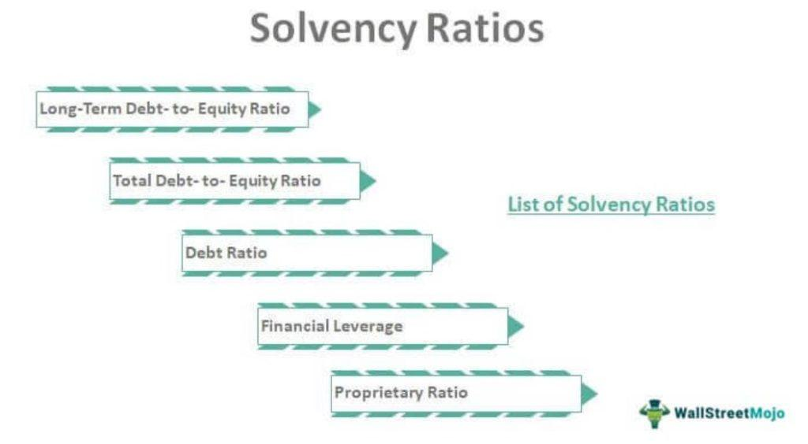

## Table of Contents

## What are solvency ratios and why are they important in investment analysis?

Solvency ratios are financial metrics that help measure a company's ability to meet its long-term obligations. These ratios look at the relationship between a company's debt and its assets, equity, or earnings. Common solvency ratios include the debt to equity ratio, the interest coverage ratio, and the equity ratio. They give investors an idea of how financially stable a company is and whether it can survive over the long term.

These ratios are important in investment analysis because they help investors understand the risk associated with a company. If a company has high solvency ratios, it might mean it has too much debt compared to its assets or earnings. This could make it harder for the company to pay back its loans, which is risky for investors. On the other hand, if a company has low solvency ratios, it might be seen as more financially stable and less risky. By looking at solvency ratios, investors can make better decisions about which companies to invest in and how likely those companies are to succeed in the future.

## How do solvency ratios differ from liquidity ratios?

Solvency ratios and liquidity ratios are both important financial metrics, but they focus on different aspects of a company's financial health. Solvency ratios measure a company's ability to meet its long-term obligations. They look at how much debt a company has compared to its assets or earnings. This helps investors understand if a company can keep going over the long term and if it can handle its debt. Examples of solvency ratios include the debt to equity ratio and the interest coverage ratio.

On the other hand, liquidity ratios focus on a company's ability to pay its short-term debts. These ratios show how easily a company can turn its assets into cash to cover immediate expenses. Liquidity ratios are important because they tell investors if a company can handle its day-to-day financial needs without running into trouble. Common liquidity ratios include the current ratio and the quick ratio.

In simple terms, solvency ratios are about the big picture and long-term survival, while liquidity ratios are about the immediate situation and short-term financial health. Both types of ratios give investors different pieces of information to help them decide if a company is a good investment.

## Can you name three common solvency ratios and explain what they measure?

Three common solvency ratios are the debt to equity ratio, the interest coverage ratio, and the equity ratio. The debt to equity ratio measures how much debt a company has compared to its equity. It's calculated by dividing a company's total liabilities by its total equity. A high debt to equity ratio might mean a company is using a lot of borrowed money to grow, which could be risky. The interest coverage ratio looks at how well a company can pay the interest on its debt. It's figured out by dividing a company's earnings before interest and taxes (EBIT) by its interest expenses. A higher ratio means the company can easily cover its interest payments, which is a good sign for investors.

The equity ratio, also called the equity to assets ratio, shows the percentage of a company's assets that are funded by shareholders' equity. It's calculated by dividing total equity by total assets. A higher equity ratio suggests that the company is less dependent on debt and more on money from its owners, which can be seen as a sign of financial strength. These three ratios help investors understand how financially stable a company is and how well it can handle its long-term debts.

## How is the Debt to Equity Ratio calculated and what does it indicate about a company's financial health?

The Debt to Equity Ratio is calculated by dividing a company's total liabilities by its total equity. Total liabilities are all the money a company owes, like loans and other debts. Total equity is the value of the company that belongs to the owners or shareholders. So, if a company has $100,000 in liabilities and $50,000 in equity, the Debt to Equity Ratio would be 2.0, meaning the company has twice as much debt as equity.

This ratio tells us a lot about a company's financial health. A high Debt to Equity Ratio means the company is using a lot of borrowed money to grow, which can be risky. If the company can't pay back its loans, it could run into big trouble. On the other hand, a low Debt to Equity Ratio means the company is using less debt and more of its own money, which is usually seen as safer. Investors look at this ratio to see if a company is financially stable and to decide if it's a good investment.

## What is the Interest Coverage Ratio and how does it help assess a company's solvency?

The Interest Coverage Ratio is a way to see if a company can pay the interest on its loans. You find it by dividing the company's earnings before interest and taxes (EBIT) by its interest expenses. For example, if a company makes $200,000 before paying interest and taxes and has to pay $50,000 in interest, its Interest Coverage Ratio would be 4. This means the company earns four times more than it needs to cover its interest payments.

This ratio helps investors understand how safe a company's finances are over the long term. A high Interest Coverage Ratio means the company can easily pay its interest, which is a good sign that it won't go bankrupt because of debt. A low ratio, though, could mean the company is struggling to pay its interest, which is risky. So, by looking at the Interest Coverage Ratio, investors can decide if a company is a good bet for their money.

## How can the Equity Ratio be used to evaluate a company's long-term solvency?

The Equity Ratio, also known as the equity to assets ratio, helps investors see how much of a company's assets are paid for by the owners or shareholders. You find it by dividing the company's total equity by its total assets. If a company has a high Equity Ratio, it means a big part of what the company owns comes from the money put in by its owners, not from loans. This can be a good sign because it shows the company isn't too dependent on borrowed money, which can make it more stable over the long run.

Looking at the Equity Ratio helps investors decide if a company is a safe bet for the future. A high Equity Ratio means the company is less risky because it relies more on its own money than on debt. On the other hand, a low Equity Ratio might mean the company has a lot of debt, which could be risky if it can't pay it back. So, by checking the Equity Ratio, investors can get a good idea of how well a company can handle its long-term debts and stay financially healthy.

## What are the limitations of using solvency ratios in investment analysis?

Solvency ratios can help investors understand a company's financial health, but they have some limits. One big problem is that these ratios only show a snapshot of a company's finances at one moment. They don't tell you how the company has been doing over time or how it might do in the future. Also, different industries have different ways of working with debt, so what looks like a bad ratio in one industry might be normal in another.

Another issue is that solvency ratios don't take into account things like the quality of a company's assets or how easily it can turn those assets into cash. A company might have a good solvency ratio, but if its assets are hard to sell or not worth much, it could still have trouble paying its debts. Plus, these ratios don't consider how the economy is doing or other outside factors that can affect a company's ability to stay solvent. So, while solvency ratios are useful, they should be used along with other information to get a full picture of a company's financial situation.

## How do industry standards affect the interpretation of solvency ratios?

Industry standards play a big role in how we look at solvency ratios. Different industries have different ways of handling debt. For example, a company in the utility industry might have a high debt to equity ratio, but that's normal because they need a lot of money to build power plants and other big projects. On the other hand, a tech company might have a low debt to equity ratio because they don't need as much money to grow. So, when we look at solvency ratios, we need to compare them to what's normal for that industry, not just look at the numbers by themselves.

If we don't think about industry standards, we might get the wrong idea about a company's financial health. A high debt to equity ratio might look bad at first glance, but if it's common in that industry, it might not be a problem. This is why it's important to know what's normal for different industries when using solvency ratios to make investment decisions. By understanding these standards, investors can better judge if a company is using its debt in a smart way or if it's taking on too much risk.

## Can you discuss a case study where solvency ratios were pivotal in making an investment decision?

In 2008, during the financial crisis, many investors used solvency ratios to decide whether to keep or sell their investments in big banks. One famous example is Lehman Brothers, a big investment bank that went bankrupt. Before Lehman Brothers collapsed, investors looked at its solvency ratios like the debt to equity ratio and the interest coverage ratio. Lehman had a very high debt to equity ratio, which meant it was using a lot of borrowed money to grow. Its interest coverage ratio was also low, showing it was struggling to pay the interest on its loans. These signs made many investors worried about Lehman's long-term survival, and they decided to sell their shares before the bank went bankrupt.

Another case is when investors looked at the solvency ratios of General Motors (GM) before it went bankrupt in 2009. GM's debt to equity ratio was very high, which meant it had a lot of debt compared to what it owned. Its equity ratio was low, showing that most of its assets were paid for with borrowed money, not money from shareholders. These solvency ratios told investors that GM was in a risky financial position. Many investors chose to sell their GM shares because they thought the company might not be able to pay back its debts. These decisions were based on the solvency ratios showing that GM was not in a strong financial position to handle its long-term obligations.

## How do changes in accounting policies affect the calculation and interpretation of solvency ratios?

Changes in accounting policies can really change how we calculate and understand solvency ratios. If a company starts using a new way to value its assets or liabilities, the numbers used in ratios like the debt to equity ratio or the equity ratio can be different. For example, if a company changes how it accounts for its debts, the total liabilities might go up or down. This means the debt to equity ratio would change too, even if nothing else about the company's business changes. So, when we look at solvency ratios, we need to know if the company has changed its accounting rules, because that could make the numbers look better or worse than they really are.

These changes can also make it hard to compare solvency ratios from one year to the next or between different companies. If one company uses one set of accounting rules and another uses different rules, their solvency ratios might not be fair to compare. This is important for investors because they might think a company is more or less risky than it really is. So, when making investment decisions based on solvency ratios, it's important to look at any changes in accounting policies and understand how those changes affect the numbers. This way, investors can get a truer picture of a company's financial health.

## What advanced statistical methods can be used to enhance the predictive power of solvency ratios?

To make solvency ratios better at predicting a company's future financial health, we can use advanced statistical methods like regression analysis and time series analysis. Regression analysis helps us see how different financial factors, like debt and earnings, affect solvency ratios. By studying this, we can guess how changes in these factors might change a company's ability to pay its long-term debts. Time series analysis looks at how solvency ratios change over time. This can help us spot patterns and predict how a company's solvency might look in the future based on past data.

Another useful method is discriminant analysis, which can help us tell the difference between companies that will stay solvent and those that won't. This method looks at a bunch of financial ratios at once to find the best mix that predicts solvency. Also, [machine learning](/wiki/machine-learning) techniques, like neural networks, can learn from lots of data to find patterns that humans might miss. These methods can make our predictions more accurate by considering more data and finding complex relationships between different financial factors. By using these advanced statistical tools, investors can get a clearer picture of a company's financial future and make smarter investment choices.

## How can solvency ratios be integrated into a comprehensive investment strategy alongside other financial metrics?

Solvency ratios are a key part of a smart investment strategy, but they work best when used with other financial metrics. They tell us how well a company can handle its long-term debts, which is important for understanding if a company is a safe bet for the future. But, to get a full picture of a company's health, we need to look at other things too, like liquidity ratios that show if a company can pay its short-term bills, profitability ratios that tell us if the company is making money, and growth ratios that show if the company is getting bigger. By combining solvency ratios with these other metrics, investors can see if a company is not just surviving, but thriving.

For example, an investor might start by checking a company's debt to equity ratio to see if it's using too much borrowed money. If the ratio looks okay, they might then look at the company's current ratio to see if it can pay its short-term debts. Next, they could check the return on equity to see if the company is making good use of its money. Finally, they might look at the company's revenue growth to see if it's on the rise. By putting all these pieces together, investors can make better decisions about which companies to invest in. This way, they can balance the risk of a company's debt with its ability to grow and make money, leading to a smarter investment strategy.

## What are Solvency Ratios and How Can We Understand Them?

Solvency ratios are essential tools in financial analysis, providing quantitative measures of a company's ability to meet long-term obligations. They assess a company's financial stability by evaluating its cash flow and overall liabilities. These metrics are crucial for investors and stakeholders, as they offer insights into a company's capacity to sustain operations over time.

One of the primary solvency ratios is the Debt-to-Equity (D/E) ratio, which compares a company's total liabilities to its shareholders' equity. This ratio indicates how much of a company's operations are financed by debt compared to owned capital. The formula for the Debt-to-Equity ratio is:

$$
\text{Debt-to-Equity Ratio} = \frac{\text{Total Liabilities}}{\text{Shareholders' Equity}}
$$

Another important metric is the Debt-to-Assets ratio, which reveals the proportion of a company's assets that are financed through debt. This ratio provides insight into the leverage position of the company and potential financial risk. It is calculated as:

$$
\text{Debt-to-Assets Ratio} = \frac{\text{Total Debt}}{\text{Total Assets}}
$$

The Interest Coverage Ratio is also a key solvency indicator, measuring a company's ability to pay interest on its outstanding debt. This ratio evaluates whether earnings before interest and taxes (EBIT) are sufficient to cover interest expenses. The formula is as follows:

$$
\text{Interest Coverage Ratio} = \frac{\text{EBIT}}{\text{Interest Expense}}
$$

Understanding these ratios allows investors to gauge a company's long-term financial health by indicating its capability to fulfill debt obligations and finance future growth. A robust solvency position is often synonymous with reduced financial risk, enhancing the company's stability and attractiveness to potential investors. However, it's crucial to interpret these ratios within the context of industry norms and economic conditions, ensuring a comprehensive assessment of financial health.

## What are the types of solvency ratios?

Solvency ratios are integral measures for evaluating a company's long-term financial stability. They provide insight into how well a company can meet its long-term obligations, which is crucial for potential investors and stakeholders. Here are the key types of solvency ratios:

1. **Debt-to-Equity (D/E) Ratio**: This ratio gauges a company's financial leverage by comparing its total liabilities to shareholders' equity. It is calculated as:
$$
   \text{Debt-to-Equity Ratio} = \frac{\text{Total Liabilities}}{\text{Shareholders' Equity}}

$$

   A higher D/E ratio indicates that a company is heavily financed by debt relative to equity, which may suggest higher financial risk. However, it can also indicate a more aggressive growth strategy.

2. **Total-Debt-to-Total-Assets Ratio**: This ratio measures what portion of a company's assets is financed through debt. It gives an overview of the financing structure of the company. The formula is:
$$
   \text{Total-Debt-to-Total-Assets Ratio} = \frac{\text{Total Debt}}{\text{Total Assets}}

$$

   A higher ratio suggests that a significant portion of a company's assets are financed by creditors, which could be risky if not managed carefully.

3. **Interest Coverage Ratio**: This ratio assesses a company's ability to pay interest on its outstanding debt, indicating financial health regarding debt servicing. It is expressed as:
$$
   \text{Interest Coverage Ratio} = \frac{\text{Earnings Before Interest and Taxes (EBIT)}}{\text{Interest Expenses}}

$$

   A higher interest coverage ratio implies that the company is more capable of meeting its interest obligations, indicating better financial health.

Each of these solvency ratios sheds light on different aspects of a firm's financial stability. By analyzing these ratios, investors can gain a comprehensive understanding of a company's risk profile concerning its long-term obligations. This aids in making more informed investment decisions.

## What is the difference between Solvency and Liquidity Ratios?

Solvency and [liquidity](/wiki/liquidity-risk-premium) ratios are pivotal in assessing a company's financial stability, each offering insights into different aspects of its financial health. Solvency ratios are primarily concerned with a company's capacity to meet its long-term financial commitments. They evaluate the risk profile by examining the ratio of long-term debt to the company's total assets and shareholders' equity. A primary example is the Debt-to-Equity (D/E) ratio, which is calculated as follows:

$$
\text{Debt-to-Equity Ratio} = \frac{\text{Total Liabilities}}{\text{Shareholders' Equity}}
$$

This ratio measures the extent to which shareholder equity can cover debts, indicating the financial leverage of a company. A higher ratio suggests that a company is more leveraged and potentially at greater risk in terms of solvency.

In contrast, liquidity ratios focus on a company's capability to meet short-term obligations, providing a snapshot of its immediate financial health. These ratios assess the ease with which a company can convert its current assets into cash to pay off its short-term liabilities. Two common liquidity ratios are the current ratio and the quick ratio:

- The Current Ratio formula is given by:

$$
\text{Current Ratio} = \frac{\text{Current Assets}}{\text{Current Liabilities}}
$$

This ratio indicates how well a company can cover its short-term liabilities with its short-term assets. A ratio above 1 suggests that the company has more assets than liabilities due at the same period.

- The Quick Ratio, also known as the acid-test ratio, refines the current ratio by excluding inventory from current assets:

$$
\text{Quick Ratio} = \frac{\text{Current Assets} - \text{Inventory}}{\text{Current Liabilities}}
$$

This ratio provides a more stringent measure of liquidity by considering only the most liquid assets, thereby offering a clearer picture of a company's short-term financial situation.

Comprehensive financial analysis necessitates understanding both solvency and liquidity ratios. Solvency ratios highlight the long-term sustainability and risk of a company, while liquidity ratios provide insights into its short-term operational efficiency. Together, these metrics enable investors to make more informed and holistic assessments of a company's financial position.

## What are Solvency Ratios in Algorithmic Trading?

Algorithmic trading utilizes solvency ratios to enhance trading strategies by assessing the financial stability of companies. Integrating these financial metrics into algorithmic systems allows for a systematic evaluation of market opportunities. Solvency ratios, such as the debt-to-equity ratio and interest coverage ratio, offer insights into a company's long-term viability, which is crucial for making informed trading decisions.

The incorporation of solvency ratios into [algorithmic trading](/wiki/algorithmic-trading) can be described as follows. Algorithms can be programmed to scan financial reports and extract relevant data points corresponding to these ratios. For example, the debt-to-equity ratio, calculated as:

$$
\text{Debt-to-Equity Ratio} = \frac{\text{Total Liabilities}}{\text{Shareholders' Equity}}
$$

can be used to identify companies with balanced leverage, suggesting financial stability. By evaluating these ratios, algorithms can filter out companies that might pose financial risks and focus on those with sound financial health.

This integration addresses financial stability by aligning trading strategies with a company's long-term financial health. For instance, algorithms can prioritize trades in firms that maintain solvency ratios within certain thresholds, minimizing exposure to firms with potential financial distress. By structuring trading strategies around these ratios, algorithms can improve the selection of assets, optimizing portfolio performance.

To implement this, one could use Python for fetching financial data, calculating solvency ratios, and executing trades based on predefined criteria. Here's a hypothetical Python function to illustrate this approach:

```python
def calculate_solvent_companies(companies):
    solvent_companies = []
    for company in companies:
        debt_equity_ratio = company['total_liabilities'] / company['shareholders_equity']
        interest_coverage_ratio = company['ebit'] / company['interest_expenses']

        if debt_equity_ratio < 1 and interest_coverage_ratio > 3:
            solvent_companies.append(company)
    return solvent_companies

# Example usage: Assume we have a list of company financial data
companies_data = [
    {'name': 'Company A', 'total_liabilities': 500, 'shareholders_equity': 600,
     'ebit': 200, 'interest_expenses': 50},
    {'name': 'Company B', 'total_liabilities': 200, 'shareholders_equity': 500,
     'ebit': 100, 'interest_expenses': 40},
    # More company data...
]

solvent_companies = calculate_solvent_companies(companies_data)
print("Solvent companies for trading:", solvent_companies)
```

This example highlights how solvency ratios can be systematically applied to filter desirable trading opportunities. Ultimately, by utilizing solvency ratios to inform algorithmic trading, the efficiency and accuracy of trading decisions can be significantly improved, reducing risk and potentially increasing returns.

## References & Further Reading

For those interested in expanding their knowledge of financial analysis and algorithmic trading, several authoritative sources provide comprehensive insights:

1. **Financial Ratios: A Step-by-Step Guide to Understanding and Creating Financial Management Reports** by Michael Rist provides a foundational understanding of financial ratios, including solvency ratios, and their applications in evaluating corporate financial health.

2. **Algorithmic Trading: Winning Strategies and Their Rationale** by Ernie Chan discusses the development of trading strategies and the use of financial ratios in algorithm design. This book offers practical insights into the integration of financial analysis within automated trading systems.

3. **Investment Valuation: Tools and Techniques for Determining the Value of Any Asset** by Aswath Damodaran is a definitive guide on investment analysis. It details a variety of tools and techniques used in asset valuation, essential for understanding how solvency ratios fit into broader investment strategies.

4. **Quantitative Trading: How to Build Your Own Algorithmic Trading Business** by Ernie Chan further explores the field of algo trading, providing a roadmap for setting up a trading business and the role of financial data analysis in informing trading decisions.

5. Scholarly articles and papers, such as those found in the *Journal of Finance* and the *Quantitative Finance Journal*, offer cutting-edge research into the applications of solvency ratios in market analysis and algorithmic trading strategies.

6. Online courses from platforms like Coursera and edX can offer interactive learning experiences. Courses that focus on financial analysis, such as 'Financial Analysis and Decision Making' by the University of Michigan, or algo trading, such as 'Algorithmic Trading Strategies' by the University of California, Berkeley, provide structured learning paths and practical projects.

By engaging with these resources, investors and finance professionals can deepen their understanding, enhance their strategies, and stay abreast of the latest trends in investment analysis and algorithmic trading.

