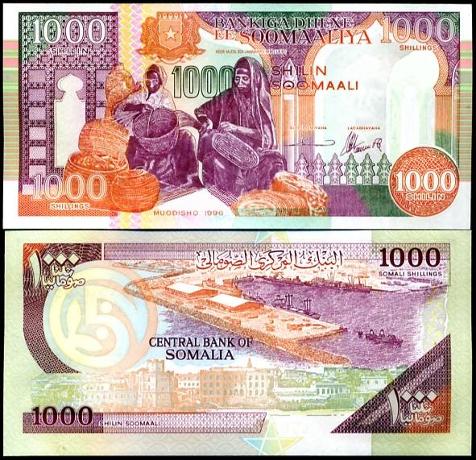

## Table of Contents

## What is the Somali Shilling?

The Somali Shilling is the money used in Somalia, a country in Africa. It is the main way people in Somalia buy things and pay for services. The Somali Shilling has been around since 1962, when Somalia first started using it as their official money.

The Somali Shilling comes in both paper money and coins. The paper money has different colors and pictures, and the coins are made of metal. Because Somalia has had a lot of problems with war and not having a strong government, the Somali Shilling can be hard to use in some places. Sometimes, people in Somalia use other kinds of money, like the US Dollar, to buy things instead.

## How is the Somali Shilling abbreviated?

The Somali Shilling is usually shortened to "SOS." This is the three-letter code that people use when they talk about or write about the Somali Shilling.

You might also see the symbol "Sh" used for the Somali Shilling. It's a shorter way to show the money without using the full name. Both "SOS" and "Sh" help make it easier and quicker to talk about the Somali Shilling.

## What is the history of the Somali Shilling?

The Somali Shilling started being used in 1962, after Somalia became its own country. Before that, Somalia used different kinds of money because it was ruled by different countries. When Somalia got its independence, it decided to make its own money, the Somali Shilling. The first Somali Shillings had pictures of important people and places in Somalia. People used the Somali Shilling to buy things and pay for services in their everyday lives.

But, Somalia had a lot of problems with war and not having a strong government. This made it hard for the Somali Shilling to be used everywhere in the country. Sometimes, people had to use other kinds of money, like the US Dollar, because the Somali Shilling was not always accepted or available. Even though the Somali Shilling is still the official money of Somalia, it can be hard to use in some places because of the country's problems.

## What are the denominations of the Somali Shilling?

The Somali Shilling comes in different amounts of money, called denominations. The paper money, or banknotes, are available in amounts like 5, 10, 20, 50, 100, 500, 1000, and 5000 shillings. These banknotes have different colors and pictures on them, which helps people tell them apart easily. The coins are smaller amounts of money and come in 1, 5, 10, 50, and 100 shillings. Coins are usually made of metal and are handy for smaller purchases.

Because Somalia has had a lot of problems with war and not having a strong government, the Somali Shilling can be hard to use in some places. Sometimes, the older banknotes are not used anymore, and new ones are made. People might use the US Dollar instead of the Somali Shilling in some parts of the country. Even though the Somali Shilling is still the official money, the different denominations can be hard to find or use in some areas.

## How does the Somali Shilling compare to other currencies?

The Somali Shilling is the money used in Somalia, but it is not as strong as many other currencies around the world. For example, 1 US Dollar can be worth thousands of Somali Shillings. This means that if you have 1 US Dollar, you can get a lot of Somali Shillings in exchange. Because of this, many people in Somalia use US Dollars instead of Somali Shillings for big purchases or to save money.

The value of the Somali Shilling changes a lot because Somalia has had many problems with war and not having a strong government. This makes it hard for the Somali Shilling to be used everywhere in the country. In some places, people might not accept the Somali Shilling at all. Compared to other African currencies, like the Kenyan Shilling or the South African Rand, the Somali Shilling is much weaker and less stable. This makes it difficult for people in Somalia to buy things from other countries or to travel abroad.

## What is the current exchange rate of the Somali Shilling?

The Somali Shilling's exchange rate changes a lot because Somalia has had many problems with war and not having a strong government. Right now, 1 US Dollar is worth about 570 Somali Shillings. This means if you have 1 US Dollar, you can get 570 Somali Shillings in exchange. The exchange rate can be different in different parts of Somalia, and it can change from day to day.

Because the Somali Shilling is not very stable, many people in Somalia use US Dollars instead for big purchases or to save money. The Somali Shilling is weaker than many other currencies, like the Kenyan Shilling or the South African Rand. This makes it hard for people in Somalia to buy things from other countries or to travel abroad. The value of the Somali Shilling can go up and down a lot, which makes it tricky to use for everyday buying and selling.

## How has the value of the Somali Shilling fluctuated over time?

The Somali Shilling's value has gone up and down a lot over time. When it first started being used in 1962, 1 US Dollar was worth about 7 Somali Shillings. But as Somalia had more problems with war and not having a strong government, the value of the Somali Shilling went down a lot. By the early 1990s, 1 US Dollar was worth hundreds of Somali Shillings. The value kept changing and going down, and now, 1 US Dollar is worth about 570 Somali Shillings.

Because the Somali Shilling is not very stable, it is hard for people in Somalia to use it for everyday buying and selling. The value of the Somali Shilling can change a lot from day to day, and it can be different in different parts of the country. This makes it difficult for people to plan their money and buy things. Many people in Somalia use US Dollars instead, especially for big purchases or to save money, because the US Dollar is more stable and accepted in more places.

## What factors influence the value of the Somali Shilling?

The value of the Somali Shilling is affected by many things, but one of the biggest is the problems Somalia has had with war and not having a strong government. When a country is not stable, people don't trust its money as much. This makes the Somali Shilling go down in value compared to other currencies, like the US Dollar. Another [factor](/wiki/factor-investing) is how much Somalia can sell to other countries. If Somalia can sell more things, like goods or services, it can make its money stronger. But because of the country's problems, it is hard for Somalia to do this, so the Somali Shilling stays weak.

Also, the way people use money in Somalia affects the value of the Somali Shilling. Many people in Somalia use US Dollars for big purchases or to save money because the US Dollar is more stable and accepted in more places. When people use the US Dollar instead of the Somali Shilling, it makes the Somali Shilling even weaker. The exchange rate of the Somali Shilling can change a lot from day to day and be different in different parts of the country. This makes it hard for people to trust and use the Somali Shilling for everyday buying and selling.

## What are the economic impacts of using the Somali Shilling in Somalia?

Using the Somali Shilling in Somalia has many economic effects. One big effect is that it makes it hard for people to buy and sell things. Because the Somali Shilling is not very stable and its value changes a lot, people don't trust it as much. This means they might use US Dollars instead, which are more stable. When people use US Dollars, it makes the Somali Shilling even weaker. This can make it hard for businesses in Somalia to plan and grow because they don't know how much their money will be worth from day to day.

Another impact is on how Somalia can trade with other countries. Because the Somali Shilling is weak, it is hard for Somalia to buy things from other places. This can make it difficult for people in Somalia to get important things they need, like medicine or food. Also, because the Somali Shilling is not strong, it can be hard for Somalia to sell things to other countries. This can hurt the economy because it means less money coming into the country. Overall, the weak and unstable Somali Shilling makes it harder for Somalia to have a strong and growing economy.

## How is the Somali Shilling regulated and by whom?

The Somali Shilling is supposed to be regulated by the Central Bank of Somalia. The Central Bank is like a big boss for money in the country. It is supposed to make sure the Somali Shilling is used the right way and that it stays strong. But because Somalia has had a lot of problems with war and not having a strong government, the Central Bank has not been able to do its job very well. This means the Somali Shilling does not have a strong boss to help keep its value stable.

Because the Central Bank is not very strong, the Somali Shilling's value changes a lot. It can be hard for people in Somalia to know how much their money is worth from day to day. This makes it difficult for them to buy and sell things. Some people use US Dollars instead because they trust it more. The weak regulation of the Somali Shilling makes it hard for Somalia to have a good economy and for people to plan their money.

## What are the challenges faced by the Somali Shilling in the global market?

The Somali Shilling faces many challenges in the global market because it is not very strong or stable. When a country's money is not stable, other countries do not want to use it for buying and selling things. The Somali Shilling's value changes a lot, which makes it hard for other countries to trust it. This means Somalia has a hard time trading with other places. When Somalia tries to buy things from other countries, it needs a lot of Somali Shillings to get just a little bit of other money, like US Dollars. This makes it expensive for Somalia to get important things it needs, like medicine or food.

Another challenge is that many people in Somalia use US Dollars instead of the Somali Shilling. Because the US Dollar is more stable and accepted in more places, people trust it more. When people use US Dollars instead of the Somali Shilling, it makes the Somali Shilling even weaker. This can make it hard for Somalia to sell things to other countries because other countries might not want to use the Somali Shilling. Overall, the weak and unstable Somali Shilling makes it hard for Somalia to be a big part of the global market and to have a strong economy.

## What future developments are expected for the Somali Shilling?

The future of the Somali Shilling depends a lot on what happens in Somalia. If Somalia can become more stable and have a stronger government, the Somali Shilling might get stronger too. The Central Bank of Somalia would need to be able to do its job better and help keep the Somali Shilling's value from changing so much. If this happens, more people might start using the Somali Shilling instead of US Dollars, and it could become easier for Somalia to trade with other countries.

But, if Somalia keeps having problems with war and not having a strong government, the Somali Shilling will probably stay weak and unstable. People might keep using US Dollars instead, which would make it hard for the Somali Shilling to get stronger. It would also be hard for Somalia to buy things from other countries and to sell things to them. This would make it difficult for Somalia to have a good economy and for people to plan their money.

## References & Further Reading

[1]: Little, P.D. (2003). ["Somalia: Economy without State."](https://archive.org/details/somaliaeconomywi0000litt) Indiana University Press.  

[2]: Looney, R. (2006). ["Trade in the Horn of Africa: Where Formal and Informal Economies Meet."](https://jhwikicollection-20.fandom.com/wiki/Moana_2/Credits) Review of African Political Economy, 33(110), 347-362.  

[3]: ["Finance in Africa: Harnessing Continental Transformations"](https://www.eib.org/en/publications/20240033-finance-in-africa) Atlantic Council Africa Center (2021).  

[4]: Tsang, E. P. K. (2013). ["Computational Intelligence: Modelling, Learning and Trading in Financial Markets."](https://www.bracil.net/edward/Home.html) World Scientific Publishing Company.  

[5]: Johnson, B. (2010). ["Algorithmic Trading & DMA: An Introduction to Direct Access Trading Strategies."](https://archive.org/details/algorithmictradi0000john) 4Myeloma Press.  