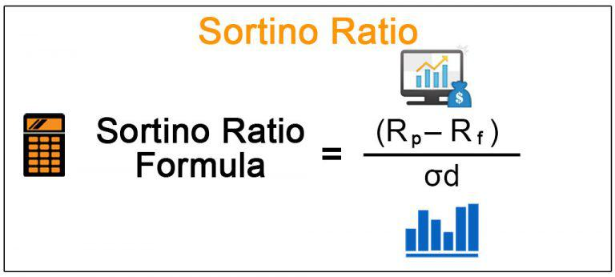

## Table of Contents

## What is the Sortino Ratio and why is it important in finance?

The Sortino Ratio is a way to measure how well an investment is doing, but it focuses on the bad times more than the good times. It looks at the returns of an investment and compares them to the bad risks, or the times when the investment loses money. The Sortino Ratio is different from other measures because it only cares about the downside risk, which means it only looks at the times when the investment is not doing well. This can be helpful because investors usually worry more about losing money than missing out on gains.

The Sortino Ratio is important in finance because it helps investors understand how much risk they are taking for the returns they are getting, especially when it comes to the risk of losing money. A higher Sortino Ratio means that an investment is doing a good job of giving returns without too much risk of big losses. This can be very useful for investors who want to avoid big drops in their investment value. By using the Sortino Ratio, investors can make better choices about which investments might be safer and more likely to meet their goals without causing too much worry about losing money.

## How does the Sortino Ratio differ from the Sharpe Ratio?

The Sortino Ratio and the Sharpe Ratio are both used to see how well an investment is doing compared to the risk it takes, but they look at risk in different ways. The Sharpe Ratio looks at all kinds of risk, both the good and the bad. It uses something called standard deviation to measure how much the returns of an investment go up and down. This means it counts all the ups and downs, even the times when the investment is doing well. On the other hand, the Sortino Ratio only cares about the bad risks, or the times when the investment loses money. It uses something called downside deviation, which only looks at the times when the returns are less than what you expect.

Because of these differences, the Sortino Ratio might be better for investors who are more worried about losing money than missing out on gains. If an investment has a lot of ups and downs but most of those are positive, the Sharpe Ratio might make it look riskier than it really is. The Sortino Ratio, by focusing only on the downside, gives a clearer picture of the risk of losing money. This can help investors choose investments that fit their comfort level with risk, especially if they want to avoid big losses.

## What is the formula for calculating the Sortino Ratio?

The Sortino Ratio is calculated using a simple formula. You start by taking the average return of your investment and subtracting the target return, which is usually the return you expect or need. This gives you the excess return. Then, you divide this excess return by the downside deviation. The downside deviation is a measure of how much the investment's returns fall below the target return. So, the formula looks like this: Sortino Ratio = (Average Return - Target Return) / Downside Deviation.

To find the downside deviation, you first figure out which returns are below the target return. You then square the difference between each of these returns and the target return, add them up, and divide by the number of returns. Finally, you take the square root of this number to get the downside deviation. This part of the formula focuses only on the bad times, which is why the Sortino Ratio is useful for investors who want to avoid big losses.

## What does the Sortino Ratio measure specifically?

The Sortino Ratio measures how well an investment does compared to the risk of losing money. It looks at the average return of the investment and takes away the return you expect or need. This gives you the extra return you get. Then, it divides this extra return by something called downside deviation. Downside deviation is a way to see how much the investment's returns drop below what you expect. By focusing only on the times when the investment loses money, the Sortino Ratio helps investors see if the investment is worth the risk of losing money.

This ratio is useful because it helps investors understand if they are getting enough return for the chance of losing money. A higher Sortino Ratio means the investment is doing a good job of giving returns without too much risk of big losses. This can be really helpful for people who want to avoid big drops in their investment value. By using the Sortino Ratio, investors can pick investments that fit their comfort level with risk and help them meet their goals without worrying too much about losing money.

## How do you calculate the downside deviation for the Sortino Ratio?

To calculate the downside deviation for the Sortino Ratio, you first need to figure out which returns are below your target return. Let's say your target return is what you expect or need from your investment. You look at all the returns and find the ones that are less than this target. For each of these returns, you find out how much they are below the target and then square that difference. 

After you have squared all the differences for the returns that are below the target, you add them all up. Then, you divide this total by the number of returns that were below the target. This gives you an average of the squared differences. Finally, you take the square root of this average to get the downside deviation. This number shows you how much the returns drop below what you expect, and it's used in the Sortino Ratio to see how risky the investment is when it comes to losing money.

## Can you explain the components of the Sortino Ratio formula?

The Sortino Ratio formula has two main parts: the excess return and the downside deviation. The excess return is found by taking the average return of your investment and subtracting the target return. The target return is what you expect or need from your investment. So, the excess return shows how much more you are getting from your investment compared to what you aimed for.

The other part of the formula is the downside deviation. This measures how much the returns of your investment drop below the target return. To find the downside deviation, you look at all the returns that are less than the target, find how much they are below it, square these differences, and then add them up. After that, you divide this total by the number of returns that were below the target to get an average, and finally, you take the square root of this average. The Sortino Ratio then divides the excess return by this downside deviation to show how well the investment does compared to the risk of losing money.

## What is considered a good Sortino Ratio?

A good Sortino Ratio depends on what you want from your investment and what other investments are like. Usually, a Sortino Ratio higher than 1 is seen as good. This means your investment is doing well compared to the risk of losing money. If the Sortino Ratio is 2 or more, it's even better because it shows the investment is giving you a lot of return for the risk you're taking.

But, what's good can change depending on the type of investment and the market. For example, a Sortino Ratio of 1 might be great for a safe investment like a bond, but not as good for a riskier investment like stocks. It's smart to compare the Sortino Ratio of your investment with others in the same group to see if it's doing well.

## How can the Sortino Ratio be used in portfolio management?

The Sortino Ratio can help people who manage investments make smart choices about what to put in their portfolio. It looks at how much money an investment makes compared to the risk of losing money. By using the Sortino Ratio, managers can pick investments that give good returns without too much chance of big losses. This is really important because investors usually care more about not losing money than missing out on gains. So, a portfolio manager might choose investments with a high Sortino Ratio to make sure the portfolio grows without too much risk.

When building a portfolio, managers can also use the Sortino Ratio to check how well the whole portfolio is doing. They can see if the mix of investments is working well together to give good returns without too much risk of losing money. If the Sortino Ratio of the portfolio is low, the manager might decide to change some of the investments to make it better. This way, they can keep the portfolio safe and help it meet the goals of the investors, like growing their money over time without big drops in value.

## What are the limitations of using the Sortino Ratio?

The Sortino Ratio is a helpful tool, but it has some limits. One big limit is that it only looks at the bad times, or when the investment loses money. But sometimes, big gains can be just as important as avoiding losses. If an investment has a lot of ups and downs but most are good, the Sortino Ratio might not show how good the investment really is. Also, the Sortino Ratio depends a lot on the target return you pick. If you choose a different target return, you might get a very different Sortino Ratio. This can make it hard to compare different investments or portfolios.

Another limit is that the Sortino Ratio looks at past data, but past results don't always tell us what will happen in the future. So, while it can help us understand how an investment did before, it can't predict how it will do next. Plus, the Sortino Ratio doesn't think about other kinds of risks, like how easy it is to sell the investment or changes in the market or economy. These things can also affect how safe or risky an investment is, but the Sortino Ratio doesn't show that. So, it's important to use the Sortino Ratio with other tools and information to get a full picture of an investment's risk and reward.

## How does the choice of a minimum acceptable return affect the Sortino Ratio?

The choice of a minimum acceptable return, or target return, really changes the Sortino Ratio a lot. This target return is what you expect or need from your investment. When you pick this number, it decides which returns are seen as bad or losses. If you choose a higher target return, more of your investment's returns will be counted as losses. This makes the downside deviation bigger, which can make the Sortino Ratio smaller. On the other hand, if you pick a lower target return, fewer returns will be seen as losses, making the downside deviation smaller and the Sortino Ratio bigger.

Because the Sortino Ratio can change a lot depending on the target return, it's important to pick this number carefully. If you're not careful, you might think an investment is doing better or worse than it really is. For example, if you set your target return too high, you might think an investment is riskier than it is. But if you set it too low, you might think it's safer than it really is. So, when you use the Sortino Ratio, make sure the target return you pick makes sense for your goals and the kind of investment you're looking at.

## Can you provide a step-by-step example of calculating the Sortino Ratio for a hypothetical investment?

Let's say you have an investment that had returns of 5%, -2%, 3%, -1%, and 6% over five months. You expect a target return of 2% each month. To calculate the Sortino Ratio, first, you need to find the excess return. The average return of your investment is (5% + -2% + 3% + -1% + 6%) / 5 = 2.2%. The excess return is the average return minus the target return, which is 2.2% - 2% = 0.2%.

Next, you need to find the downside deviation. Look at the returns that are below the target return of 2%. These are -2% and -1%. The differences from the target return are -2% - 2% = -4% and -1% - 2% = -3%. Square these differences to get 16% and 9%. Add them up to get 25%. There are 2 returns below the target, so divide 25% by 2 to get 12.5%. Take the square root of 12.5% to find the downside deviation, which is about 3.54%. Finally, divide the excess return by the downside deviation to get the Sortino Ratio: 0.2% / 3.54% ≈ 0.0565. This means for every unit of downside risk, your investment gave you about 0.0565 units of return above your target.

## How does the Sortino Ratio adjust for non-normal distribution of returns?

The Sortino Ratio helps with investments that don't follow a normal pattern by focusing on the bad times, or when the investment loses money. Some investments can have big ups and downs, and these ups and downs might not happen evenly. The Sortino Ratio looks at only the times when the returns are less than what you expect, so it can handle these uneven patterns better than other measures that look at all the ups and downs.

By only caring about the downside, the Sortino Ratio gives a clearer picture of the risk of losing money. This is good for investments where the returns can be all over the place. It helps investors see if the investment is worth the risk of big losses, even if the returns don't follow a normal pattern. This way, investors can make better choices about which investments might be safer for them.

## What is involved in understanding risk measurement in investment?

Understanding risk measurement in financial markets is crucial for investors seeking to make informed decisions. Risk measurement quantifies the uncertainty associated with investment returns, helping investors balance potential gains against the probability and magnitude of potential losses. Effective risk measurement forms the backbone of robust investment strategies, ensuring that portfolios are tailored to meet investors' risk appetites while optimizing returns.

Investors face various types of financial risks. Market risk, also referred to as systematic risk, arises from broader economic factors affecting entire markets. Examples include changes in interest rates or economic recessions. Credit risk pertains to the possibility of a counterparty defaulting on its obligation, affecting the value of an investment, particularly in debt securities. Liquidity risk is concerned with investors' ability to quickly buy or sell assets without causing significant price changes, which can be crucial in volatile market conditions.

Accurate risk measurement allows investors to identify and mitigate these risks effectively. Common risk metrics include standard deviation, which measures the [volatility](/wiki/volatility-trading-strategies) of asset returns by quantifying the extent to which returns deviate from their historical average. Another popular metric, Value at Risk (VaR), estimates the potential loss in value of a portfolio over a defined period for a given confidence interval. VaR provides a snapshot of financial risk, but its reliance on historical data may not always predict future outcomes accurately.

The Sortino Ratio serves as a specialized risk metric, honing in on downside risk rather than total variability of returns, unlike the Sharpe Ratio which uses total risk. Downside risk specifically accounts for returns falling below a target or a required rate, aligning more closely with investors' concerns of mitigating losses rather than focusing on overall volatility. The Sortino Ratio is calculated by subtracting the risk-free rate from the portfolio's return and dividing the result by the downside deviation. It is expressed as:

$$
\text{Sortino Ratio} = \frac{R_p - R_f}{\sigma_{\text{downside}}}
$$

Where $R_p$ is the portfolio return, $R_f$ the risk-free rate, and $\sigma_{\text{downside}}$ the downside deviation.

By focusing solely on negative fluctuations, the Sortino Ratio provides a clearer picture of the actual risk faced by risk-averse investors, helping them make better-informed investment decisions. This focus on downside risk aligns well with the goals of mitigating losses and enhancing the risk-adjusted performance of an investment portfolio.

## What is the Sortino Ratio?

The Sortino Ratio is a financial metric used to evaluate the risk-adjusted return of an investment portfolio by focusing specifically on downside risk, which differentiates it from the Sharpe Ratio. While the Sharpe Ratio considers total volatility, both upside and downside, in its risk assessment, the Sortino Ratio isolates downside deviation, offering a more precise evaluation of the negative risk that most concerns investors.

### Definition and Difference from the Sharpe Ratio

The Sharpe Ratio is calculated using the formula:

$$
\text{Sharpe Ratio} = \frac{R_p - R_f}{\sigma_p}
$$

where $R_p$ is the portfolio return, $R_f$ is the risk-free rate, and $\sigma_p$ is the standard deviation of the portfolio's return. This approach assumes that total volatility is a valid proxy for risk, which may not always align with an investor's objective of minimizing losses.

In contrast, the Sortino Ratio uses:

$$
\text{Sortino Ratio} = \frac{R_p - R_f}{\sigma_d}
$$

where $\sigma_d$ represents the downside deviation, capturing only those returns that fall below the minimum acceptable return (MAR), often the risk-free rate. This focus on downside risk is particularly important for risk-averse investors seeking to avoid the impact of negative returns.

### Importance of Focusing on Downside Risk

Downside risk measurement is critical because it aligns more closely with investor concerns about losses rather than total volatility. Many investors are predominantly concerned with protecting against returns that fall below a certain threshold, making downside risk a more suitable measure.

### Mathematical Formulation and Components

The Sortino Ratio components include:

1. **Portfolio Return ($R_p$)**: The overall return of the investment.
2. **Risk-Free Rate ($R_f$)**: A benchmark return, usually from government securities.
3. **Downside Deviation ($\sigma_d$)**: Calculated as the square root of the average of all squared deviations below the MAR. It indicates the frequency and extent of negative returns.

The reliance on downside deviation provides a tailored view of risk that emphasizes protecting capital rather than rewarding volatility in excess.

### Advantages for Risk-Averse Investors

For investors who prioritize risk mitigation, the Sortino Ratio offers several advantages:

- **Tailored Risk Assessment**: By focusing on adverse outcomes, the Sortino Ratio aligns with the primary concern of containing losses.
- **Emphasis on Capital Preservation**: As downside risk concentrates on negative deviations, it provides insights into potential capital loss, vital for conservative investors.
- **More Accurate Performance Measure**: For portfolios with asymmetric return distributions, the Sortino Ratio provides a more accurate reflection of the risk-return profile.

### Scenarios Illustrating the Superiority of the Sortino Ratio

The Sortino Ratio is particularly advantageous in scenarios such as:

- **Volatile Markets**: In times of high volatility, when upside oscillation may be significant but not compelling for risk-averse investors, emphasizing negative swings can yield more actionable strategies.
- **Hedge Funds or Alternative Investments**: These often employ strategies that can result in skewed distributions. The Sortino Ratio, with its focus on downside, accommodates such skew and kurtosis effects.
- **Conservative Portfolios**: Investors seeking income or principal protection will find the Sortino Ratio more meaningful, as it directly addresses the potential downside losses.

In summary, the Sortino Ratio offers a refined approach for investors focused on minimizing negative returns, standing as a compelling improvement over traditional metrics like the Sharpe Ratio, particularly for risk-sensitive portfolios.

## How do you calculate the Sortino Ratio in practice?

Calculating the Sortino Ratio involves understanding and applying specific financial metrics that reflect an investment portfolio's performance relative to its risk, focusing particularly on downside risk. Here's a detailed guide to this calculation.

### Required Data

To compute the Sortino Ratio, the following data is essential:

1. **Expected Return of the Portfolio ($R_p$)**: This is the average return the portfolio is expected to generate over a specific period.
2. **Minimum Acceptable Return (MAR or \[T\])**: A benchmark return, often set as the risk-free rate or a specific target return. It represents the threshold below which returns are considered undesirable.
3. **Downside Deviation ($\sigma_d$)**: A measure of the portfolio's downside volatility, focusing only on the variations of returns that fall below the MAR.

### Mathematical Formula

The Sortino Ratio is calculated using the formula:

$$
\text{Sortino Ratio} = \frac{R_p - T}{\sigma_d}
$$

Where:
- $R_p$ is the expected portfolio return.
- $T$ is the minimum acceptable return.
- $\sigma_d$ is the downside deviation.

### Step-by-Step Calculation

1. **Determine Expected Returns ($R_p$)**: Calculate the average historical returns of the portfolio over the desired time frame.

2. **Set the Minimum Acceptable Return (T)**: Choose an appropriate MAR, which could be the risk-free rate, such as the yield on government bonds, or a subjective target return.

3. **Calculate Downside Deviation ($\sigma_d$)**:
   - Identify all the periods where the portfolio's return was below the MAR.
   - Calculate the squared deviations of the portfolio returns from the MAR for these periods.
   - Average these squared deviations, and take the square root of this average to derive the downside deviation.

   In Python, the calculation might look something like this:
   ```python
   import numpy as np

   portfolio_returns = np.array([...])  # Array of portfolio returns
   mar = ...  # Minimum acceptable return

   # Calculate differences from MAR
   diff_from_mar = portfolio_returns - mar

   # Focus only on periods with underperformance (downside)
   downside_diff = diff_from_mar[diff_from_mar < 0]

   # Compute downside deviation
   downside_deviation = np.sqrt(np.mean(downside_diff**2))
   ```

4. **Compute the Sortino Ratio**: Apply the values into the Sortino Ratio formula.

### Automation and Software Tools

Modern financial software and platforms like Excel, Python, or specialized trading software can automate these calculations efficiently, handling large datasets to provide quick insights. For instance, in Python, libraries such as NumPy and pandas can facilitate data manipulation and compute complex metrics like downside deviation seamlessly.

### Best Practices for Interpretation

Understanding and interpreting the Sortino Ratio is crucial for making informed investment decisions:

- **Higher Ratio Indicates Better Performance**: A higher Sortino Ratio suggests that the portfolio yields more return per unit of downside risk, reflecting efficient risk-adjusted performance.
- **Contextualize with Other Metrics**: While valuable, the Sortino Ratio should be considered alongside other metrics and qualitative factors to capture the overall risk landscape comprehensively.
- **Regular Monitoring**: Markets are dynamic, and the validity of assumptions (like MAR) might change. Regular recalibration of these inputs can ensure the Sortino Ratio remains a relevant measure.

In conclusion, while the Sortino Ratio is a powerful tool for evaluating risk-adjusted returns focusing on downside risk, it should be part of a broader risk management approach. It provides a sharper lens for observing losses but should be complemented with other analyses to create a robust investment strategy.

## References & Further Reading

[1]: Sortino, F. A., & Van der Meer, R. (1991). ["Downside Risk."](https://research.rug.nl/en/publications/downside-risk-capturing-whats-at-stake-in-investment-situations) Journal of Portfolio Management, 17(4), 27-31.

[2]: J.P. Morgan/Reuters, RiskMetrics™—Technical Document, Fourth Edition, December 1996. 

[3]: Sharpe, W.F. (1966), ["Mutual Fund Performance"](https://www.jstor.org/stable/2351741), Journal of Business, 39: 119–138.

[4]: Vinod, H. D. (1993). ["Bootstrap Methods: Applications in Financial Modeling."](https://link.springer.com/referenceworkentry/10.1007/978-1-349-58802-2_146) National Bureau of Economic Research.

[5]: Sortino, F., & Van Der Meer, R. (1991). "Downside Risk: Capturing What’s at Stake". Journal of Portfolio Management.

[6]: ["Algorithmic Trading and DMA"](https://www.amazon.com/Algorithmic-Trading-DMA-introduction-strategies/dp/0956399207) by Barry Johnson.

[7]: "Portfolio Selection: Efficient Diversification of Investments" by Harry Markowitz.

[8]: "Quantitative Risk Management: Concepts, Techniques, and Tools" by Alexander McNeil, Rüdiger Frey, and Paul Embrechts.

[9]: "The New Science of Asset Allocation: Risk Management in a Multi-Asset World" by Thomas Schneeweis, Garry B. Crowder, and Hossein Kazemi.

[10]: [NIST/SEMATECH e-Handbook of Statistical Methods](https://www.itl.nist.gov/div898/handbook/)