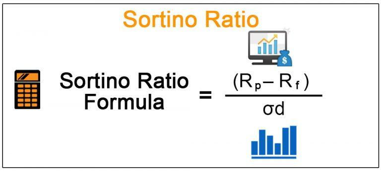

## Table of Contents

## What is the Sortino Ratio?

The Sortino Ratio is a way to measure how well an investment is doing, focusing on the bad risks. It looks at the return of an investment compared to the risk of losing money. Unlike other measures, the Sortino Ratio only cares about the downside risk, which means it only looks at the times when the investment loses value. This makes it a useful tool for investors who want to know how an investment might perform during tough times.

To calculate the Sortino Ratio, you take the average return of the investment and subtract the target return, which is often set to zero or a minimum acceptable return. Then, you divide this by the downside deviation, which is a measure of how much the investment's returns fall below the target return. A higher Sortino Ratio means the investment has a better return for the level of bad risk it carries. This helps investors make choices that balance potential gains with the risk of losses.

## How does the Sortino Ratio differ from the Sharpe Ratio?

The Sortino Ratio and the Sharpe Ratio are both used to measure how well an investment is doing compared to the risk it takes. But they look at risk in different ways. The Sharpe Ratio looks at all kinds of risk, both good and bad. It uses something called standard deviation to measure how much the investment's returns move around. This means it considers all the ups and downs of the investment, whether they are gains or losses.

On the other hand, the Sortino Ratio only cares about the bad risk, or the downside risk. It focuses on how much the investment's returns fall below a certain target, often set to zero or a minimum acceptable return. This makes the Sortino Ratio more useful for investors who are more worried about losing money than about missing out on gains. By only looking at downside risk, the Sortino Ratio gives a clearer picture of how an investment might perform during tough times.

## Why is the Sortino Ratio important for investors?

The Sortino Ratio is important for investors because it helps them understand how well an investment can handle bad times. Unlike other measures, the Sortino Ratio only looks at the risk of losing money, which is what most investors worry about the most. By focusing on downside risk, it gives investors a clearer idea of how safe their investment might be when things go wrong. This is really helpful for people who want to avoid big losses and need to know how an investment might behave during tough times.

Investors can use the Sortino Ratio to compare different investments and see which one offers a better return for the level of bad risk it carries. A higher Sortino Ratio means the investment is doing a better job of giving good returns while keeping the risk of losses low. This makes it easier for investors to make choices that balance the potential for making money with the risk of losing it. In the end, the Sortino Ratio helps investors pick investments that fit their goals and how much risk they are willing to take.

## What does a higher Sortino Ratio indicate?

A higher Sortino Ratio means that an investment is doing a good job of giving you returns while keeping the risk of losing money low. It shows that the investment is handling the bad times well, which is important for people who don't want to lose a lot of money.

When you see a high Sortino Ratio, it tells you that the investment is [earning](/wiki/earning-announcement) more money compared to the times it loses value. This helps investors feel more confident that their money is safe and that they're getting a good reward for the risk they're taking.

## How is the Sortino Ratio calculated?

To calculate the Sortino Ratio, you first need to find the average return of the investment and subtract the target return. The target return is usually set to zero or a minimum acceptable return that the investor is okay with. Then, you look at how much the investment's returns fall below this target return. This is called the downside deviation, and it measures the risk of losing money.

Next, you divide the difference between the average return and the target return by the downside deviation. This gives you the Sortino Ratio. A higher Sortino Ratio means the investment is doing a good job of giving you returns while keeping the risk of losing money low. It shows that the investment is handling the bad times well, which is what most investors care about.

## What is the role of the target return in the Sortino Ratio?

The target return in the Sortino Ratio is really important. It's the return that an investor thinks is okay to get. Usually, people set this to zero or a small return they're happy with. The target return helps figure out when the investment is not doing well. It only looks at the times when the investment's return is less than this target.

When you calculate the Sortino Ratio, you take the average return of the investment and subtract the target return. Then, you see how much the returns fall below this target, which is called the downside deviation. This helps show how risky the investment is when it's losing money. By using the target return, the Sortino Ratio tells investors how well the investment does when things are tough.

## Can you explain the concept of downside deviation used in the Sortino Ratio?

Downside deviation is a way to measure how much an investment's returns fall below a certain target return. This target return is usually set to zero or a small return that an investor is okay with. When we talk about downside deviation, we're only looking at the times when the investment loses money or doesn't meet the target return. This helps us understand how risky the investment is during bad times.

In the Sortino Ratio, downside deviation is really important because it only focuses on the bad risks. It doesn't care about the good times when the investment does well. By using downside deviation, the Sortino Ratio gives investors a clear idea of how much they might lose when things go wrong. This makes it easier for people to choose investments that they feel comfortable with, knowing how the investment might behave during tough times.

## What are the limitations of using the Sortino Ratio?

The Sortino Ratio is a helpful tool, but it has some limits. One big limit is that it depends a lot on the target return that you choose. If you pick a different target return, you can get a different Sortino Ratio. This means that the Sortino Ratio might not be the same for everyone, because people might have different ideas about what return they want.

Another limit is that the Sortino Ratio only looks at the bad times, but it doesn't tell you everything about the investment. It doesn't think about other risks, like how easy it is to sell the investment or how it might be affected by changes in the market. So, while the Sortino Ratio is good for understanding the risk of losing money, it's not the only thing you should look at when choosing an investment.

## How can the Sortino Ratio be applied in portfolio management?

In portfolio management, the Sortino Ratio helps investors pick and manage their investments better. It looks at how well an investment does when things are tough, which is what many investors care about most. By using the Sortino Ratio, investors can compare different investments and see which ones are good at giving returns without too much risk of losing money. This helps them build a portfolio that matches their goals and how much risk they are okay with taking.

For example, if an investor is managing a portfolio and wants to add a new investment, they can use the Sortino Ratio to see how it might affect their overall risk and return. If the new investment has a high Sortino Ratio, it means it's good at handling bad times, which could make the whole portfolio safer. By keeping an eye on the Sortino Ratios of their investments, portfolio managers can make smart choices about when to buy, sell, or hold onto different investments, helping them keep the portfolio strong even when the market is tough.

## What are some real-world examples where the Sortino Ratio has been used effectively?

One real-world example where the Sortino Ratio has been used effectively is in the management of retirement funds. A retirement fund manager might use the Sortino Ratio to choose investments that offer good returns while minimizing the risk of losing money during market downturns. This is especially important for retirees who rely on their investments for income and can't afford big losses. By focusing on the Sortino Ratio, the manager can build a portfolio that helps protect the retirees' savings and provides steady returns even in tough economic times.

Another example is in [hedge fund](/wiki/hedge-fund-trading-strategies) management. Hedge funds often aim to deliver high returns, but they also need to manage risk carefully. A hedge fund manager might use the Sortino Ratio to evaluate different trading strategies or investments. By choosing strategies with higher Sortino Ratios, the manager can increase the chances of achieving good returns without exposing the fund to too much downside risk. This helps the hedge fund attract investors who are looking for high rewards but are also concerned about protecting their capital during market volatility.

## How does the Sortino Ratio handle non-normal distribution of returns?

The Sortino Ratio is good at handling investments where the returns don't follow a normal pattern. Normal means the returns go up and down in a predictable way. But sometimes, returns can jump around a lot more than expected, or they can have big drops more often. The Sortino Ratio helps with this because it only looks at the bad times when the investment loses money or doesn't meet the target return. This makes it a better tool for understanding risk when the returns are not normal.

By focusing on downside risk, the Sortino Ratio gives a clearer picture of how an investment might behave during tough times, even if the returns are all over the place. This is important because many investments don't follow a normal pattern, and investors need to know how much they might lose. The Sortino Ratio helps investors make better choices by showing them how well an investment can handle the bad times, no matter how unpredictable the returns might be.

## What advanced techniques can enhance the accuracy of the Sortino Ratio?

To make the Sortino Ratio more accurate, one advanced technique is to use a longer period of data. By looking at returns over many years instead of just a few, you can get a better idea of how an investment handles bad times. This helps smooth out any unusual events that might have happened in a shorter time and gives a clearer picture of the investment's true downside risk.

Another technique is to use more advanced statistical methods to measure downside deviation. Instead of just using the simple average of returns below the target, you can use methods like bootstrapping or Monte Carlo simulations. These methods create many different possible scenarios of how the investment might perform, which can give a more detailed and accurate view of the risk of losing money. By using these advanced techniques, investors can get a better understanding of how an investment might behave during tough times.

## What is the Sortino Ratio and how can it be understood?

The Sortino Ratio is an essential financial metric that evaluates the risk-adjusted return of an investment or portfolio by focusing specifically on downside risk. Unlike the Sharpe Ratio, which considers both upside and downside volatility, the Sortino Ratio only accounts for negative fluctuations, offering a more precise assessment of risk management.

This ratio is named after Frank A. Sortino, which emphasizes the importance of downside deviation—also known as the standard deviation of negative returns—in determining performance. The Sortino Ratio is calculated using the following formula:

$$
\text{Sortino Ratio} = \frac{\text{Portfolio Return} - \text{Target Rate of Return}}{\text{Downside Deviation}}
$$

To compute the Sortino Ratio, subtract the target rate of return from the portfolio's return to obtain the excess return. This excess return is then divided by the downside deviation, thus isolating the negative volatility, which is of particular concern to risk-averse investors. In practice, some analysts may substitute the target rate of return with a risk-free rate, depending on specific investment criteria or objectives.

By focusing solely on downside risk, the Sortino Ratio provides traders and analysts with a refined view of a strategy's performance. This metric highlights how much return is generated per unit of downside risk, thus offering a more meaningful perspective in financial assessments compared to metrics that account for both positive and negative [volatility](/wiki/volatility-trading-strategies) equally. This distinctive approach can be particularly advantageous in complex trading environments where minimizing negative risk exposure while encouraging positive volatility is vital.

## How do you calculate the Sortino Ratio?

To calculate the Sortino Ratio, begin by determining the portfolio's average return over a specified period. This period is crucial as it sets the context for the expected risk and return. The calculation involves subtracting a benchmark rate—typically the risk-free rate—from this average portfolio return to derive the excess return. This excess return indicates how much more the portfolio earned compared to a risk-free investment, such as government treasury bonds.

The core element of the Sortino Ratio is the downside deviation. Unlike standard deviation, which measures overall volatility, downside deviation focuses exclusively on negative returns. To compute this, identify all the returns below a set target, typically the risk-free rate or a target rate of return. The formula for downside deviation is the square root of the average squared deviations below this target rate.

$$
Downside\ Deviation = \sqrt{\frac{1}{n} \sum_{i=1}^{n} \min(0, R_i - T)^2}
$$

where $R_i$ is a portfolio return and $T$ is the target or risk-free return.

Once you have the downside deviation, the Sortino Ratio can be calculated using:

$$
Sortino\ Ratio = \frac{\text{Portfolio Return} - \text{Risk-free Rate}}{\text{Downside Deviation}}
$$

This ratio provides a measure of risk-adjusted return, emphasizing downside risk. In some contexts, replacing the risk-free rate with a target return is appropriate if the investment strategy aims for a specific benchmark. For instance, a strategic objective might target inflation plus a certain percentage, which would then substitute for the risk-free rate in the formula. This adjustment reflects the portfolio manager's or investor's performance relative to their risk-return expectation, offering a tailored insight into how well the strategy navigates negative market movements.

## How do the Sortino Ratio and Sharpe Ratio compare?

Both the Sortino and Sharpe Ratios are pivotal tools in evaluating investment performance, each with unique methodologies for handling volatility. The primary distinction between these metrics lies in their treatment of different types of volatility. 

The Sharpe Ratio, developed by Nobel laureate William F. Sharpe, is defined as:

$$
\text{Sharpe Ratio} = \frac{(R_p - R_f)}{\sigma_p}
$$

where $R_p$ is the return of the portfolio, $R_f$ is the risk-free rate, and $\sigma_p$ represents the standard deviation of the portfolio's excess return. This ratio considers the total volatility of the portfolio, encompassing both upside and downside deviations equally. As a result, investments with high overall volatility, regardless of whether the fluctuations are favorable (upside) or unfavorable (downside), may exhibit a lower Sharpe Ratio.

In contrast, the Sortino Ratio focuses solely on downside risk. It is calculated as follows:

$$
\text{Sortino Ratio} = \frac{(R_p - R_f)}{\sigma_d}
$$

where $\sigma_d$ is the downside deviation, capturing only the negative fluctuations of the portfolio return below a minimum acceptable return (MAR). By ignoring positive volatility, the Sortino Ratio provides a more targeted examination of the 'bad' risk, offering insights into how well an investment performs amid adverse conditions without penalizing excess positive movements.

This distinction is particularly beneficial for strategies that aim to capitalize on upside potential. Investors deploying such strategies prefer the Sortino Ratio, as it allows them to quantify risk-adjusted returns that are not diluted by desirable gains. Thus, while both metrics serve as key indicators of performance, the choice between them hinges on an investor's specific goals and tolerance for different types of volatility.

## References & Further Reading

[1]: Sortino, F. A., & Van Der Meer, R. (1991). ["Downside risk."](https://www.pm-research.com/content/iijpormgmt/17/4/27) The Journal of Portfolio Management, 17(4), 27-31.

[2]: Sortino, F. A., & Forsey, H. J. (1996). ["On the Use and Misuse of Downside Risk."](https://www.proquest.com/docview/195585019?pq-origsite=gscholar&fromopenview=true) The Journal of Portfolio Management, 22(2), 35-42.

[3]: Sharpe, W. F. (1966). ["Mutual Fund Performance."](http://www.stat.ucla.edu/~nchristo/statistics_c183_c283/sharpe__mutual_fund_performance.pdf) The Journal of Business, 39(1), 119-138.

[4]: Bacon, C. R. (2008). ["Practical Portfolio Performance Measurement and Attribution."](https://onlinelibrary.wiley.com/doi/book/10.1002/9781119206309) John Wiley & Sons.

[5]: Ang, A. (2014). ["Asset Management: A Systematic Approach to Factor Investing."](https://academic.oup.com/book/3342) Oxford University Press.