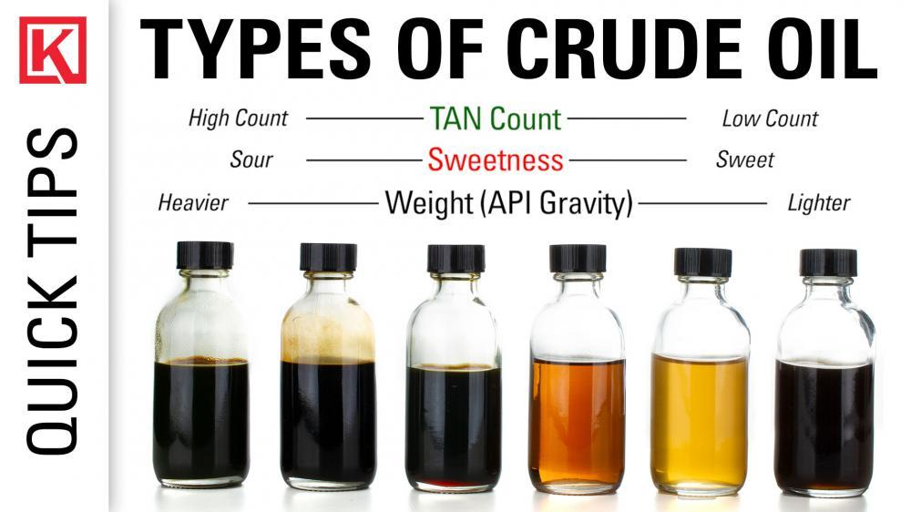

The importance of oil quality in the global market cannot be overstated, as it directly influences pricing, refining costs, and economic stability. Among the various types of crude oil, sour crude, characterized by its higher sulfur content, presents unique challenges and opportunities. Understanding this type of crude oil is crucial for traders and investors who seek to navigate the complexities of the oil market.

Crude oil, a fundamental energy resource, is classified based on its sulfur content into two main categories: sweet and sour. Sweet crude contains less sulfur and is highly sought after because it requires less processing, making it more desirable and valuable. Conversely, sour crude, with its higher sulfur content, demands more intensive and costly refining processes. Despite its less favorable properties, sour crude holds a significant position in global oil reserves, making understanding its dynamics critical for market participants.



In recent years, the integration of algorithmic trading in crude oil markets has emerged as a potent tool for maximizing profits. Algorithmic trading, the practice of using computer algorithms to execute trades at high speeds based on pre-set criteria, capitalizes on minute market fluctuations and is ideally suited to volatile markets like crude oil. It provides an avenue for traders to exploit price inefficiencies and manage the risks associated with commodity trading.

This article aims to provide a comprehensive overview of sour crude and its implications for algorithmic trading in the oil markets. By examining the nuances of sour crude and leveraging algorithmic strategies, traders can enhance their decision-making processes and potentially achieve greater profitability.

## Table of Contents

## Understanding Crude Oil Quality

Crude oil quality is predominantly assessed based on its sulfur content, which classifies crude into two main categories: sour and sweet. This classification holds significant implications for the oil's market value, refining process, and overall desirability.

Sour crude oil exhibits a higher sulfur content, generally exceeding 0.5% by weight. The elevated sulfur levels make processing more complex and costly, as specialized refining processes are required to remove sulfur and its compounds. The presence of sulfur compounds, such as hydrogen sulfide and mercaptans, can lead to corrosion in refinery infrastructure and produce greater environmental pollutants if not properly managed. Consequently, sour crude tends to be less desirable among refiners, leading to a lower market value compared to its sweet counterpart. Major sources of sour crude include oil fields in regions like Venezuela, Canada, and the Gulf of Mexico. 

In contrast, sweet [crude oil](/wiki/crude-oil) contains less than 0.5% sulfur by weight, making it relatively easier and more economical to refine. The reduced necessity for desulfurization processes not only minimizes costs but also results in lighter products such as gasoline and diesel that are in higher demand. Due to these advantages, sweet crude is often valued higher in global markets. Prominent examples of sweet crude include West Texas Intermediate (WTI) from the United States and Brent crude from the North Sea.

The distinction in sulfur content between sour and sweet crude is measured using a sulfur assay, which quantifies the sulfur percentage in the crude oil sample. This assessment informs trading decisions and influences pricing benchmarks in the oil markets. In summary, sulfur content serves as a critical parameter in determining crude oil quality, significantly affecting refining processes, market values, and the geographical desirability of crude oil resources.

## The Dynamics of Sour Crude

Sour crude oil, characterized by its high sulfur content, presents unique challenges in the energy sector. Its sulfur concentration, often above 0.5%, complicates the refining process, leading to higher costs compared to sweet crude oil, which contains less sulfur. This elevated sulfur content necessitates more advanced desulfurization treatments to produce commercially viable products, which increases the complexity and expense of refining sour crude.

Key producers of sour crude include countries and regions such as Venezuela, Canada, and the Gulf of Mexico. Venezuela's Orinoco Belt, for instance, is one of the largest reserves of heavy and sour crude in the world. Canada contributes significantly with its oil sands, while the Gulf of Mexico remains a critical producer with numerous offshore sour oil fields. The global dependency on these sources highlights the importance of refining capacity and technological advancements in processing sour crude efficiently.

The market value of sour crude is sensitive to various factors, primarily demand fluctuations and refining costs. When demand for oil products increases, refineries may adjust to process more sour crude despite the additional costs. Conversely, in periods of decreased demand, the preference often shifts to sweet crude, which is cheaper to process. Additionally, changes in refining costs, driven by technological advancements or regulatory pressures to reduce sulfur emissions, directly impact the profitability and market pricing of sour crude. This delicate balance underscores the volatile nature of sour crude's market value and its dependence on both macroeconomic factors and industry-specific innovations.

## Algo Trading in Crude Oil Markets

Algorithmic trading, often referred to as algo trading, constitutes the utilization of computer algorithms to execute trades at high speeds and volumes. These algorithms are pre-defined sets of rules or instructions that decide on aspects of trades, such as timing, price, and quantity, without direct human intervention. The approach is highly applicable in crude oil markets owing to their inherent [volatility](/wiki/volatility-trading-strategies) and the vast amounts of data generated.

Crude oil markets are characterized by rapid price fluctuations, driven by geopolitical events, natural disasters, and supply-demand shifts. This volatility provides fertile ground for [algorithmic trading](/wiki/algorithmic-trading) systems, which can quickly respond to market changes and capitalize on transient price inefficiencies.

One popular strategy in algo trading is **statistical [arbitrage](/wiki/arbitrage)**. This involves leveraging statistical models to identify and exploit temporary disparities between related financial instruments, such as the price differences between sour and sweet crude oil. Traders can use historical data to develop predictive models, which suggest the probable future direction of prices based on the mean-reversion principle or other statistical correlations.

**Momentum trading** is another widely-used strategy, predicated on the assumption that asset prices that are rising (or falling) will continue to do so in the short term. Algorithms designed for momentum trading may, for instance, use moving averages and other trend-following indicators to make buy or sell decisions. Python code for a simple momentum strategy might involve calculating the moving average of historical prices to generate trade signals:

```python
import pandas as pd

# Assuming 'data' is a pandas DataFrame with a column 'price'
data['short_mavg'] = data['price'].rolling(window=20).mean()
data['long_mavg'] = data['price'].rolling(window=50).mean()

# Create a trading signal
data['signal'] = 0
data.loc[data['short_mavg'] > data['long_mavg'], 'signal'] = 1  # Buy
data.loc[data['short_mavg'] < data['long_mavg'], 'signal'] = -1 # Sell
```

**Event-driven strategies** focus on economic releases, political events, or natural disasters that might affect oil prices. These strategies are particularly suited for sour crude markets, where geopolitical tensions or regulatory changes can have pronounced impacts. Algorithms designed for this strategy might analyze news feeds or social media to trigger trades based on the detected sentiment or relevance of events.

The incorporation of **[machine learning](/wiki/machine-learning) models** has further expanded the capabilities of algo trading. By using techniques such as clustering, neural networks, or [reinforcement learning](/wiki/reinforcement-learning), algorithms can adapt to new market conditions and improve the accuracy of their predictions. These models can process vast amounts of historical and real-time data to identify subtle patterns or anomalies that may be imperceptible to human traders.

In conclusion, algorithmic trading stands out as a powerful tool in the crude oil markets, offering the potential for enhanced efficiency and profitability. The complexity of sour crude, combined with the volatility inherent to oil markets, makes algorithmic strategies not only advantageous but essential for modern traders.

## Strategies for Trading Sour Crude

Successful algorithms play a crucial role in capitalizing on market inefficiencies within the crude oil sector, particularly between sour and sweet crude. This exploitation can be achieved through various strategic approaches that leverage the inherent price differences due to factors such as sulfur content and refining complexities.

One effective strategy is event-driven trading, which focuses on geopolitical events that can significantly impact the prices of sour crude. These events may include geopolitical tensions in key producing regions like Venezuela or changes in regulatory policies affecting the refining of high-sulfur content oils. By monitoring news feeds, market reports, and other real-time data sources, traders can design algorithms that respond promptly to these events, thereby seizing opportunities as prices adjust to new information.

Machine learning models further enhance trading strategies by improving decision-making processes under volatile market conditions. These models can analyze large datasets comprising historical prices, production outputs, and global demand trends to forecast future price movements. Using techniques such as regression analysis, neural networks, or support vector machines, algorithms can identify patterns and correlations that might be overlooked by traditional analysis methods.

Consider a simple example using a Python-based machine learning approach. Suppose we have historical price data for both sour and sweet crude. A machine learning model, such as a Random Forest regressor, could be trained on this dataset to predict future price spreads between the two types of crude. Here's a basic outline of how this might be implemented:

```python
from sklearn.ensemble import RandomForestRegressor
from sklearn.model_selection import train_test_split
import pandas as pd

# Load historical price data
data = pd.read_csv('crude_oil_prices.csv')  # hypothetical dataset
X = data.drop(columns='price_spread')  # features
y = data['price_spread']  # target variable

# Split the dataset into training and testing sets
X_train, X_test, y_train, y_test = train_test_split(X, y, test_size=0.2, random_state=42)

# Initialize and train the Random Forest regressor
model = RandomForestRegressor(n_estimators=100, random_state=42)
model.fit(X_train, y_train)

# Predict future price spreads
predictions = model.predict(X_test)

# Evaluate model performance
from sklearn.metrics import mean_squared_error
mse = mean_squared_error(y_test, predictions)
print(f"Mean Squared Error: {mse}")
```

This example demonstrates how machine learning can quantify potential price inefficiencies, allowing traders to execute well-timed trades. These algorithms continuously adapt to new data, which is critical in a market characterized by rapid and often unpredictable changes.

In summary, by exploiting price inefficiencies between sour and sweet crude, utilizing event-driven strategies, and implementing sophisticated machine learning models, traders can significantly enhance their strategies, ensuring robust performance in the ever-evolving crude oil market.

## Risks and Challenges

Volatility risk in the trading of sour crude oil is a significant challenge, primarily driven by geopolitical events and market dynamics. The global political landscape can swiftly alter the supply-demand balance, leading to sharp price fluctuations. For example, tensions in major oil-producing regions or changes in trade policies can lead to sudden supply disruptions or surges, impacting crude oil prices. This unpredictability makes sour crude oil markets highly volatile, requiring traders to be adept at quickly adapting their strategies to navigate rapid changes in market conditions.

Regulatory changes add another layer of complexity to trading strategies and compliance requirements. Governments worldwide regularly reassess energy regulations, often in response to environmental concerns, economic strategies, or international accords. New policies can affect refining processes, transportation, and trading practices, leading to increased compliance costs or altered trading conditions. For instance, stricter emissions regulations may raise the cost of refining sour crude, thereby impacting its market value and the profitability of related trading strategies.

Technical failures or model flaws present additional risks in algorithmic trading. Trading algorithms, while designed to optimize decision-making and execution, can experience failures due to software bugs, incorrect assumptions, or unforeseen market conditions. This can lead to substantial financial losses if trades are executed incorrectly or at inopportune times. Furthermore, complex algorithms often rely on large datasets and external inputs; disruptions in data flow or integrity can compromise model accuracy. To mitigate these risks, robust testing and continuous monitoring are essential to ensure that algorithms function as intended and can adapt to unexpected market changes. 

Implementing reliable error-handling mechanisms and maintaining redundancy for critical data sources is crucial. In Python, for example, ensuring stable execution might involve using try-except blocks to handle potential exceptions gracefully:

```python
try:
    # Assume get_price is a function fetching real-time oil prices
    price = get_price('sour_crude')
    # Trading logic here
except DataFetchError:
    print("Data fetch failed. Retrying...")
    # Retry logic here
except Exception as e:
    print(f"An unexpected error occurred: {e}")
```

In conclusion, while sour crude oil trading through algorithmic systems offers numerous opportunities, traders must be vigilant regarding the multifaceted risks involved. Addressing these challenges directly is essential for minimizing potential financial losses and ensuring sustainable trading operations.

## Opportunities and Future Trends

Increased data availability significantly enhances the ability of traders to develop and implement more refined and adaptable strategies within the crude oil market. With the advent of big data, traders can harness vast amounts of information, including historical price data, geopolitical events, supply and demand metrics, and weather patterns. This wealth of data facilitates a deeper understanding of market dynamics, enabling more accurate predictive analytics and more sophisticated algorithmic models. The use of data science techniques, such as regression analysis and machine learning, allows traders to identify trends and correlations that were previously inaccessible.

The global market for crude oil, including sour crude, operates on a 24-hour basis, providing continuous trading opportunities. This around-the-clock market environment is particularly valuable for trading sour crude, which is influenced by geopolitical events across different time zones. Round-the-clock market access enables traders to react promptly to international news and events that could impact the price and availability of sour crude. It also allows the execution of trades without delay, reducing the latency that can be critical in volatile market conditions.

The integration of Artificial Intelligence (AI) and machine learning into trading systems is expected to expand, driven by the need for more precise and efficient trading approaches. Machine learning algorithms can process and analyze large datasets to generate predictive models for market movements. These models can be optimized for high-frequency trading, where speed and accuracy are paramount.

Consider a simple machine learning example using Python:

```python
from sklearn.linear_model import LinearRegression
import numpy as np

# Sample data: [variable data (e.g., historical prices, geopolitical indicators)], [target data (e.g., future price)]
X = np.array([[1, 2], [2, 3], [3, 4], [4, 5]])
y = np.array([2, 3, 3, 4])

# Create a linear regression model
model = LinearRegression()

# Fit model to the data
model.fit(X, y)

# Predict future prices
future_price_prediction = model.predict(np.array([[5, 6]]))
print(f"Predicted future price: {future_price_prediction[0]}")
```

In this example, the Linear Regression model is used to predict future prices of crude oil based on historical data and other relevant variables. More complex models, such as [deep learning](/wiki/deep-learning) frameworks, can be deployed for higher accuracy and adaptability.

As the technological landscape evolves, traders who leverage these advancements in AI and machine learning can identify and exploit inefficiencies, resulting in more strategic and profitable trading decisions. Overall, the future of sour crude trading will likely be characterized by increased automation, enhanced data-driven insights, and a more competitive market environment.

## Conclusion

Sour crude oil remains a focal point in the global energy market due to its intrinsic complexities and promising potential rewards. Its high sulfur content distinguishes it from sweet crude, necessitating advanced refining processes and influencing its market dynamics. This complexity creates a landscape ripe with both challenges and opportunities for traders looking to capitalize on the distinctive characteristics of sour crude.

Advancements in algorithmic trading have significantly reshaped the crude oil trading landscape, offering innovative avenues for profitability. By utilizing algorithmic strategies, traders can efficiently process vast amounts of data, detect price inefficiencies, and execute trades with precision. This technological approach is particularly advantageous in the volatile markets associated with sour crude, where rapid and informed decision-making is crucial. Algorithms powered by sophisticated machine learning models analyze patterns and adapt to market shifts in real-time, providing traders with a strategic edge.

For those who embrace these technologies and adapt to evolving market conditions, the potential for significant financial gain is considerable. The integration of [artificial intelligence](/wiki/ai-artificial-intelligence) continues to enhance trading systems, enabling more refined strategies that cater to the unique challenges presented by sour crude. As such, traders equipped with the ability to leverage these tools are well-positioned to navigate the complexities of the energy market and achieve sustained success.

## References & Further Reading

[1]: Bergstra, J., Bardenet, R., Bengio, Y., & Kégl, B. (2011). ["Algorithms for Hyper-Parameter Optimization."](https://dl.acm.org/doi/10.5555/2986459.2986743) Advances in Neural Information Processing Systems 24.

[2]: ["Advances in Financial Machine Learning"](https://www.amazon.com/Advances-Financial-Machine-Learning-Marcos/dp/1119482089) by Marcos Lopez de Prado

[3]: ["Evidence-Based Technical Analysis: Applying the Scientific Method and Statistical Inference to Trading Signals"](https://www.amazon.com/Evidence-Based-Technical-Analysis-Scientific-Statistical/dp/0470008741) by David Aronson

[4]: ["Machine Learning for Algorithmic Trading"](https://github.com/stefan-jansen/machine-learning-for-trading) by Stefan Jansen

[5]: ["Quantitative Trading: How to Build Your Own Algorithmic Trading Business"](https://www.amazon.com/Quantitative-Trading-Build-Algorithmic-Business/dp/1119800064) by Ernest P. Chan